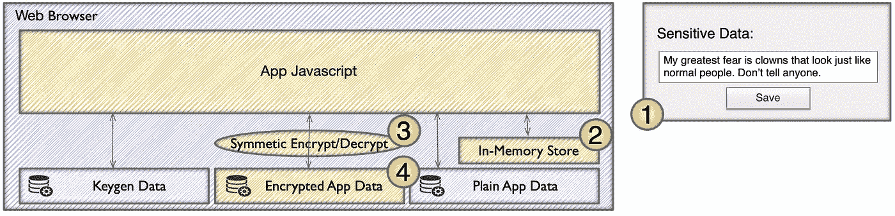

# 与 Jeggers 夫人一起向您的 Web 应用程序添加静态加密

> 原文：<https://levelup.gitconnected.com/adding-encryption-at-rest-to-your-web-app-with-mrs-jeggers-f50b037fbc54>

我写了一篇[的前一篇文章，解释了为什么你会想把静态加密](/why-would-a-web-app-need-encryption-at-rest-3efd10c145e1)添加到一个[离线优先](https://offlinefirst.org/)的网络应用中。

**快速回答“为什么？”**:您通常从 web 服务访问的数据将从永久存储器中取出，以允许离线访问。也许这些数据是敏感的，值得保护。在上一篇文章中，我还谈到了一些攻击媒介以及在哪里安全地存储解密密钥的问题。

在本文中，我将解释一个简单的体系结构，它将使您的离线数据保持合理的安全性，并满足大多数用例。该架构与您选择的 web 应用框架无关，例如 React、Vue、Angular 等。，但将假设运行 Javascript 的单页应用程序(SPA)。重要的是，这里没有发明新的加密算法或协议。我遵循了 PKCS 第五期关于基于密码的加密的建议。

展示静态加密的完整 web 应用程序演示在这里是以及在 Github 上提供的[完整源代码。**在重用这个源码之前，请，请，阅读我在文章末尾的警告。**](https://github.com/erikh2000/encryption-at-rest-poc)

**7/9/22 更新:**我已经发布了 [web-enc-at-rest NPM 包](https://www.npmjs.com/package/web-enc-at-rest)，它极大地简化了创建一个像本文中描述的应用程序。

# 杰格斯夫人

我不可能写出这样的东西而脑子里没有听到声音。质问我。评判我。对我提出令人痛苦的有效观点。

我将在这篇文章中展现我的七年级英语老师，杰格斯女士，来代表这些批评的声音。


啊，杰格斯太太——她是一位令人敬畏的教育家。就像玛丽·波平斯和西蒙·考威尔合二为一。

没有进一步的告别，我介绍…

# 静态加密体系结构

哦，天啊。我说得好像这是件大事。这是我想到的:


地貌

*   网络浏览器 —对，就是个网络浏览器。但它也可以被认为是应用程序代码、持久存储、域对象模型(DOM)和进程内存的容器。
*   **对称加密/解密** —实现对称加密的库，如 NaCl Secretbox (Salsa20)、Web Crypto (AES)。
*   **内存存储** —以方便的方式为您的 web 应用程序代码存储明文(解密数据)的内存数据结构，例如 Redux 或 MobX 存储。
*   **Keygen 数据** —它保存了少量明文数据，用于从用户的密码中导出一个密钥。这些数据存储在浏览器永久存储器中，例如 IndexedDB 或 LocalStorage。
*   **加密的应用数据** —它在浏览器永久存储器中保存你想要加密的敏感应用数据。
*   **普通应用数据** —它保存你不需要加密的应用数据。这些数据存储在浏览器的永久存储器中。

注意“*明文*”适用于所有类型的数据，而不仅仅是文本。它只是意味着未加密的数据。反之，“*密文*是加密的数据。

# 我的堆栈选择

除了这篇文章，我还写了一个概念验证(POC) web 应用程序。以下是我选择的堆栈:

*   **React/Typescript** —这些框架无论如何都不是架构的基础。我目前只是精通它们。
*   [**Web Crypto**](https://developer.mozilla.org/en-US/docs/Web/API/Crypto)—具体来说，我用了 Web Crypto 的 AES-GCM(对称加密)和 PBKDF2(密钥派生)。这是一个内置的 API [，可以在所有流行的浏览器](https://caniuse.com/?search=web%20crypto)中使用。
*   [**indexed db**](https://developer.mozilla.org/en-US/docs/Web/API/IndexedDB_API)—indexed db 是存储大量数据(数百兆字节)和支持所有流行浏览器的明确选择。

我起草了一堆关于 [TweetNaCl.js](https://tweetnacl.js.org/#/) 的东西，把它比作网络加密。但是我认为这些内容属于另一篇文章。现在，我只想说我喜欢 TweetNaCl.js，它工作得很好。但是我更喜欢使用 Web Crypto 的 AES-GCM(和其他加密特性)的本地实现来获得更快的速度。还有其他原因，我拒绝在这里没有支持的论点。

# POC 应用程序

我的概念验证(POC)应用程序非常简单。它只有两个屏幕。


你可以登录，做一些事情，然后退出。

在“登录屏幕”上，输入一些凭证，然后单击“登录”或“创建帐户”按钮。在应用程序中没有执行实际的身份验证，(为了简单起见，省略了)，但提供的密码必须正确，才能成功解密数据。

到达主屏幕后，来自 IndexedDB 的加密数据被检索并显示在“敏感数据”文本框中。您可以编辑并重新保存它。

更改密码将重新加密敏感数据，以便您将来可以使用新密码。

注销将清除内存中的任何敏感数据，并返回到登录屏幕。

我将更详细地介绍上面的每个用例。

# 用例:登录


1.用户提供身份认证所需的凭据。

2.App 检查 Keygen 数据(IndexedDB)中的现有 salt 值。如果没有，App 将创建一个新的随机值并存储在那里。

3.App 使用密码和 salt 作为输入，使用 PBKDF2 导出凭证密钥。


4.App 从 IndexedDB 加载加密的 App 数据为 IV +密文(加密数据)。该数据有一个前缀，其中包括之前用于加密数据密文部分的 IV。(每个单独的加密使用一个唯一的 IV。)

5.App 使用密文和 IV 前缀作为输入，通过 AES-GCM 对加密的 App 数据进行解密。


6.应用程序将新解密的数据复制到内存存储中，现在应用程序可以轻松使用这些数据。


# 为密钥派生重用相同的 Salt 值(我知道我知道我知道…)

对于几乎所有基于密码的加密(PBE)用例，每次都必须从相同的输入中获得相同的密钥。否则，该密钥将无法解密同一用户使用同一密码在之前的会话中生成的密文。

毫无疑问，你以前用过 PBE。有人发给你一个需要你输入密码的 ZIP 文件吗？当您输入密码时，将从中导出一个密钥，用于解密存档。如果那个密钥和用来加密的密钥不一样，那么…你将不能进入存档。

重用的 salt 仅限于用 PBKDF2 派生一个密钥。派生的密钥只保存在浏览器的进程内存中(不保存到存储中)。盐是为应用程序的每个用户随机生成的。因此，具有相同密码的两个用户将得到两个不同的密钥。

在某些系统中，重复使用的 salt 可能允许重放攻击。上述“登录”用例不包括网络通信，也不包括攻击者有机会向系统组件发送重放消息的系统。例外情况是，攻击者可以查看浏览器进程内存或在浏览器中执行任意代码。但是在这些情况下，攻击者可以广泛地访问许多有价值或者更有价值的东西，比如用户输入的密码(例如键盘记录器)或者加载到内存中的数据本身。

重复使用的盐会暴露另一种攻击媒介。假设攻击者可以使用相同的加密过程和 salt 来生成大量的加密值。如果这些攻击者的加密之一与应用程序加密的数据匹配，那么攻击者将知道应用程序使用的明文值输入。我的特定用例不受这种攻击的影响，因为没有应用程序加密的值(派生密钥)可供攻击者进行比较。同样，我在上一段中描述了相同的浏览器进程/执行任意代码警告。

因此，这里的密钥保护原则是，我们从不将凭证密钥(从密码派生的密钥)存储在除内存之外的任何地方。

要更好地解释为什么我们在密码学中使用 salt，请参阅 Ricardo Baylon 的 [Salt and IV Explained](https://ricardobaylon.wordpress.com/2013/10/06/salt-and-iv-explained/) 文章。有关针对基于密码的加密的潜在攻击的更多信息和一组经过充分研究的建议，请阅读针对 PKCS#5 的 [IETF 的 RFC 2898](https://datatracker.ietf.org/doc/html/rfc2898/) 。

# 用例:保存应用程序数据



1.  用户对数据进行更改，并开始在 UI 中保存数据。
2.  App 将数据作为明文存储在内存存储中。
3.  App 使用凭证密钥、新的随机 IV 和明文作为输入，通过 AES-GCM 将数据加密为密文。
4.  App 将 IV+密文值写入加密的 App 数据(IndexedDB)。

我对每次加密都使用唯一的 IV 值。如果攻击者获得了用户设备文件系统的访问权限，我们的应用程序数据的密文将是可用的。在这种情况和其他一些情况下，如果我没有唯一的 IV 值，那么寻找/生成匹配密文来推断明文的攻击就可能成功。


杰格斯太太，没事的。内存存储没什么特别的。它只是 web 应用程序通常用来操作的任何数据结构。内存中的存储可以是 React 的`useState()`钩子、Redux 存储、模块中声明的全局变量，或者对工程师来说方便的任何东西。并且数据必须是明文。因为它将由应用程序使用，无需进一步翻译。


# 用例:更改密码


1.用户更改他们的密码。

2.App 使用来自内存的凭据密钥和来自加密的 App 数据的 IV+密文作为输入，通过 AES-GCM 对加密的 App 数据进行解密。


3.App 从 Keygen 数据(IndexedDB)中检索 salt 值。

4.App 使用新密码和 salt 作为输入，通过 PBKDF2 导出新的凭据密钥。


5.App 使用凭证密钥、新的随机 IV 和明文作为输入，通过 AES-GCM 将数据加密为密文。

6.App 将一个 salt +密文值写入加密的 App 数据(IndexedDB)。

**以上步骤中缺失:**任何与认证 web 服务或其他来源的交互对用户凭证的真实性。这超出了我的概念验证范围。但是请注意，在继续其他步骤之前，步骤 1 应该已经成功完成。并且实现应该适当地中止/回滚，以使应用程序处于良好状态，用户在登录后仍然可以访问他们的加密应用程序数据。

在这个基于 PBE 的架构中，密码与访问数据紧密相关。假设在您的实现中，您不能保证用户的密码总是与数据加密相匹配。最糟糕的情况就像丢失了你的比特币钱包的密码。加密的数据被分块存储——在这一点上实际上毫无价值。你所能做的就是重新创建应用程序数据。


不要把你的用户数据做成砖块。

有一些方法可以防止数据被阻塞，但是它们会使体系结构变得复杂。加上杰格夫人的插话，这篇文章已经够长了。简而言之，您可以拥有一个身份验证 web 服务，该服务生成密钥，并在身份验证成功后在服务响应中将它们提供给应用程序。这种集中化允许您将密钥与密码分离开来。

我决定不在每次用户更改密码时重新生成 salt。它没有提供安全优势。在某些情况下，它的缺点是会向攻击者提供用户何时更改了密码的信息。

# 用例:注销

这是一个简单的问题，但是不能忘记。当用户注销时，只需从内存中清除所有秘密。这肯定包括凭证密钥，它可以让攻击者访问 IndexedDB 中的所有现在和将来的数据。但也可能清除内存存储。

# 更快的解密=我们可以存储更敏感的数据

在我的架构中，解密速度是可以访问多少敏感数据的实际限制。当应用程序加载时，它需要从 IndexedDB 中解密所有敏感数据，并将其作为明文放入内存存储中。如果我在解密数据时打开加载屏幕 10 秒钟，那么这个解决方案可能比不上从 web 服务加载数据。

所以当我看到我的弱酱 2015 MacBook 以每兆 13 毫秒的速度解密时，我松了一口气。

不止是如释重负。我很开心！


总有快乐的时候。不要欺骗自己。

具有大量数据的测试遵循线性函数，例如 o(n)。想解密百兆？那将是 1.3 秒的等待。


这是使用网络加密的 AES-GCM。TweetNaCl.js 要慢得多，可能是由于非本机实现。我将在另一篇文章中保存基准数据和更仔细的比较。

# 速度的普通应用程序数据

因此，AES-GCM 的网络加密足够快，足以证明定期加密和解密数百兆字节的数据。但是我想尽可能避免延误，你也应该这样。

所以我从一开始就计划在 IndexedDB 存储(RDBMS 术语中的“表”)的粒度上将数据分为“敏感的”和“公共的”。然后就是不要加密“公共”数据。

# 明文===公共

“公共”是一个很好的数据分类名称，可以提醒您哪些内容存在风险。

假设你所有的网络应用程序的持久存储的明文将会被发布在网络的某个黑暗的角落，让世界上所有的坏人都可以看到。结果会怎样？

你的用户被 doxxed 了吗？你为一次社会攻击提供了可信的细节吗？有没有发布看似无害的数据，可以结合其他数据或者很好的猜测来学习敏感数据？


就在今年，我已经接到两个骗子的电话，他们利用我的个人信息。

# 将凭证密钥放在不好的地方的诱惑

如果你有一个网站，在典型的[微前端架构](https://martinfowler.com/articles/micro-frontends.html)中包含多个网络应用，那么有一个很大的陷阱需要避免。


当 DOM 重新加载时，您不再拥有凭证密钥。

当您在 SPA web 应用程序之间切换时，DOM 将会重新加载，您将会丢失凭据密钥。您可能已经有了一个完全独立于静态加密 web 应用程序的 auth web 应用程序。在这种情况下，在 auth web 应用程序从自身导航到您的 web 应用程序或其他地方后，您将会丢失凭据密钥。

或者你可能有网页的服务器端渲染——常见于 WordPress、其他 CMS 或 pre-SPA web 应用。

一个关键的概念是，每次 DOM 重新加载时，您都会丢失凭证密钥。

下面是一些可怕的事情，你应该*而不是*去应对:

*   **不要把证书密钥放在饼干里。**
*   **不要**将凭证密钥放在 querystring 参数中。
*   **不要**将凭证密钥放在任何浏览器永久存储器中。(IndexedDB、LocalStorage、WebSQL 等。)
*   **不要**将凭证密钥放在 SessionStorage 中。(大概吧。下面看到更多细致入微的想法。)

当您跨越 web 应用程序边界时，您可以重新获得凭据密钥的一些好方法:

*   再次提示用户输入凭据并重新生成凭据密钥。**或……**
*   需要时，使用 auth web 服务请求凭据密钥。**或……**
*   使用容器页面将 SPA web 应用程序加载到其中，而无需重新加载 DOM。(复杂。本文就不赘述了。)

我们可以使用[会话存储](https://developer.mozilla.org/en-US/docs/Web/API/Window/sessionStorage)吗？老实说，我不确定。假设浏览器实现(Brave、Firefox、Chrome 等)将凭证密钥写入磁盘。然后，攻击者可以在与会话相关联的浏览器选项卡仍然打开时从文件系统中获取密钥。所以乍一看，SessionStorage 似乎风险太大。为了让自己放心，我必须在某处阅读一个实现标准，该标准对 SessionStorage 提出了一些约束。

凭证密钥需要是短暂的。它不应该在磁盘上。当您关闭浏览器选项卡或注销时，它需要从内存中消失。

# 索引 b 考虑事项

我的 POC 代码直接调用 IndexedDB API。但是我不得不说，这个令人费解的 API 只是*乞求*包装起来。如果你想要和 IndexedDB 一样的特性，但是有一个更好的基于承诺的界面，试试 Jake Archibald 的 IDB。如果你想要一个简单的键/值 API 来处理`get()`和`set()`，我可以推荐我在 [Chirp](https://github.com/erikh2000/chirp) 中使用的[local feed](https://www.npmjs.com/package/localforage)，一个离线优先的开源 web 应用。


黑客对 Chrome 开发工具内部敏感数据的看法。

请记住，即使有这种静态 enc 体系结构的保护，攻击者仍然可以了解到以下情况:

*   IndexedDB 存储(表)的名称。
*   存储中对象(行)的数量。
*   对象中字段的名称。
*   对象的键路径(主键)值。

你可以混淆其中的一些东西，例如把所有的字段放入一个 blob 中，使用无意义的存储/字段名称。但是请记住，当您将 web 应用程序部署到网站时，您的 web 应用程序的源代码就是公开的。这将淡化混淆。

# 网络加密和供应链攻击

我不喜欢基于节点的 web 应用程序带来的所有这些可传递依赖性的风险。上次我运行 create-react-app 时，这个“空”生成的应用程序附带了 1380 个 NPM 包。如果 1380 个 NPM 软件包中有这样的代码会怎么样呢？

```
async function _hackedEncrypt(algorithm, key, data) {
   return data; // "encrypted" to plaintext
}

const subtle = global.crypto.subtle;
subtle.encrypt = _hackedEncrypt;
```

是的，函数替换肯定会劫持内置 API。我测试过了。

我的防止函数替换的解决方案可以在 POC 中找到。另外，我发现一个代码兄弟也在担心同样的事情。他做了这个[安全加密项目](https://github.com/WebReflection/safer-crypto)，看起来很有前途。我还没机会深入复习。

# 你和我的鞋枪

Web Crypto 的创建者将几乎所有的 API 放在一个名为“微妙”的对象下是有原因的。你可以用它来搬起石头砸自己的脚，这种方式非常微妙。


鞋枪…危险，是的。不切实际，当然。但是不可否认的性感。

在我将自己的 POC 代码投入生产使用之前，我希望有更多的同行评审来发现任何问题。今年我可能会带着更多的发现和改进回来。( **7/9/22 更新:**见我的 [web-enc-at-rest NPM 包](https://www.npmjs.com/package/web-enc-at-rest)关于这个)需要澄清的是，我没有在加密领域发明任何新的算法、原语或协议。对于基于密码的加密，我基本上遵循了[PKCS 5 号推荐标准](https://datatracker.ietf.org/doc/html/rfc2898/)，并考虑了一些特定于网络应用的因素。

但是更多的思考和回顾是必要的。很容易把事情搞砸。

**代码兄弟和代码姐妹**，在抓取[我的代码](https://github.com/erikh2000/encryption-at-rest-poc)粘贴到重要的东西之前，请考虑我的警告。如果你对我提出的东西有建设性的批评，(不只是路过的鹬鸟)我会听的。我也很高兴听到与我正在做的项目重叠的现有项目。


杰格斯太太…我做了什么？我说了什么？


* * * [媒体学分](https://medium.com/@ErikH2000/where-my-media-comes-from-59761dc4be7) * * * [想要一份工作？](https://medium.com/@ErikH2000/yes-i-can-help-you-get-an-it-job-b0b51fee4c95) * * * [LinkedIn 个人资料](https://www.linkedin.com/in/erikhermansen) * * *