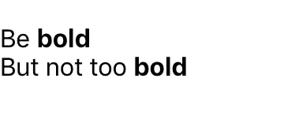
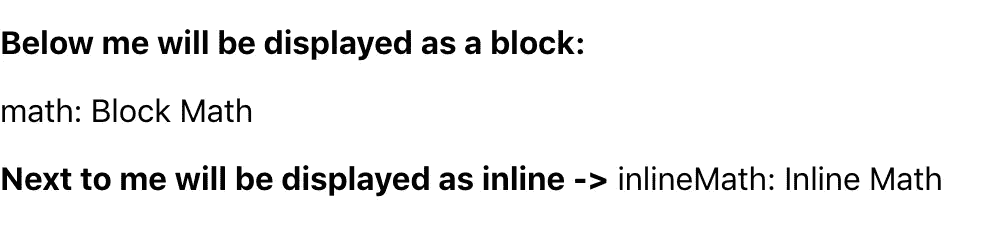
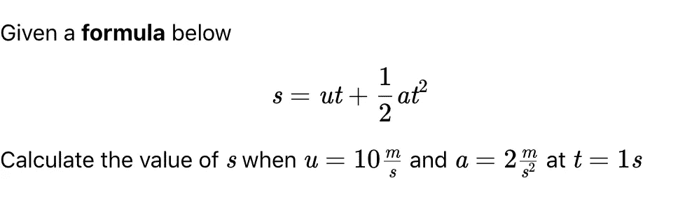

# 在 React 中添加 KaTeX 和 Markdown

> 原文：<https://levelup.gitconnected.com/adding-katex-and-markdown-in-react-7b70694004ef>

## 关于如何在 React Web 应用程序中显示 TeX 和 Markdown 内容的教程


[JESHOOTS.COM](https://unsplash.com/@jeshoots?utm_source=medium&utm_medium=referral)在 [Unsplash](https://unsplash.com?utm_source=medium&utm_medium=referral) 上拍照

在家学习正成为我们的新常态。学生们正从书本转向在线学习应用。这给开发人员带来了一个挑战，他们需要构建更具交互性的应用程序，为用户显示丰富的内容，包括数学方程式。通过在 React 中实现 KaTeX 和 Markdown，您的单页应用程序可以在丰富的文本内容中呈现复杂的方程。

KaTeX 是一个 Javascript 库，基于 TeX 布局显示数学符号。它由 Khan Academy 开发，以比其替代品 MathJax 更快的渲染速度而闻名。在本教程中，我们将使用以下库，

1.  [React Markdown](https://github.com/rexxars/react-markdown) 是将 Markdown 内容渲染到 React 组件中。
2.  [Remark Math](https://github.com/remarkjs/remark-math) 是一个 markdown 处理器，用作插件来解析 markdown 内容中的 TeX 布局。
3.  [React KaTeX](https://github.com/talyssonoc/react-katex) 是在块或内联组件中渲染 TeX 布局。

您可以使用下面的`npm`将这些库安装到您的项目中，

```
npm install react-markdown remark-math react-katex
```

# 添加 React 降价

本教程的目标是创建一个可重用的组件来呈现 markdown 和 TeX 数据。因此，您可以在项目中添加一个名为`Markdown.component.js`的新文件。如果您没有现有的项目，您可以引导一个 [Create React App](https://create-react-app.dev/) 项目并在那里添加新组件。然后，在组件中，我们会用自己的配置包装`react-markdown`库。

对于我们的组件，我们希望呈现 HTML 以显示更丰富的内容。默认情况下，该库对 HTML 语法进行转义，因此我们将自己的属性映射到 markdown 库中，如下所示。

自定义 ReactMarkdown 组件

现在，我们的组件可以呈现 markdown 和 HTML 语法。要使用这个组件，我们可以像下面这样将内容数据作为它的孩子来传递，

使用自定义降价组件

它会呈现这个:



呈现降价+ HTML

# 添加备注数学

使用`remark-math`库，您可以在 markdown 内容中编写您的 TeX 语法。它会将`$`中的值解析为`inlineMath`节点；并将`$$`内的值作为`math`节点。

然后，我们可以在每个节点上添加自定义渲染器。我们可以使用`inlineMath`在句子中内联呈现等式，使用`math`在内容中以块的形式呈现等式。

为了说明如何将`remark-math`用作`react-markdown`插件，您可以查看下面的代码，

将 markdown 组件与 remark-math 一起使用

我们可以用如下内容测试我们的 markdown 组件，

```
**Below me will be displayed as a block:**
$$
Block Math
$$
**Next to me will be displayed as inline ->** $Inline Math$
```

然后我们的组件会呈现这个，



markdown 内部呈现注释数学语法

> 请记住，当您编写块数学语法`$$`时，它应该后跟换行符，就像您在上面的例子中看到的那样。

# 添加 React KaTeX

React KaTeX 有两个组件来渲染 TeX 方程。它们是`InlineMath`和`BlockMath`，我们可以相应地使用从`remark-math`插件解析的节点。所以我们最后的组件会是这样的，

将 markdown 组件与 react-katex 一起使用

例如，我们有如下内容:

```
Given a **formula** below
$$
s = ut + \\frac{1}{2}at^{2}
$$
Calculate the value of $s$ when $u = 10\\frac{m}{s}$ and $a = 2\\frac{m}{s^{2}}$ at $t = 1s$
```

我们的组件会把它渲染成这样，



渲染纹理内部降价

我希望现在你能够创建自己的在线学习和测验应用程序。如果你需要一个我们的`Markdown`组件是如何实现的例子，你可以在下面看到我做的一个简单的数学测验应用。

[](https://github.com/iksena/math-quiz) [## iks ENA/数学测验

### 这是一个 React web 应用程序示例，显示了一个带有等式、公式和图像的数学测验。它实现了以下功能…

github.com](https://github.com/iksena/math-quiz)