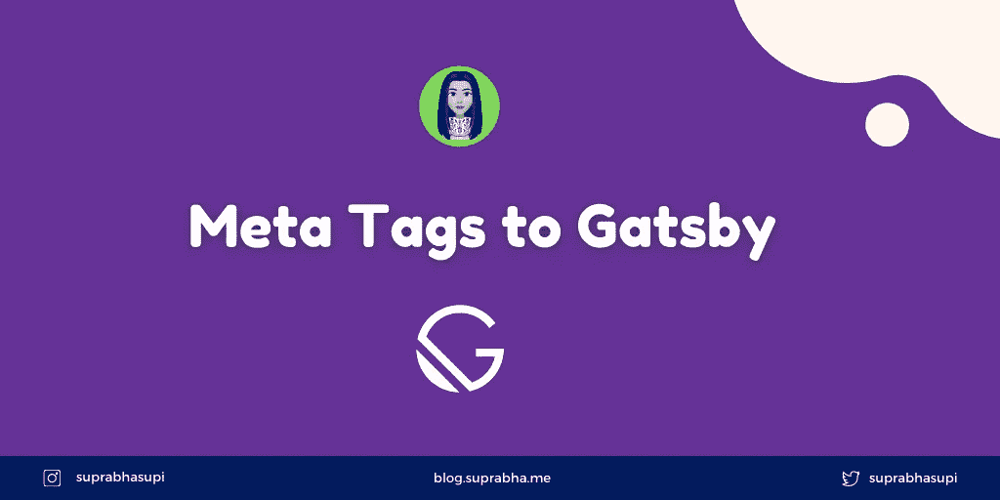

# 向 Gastby 添加元标记

> 原文：<https://levelup.gitconnected.com/adding-meta-tags-to-gastby-c4dee655199f>



盖茨比的元标签

这是一个非常好的主意，添加元标签，如标题，描述到一个页面，是搜索引擎优化友好。为此，您需要在`gatsby-config.js`中进行更改。

盖茨比-配置. js:

```
module.exports = {
    siteMetadata: {
        title: 'Gaatsby Workshop',
        description: 'Learn Gatsby From scratch'
    },
    plugins: ['gatsby-plugin-sass']
}
```

添加上述代码片段后，重启 gatsby 服务器💻

运行服务器后，你将无法在浏览器中看到元标签。因此，要做到这一点，您将使用 graphql。

进入[http://localhost:8000/_ _ _ graphql](http://localhost:8000/___graphql)到浏览器，可以看到 graph QL 的 docs 中的`site`。

查询下面的命令，你会得到元标签🔖：

```
query {
  site{
    siteMetadata {
      title
      description
    }
  }
}// output:
{
  "data": {
    "site": {
      "siteMetadata": {
        "title": "Gaatsby Workshop",
        "description": "Learn Gatsby From scratch"
      }
    }
  }
}
```

要使用这个进入页面，需要安装两个插件`gatsby-plugin-react-helmet`、`react-helmet`。

react-helmet 是一个用于在 react 中修改 HTML 文档头的库。它允许你设置标题，元标签，开放的图形描述或写卡——你可以在这里设置这些(所有的功能，使搜索引擎优化友好的网站)

一旦你安装了插件，把它添加到`gatsby-config.js`，这样你就可以用头盔⛑做服务器端渲染了

盖茨比-配置. js:

```
plugins: ['gatsby-plugin-sass', 'gatsby-plugin-react-helmet']
```

**将头盔添加到具有虚拟内容的布局页面:**

```
import {Helmet} from 'react-helmet'
<Helmet>
        <html lang='en' />
        <title>Hello Suprabha!</title>
        <meta name='description' content='Suprabha Blog!' />
</Helmet>
```

就是这样。在浏览器里检查一下，应该可以。💪🏼

现在，我们将使用配置数据来表示元标签。

使用-sitemMetadata.js:

```
import {graphql, useStaticQuery} from 'gatsby';
const useSiteMetadata = () => {
    const data = useStaticQuery(graphql`
        query {
          site{
              siteMetadata {
              title
              description
              }
          }
        }
    `);
    return data.site.siteMetadata;
}export default useSiteMetadata;
```

**使用成布局文件📂**

布局. js:

```
import {Helmet} from 'react-helmet'
import useSiteMetadata from '../hooks/use-siteMetadata'const {title, description} = useSiteMetadata();
<Helmet>
      <html lang='en' />
      <title>{title}</title>
      <meta name='description' content={description} />
</Helmet>
```

重启盖茨比发球。(正如每当您添加/更改 graphql 查询时，每次都必须重启服务器。)

🌟[推特](https://twitter.com/suprabhasupi)👩🏻‍💻 [Suprabha.me](https://www.suprabha.me/) 🌟 [Instagram](https://www.instagram.com/suprabhasupi/)