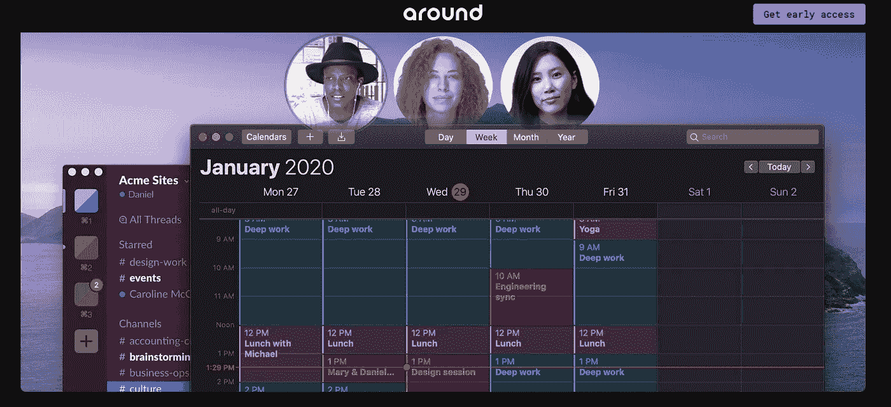
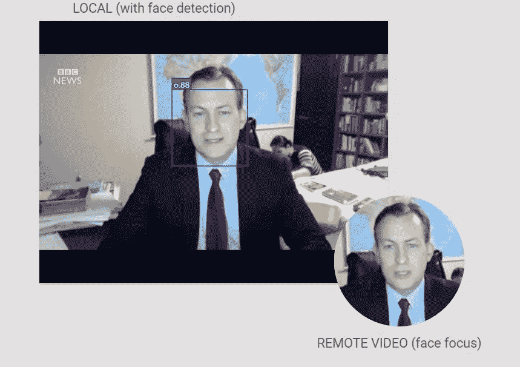

# 通过 WebRTC 的可插入流 API 向媒体帧添加元数据

> 原文：<https://levelup.gitconnected.com/adding-metadata-to-media-frames-via-insertable-streams-api-for-webrtc-47f7a740e457>

许多 WebRTC 功能以前只能在原生应用中实现，包括修改了 Chromium 代码的电子应用。CoSMo 多年来一直与多个合作伙伴(包括 Symphony Communications、AOMedia、Google 或 Apple/Webkit)一起引领编解码器(AV1)、音频处理、E2EE 和 AI 等新功能的开发。

如今，多亏了 WebRTC NV APIs，其中一些在 web 应用程序中也成为可能。[继上周我们披露了与谷歌合作开发的 SFrame E2EE 之后](https://webrtcbydralex.com/index.php/2020/03/30/secure-frames-sframes-end-to-end-media-encryption-with-webrtc-now-in-chrome/)，由于 Insertable stream，该在网络上实现了部分功能，现在是时候展示另一个以前在网络应用中几乎不可能实现的功能了。

[受我们的合作伙伴在其应用中的出色工作的启发，](https://webrtcbydralex.com/index.php/2020/04/20/around-a-refreshingly-new-approach-to-webrtc-calls-and-meetings/)我们将展示如何实现媒体和数据之间的实时、帧完美同步，并将简单的人工智能算法应用于视频内容以改善用户体验。

通过能够访问原始编码媒体帧并修改其内容，可插入流 API 允许在编码之后将定制元数据附加到每个帧，并在解码过程之前在另一端接收到媒体帧时提取它。

虽然您可以通过 WebRTC datachannels 发送这些元数据，但能够以每帧的精度将元数据附加到媒体流是 AR/VR 等应用程序的关键要求。

为了演示这一功能，我们受到了 Around 应用程序的启发，该应用程序提供了最先进的 UI/UX，包括面部识别和自动对焦，可以在一个小圆圈上显示每个参与者的面部，而不必浪费屏幕空间来显示参与者背景。

【https://www.around.co/ 

目前，为了实现这一点，您必须捕获媒体流的每个视频帧，将其显示在画布上，适当地裁剪和调整其大小，然后使用 *canvas.captureStream()* 通过 peerconnection 发送。

正如你所看到的，这个过程仍然不够高效(直到支持 WebRTC NV 的“滑稽帽子”用例)，所以我们将尝试使用 Insertable Streams API 实现它，并将图像处理推送到 css 上的接收端，以增加性能。

为了将处理逻辑移出主 javascript 线程，我们将使用两个 web workers，一个处理可插入的流，另一个进行面部检测。

主网页将创建 web workers 和 MessageChannel，这样它们可以直接在它们之间发送消息，而不必通过主线程。

主线程将可写和可读的流从 RTCRtpSender 和 RTCRtpReceiver 传输到 insertable streams worker，并定期(每秒)从本地视频对象中抓取一帧，并将其传输到人脸检测器 worker。

人脸检测器工作器使用 [face-api.js](https://github.com/justadudewhohacks/face-api.js/) 来检测视频帧中出现的人脸，并向 insertable streams 工作器发布一条消息，其中包含有关检测到的人脸的位置和大小的信息。

可插入流工作器将把检测到的面部元数据附加到接收到的下一个视频帧，该视频帧将被发送到服务器并循环回浏览器，在那里它将由可插入流工作器再次处理，该可插入流工作器将从帧中提取元数据(因此它可再次被解码)并将带有面部信息的消息发布到主线程。

Web worker 在视频帧上插入和提取人脸元数据

然后，主线程将在视频元素上应用 css 转换，以便在查看区域的中心为参与者显示人脸。

[T3【https://sgmedooze.cosmosoftware.io/insertable-face】T5](https://sgmedooze.cosmosoftware.io/insertable-face/index.html)

你可以看到被孩子们打断的著名 BBC 采访的实际结果:

可插入流 API 和 TransformStream 的良好设计还允许该元数据插入/提取过程可以容易地与端到端加密过程链接，因此通过服务器发送的元数据被端到端加密并且对 SFU 不透明:

端到端元数据加密

# 经过思考

排名不分先后:

*   WebRTC 已经成熟，第二代服务正在推出，重点是改善用户体验，更好地适应他们的主要用例。
*   WebRTC(或 libWebRTC)默认行为已经从您可以达到的最高质量变成了它所要求的基本水平。关于如何超越基本体验的示例，请参见围绕增强音频处理的[或基于包丢失隐藏算法的](https://www.around.co/) [Google DUO AI。这将需要大量非常具体的专业知识和知识。](https://ai.googleblog.com/2020/04/improving-audio-quality-in-duo-with.html)
*   基于 WebRTC NV 需求的新 WebRTC APIs(如可插入流)将是非常强大的工具，开发人员可以利用它们来探索和创造各种各样的创新想法。
*   客户端开发将比以往更加重要，也更加难以实现。
*   在不久的将来，WebCodec、WebTransport 和 WASM 将进一步开放网络应用的容量。这将需要大量的 WebRTC 客户端专业知识，而 [CoSMo](https://www.cosmosoftware.io/) 可以提供这些专业知识。