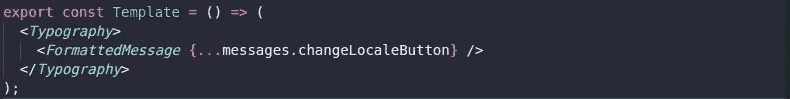

# 向 React 项目添加多语言支持

> 原文：<https://levelup.gitconnected.com/adding-multilanguage-support-to-your-react-project-a4fa209071d9>

## 如何让你的项目更上一层楼

凯尔·格伦在 [Unsplash](https://unsplash.com?utm_source=medium&utm_medium=referral) 上的照片

I 与来自不同国家的用户和服务的互动变得越来越普遍，这种趋势超越了 it 界的边界概念。因此,**越来越强烈地要求**开发支持不同国家的平台，从而适应当地语言。

有一个有趣的练习可以帮助我们理解这一点的重要性，那就是尝试想象以下场景:

**。您经常使用的仅支持韩语、法语或您没有域名的任何语言的脸书、Twitter 或其他社交媒体；**

**。仅使用当地货币表示货币成本的电子商务网站(用俄罗斯卢布计算，你的手机值多少钱？);**

**。使用其他国家的日期和时间格式的在线日记(
你知道如何用台语表示你的生日吗？);**

考虑到上面列出的主题，**如果与您目前的用户体验相比，您认为您在这些场景中会有同样的体验吗？**

如果答案是**否**，那么我们都认同国际化的重要性，以及为什么我们在构建应用程序时应该关注国际化。

# 我向你介绍国际反应

这个为 React 开发的库为我们提供了用于格式化不同类型数据的组件和 API，支持 150 多种语言。

如果你想进一步了解这个库，可以点击 [**这里**](https://github.com/formatjs/react-intl) 直接访问它在 GitHub 上的资源库！

> 在这篇文章中，**我将只关注把我们应用程序中的信息翻译成不同的语言。**如果你对这个主题感兴趣，想要更多关于如何格式化日期、货币值以及其他数据类型的内容，请在评论中留下你的建议！

# 定义消息

*react-intl* 库使用**消息描述符**概念，它包含定义消息如何格式化的必要数据。

因此，每条消息具有以下属性:

**。id(必需):**定义每条消息的唯一标识。

**。描述(可选):**消息内容的描述。

**。defaultMessage(可选):**一个标准消息，当主消息处理中出现错误时，例如没有找到翻译时，用作后备消息。它可以直接用作您的主要语言文本。

使用同一个库，我们可以使用另一个名为 *defineMessages* 的函数来返回消息描述符列表，从而在我们的组件中使用它们。

使用 defineMessages 函数定义我们的消息。

注意，在每条消息的 id 中，我使用了一个范围，后跟消息键。

在大型项目中，应用程序中定义了大量的消息。考虑到可伸缩性并确保每个标识对于每个消息都是唯一的，我们可以使用一些*约定*来编写消息 id。

在我的项目中，我通常使用**消息所在的每个文件的路径作为作用域，后跟消息键**，因此我们将每个消息的 id 定义为:

**{路径文件}。{messageKey}**

> 选择使用哪种约定可能会有所不同，但是推荐的做法是，一旦定义了标准标识，就应该为所有的项目消息维护它。

## 格式化邮件

定义消息后，我们将使用 *FormattedMessages* 来格式化组件中的消息。要做到这一点，只需在我们的组件中调用这个函数，向它传递带有先前定义的消息的 *MessageDescriptor* 对象，如果需要，传递一个名为 values 的属性，该属性包含一个带有*值*的对象，该值将替换消息中包含的可能变量。

使用 FormattedMessage 在我们的组件中格式化消息

根据定义，所有以某种方式使用 React Intl 的组件都必须使用一个名为 *IntlProvider* 的组件，该组件负责设置 i18n 的上下文(用作 **I** 国际化 **n** 的缩写，在“I”和“n”之间有 18 个字母)。

使用 IntlProvider

## 就这样…完成了！我们已经在使用 React Intl 格式化的消息。

# 在我们的应用中实现其他语言

## 首先，让我们考虑一下如何在项目中安排我们的翻译文件…

将翻译文件存储在靠近使用它们的位置是一个很好的编程实践。

然而，我们将遵循这个概念，在组件之外创建一个位置，这将导入所有位置的翻译，将它们集中在一个文件中。

文件夹架构

根据我为 i18n 创建的模型，我们应该实现以下步骤:

**步骤 1:** 在与组件索引相同的文件夹中创建一个 messages.js 文件，该文件将使用 *defineMessages* 函数，但只能通过定义消息的范围和 id 来实现。

示例消息文件

**注:** *我们甚至不会在这里写一个 defaultMessage，稍后我会解释原因。如果您想在 id 旁边添加描述，请随意。*

**步骤 2:** 对于每个组件翻译文件，导入消息文件的范围，并为每个 id 定义翻译成文件命名的语言的相应消息。

en.js

pt.js

对组件中的所有消息都这样做。

## 步骤 3:将所有翻译集中到一个文件中

在组件和容器之外定义的翻译文件中，我们导入在代码中定义的所有翻译。

> 这里，如果有必要，我们可以使用中间文件来避免在单个文件中进行大量的导入。

**对于每个通用翻译文件**，我们会有这样的内容:

将所有翻译集中到一个文件中

最后，我们导出一个对象，其中包含我们的应用程序将支持的所有语言作为关键字。

我们现在可以访问包含项目所有翻译的对象。

## 步骤 4:注入通过当前位置的消息

在 Intl 提供程序中使用消息

这样，当我们更改位置时，应用程序中的所有文本都将被翻译到所选的位置。很酷，不是吗？

# 定义标准消息

假设你刚被一家巴西公司雇佣，这家公司正在其运营地区的可再生能源市场发展。尽管我们打算用多种语言编写应用程序，但在这种情况下，我们将始终将葡萄牙语作为默认语言，因为该应用程序最初可能会在巴西使用，随后，当公司在国际上扩张时，其他国家的用户也会使用。

*MessageDescriptor* 预测到这一点，并为我们提供了 *defaultMessage* ，在这里我们将一个带有默认语言的字符串传递给我们的应用程序，如果 *react-intl* 未能尝试翻译任何消息，它将根据其策略 [**fallback**](https://github.com/formatjs/react-intl/blob/master/docs/API.md#message-formatting-fallbacks) 返回 *defaultMessage* 的值。

> 在这种情况下，在 messages.js 文件中写一个 defaultMessage 以及 id 就足够了，可以防止任何翻译错误的发生，对吗？

没错，是解决这个问题的一个办法。但是，让我们更深入地想象以下场景:

贵公司发展迅速，在行业中处于领先地位，并引起了加拿大一家跨国公司的注意，该公司决定收购贵公司并接管其业务。但是这家跨国公司的总部不在巴西，它想让它的老公司迁移到加拿大，在那里建立一个新的总部，现在它的客户大多不会说葡萄牙语。

该公司希望将其新收购的服务的默认语言更改为本地语言，这是有道理的，对吗？

但是想象一下，它必须翻译每条现有的消息，这些消息的*默认消息*是葡萄牙语的，散布在整个代码的各个 *messages.js* 文件中。如果出于某种原因，她需要再次更改默认语言，该怎么办？

这是完全不可扩展的。

不幸的是， *react-intl* 库不接受任何与它的 *IntlProvider* 中的默认消息相关的属性来处理这个问题，因为它期望通过 *MessageDescriptor* 接收这个属性。

**然而，有一个超级简单的解决方案，对 Javascript 对象使用扩展操作符。**

很简单。我们将创建一个辅助对象 mergedMessages，它接收所有 ID，并将该语言的翻译设置为默认语言，随后我们使用 ID 作为比较键，用当前语言替换它们，而不是只发送所选语言的翻译。

这样，如果 *react-intl* 找不到所选语言的任何消息的翻译，它将始终使用默认语言翻译。

使用合并邮件

# 酷，解决方案很好，但我仍然有一个问题…

> **我需要手动更改位置来翻译我的邮件吗？**
> 
> 答案:根据我们目前掌握的情况，是的。幸运的是，有一种方法可以简化事情，让我们的工作自动化。

# 使用 Redux 管理位置

我们需要能在运行时动态改变位置值的东西。在这种背景下， [**Redux**](https://redux.js.org/) 库非常适合，这是我们将用来补充我们的解决方案的。

这里要做的修改是将 *IntlProvider* 传递给一个容器，该容器通过商店的状态接收位置。因此，如果需要更改位置(例如，用户已经表明他想要更改屏幕上文本的语言)，只需触发一个动作，替换商店的状态，因此新位置将被传递给 *IntlProvider* 。

使用 Redux 管理位置

最后，只需在我们的根索引中使用导出的组件，而不是 IntlProvider。

使用语言提供者

# 后续步骤

该解决方案认为**所有翻译都是手动完成的。**

例如，我们可以使用[**babel-plugin-react-intl**](https://github.com/formatjs/babel-plugin-react-intl)库，它用 react-intl 从模块中提取所有消息，并生成一个包含所有消息的 JSON。

从那里，我们可以使用单独的翻译服务来自动生成翻译，这将节省大量的开发时间，即使这样应用程序将依赖于外部服务和自动生成的翻译。如果这对你的目的有意义，我认为这将是一个更合理的改变。

由于这篇文章目前的长度，我把它作为对这个主题感兴趣的读者的一个练习。

我要强调的是，上述**给出的解决方案仅代表了几种可能的现有解决方案中的一种。**

**欢迎在评论中留下任何疑问、批评甚至改进建议。**