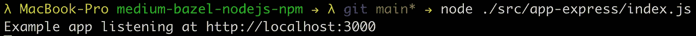
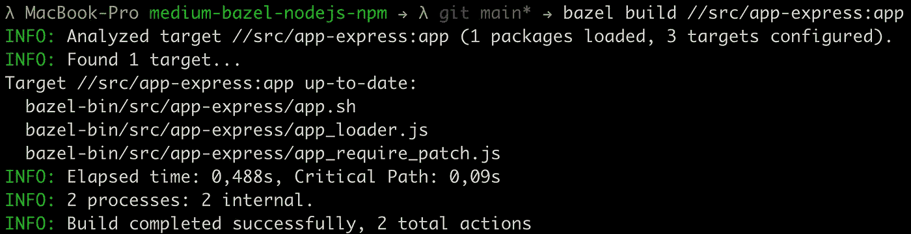
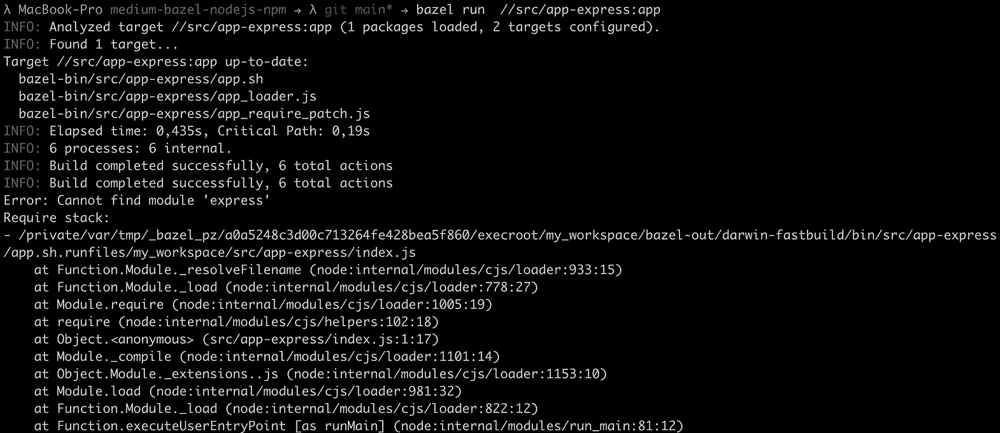
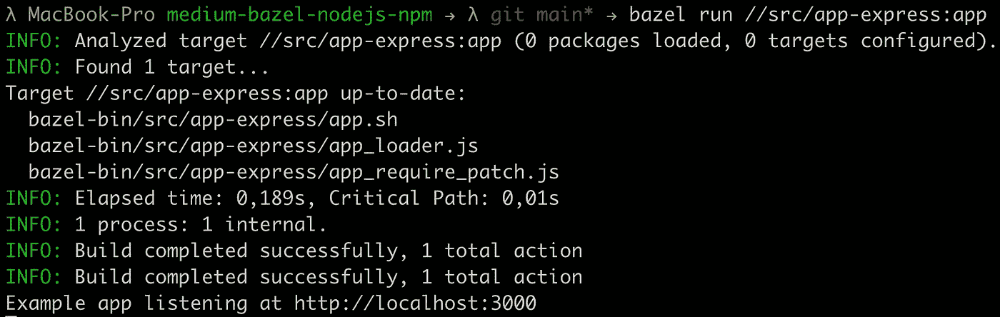

# 使用 Bazel 向 Node.js 应用程序添加 NPM 依赖项

> 原文：<https://levelup.gitconnected.com/adding-npm-dependencies-to-your-node-js-application-with-bazel-81f73b578c02>

使用 Bazel 向 Node.js 应用程序添加 NPM 依赖项的分步指南。


# 要求

*   [Bazel 已安装](https://docs.bazel.build/versions/main/install.html)(我在这个演示中使用的是 Bazel 4.2.2)
*   [Node.js 和 NPM 安装完毕](https://nodejs.org/en/)
*   看一下我以前的一篇[文章](/build-and-run-your-first-node-js-application-with-bazel-898e1a92fac5)有一个工作环境。

[](/build-and-run-your-first-node-js-application-with-bazel-898e1a92fac5) [## 用 Bazel 构建并运行您的第一个 Node.js 应用程序

### 使用 Bazel 构建和运行第一个 Node.js 应用程序的分步指南。

levelup.gitconnected.com](/build-and-run-your-first-node-js-application-with-bazel-898e1a92fac5) 

## 你将学到什么

*   通过 Bazel 向 Node.js 应用程序添加 NPM 依赖项

像往常一样，我准备了一个 [GitHub 库](https://github.com/Abszissex/medium-bazel-nodejs-npm)供您查看完成的代码库，并遵循本文中描述的步骤。

[](https://github.com/Abszissex/medium-bazel-nodejs-npm) [## GitHub-abszisex/medium-bazel-nodejs-NPM

### 此时您不能执行该操作。您已使用另一个标签页或窗口登录。您已在另一个选项卡中注销，或者…

github.com](https://github.com/Abszissex/medium-bazel-nodejs-npm) 

## 一般设置

关于初始设置，请参考我的前一篇文章[,我已经向您展示了如何设置适用于 Node.js 应用程序的 Bazel 环境。](/build-and-run-your-first-node-js-application-with-bazel-898e1a92fac5)

我们将从以下项目结构开始:

```
/
|- .gitignore
|- WORKSPACE.bazel
|- BUILD.bazel
|- package.json
|- src/
```

我们将忽略初始设置中已经创建的应用程序，并创建一个新的应用程序。

因此，在`/src`文件夹下，让我们创建一个包含`index.js`和`BUILD.bazel`文件的`app-express`文件夹。

```
/
|- ...
|- src/
   |- index.js
   |- BUILD.bazel
```

首先，`BUILD.bazel`文件包含以下内容:

您可以在下面的代码片段中看到`index.js`的内容。

正如您从`index.js`中看到的，我们计划使用 NPM 包`express`来创建 Node.js web 服务器。当然，本教程也适用于任何其他包。

## 运行代码

要在您的 Bazel 环境中安装`express`，导航到工作空间的根目录并通过`npm i --save express`进行安装。

安装后，我们可以通过 Node.js 运行 express 服务器。

```
node ./src/app-express/index.js
```



现在让我们试着和巴泽尔合作。

```
bazel build //src/app-express:app
```



正如所料，构建工作没有问题。

下一步是验证我们的应用程序是否也像预期的那样启动。所以让我们试着运行它。

```
bazel run //src/app-express:app
```



如果你读了我以前的一篇关于使用 Bazel 为 Node.js 应用程序使用多个文件的文章，你可能已经知道为什么它不工作了。

[](/building-multi-file-node-js-applications-with-bazel-9d631b667c8d) [## 用 Bazel 构建多文件 Node.js 应用程序

### 使用 Bazel 构建多文件 Node.js 应用程序的分步指南。

levelup.gitconnected.com](/building-multi-file-node-js-applications-with-bazel-9d631b667c8d) 

原因是目标`//src/app-express:app`只知道`BUILD.bazel`文件中指定的文件。Bazel 不会检查你所有的`require`语句并自动添加文件/模块。

但是不用担心，添加必要的依赖项很容易。`nodejs_binary`规则有一个`data`属性，可以向构建的应用程序添加额外的文件/模块。

现在让我们将`@npm//express`添加到`data`属性中。

并尝试通过 Bazel 重新运行应用程序。

```
bazel run //src/app-express:app
```

正如您在下图中看到的，应用程序正常启动。



**为什么是** `**@npm//express**` **？你现在可能会问。**

您可能还记得`WORKSPACE.bazel`文件，我们在其中定义了以下内容:

在这里，我们告诉 Bazel 它需要管理`node_modules`目录，并且它应该在内部被称为`@npm`。`npm_install`规则还有一个名字`npm`，表示通过 NPM CLI 安装的包应该可以通过`@npm//package`访问，例如`@npm//express`。

## 摘要

在这个简短的教程中，您应该已经学会了如何将外部 NPM 依赖项添加到 Node.js 应用程序中，并让您的 Bazel 构建知道它们。

## 你想联系吗？

如果你想联系我，请通过 LinkedIn 联系我。

另外，请随意查看我的书籍推荐📚。

[](https://mr-pascal.medium.com/my-book-recommendations-4b9f73bf961b) [## 我的书籍推荐

### 在接下来的章节中，你可以找到我对所有日常生活话题的书籍推荐，它们对我帮助很大。

mr-pascal.medium.com](https://mr-pascal.medium.com/my-book-recommendations-4b9f73bf961b) [](https://mr-pascal.medium.com/membership) [## 通过我的推荐链接加入 Medium—Pascal Zwikirsch

### 作为一个媒体会员，你的会员费的一部分会给你阅读的作家，你可以完全接触到每一个故事…

mr-pascal.medium.com](https://mr-pascal.medium.com/membership)