# 添加电源！

> 原文：<https://levelup.gitconnected.com/adding-power-ups-e4af4ccbd7cb>

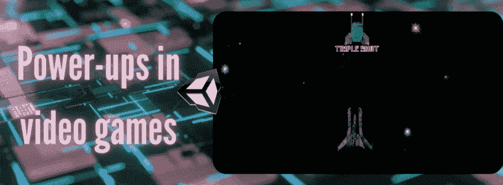

[加电](https://en.wikipedia.org/wiki/Power-up#History_and_influence)是一个游戏特性，为玩家角色提供暂时的优势或额外的能力。电源通常放置在游戏世界中预先确定的位置，随机产生，被击败的敌人丢弃，或从容器中捡起。嵌入的能力在与玩家角色接触后立即生效，他们的设计与整个游戏形成鲜明对比，以便于识别。由于这个原因，他们的设计并不总是适合游戏世界，因为他们用鲜艳的颜色，跳动的动画，甚至代表他们赋予的能力的字母来点缀。

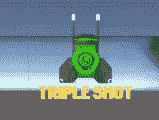

第一次启动被认为起源于 20 世纪 80 年代，来自超受欢迎的街机游戏[吃豆人](https://es.wikipedia.org/wiki/Pac-Man)。游戏中的每个迷宫都包含四个能量球，可以让吃豆人在有限的时间内吃掉鬼魂。

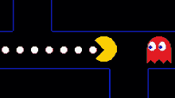

派克曼

这一功能的加入有效地增加了一个极简游戏的可玩性，因此，无数游戏效仿这一做法来增加游戏的趣味性。在开发我的 2D 太空射击游戏时，我利用 Unity 的碰撞系统来实现完全可收集的功能！

# 在 Unity 中添加可收集的能量

如前所述，当玩家角色**通过“**收集**它”与**接触时，加电变为**激活**。这只不过是由编程独创性提供动力的一点虚幻的东西。

## **“收藏**”是什么意思？

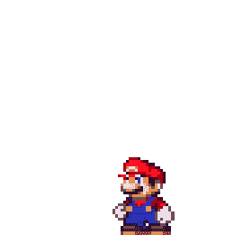

对于我们这些 Unity 开发者来说，收集一个能量意味着在效果生效后的适当时间摧毁一个物体。该物品被销毁，作为一种手段来创造一种幻觉，即该收藏品不再存在，因为玩家刚刚消费了它。这可以通过添加粒子效果和声音效果来进一步修饰。

> **注意**:这篇文章将集中在加电的实际实现上，音效和粒子的添加将在后面介绍，因为它们应该在石灰光中有自己的位置。

# 让我们一步步来看看这个过程吧！

1.  添加一个对象作为你的动力。这可以是精灵、3D 模型，甚至是图元。最重要的部分是你有一个可以编写脚本的对象。即使你使用了占位符，从原型到艺术作品的过渡也非常简单，正如[这篇](/from-prototype-to-a-work-of-art-67f8241e11a7?source=your_stories_page-------------------------------------)文章中提到的。

2.将刚体组件添加到通电对象，并将“重力比例”设置为 0。确保为您的项目添加了正确的组件类型。在我的例子中，我添加了一个刚体 2D，因为我的太空射击游戏是 2D 游戏。

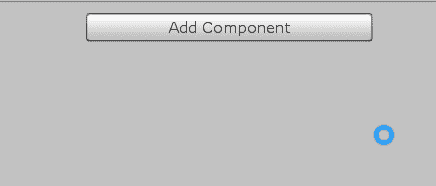

3.为玩家对象和电源增加一个碰撞器。确保你添加了合适类型的碰撞器，这样 Unity 可以在以后正确地计算相关的物理。

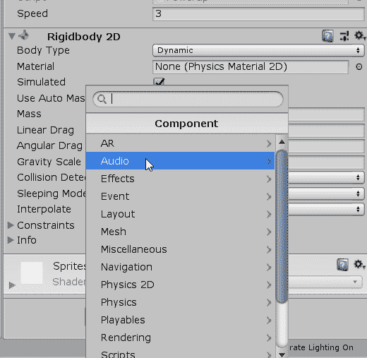

4.电源不是固体**——它们不会打断你的移动，因此你不能像撞上一堵坚固的墙一样撞上它们。出于这个原因，确保调整**是触发器**盒，这将使你通过通电*而不是碰撞它。***

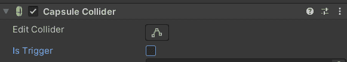

5.为了激活我们的能量，我们需要**检测我们的玩家角色何时与它碰撞**，这可以通过 Unity 碰撞系统来完成。因为我们正在处理一个一旦我们通过就会被触发或激活的对象，所以我们的代码将依赖于 **OnTriggerEnter** 函数。

> **注**:你可以在这里了解更多关于碰撞类型以及如何使用它们的[。](/oncollisionenter-vs-ontriggerenter-when-to-use-them-56d42772dd22?source=your_stories_page-------------------------------------)

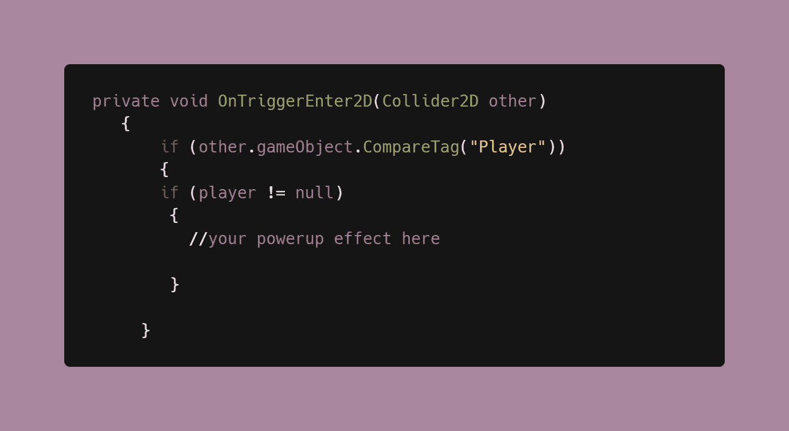

> **注意**:在执行代码之前，最好检查播放器是否为空。

6.正如你在上面的代码中看到的，检查*其他*碰撞游戏对象中的玩家标签。这样做是为了只有玩家可以激活加电。因此，给你的玩家游戏对象添加一个玩家标签。

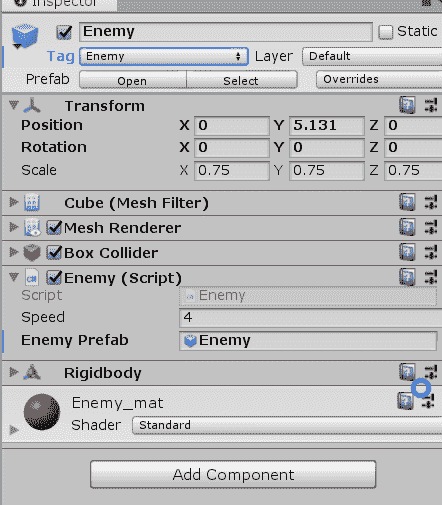

7.现在你有了一种检测碰撞的方法，你可以添加代码，一旦玩家角色获得能量，代码就会激活。这就是我们如何通过添加以下代码来执行 power-up 对象的销毁并创建集合的假象:

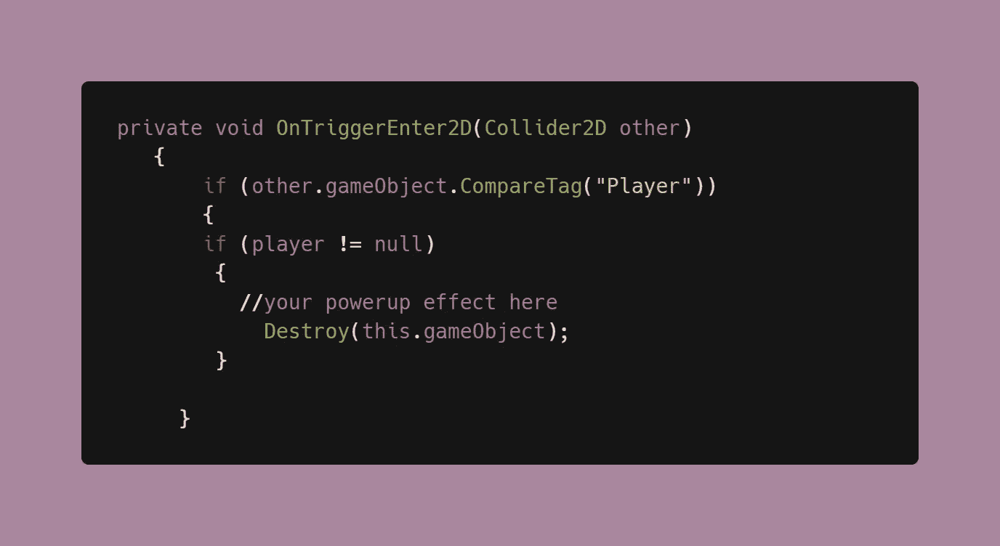

现在你有了一个可以被玩家收集的异能，被收集后实际上会消失！您可以在 OnTriggerEnter 函数中添加各种代码来执行各种有趣的效果，或者您可以通过[脚本通信](http://methods within the OnTriggerEnter to execute a variety of interesting effects)调用方法，并让它们在该函数中执行。

在我的太空射击游戏中，我使用了一个随机预置的[实例化](https://docs.unity3d.com/ScriptReference/Object.Instantiate.html)来制造一个三重射击的能量源，一个三重激光的实例化，以及一个[协程](https://medium.com/codex/coroutines-with-unity-b5a2b3fc3426)来处理它活动的时间。这都是在玩家脚本中完成的，因为加电实质上是修改玩家的行为。

**实例化:**

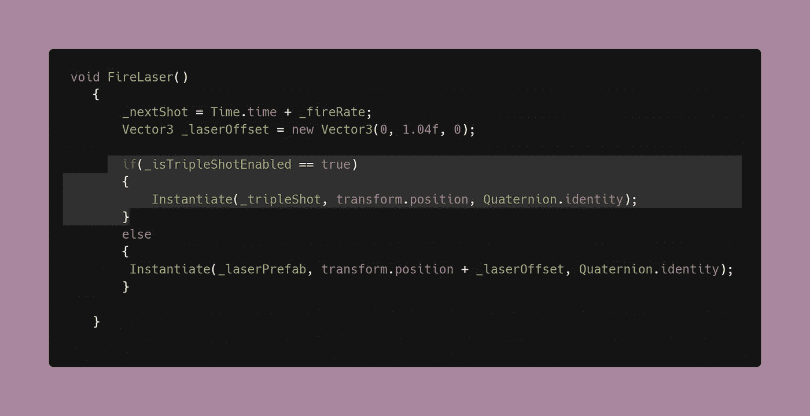

**跟踪上电是否已启动的功能:**

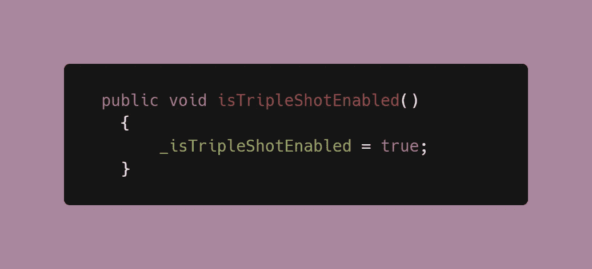

**一个协程，使得加电的效果在给定时间后逐渐消失:**

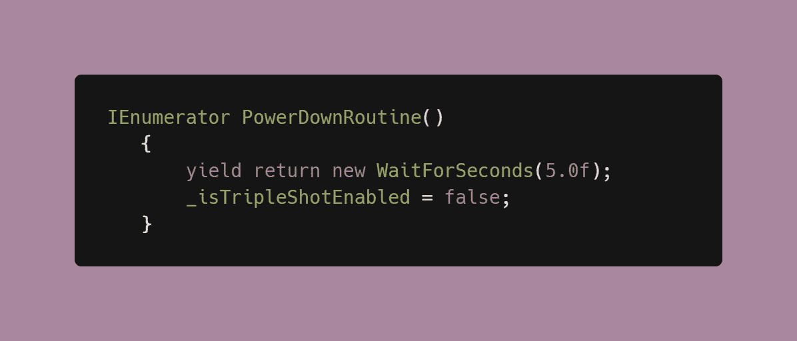

并且使用 [**模块化加电系统处理激活。**](https://dennisse-pd.medium.com/creating-modular-power-up-systems-bcf349e0020?postPublishedType=initial)

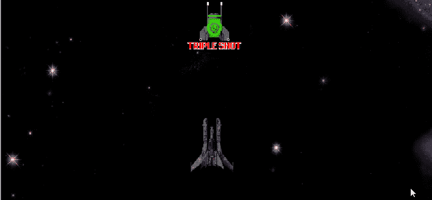

在接下来的文章中，我们将看看我是如何为三次开机添加精灵[动画的，以及如何确定开机效果的长度！](https://medium.com/codex/animating-a-sprite-with-unitys-animation-window-b049493f69a1)