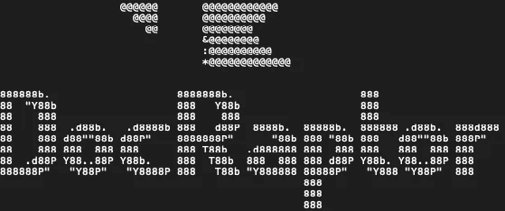
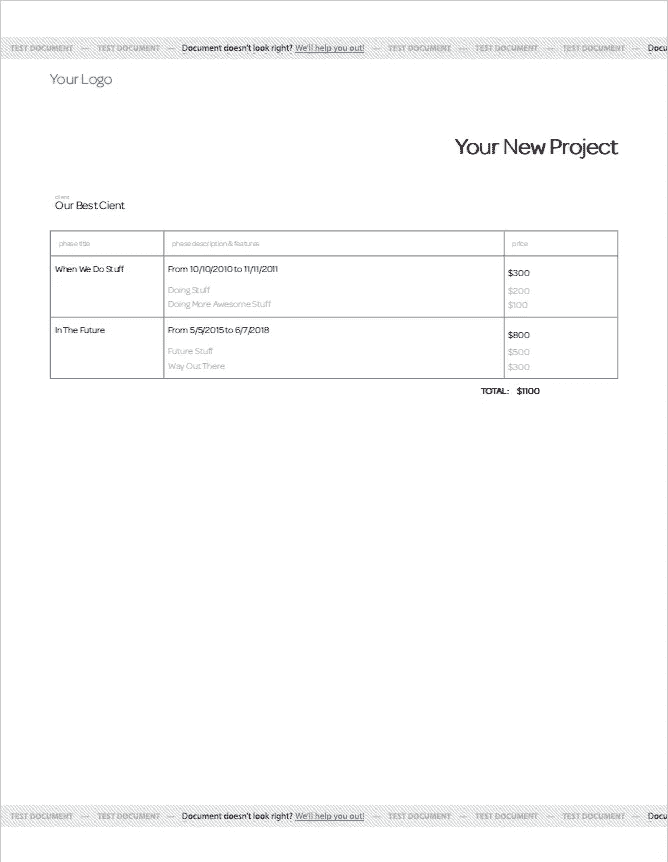
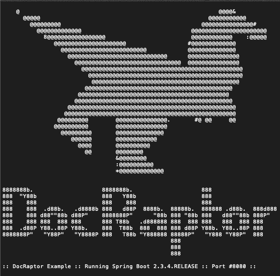
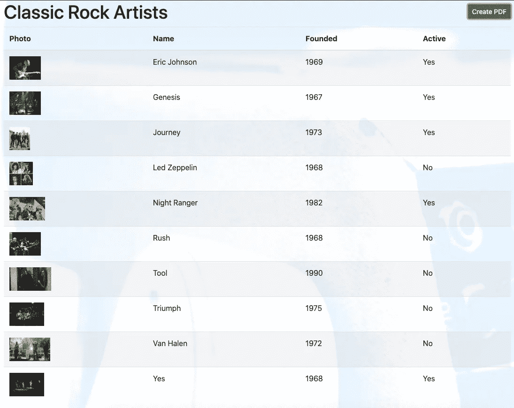
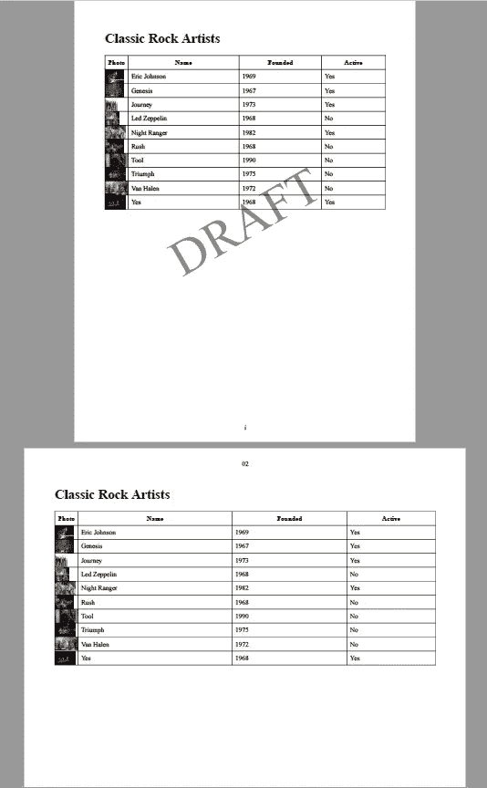

# 使用 DocRaptor 为全栈应用程序添加丰富的输出选项

> 原文：<https://levelup.gitconnected.com/adding-rich-output-options-to-a-full-stack-application-using-docraptor-5e653e1b8e90>



[了解如何将 DocRaptor 添加到 Spring Boot 项目中，以将 HTML 转换为具有高级功能的 PDF，如自定义页眉、页脚、水印和无尽的样式选项。结果呢？任何 RESTful 客户端都可以调用的 URI。]

对于功能团队来说，构建现代应用变得更加容易，因为有了像 Spring Boot、Angular、ReactJS 和 Vue 这样的优秀框架。来自 Amazon、Heroku、Microsoft 甚至 Google 的服务提供了令人兴奋的选项，进一步完善了现代应用程序体验。然而，对丰富的输出格式(PDF 或 Microsoft Excel [XLS])的需求似乎仍然落后于其他一切。CSS 中的复杂设计通常是首选架构，然而，理解和支持这些设计会变得很困难。

人们可能会认为这是一个清晰的信号，表明随着应用程序体验的发展，对丰富输出的需求越来越少。然而，这些需求仍然保留在各种规模的应用程序的特性列表中。事实上，我正在构建的[健身应用](https://dzone.com/articles/using-heroku-to-quickly-build-a-multi-tenant-saas)需要生成 PDF 格式的发票。税务准备软件需要打印质量的输出，用于手动归档或将来参考。对于提供大量数据的应用程序来说，XLS 提取是必不可少的。

在意识到丰富的输出仍然是一种有效的需求后，我研究了一款名为 [DocRaptor](https://docraptor.com) 的产品。

# 关于 DocRaptor

我首先研究了几个创建 pdf 的开源解决方案，但是很快意识到它们不能处理复杂性，也不能(有希望！)我需要的规模。相反，我找到了一个看似完美的解决方案:DocRaptor。它基于 [Prince](https://www.princexml.com) ，这是一个经过行业验证的功能丰富的引擎，可以执行转换；然而，Prince 没有在顶部提供服务来提供对该引擎的方便访问。

DocRaptor 是基于引擎的 SaaS 解决方案，其 API 支持各种语言，包括:

*   C#
*   Java 语言(一种计算机语言，尤用于创建网站)
*   结节
*   服务器端编程语言（Professional Hypertext Preprocessor 的缩写）
*   计算机编程语言
*   红宝石

还有一个 RESTful URI，可以使用一个简单的 cURL 命令调用它:

```
curl http://YOUR_API_KEY_HERE@docraptor.com/docs \
 --fail --silent --show-error \
 --header "Content-Type:application/json" \
 --data '{"test": true,
          "document_url": "http://www.docraptor.com/examples/invoice.html",
          "type": "pdf" }' > docraptor.pdf
```

在上面的例子中，invoice.html 文件中的模板数据用于生成一个名为`docraptor.pdf`的简单 PDF。您甚至可以尝试上面的 cURL 命令，它将生成一个类似于下面的 PDF:



# 需求

为了试用 DocRaptor，我想使用 Spring Boot 和 Angular 创建一个全栈应用程序体验。Spring Boot RESTful 服务将引入提供经典摇滚表演者列表的服务。Angular 应用程序将以表格格式显示这些表演艺术家。

在同一个显示屏上，我添加了一个按钮来创建 PDF 版本的列表。使用该按钮将对 Spring Boot API 进行 RESTful 调用。反过来，DocRaptor SaaS 解决方案将生成 PDF 版本的表格输出。示例 PDF 将通过跨两页复制具有以下特征的表格来测试转换器引擎的功能:

# 第一页

第一页将包含以下元素:

*   使用纵向方向
*   水印(但仅在测试模式设置为假时可用)
*   小写罗马数字页码
*   页面底部的页码(页脚)

# 第 2 页

为了展示 DocRaptor 的强大功能和灵活性，第二页将包含:

*   横向
*   第二页上不会出现水印
*   两位数标准页码
*   页面顶部的页码(页眉)

# 方法

DocRaptor 期望 HTML 格式产生 PDF 或 XLS 文档。在这个例子中，Spring Boot 服务将作为 DocRaptor 的集成点。因此，Spring Boot 必须收集必要的数据，并将源文件格式化为 HTML，以便 DocRaptor 可以将其作为`byte[]`返回。

以下是来自`[https://docraptor.com/examples/invoice.html](https://docraptor.com/examples/invoice.html)` DocRaptor 文件的内容:

```
<!DOCTYPE html>
<html>
  <head>
    <title>Your New Project for Our Best Client</title>
    <meta http-equiv="content-type" content="text/html; charset=utf-8" />
    <style type="text/css">
      /*resets from YUI*/
      table {border-collapse:collapse; border-spacing:0;} /* setup the page */
      @page { margin: 30px; background: #ffffff; }
      /* setup the footer */
      @page { @bottom { content: flow(foot); } }
      #footer { flow: static(foot); } /* useful utility */
      .clear { clear:both; } /* layout */
      #container { font-family: Omnes Light, Trebuchet MS, Calibri, Futura, Geneva, Tahoma; font-size: 14pt; color: #a7a7a7; position: relative; } /* footer shenanigans! */
      #footer { text-align: center; display: block; } /* colors */
      .black { color: black } /* stylin */ #quote_name { margin-top: 3.5em; text-align: right; font-weight: bold; font-size: 1.5em } #client { font-size: 0.75em; margin-top: 3em; margin-left: 0.5em;} #client_header { font-size: 0.5em; } #phase_details {
        margin-top: 2em;
        font-size: 0.6em;
        border-width: 1px;
        border-spacing: 0px;
        border-style: solid;
        border-color: gray;
        width: 100%;
      } #phase_details th { font-size: 0.8em; padding: 10px !important; border-style: solid !important; } #phase_details th, td {
        border-width: 1px;
        padding: 3px 5px;
        border-top-style: none;
        border-bottom-style: none;
        border-left-style: solid;
        border-right-style: solid;
        border-color: gray;
        background-color: white;
      } #phase_details tr.first td { padding-top: 10px; padding-bottom: 10px; } #phase_details td.price { text-align: left; }
      #phase_details .price_container { float: left; min-width: 30%; } #phase_details thead .title { width: 20%; }
      #phase_details thead .description { width: 60%; }
      #phase_details thead .price { width: 20%; }
      #phase_details tr.last { border-bottom: 1px solid gray; }
      #footer #contain { text-align: right; font-size: 0.8em; }
      #total_price { text-align: right; margin-right: 6.75em; margin-top: 0.5em; }
      #total_price h2 { color: black; font-size: 0.6em; font-weight: bold; }
      #total_price .price { margin-left: 0.75em; }
    </style>
  </head>
  <body>
    <div id="container">
      <div id="logo">Your Logo</div>
      <div id="main">
        <div id="header">
          <div id="header_info black">1234 Made Up LN <span class="black">|</span> (555)-555-5555 <span class="black">|</span> example.com</div>
        </div>
        <h1 class="black" id="quote_name">Your New Project</h1>
        <div id="client">
          <div id="client_header">client:</div>
          <p class="address black">
            Our Best Cient
          </p>
        </div>
        <table id="phase_details">
          <thead>
            <tr>
              <th class="title">phase title</th>
              <th class="description">phase description &amp; features</th>
              <th class="price">price</th>
            </tr>
          </thead>
          <tr class="first black">
            <td>When We Do Stuff</td>
            <td>From 10/10/2010 to 11/11/2011</td>
            <td class="price"><div class="price_container">$300</div></td>
            </tr>
          <tr>
            <td></td>
            <td>Doing Stuff</td>
            <td class="price"><div class="price_container">$200</div></td>
          </tr>
          ...
        </table>
      </div>
      <div id="total_price">
        <h2>TOTAL: <span class="price black">$1100</span></h2>
      </div>
    </div>
  </body>
</html>
```

DocRaptor 将 HTML 转换成 PDF 所需的一切都在这个文件中。当然，可以链接到外部样式文件以避免重复工作。

# 使用 DocRaptor 设置 Spring Boot 服务

将 DocRaptor 添加到 Spring Boot 实例就像添加以下依赖项一样简单:

```
<dependency>
            <groupId>com.docraptor</groupId>
            <artifactId>docraptor</artifactId>
            <version>2.0.0</version>
        </dependency>
```

本例中的 Spring Boot 服务包括一个内存中的 H2 数据库，并填充了一个经典摇滚艺术家的小列表。对于该数据，存在以下`Entity`对象:

```
@Data
@Entity
@Table(name = "artists")
public class Artist {
    @Id
    private String name;
    private String yearFormed;
    private boolean active;
    private String imageUrl;
}
```

当与 ArtistController 中的 RESTful URI 结合使用时，对`\artists`路径的一个简单的`GET`命令提供了类似于下面列表的数据:

```
[
 ...
 {
   "name": "Yes",
   "yearFormed": "1968",
   "active": true,
   "imageUrl": "https://somehost/Yes_concert.jpg"
 }
]
```

# 在 Spring Boot 内部配置 DocRaptor

以下属性是与 DocRaptor 服务交互所必需的:

*   `${DOCRAPTOR_API_KEY}` -为新账户提供的 API 密钥`[doc-raptor.api-key]`
*   `${DOCRAPTOR_TEST_MODE_ENABLED}` -确定测试模式是否启用(见下文)`[doc-raptor.test-mode]`
*   `${DOCRAPTOR_USE_JAVASCRIPT}` -确定 Javascript 是否启用`[doc-raptor.use-javascript]`
*   `${PORT}`-Spring Boot 服务端口`[server.port]`(可选，默认为 8080)

# 关于`doc-raptor.test-mode`

通过映射到`[doc-raptor.test-mode]`的`${DOCRAPTOR_TEST_MODE_ENABLED}`变量启用测试模式，将不会对 DocRaptor 帐户产生任何费用。但是，启用测试模式会用通用 DocRaptor 水印替换任何自定义水印。

请记住，有可能使用一个等于`YOUR_API_KEY_HERE`的`[doc-raptor.api-key]`。然而，这样做的话，在 DocRaptor 服务中`[doc-raptor.test-mode]`将总是被设置为`true`。

# 使用 DocRaptor 启动 Spring Boot

DocRaptor 配置就绪后，使用示例项目启动 Spring Boot 服务器应该会产生一个类似于下面的启动屏幕:



加载后，应该会出现与下面类似的日志条目:

```
2020-10-30 10:42:05.100  INFO 95816 --- [           main] DeferredRepositoryInitializationListener : Spring Data repositories initialized!
2020-10-30 10:42:05.108  INFO 95816 --- [           main] c.g.j.d.DocraptorServiceApplication      : Started DocraptorServiceApplication in 2.615 seconds (JVM running for 3.042)
2020-10-30 10:42:15.634  INFO 95816 --- [nio-8017-exec-2] o.a.c.c.C.[Tomcat].[localhost].[/]       : Initializing Spring DispatcherServlet 'dispatcherServlet'
2020-10-30 10:42:15.634  INFO 95816 --- [nio-8017-exec-2] o.s.web.servlet.DispatcherServlet        : Initializing Servlet 'dispatcherServlet'
2020-10-30 10:42:15.639  INFO 95816 --- [nio-8017-exec-2] o.s.web.servlet.DispatcherServlet        : Completed initialization in 5 ms
```

# 为 DocRaptor 创建动态模板

为了创建供 DocRaptor 使用的模板，我决定使用`j2html.` j2html 是一个 html 构建器，它允许 Java 程序生成 HTML 文本。我通过以下依赖项将库添加到 Spring Boot:

```
<dependency>
            <groupId>com.j2html</groupId>
            <artifactId>j2html</artifactId>
            <version>1.4.0</version>
</dependency>
```

接下来，我为这个例子创建了一个非常简单的静态实用程序类:

```
public final class HtmlBuilder {
    private HtmlBuilder() { } public static String createHtml(List<Artist> artists, String title) {
        ContainerTag containerTag = html(
            head(
                title(title),
                style(createStyleObjects()).attr("type", "text/css")
            ),
            body(
                div(
                   div("DRAFT").attr("id", "watermark"),
                   h1(title),
                   createBasicTable(artists.stream())
                ).withClass("named_page_one"),
                div(
                    h1(title),
                    createBasicTable(artists.stream())
                ).withClass("named_page_two page_break")
            )
        );
    return containerTag.render();
    } private static ContainerTag createBasicTable(Stream<Artist> artists) {
        return table(
            thead(
                tr(
                    th(text("Photo")),
                    th(text("Name")),
                    th(text("Founded")),
                    th(text("Active"))
                )
            ),
            tbody(
                  artists.map(artist ->
                      tr(
                      td("").attr("width", "5%").attr("background", artist.getImageUrl()).withStyle("background-size: contain; background-repeat: no-repeat;"),
                      td(text(artist.getName())),
                      td(text(artist.getYearFormed())),
                      td(text(artist.isActive() ? "Yes" : "No"))
                    )).toArray(ContainerTag[]::new)
                )
        );
    } private static String createStyleObjects() {
        return "table, th, td {" +
                "border: 1px solid black; " +
                "padding: 7px; " +
                "} " +
                "table {" +
                "  border-collapse: collapse;" +
                "  width: 100%;" +
                "} " + "#watermark {" +
                "flow: static(watermarkflow);" +
                "font-size: 120px;" +
                "opacity: 0.5;" +
                "transform: rotate(-30deg);" +
                "text-align: center;" +
                "} " + "@page namedPage1 {" +
                "size: letter portrait;" +
                "@bottom {" +
                "content: counter(page, lower-roman);" +
                "} " +
                "@prince-overlay {" +
                "content: flow(watermarkflow)" +
                "} " +
                "} " + "@page namedPage2 {" +
                "size: letter landscape;" +
                "margin-top: 70px; " +
                "@top {" +
                "content: counter(page, decimal-leading-zero);" +
                "} " +
                "} " + ".named_page_one {" +
                "page: namedPage1;" +
                "} " + ".named_page_two {" +
                "page: namedPage2;" +
                "} " + ".page_break {" +
                "page-break-before: always;" +
                "} ";
    }
}
```

虽然这个`HtmlBuilder`类很少使用层叠样式表(CSS)特性，但它将创建 DocRaptor 所需的模板，甚至允许`Artist`数据成为将要创建的工件的一部分。

# 创建 DocRaptor 服务

您可以通过一个简单的公共方法在`DocRaptorService`中处理 DocRaptor 请求:

```
public byte[] process(DocRaptorRequest docRaptorRequest) throws Exception {
        log.info("process(docRaptorRequest={}, testMode={})", docRaptorRequest, docRaptorProperties.isTestMode()); DocApi docApi = new DocApi();
        ApiClient apiClient = docApi.getApiClient();
        apiClient.setUsername(docRaptorProperties.getApiKey()); validateRequest(docRaptorRequest);
        return docApi.createDoc(buildDocFromRequest(docRaptorRequest));
    }
```

一旦`validateRequest`验证了`docRaptorRequest`，它就调用`buildDocFromRequest()`方法:

```
private Doc buildDocFromRequest(DocRaptorRequest docRaptorRequest) {
        Doc doc = new Doc();
        doc.setTest(docRaptorProperties.isTestMode());
        doc.setJavascript(docRaptorProperties.isUseJavascript()); if (docRaptorRequest.getContentType().equals(DocRaptorContentType.STRING)) {
            doc.setDocumentContent(docRaptorRequest.getDocumentContent());
        } else {
            doc.setDocumentUrl(docRaptorRequest.getDocumentUrl());
        } doc.setDocumentType(docRaptorRequest.getDocumentType());
        doc.setName(docRaptorRequest.getName()); if (docRaptorRequest.usePrinceXml()) {
            PrinceOptions princeOptions = new PrinceOptions();
            princeOptions.setBaseurl(docRaptorRequest.getBaseUrl());
            doc.setPrinceOptions(princeOptions);
        } log.debug("doc={}", doc.toString());
        return doc;
    }
```

在`ArtistService`中，以下方法与`DocRaptor`服务接口:

```
public byte[] createPdf(String name) throws Exception {
        DocRaptorRequest docRaptorRequest = new DocRaptorRequest();
        docRaptorRequest.setDocumentType(Doc.DocumentTypeEnum.PDF);
        docRaptorRequest.setContentType(DocRaptorContentType.STRING);
        docRaptorRequest.setDocumentContent(HtmlBuilder.createHtml(getArtists(), "Classic Rock Artists"));
        docRaptorRequest.setName(name);
        return docRaptorService.process(docRaptorRequest);
    }
```

然后，`ArtistController`和`/artists/pdf` URI 调用服务:

```
@GetMapping(value = "/artists/pdf", produces = MediaType.APPLICATION_OCTET_STREAM_VALUE)
    public ResponseEntity<byte[]> getArtistsPdf(@RequestParam(required = false) String filename) {
        try { if (StringUtils.isEmpty(filename)) {
                filename = "Artists.pdf";
            } HttpHeaders headers = new HttpHeaders();
            headers.setCacheControl(CacheControl.noCache().getHeaderValue());
            headers.add("content-disposition", "inline;filename=" + filename); return new ResponseEntity<>(artistService.createPdf(filename), headers, HttpStatus.OK);
        } catch (Exception e) {
            log.error(e.getMessage(), e);
            return new ResponseEntity<>(HttpStatus.BAD_REQUEST);
        }
    }
```

# 添加简单的角度客户端

此时，您可以使用简单的 cURL 或 Postman 请求，通过以下命令从 DocRaptor 检索 PDF 文件:

```
curl --location --request GET 'http://localhost:8080/artists/pdf'
```

然而，我想创建一个非常基本的角度应用程序来提供一些关于体验的演示。构建一个简单的`list-artists`组件后，当从角度库执行`ng serve`时，出现以下屏幕:



这个视图是来自 Spring Boot 服务的内存 H2 数据库的一个简单的数据列表。位于应用程序右上角的**创建 PDF** 调用 DocRaptor 和`artists/pdf` URI。

# 请求 PDF

为了让 DocRaptor 生成 PDF 文件，将**创建 PDF** 按钮连接到以下方法:

```
createPdf() {
    this.artistsService.createPdf().subscribe((response)=> {
      let file = new Blob([response], {type: 'application/pdf'});
      let fileURL = URL.createObjectURL(file);
      window.open(fileURL);
    });
  }
```

这个方法在 Angular 中调用`artistsService`:

```
createPdf() {
    const httpOptions = {
      'responseType'  : 'arraybuffer' as 'json'
    }; return this.http.get<any>(this.baseUrl + '/pdf', httpOptions);
  }
```

这又调用 Spring Boot，后者联系 DocRaptor 并在新窗口中返回一个 PDF:



成功！在上面的例子中，我们看到一个 PDF 文件。

正如您将看到的，第一页包含以下元素:

*   纵向方向
*   水印(但仅在测试模式设置为假时可用)
*   小写罗马数字页码
*   页面底部的页码(页脚)

第二页包含以下元素:

*   横向
*   第二页上不出现水印
*   两位数标准页码
*   页面顶部的页码(页眉)

# 结论

在本文中，我们探讨了如何使用 DocRaptor 创建包含在全栈应用程序中的数据的简单 PDF。如果您对这个示例的数据感兴趣，请查看下面的存储库:

[https://gitlab.com/johnjvester/doc-raptor](https://gitlab.com/johnjvester/doc-raptor)

最初，我担心我不能为 DocRaptor 提供一个角度模板的路径来使用 HTML 数据构建 PDF。然而，我很快意识到这不是一个 DocRaptor 用例。虽然我可以将发票信息作为应用程序的一部分提供给我的客户，但是我不需要在应用程序的视图中包含大量的打印发票内容。提供打印质量版本的数据时，需要客户和提供商信息等内容。

这种丰富的模板数据需要存储在某个地方。此外，动态创建这些模板的能力非常符合 DocRaptor 的定位。当然，XLS 文件也存在相同的用例。

从定价的角度来看，使用每个请求标题中的`API_KEY=YOUR_API_KEY_HERE`可以免费开始。这将生成一个具有所有必要功能的 PDF 或 XML 文件，但会在输出中添加一个“测试文档”水印。

开始 7 天的免费试用允许 testMode=false 功能删除此类水印，并允许类似于本例中提供的自定义水印。免费试用后，[基本](https://docraptor.com/signup)计划每月收费 15 美元，每月 125 份文件。在白银级别，每份文档的价格大幅降低，允许以每月 1，000 美元的价格购买 40，000 份文档。还有一些额外的定价选项，包括一个无限制的版本。

在当今的现代应用程序开发世界中，SaaS 选项提供了一种以有吸引力的价格做好某些事情的机制。这使得功能团队可以专注于细化业务规则，并增强应用程序中的知识产权逻辑。

经[约翰·维斯特](https://www.linkedin.com/in/johnjvester/?ref=hackernoon.com)许可出版