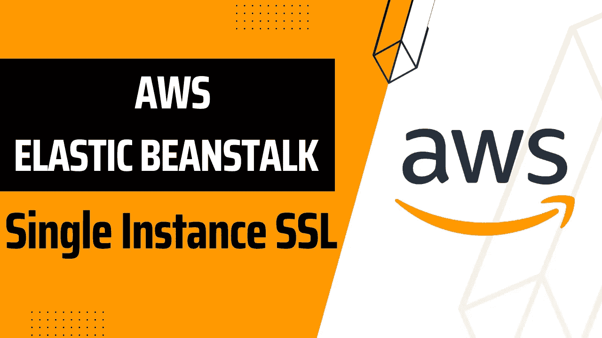
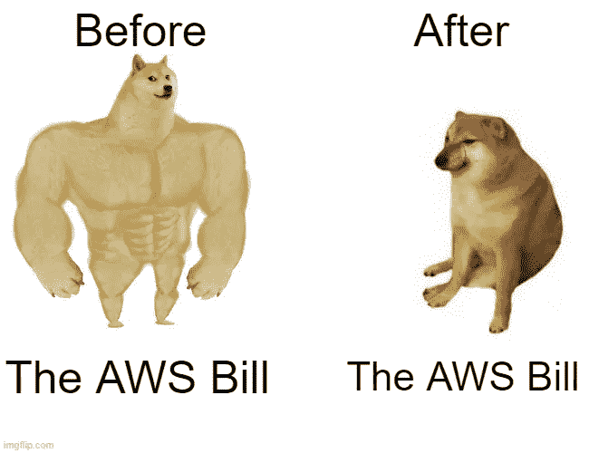
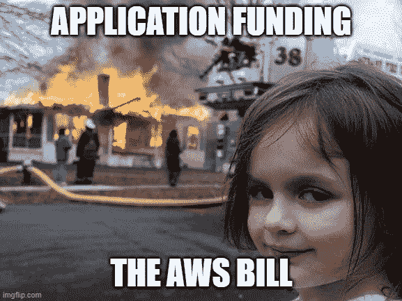

# 向单实例 AWS 弹性 BeanStalk 添加 SSL

> 原文：<https://levelup.gitconnected.com/adding-ssl-to-single-instance-aws-elastic-beanstalk-5a1004daec8b>



最近，我受到了广受恐惧的 AWS 比尔·🥲🥲的攻击

像其他开发人员一样，我决定咆哮而不是试图优化我的架构。后来，我冷静下来，意识到我可以通过删除开发环境中的负载平衡器并替换为单实例容量来降低成本



一切都很好，直到我意识到 SSL 在单实例 beanstalk 环境中运行时不容易配置。所以我做了什么；再次咆哮，然后启用 SSL🙂

让我向您介绍一下我是如何设置 SSL 的

# 免费获取 SSL 证书

第一步是获得 SSL 证书。我的直觉是使用 AWS 证书管理器，因为我的应用程序部署在 AWS 上，但是 ACM 证书不能被 EC2 实例直接使用😒

后来我从 SSL 免费获得了一个 SSL 证书。整个过程非常简单，我只需要在 53 号公路上添加一个 CNAME 记录就可以了。

SSL For Free 的免费层非常有限；顾名思义。如果你不想花钱，你也可以很容易地生成自己的证书

# 生成您自己的 SSL 证书

我决定把这作为一篇独立的文章，你可以在这里阅读[。](https://medium.com/@toluolatubosun/generate-ssl-certificate-with-lets-encrypt-a8e26cf0a378)

# 配置弹性 BeanStalk 环境

要配置使用 SSL 证书的环境，请将这里的代码[添加到您的应用程序中。它包含两个文件夹，配置 SSL 证书，处理 HTTP 到 HTTPS 重定向，并且也是 WebSocket 兼容的](https://github.com/toluolatubosun/aws-elastic-beanStalk-single-instance-SSL)

然后更新在中找到的配置

```
.ebextensions > certs.config
```

使用 SSL 证书文件中的代码和私钥。确保不要弄乱缩进，因为这是一个 YAML 文件，我们都知道谁与 YAML 文件😏

使用这种配置，您的应用程序必须监听端口 8081

如果你知道你在做什么，你可以编辑配置文件来使用不同的端口

# 多一点

如果您的生产环境运行负载平衡的多个实例，您肯定不希望您的配置文件进入应用程序的生产分支

我的处理方法是使用下面的 git 命令来合并、删除文件夹，然后提交

```
git merge --no-ff --no-commit devgit reset HEAD .ebextensions .platformgit checkout -- .ebextensions .platformgit commit -m "merged dev"git push origin main
```

我不确定这是最好的处理方式，我愿意听取你的建议

你也可以随时联系我[这里](https://toluolatubosun.com/contact)🤠

保持新鲜，下一集再见😎🖖



# 分级编码

感谢您成为我们社区的一员！在你离开之前:

*   👏为故事鼓掌，跟着作者走👉
*   📰查看[级编码出版物](https://levelup.gitconnected.com/?utm_source=pub&utm_medium=post)中的更多内容
*   🔔关注我们:[推特](https://twitter.com/gitconnected) | [LinkedIn](https://www.linkedin.com/company/gitconnected) | [时事通讯](https://newsletter.levelup.dev)

🚀👉 [**软件工程师的顶级工作**](https://jobs.levelup.dev/jobs?utm_source=pub&utm_medium=post)