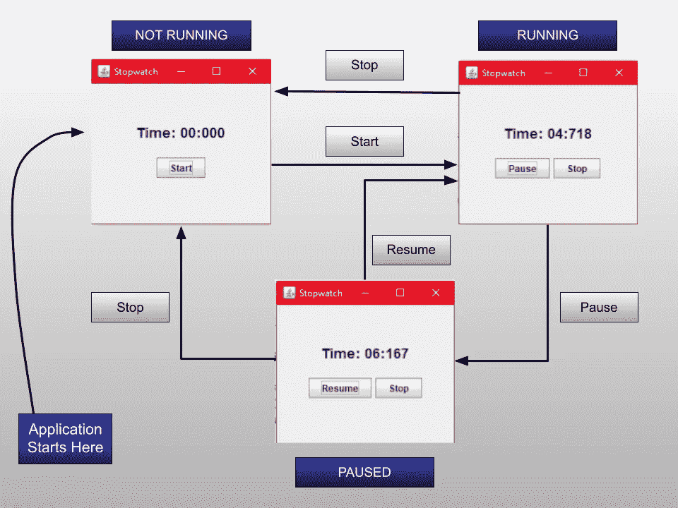

# 向我们的应用程序添加开始、暂停、恢复和停止(第 5 部分)

> 原文：<https://levelup.gitconnected.com/adding-start-pause-resume-and-stop-to-our-app-part-5-dd562d82d0a3>


礼貌:timeanddate.com

欢迎来到本系列的第 5 部分。在上一个教程中，我们关注于构建我们的用户界面，设计我们的布局，并为我们的应用程序添加最少的功能。现在我们已经准备好了我们的 UI，我们可以考虑让 UX 更好。

# 之前的教程

如果您是第一次阅读这一部分，那么您一定要看看本系列的第 4 部分。

*   [**代号**](https://github.com/rajtilakls2510/Stopwatch/tree/S4_Setting_up_the_UI_of_Swing_App) 直到现在。
*   [第四部](https://rajtilakls2510.medium.com/starting-with-the-swing-app-part-4-7b9395a5960c)

现在，我们的应用程序看起来像这样:


我们必须给用户开始，暂停，恢复和停止的功能。我们已经准备好了开始和停止按钮。所以这是一个优点。但是我们不想再做两个暂停和恢复的按钮。这将使我们的应用程序看起来非常非常丑陋。我们能做的是:当用户按下开始时，将开始按钮的功能改为暂停。这是因为用户在启动秒表后不需要启动按钮。类似地，当按下暂停按钮时，我们可以将按钮的功能更改为恢复。Stop 按钮会一直在那里帮助用户重置秒表。

让我们更清楚地了解一下这个东西:

*   当我们的应用程序第一次启动时，它看起来像这样。


*   当用户按下 start 时，秒表将开始计时，Start 按钮的名称将变为 Pause。


*   当用户按下 Pause 时，秒表暂停，Pause 按钮的名称更改为 Resume。


*   在启动秒表后的任何时候，如果用户按下停止按钮，“计时器显示”将变为零，应用程序将返回到其初始状态。


注:实际上，当用户处于初始状态时，我们不需要停止按钮。当然，用户不会试图停止已经复位的秒表。因此，我们也将从初始状态中删除停止按钮。我们的初始状态将是这样的:


注意这里发生了什么。当用户按下任何按钮时，应用程序的状态都在变化。基于此，我准备了一个状态图。看看这个:



这个状态图显示了我们的应用程序的完整状态转换。有三种状态:

*   **未运行:**这是秒表尚未启动的初始状态。
*   **运行:**秒表运行时的状态。
*   **暂停:**秒表暂停时的状态。

让我们开始编码吧。我们首先将这些状态添加到我们的应用程序中。状态将是带有一些值的正常整数。还将有一个“currentState”变量来保存秒表的当前状态。打开 StopwatchSwing.java，将这些整数相加:

```
public class StopwatchSwing implements Observer {

    ...
    final int NOT_RUNNING=0, RUNNING=1, PAUSED=2;
    int currentState;
    ....}
```

注意这里的 **final** 关键字。最终的状态是我们不能在初始化后改变状态的值。这完全没问题，因为我们只需要通过名称来标识我们的州。

当应用程序启动时，当前状态应该处于未运行状态。因此，在构造函数中，我们必须使 currentState 处于未运行状态。

```
StopwatchSwing()
{
    currentState=NOT_RUNNING;
    ...

}
```

主要问题是当用户按下开始按钮时。当用户按下开始按钮时，状态会随着用户界面和秒表的变化而不断变化。因此在 handleStartPress()方法中我们必须处理各种各样的问题。第一个是识别当前状态。然后根据它采取一些行动。然后，改变状态。识别状态很容易:currentState 已经保存了应用程序的当前状态，我们可以将它与我们的任何状态进行匹配。我们可以这样写。

```
private void handleStartPress() {
    if(currentState==NOT_RUNNING)
    {
    }
    else if(currentState==RUNNING)
    {
    }
    else if(currentState==PAUSED)
    {
    }

}
```

这将正确识别当前状态并执行适当的块。接下来要做的是填满每一块积木。

```
private void handleStartPress() {
    if(currentState==NOT_RUNNING)
    {
        sw =  new Stopwatch();
        sw.registerObserver(this);
        sw.start();
        start.setText("Pause");
        stop.setVisible(true);
        currentState=RUNNING;
    }
    ....

}
```

当用户处于非运行状态时:

*   我们正在创建一个新的秒表对象并注册一个观察者(可能看起来有点可疑，因为我们已经在构造函数中创建了一个秒表，但是当我们编写 handleStopPress()方法时，您会理解我们为什么要这样做)。
*   然后，我们使用 setText()方法将按钮的名称从开始更新为暂停。我们现在也使停止按钮可见。停止按钮直到现在才可见，因为用户在非运行状态下不需要它。
*   最后，我们将状态更改为正在运行。

```
private void handleStartPress() {
    ...
    else if(currentState==RUNNING)
    {
        sw.stop();
        start.setText("Resume");
        currentState=PAUSED;
    }
    ...

}
```

当用户处于运行状态并按下暂停(或开始)时:

*   我们使用秒表的 stop 方法暂停秒表。记住，我们可以通过稍后调用它的 start()方法随时恢复秒表。
*   我们将按钮的名称改为 Resume。
*   最后，我们将状态更改为暂停。

```
private void handleStartPress() {
    ...
    else if(currentState==PAUSED)
    {
        sw.start();
        start.setText("Pause");
        currentState=RUNNING;
    }

}
```

当用户处于暂停状态并按下 Resume(或 Start)时:

*   我们通过调用它的 start()方法来恢复秒表。
*   我们将开始按钮的名称从继续改为暂停
*   最后，我们将状态更改为正在运行。

你能考虑一下我们将如何处理停止新闻吗？我们重置秒表的唯一方法是创建一个新的对象。在应用程序的任何时候，当 Stop 按钮被按下时，我们将丢弃当前的秒表并制作一个新的。

```
private void handleStopPress(){
    if(sw!=null)
        sw.stop();
    sw = null;
    timerDisplay.setText("Time: 000");
    start.setText("Start");
    stop.setVisible(false);
    currentState=NOT_RUNNING;
}
```

当用户按下停止按钮时:

*   我们首先丢弃秒表(sw=null)。如果秒表可用，我们调用它的 stop()方法。*这很重要，因为秒表是在后台线程上运行的。如果我们不显式地停止它，线程将继续运行，直到应用程序关闭才会停止。因此，在丢弃一个秒表之前，我们必须调用它的 stop()方法来停止它的后台线程。*
*   接下来，我们初始化 timerDisplay 的文本，并将其设置为 000。
*   接下来，我们将开始按钮的文本改为开始。我们隐藏了停止按钮，因为用户不再需要它了。(当用户再次按下开始按钮时，它会返回)。
*   最后，我们将状态更改为不运行。

就是这样！我们要做一些清理工作，然后就可以开始了。

记住在创建 Stop 按钮后隐藏它，否则，当应用程序启动时，用户会看到它。

```
StopwatchSwing()
{
    ....
    stop = new JButton("Stop");
    stop.setVisible(false);
    ...

}
```

很长时间以来，我们一直在延迟时间格式化函数。是时候写了。如果你写了你自己的，干得好。看看我的吧。

```
String formatTime(long time)
{
    int time1 = (int)time;
    int milis=0, secs = 0, minutes = 0, hours = 0;
    String formattedTime="";

    milis = time1%1000;
    time1 = time1 / 1000;
    secs = time1 % 60;
    time1 = time1 / 60;
    minutes = time1 % 60;
    time1 = time1 / 60;
    hours = time1 % 60;

    formattedTime = String.*format*("%02d", secs) + ":" +String.*format*("%03d", milis);
    if(minutes>0)
        formattedTime = String.*format*("%02d", minutes) + ":" + formattedTime;
    if(hours>0)
        formattedTime = String.*format*("%02d", hours) + ":" + formattedTime;
    return formattedTime;

}
```

现在我们有了 formatter 函数，我们可以在更新 timerDisplay JLabel 中的时间时使用它。

在构造函数中，将“timer display”JLabel 创建行替换为:

```
timerDisplay = new JLabel("Time: "+formatTime(0L));
```

在 update()方法中，将 timerDisplay setText()方法替换为:

```
timerDisplay.setText("Time: "+formatTime(time));
```

在 handleStopPress()方法中，将 setText()方法更新为:

```
timerDisplay.setText("Time: "+formatTime(0L));
```

就是这样！现在运行应用程序，看看所有的功能是否正常工作。

**我想让你最后看一下这段代码:**

```
if(currentState == NOT_RUNNING)
{
    sw = new Stopwatch();
    sw.registerObserver(this);
    sw.start();
    start.setText("Pause");
    stop.setVisible(true);
    currentState=RUNNING;
}
else if(currentState == RUNNING)
{
    sw.stop();
    start.setText("Resume");
    currentState=PAUSED;
}
else if(currentState == PAUSED)
{
    sw.start();
    start.setText("Pause");
    currentState=RUNNING;
}
```

**这看起来不难看吗？太多的 if-else 语句，在这些语句中，我们所有的代码都是交错排列的。所有的陈述并不一致。我们在结构化程序中想要的只是一致性，而在这些代码中根本没有一致性。这告诉我，还有提升的空间。此外，当我们试图通过增加更多功能来扩展这个应用程序时，我们将会非常努力。我们能不能用一些很酷的 OOP 特性让这段代码保持一致？幸运的是，我们有另一种模式可以拯救我们:国家模式。我们将在下一个教程中看到这是什么。在那里见！**

# 下一个教程:

[实现状态模式](https://rajtilakls2510.medium.com/implementing-the-state-pattern-part-6-7631a532c0ea)

# 完整代码

完整的代码在这里。

StopwatchSwing.java

```
import javax.swing.*;
import java.awt.*;
import java.awt.event.ActionEvent;
import java.awt.event.ActionListener;

public class StopwatchSwing implements Observer {

    Stopwatch sw;
    JFrame frame;
    JPanel panel1, panel2;
    JLabel timerDisplay;
    JButton start, stop;
    final int NOT_RUNNING=0, RUNNING=1, PAUSED=2;
    int currentState;

    StopwatchSwing()
    {
        currentState=NOT_RUNNING;
        sw = new Stopwatch();
        sw.registerObserver(this);

        *// Initializing the JFrame* frame = new JFrame("Stopwatch");
        frame.setSize(300,300);
        frame.setMinimumSize(new Dimension(300,300));
        frame.setLayout(new GridLayout(2,1));
        frame.setDefaultCloseOperation(JFrame.*EXIT_ON_CLOSE*);

        *// Setting Up Panels* panel1 = new JPanel();
        panel1.setLayout(new FlowLayout(FlowLayout.*CENTER*, 0, 50));

        timerDisplay = new JLabel("Time: "+formatTime(0L));
        Font font = timerDisplay.getFont();
        timerDisplay.setFont(new Font(font.getFontName(), font.getStyle(), 18));

        panel1.add(timerDisplay);

        panel2 = new JPanel();
        panel2.setLayout(new FlowLayout(FlowLayout.*CENTER*));
        start = new JButton("Start");
        stop = new JButton("Stop");
        stop.setVisible(false);
        panel2.add(start);
        panel2.add(stop);

        frame.add(panel1);
        frame.add(panel2);

        frame.setVisible(true);

        *// Adding Listeners to the Buttons* start.addActionListener(new ActionListener() {
            @Override
            public void actionPerformed(ActionEvent e) {
                handleStartPress();
            }
        });

        stop.addActionListener(new ActionListener() {
            @Override
            public void actionPerformed(ActionEvent e) {
                handleStopPress();
            }
        });

    }

    private void handleStartPress() {
        if(currentState==NOT_RUNNING)
        {
            sw =  new Stopwatch();
            sw.registerObserver(this);
            sw.start();
            start.setText("Pause");
            stop.setVisible(true);
            currentState=RUNNING;
        }
        else if(currentState==RUNNING)
        {
            sw.stop();
            start.setText("Resume");
            currentState=PAUSED;
        }
        else if(currentState==PAUSED)
        {
            sw.start();
            start.setText("Pause");
            currentState=RUNNING;
        }

    }
    private void handleStopPress(){
        if(sw!=null)
            sw.stop();
        sw = null;
        timerDisplay.setText("Time: "+formatTime(0L));
        start.setText("Start");
        stop.setVisible(false);
        currentState=NOT_RUNNING;
    }

    public static void main(String[] args) {
        SwingUtilities.*invokeLater*(new Runnable() {
            @Override
            public void run() {
                new StopwatchSwing();
            }
        });
    }

    String formatTime(long time)
    {
        int time1 = (int)time;
        int milis=0, secs = 0, minutes = 0, hours = 0;
        String formattedTime="";

        milis = time1%1000;
        time1 = time1 / 1000;
        secs = time1 % 60;
        time1 = time1 / 60;
        minutes = time1 % 60;
        time1 = time1 / 60;
        hours = time1 % 60;

        formattedTime = String.*format*("%02d", secs) + ":" +String.*format*("%03d", milis);
        if(minutes>0)
            formattedTime = String.*format*("%02d", minutes) + ":" + formattedTime;
        if(hours>0)
            formattedTime = String.*format*("%02d", hours) + ":" + formattedTime;
        return formattedTime;

    }
    @Override
    public void update(long time) {
        timerDisplay.setText("Time: "+formatTime(time));
    }
}
```

# 参考资料:

*   书: [Head First 设计模式](https://www.oreilly.com/library/view/head-first-design/0596007124/)，作者埃里克·弗里曼、伊丽莎白·罗布森、伯特·贝茨、凯西·塞拉。