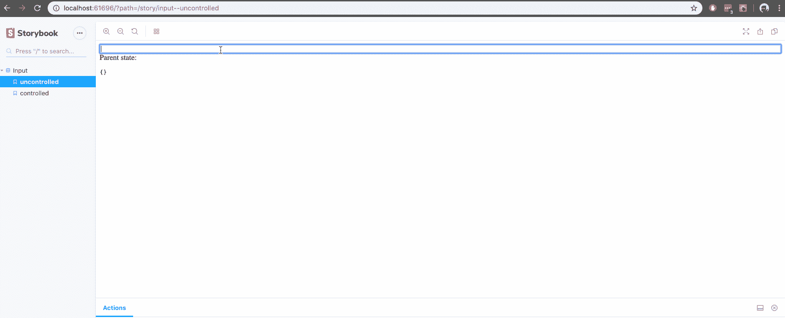

# 在 React 中将状态添加到故事书

> 原文：<https://levelup.gitconnected.com/adding-state-to-storybook-in-react-c6744fda25b4>


Storybook 是一个不可思议的开源沙盒，用于独立开发 UI 组件。我目前的一个项目是一个大型的多屏表单，其中有各种[控制的组件](https://reactjs.org/docs/forms.html#controlled-components)，这些组件依赖于它们的父容器作为唯一的真实来源。我发现虽然 Storybook 非常适合测试单个组件的状态，但我在每个受控组件将状态传递给父容器的故事中都编写了样板代码。

```
/* src/stories/index.js */import React, { useState } from "react";
import { storiesOf } from "@storybook/react";

storiesOf("Input", module).add("controlled", () => {
  function Parent({ children, ...props }) {
    const [state, setState] = useState();
    return <div>{children(state, setState)}</div>;
  }

  return (
    <Parent>
      {(state, setState) => (
        <input
          value={state.value}
          onChange={e => setState({ value: e.target.value })}
        />
      )}
    </Parent>
  );
});
```

这个父组件可以很容易地被抽象出来并导入到相关的故事中，但是由于每个故事实际上都是一个渲染函数，所以理想的情况是将状态变量作为参数传递，即

```
/* src/stories/index.js */import React, { useState } from "react";
import { storiesOf } from "@storybook/react";

storiesOf("Input", module).add("controlled", (state, setState) => (
  <input 
    value={state.value} 
    onChange={e => setState({ value: e.target.value })}
  />
);
```

这可以通过在*中创建两个组件和一个定制的[装饰器](https://storybook.js.org/docs/addons/introduction/#1-decorators)来实现。storybook/config.js* 文件。第一个组件是一个作为子组件的函数，它通过充当呈现回调来模拟第一个示例中的父组件。第二个是表示组件，它接收状态作为道具，并在每个故事下面显示当前值。定制装饰器用这些组件和状态变量来扩充每个故事，其中组件将包装故事，状态值将作为参数传递。

```
/* .storybook/config.js */import React, { useState } from "react";
import { configure, addDecorator } from "@storybook/react";

function loadStories() {
  require("../src/stories/index.js");
}

// Component 1
function Stage({ children, …props }) {
  const [state, setState] = useState({});
  return <div {…props}>{children(state, setState)}</div>;
}

// Component 2
function State({ state, …props }) {
  return (
    <div {…props}>
      Parent state: <pre>{JSON.stringify(state)}</pre>
    </div>
  );
}

// Custom decorator
addDecorator(story => (
  <Stage>
    {(state, setState) => (
      <div style={{ display: "flex", flexFlow: "column" }}>
       {story(state, setState)}
       <State state={state} />
      </div>
    )}
  </Stage>
));

configure(loadStories, module);
```

现在，每个组件都可以选择从故事本身设置和检索提升的状态值，而无需任何样板代码💥

```
/* src/stories/index.js */import React from "react";
import { storiesOf } from "@storybook/react";

storiesOf("Input", module)
  // stateless
  .add("uncontrolled", () => <input />)

  // stateful
  .add("controlled", (state, setState) => (
    <input
      value={state.value}
      onChange={e => setState({ value: e.target.value })}
    />
));
```

您可以在 [GitHub](https://github.com/phunkren/storybook-state) 上找到这个库，下面快速浏览一下它的运行情况:

