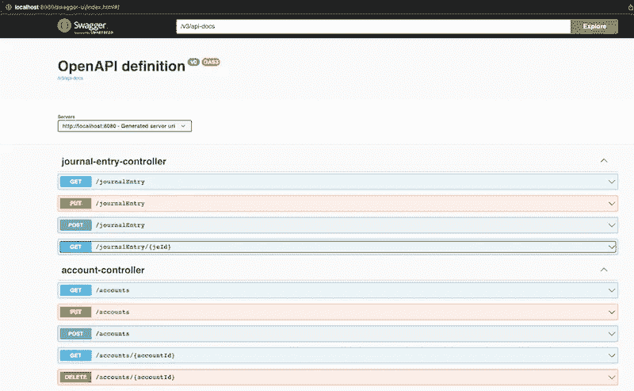

# 给科特林泉增添了霸气

> 原文：<https://levelup.gitconnected.com/adding-swagger-to-kotlin-spring-48b930e03ed5>

Spring 使得创建 REST API 变得极其容易，但是作为 API 的消费者，我们需要文档来了解什么是可用的以及如何使用它。这就是 [Swagger](https://swagger.io/) 介入并解决问题的原因。

简而言之，Swagger 以 json 模式的形式定义了 API 文档的结构，指定了可用的路径、各种路径所需的参数以及可以预期的结果类型。因此，人类和机器都可以有一个标准的方式来读取 API。阅读对人来说很容易，命名约定对大多数人来说定义得很好，不需要参考模式文档就能理解。然而，写它可能是棘手的，因为你必须记住每一项的确切措辞。

对于 Spring 用户来说，有一个简单的方法。只需将 [SpringDoc](https://springdoc.org/) 依赖项添加到您的类路径中，就可以在运行项目时自动生成 Swagger 文档。

```
dependencies {
  ...
  implementation("org.springdoc:springdoc-openapi-data-rest")
  implementation("org.springdoc:springdoc-openapi-ui")
  implementation("org.springdoc:springdoc-openapi-kotlin")
}
```

在您`bootRun`应用程序后，swagger ui 将在您的应用程序上可用，可通过路径- `/swagger-ui/index.html`访问，例如`[http://localhost:8080/swagger-ui/index.html](http://localhost:8080/swagger-ui/index.html.)` [。](http://localhost:8080/swagger-ui/index.html.)



而实际 json 模式文件的链接在页面`/v3/api-docs`上，例如`[http://localhost:8080/v3/api-docs](http://localhost:8080/v3/api-docs.)` [。](http://localhost:8080/v3/api-docs.)

*本文原载于*[*https://the coding analyst . github . io/knowledge base/Adding-swagger-to-Kotlin-Spring/*](https://thecodinganalyst.github.io/knowledgebase/Adding-swagger-to-Kotlin-Spring/)*。*