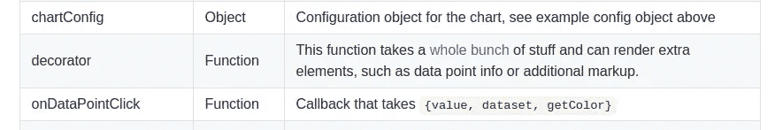

# 向 React 添加工具提示-原生图表

> 原文：<https://levelup.gitconnected.com/adding-tooltip-to-react-native-charts-67606c5d3182>


向图表添加工具提示听起来像是一个小任务，确实如此，但有一些变通办法，因为即使是 react-native 中最流行的图表库也不会在文档中直接提到它。

# 要求

在本文中，我将使用 [react-native-chart-kit](https://www.npmjs.com/package/react-native-chart-kit) ，并向您展示我们如何向其折线图添加工具提示。

首先，安装 react-native 项目所需的库。

```
npm install react-native-chart-kit --save
npm install react-native-svg --save
```

本文中使用的库版本(因此，如果将来的更新做了一些突破性的更改，您可以切换到这种组合)。

```
"react": "16.13.1",
"react-native": "0.63.2",
"react-native-chart-kit": "^6.4.1",
"react-native-svg": "^12.1.0"
```

# 实施折线图

让我们首先创建一个没有工具提示的折线图。代码非常简单，因为折线图属性包含要呈现的数据或图表的一些样式。

由于我已经使用 Math.random()生成了一个随机数据集，您将看到的输出将与下图不同。


# 添加工具提示

如果我们转到 react-native-chart-kit 的 GitHub 页面，如果我们在[文档](https://github.com/indiespirit/react-native-chart-kit)中向下滚动一点，我们会发现折线图可用的属性列表，我们会看到没有提到任何工具提示。有一个名为**装饰器**的道具提到了添加额外标记的事情。



折线图道具及其说明

为我们的用例简化一下，额外的元素是我们的工具提示，它将显示一些关于数据点的额外信息。现在，这里是令人困惑的部分，没有提到的是我们应该使用什么类型的元素？

一个常见的猜测是像**视图**这样的核心 react-native 组件，但是光靠这个是不行的。上述问题的正确答案是一个核心 react-native 元素包装一个 *react-native-svg* 元素。原因是 *react-native-chart-kit* 本身使用 *react-native-svg* 元素来呈现它的图表元素，我们也将使用 svg 元素来呈现我们的工具提示。

让我们看看下面给出的一个例子。

```
decorator={() => { return <View> <Svg> <Rect x={80} y={110} width="40" height="30" fill="black" /> <TextSVG x={100} y={130} fill="white" fontSize="16" fontWeight="bold" textAnchor="middle"> 0.0 </TextSVG> </Svg> </View>}}
```

通过看到下面的工具提示，你可以知道我没有投入太多时间来设计它。 *react-native-svg* 库提供了许多形状，例如圆形、矩形、多边形等。我选择了矩形来绘制工具提示。

但是你可以学习自己设计，只需访问 [react-native-svg。](https://www.npmjs.com/package/react-native-svg)


带有硬编码工具提示的图表

将上面的 decorator prop 添加到折线图中，现在您将能够在图表上看到工具提示，但是它的位置和值是硬编码的，因为 x 和 y 是一些常量值。我们显然希望这个工具提示能够动态定位，并根据图表上呈现的数据点显示值。

# 添加动态工具提示

在开始实现之前，让我们设定一些期望。首先，我们将只在用户点击数据点时显示工具提示。第二，我们将工具提示放在它的数据点附近。第三个也是最后一个是当用户第二次点击同一个数据点时隐藏工具提示。

让我们为工具提示初始化一个状态，我们可以操纵它来定位和控制它的可见性。

```
let [tooltipPos,setTooltipPos] = useState(
                              { x:0, y:0, visible:false, value:0 })
```

我们将使用 **x** 和 **y** 进行定位，为了控制可见性，我们将使用**可见**键。

我们还将在 DataPointClick 上使用一个折线图属性**。onDataPointClick** 属性接受一个回调函数，每当用户单击图表上的数据点时就会调用这个函数。它接收一个提供一些数据的参数，下面显示了它接收的数据的一个例子。

```
{"dataset": {"data": [100, 110, 90, 130, 80, 103]}, "getColor": [Function getColor], "index": 3, "value": 130, "x": 237.7142857142857, "y": 16}
```

所有键都是不言自明的，x 和 y 定义了所单击的数据点的位置，value 是它从数据集中表示的数据点的值，index 是数据集中值的索引，dataset 显然是折线图中使用的数据集。我们可以忽略 getColor，因为它只有在处理多行时才有用，但这不是我们的情况。

## 工具提示功能的实现

现在，让我们为工具提示的预期特性编写一些逻辑，我们已经在本节中定义了这些特性。

```
onDataPointClick={ (data) => {
     // check if we have clicked on the same point again
     let isSamePoint = (tooltipPos.x === data.x 
                         && tooltipPos.y ===  data.y)

     // if clicked on the same point again toggle visibility
     // else,render tooltip to new position and update its value isSamePoint ? setTooltipPos((previousState)=> {
                        return {
                             ...previousState, 
                             value: data.value,
                             visible: !previousState.visible}
                        })
                  : 
                setTooltipPos({x: data.x, 
                   value: data.value, y: data.y,
                   visible: true
                }); } // end function
}
```

在我们的 **< Rect >** 元素中做一些修改来对齐工具提示，这样它就不会与图表上的数据点重叠。

```
decorator={() => { return tooltipPos.visible ? <View> <Svg> <Rect x={tooltipPos.x -15} y={tooltipPos.y + 10} width="40"  
        height="30" fill="black" /> <TextSVG x={tooltipPos.x + 5} y={tooltipPos.y + 30} fill="white" fontSize="16" fontWeight="bold" textAnchor="middle"> {tooltipPos.value} </TextSVG> </Svg></View> : null}}
```


单击数据点时呈现的工具提示


另一个数据点的工具提示

# **合并所有变更**

恭喜你！我们已经成功地向图表添加了工具提示。让我们把所有的修改放在一个文件里。

# 参考

[](https://www.npmjs.com/package/react-native-svg) [## 反应-原生-svg

### react-native 的 SVG 库

www.npmjs.com](https://www.npmjs.com/package/react-native-svg) [](https://www.npmjs.com/package/react-native-chart-kit) [## 反应-原生-图表-套件

### 如果你正在寻找建立一个网站或跨平台的移动应用程序-我们将很乐意帮助你！向…发送通知

www.npmjs.com](https://www.npmjs.com/package/react-native-chart-kit) [](https://github.com/indiespirit/react-native-chart-kit) [## indiespirit/react-native-chart-kit

### 如果你正在寻找建立一个网站或跨平台的移动应用程序-我们将很乐意帮助你！向…发送通知

github.com](https://github.com/indiespirit/react-native-chart-kit)