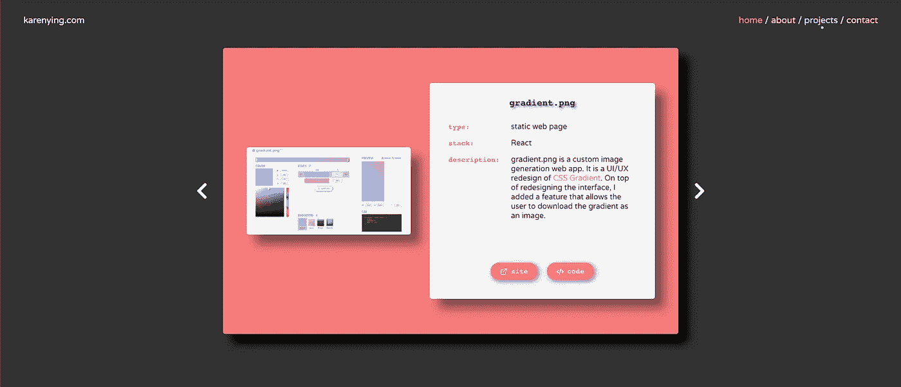
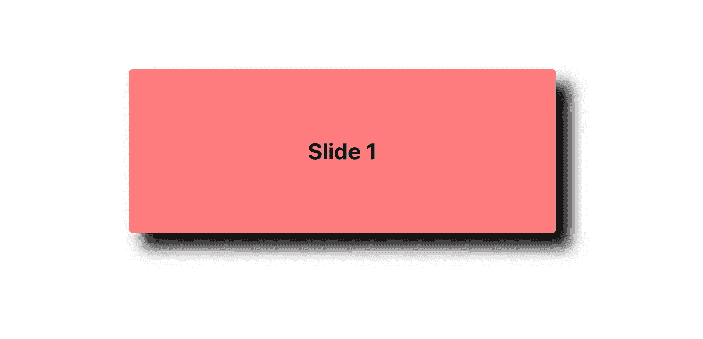
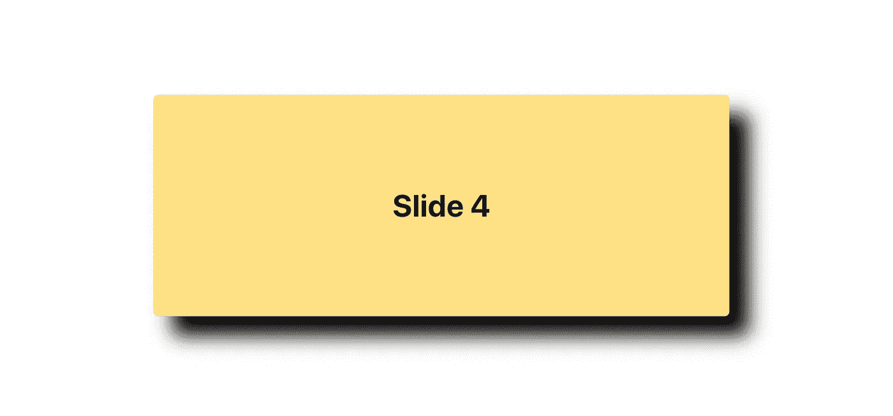
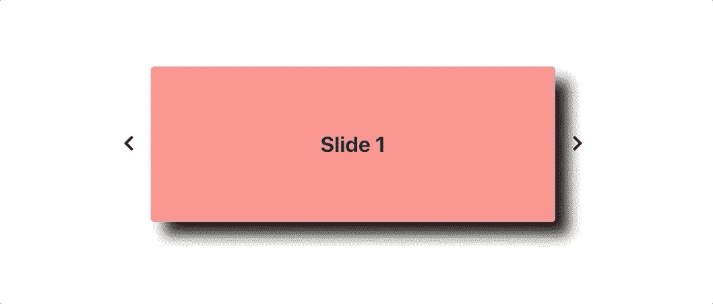

# 使用材质 UI 向 React 转盘添加过渡

> 原文：<https://levelup.gitconnected.com/adding-transitions-to-a-react-carousel-with-material-ui-b95825653c1b>

[【blog.karenying.com】](https://www.blog.karenying.com/posts/adding-transitions-to-a-react-carousel-with-material-ui)*上*[在黑暗模式下阅读本](https://www.blog.karenying.com/) *。*



我的[个人网站上的旋转木马](http://karenying.com)

有兴趣为无聊的 React 旋转木马注入活力吗？在这篇文章中，我们使用 [Material-UI](https://material-ui.com/) ，一个非常流行且易于使用的 React 库，来添加滑动过渡。

奖励:留下来看看如何实现箭头键导航控件。

如果你只对过渡感兴趣，直接跳到**的第 4 步**，否则我们将从头开始编码这个传送带。React carousels 已经有一堆 [npm 包](https://www.npmjs.com/search?q=react%20carousel)，但是我们自己实现它给了我们更多的定制灵活性。它也很有趣，非常简单！

下面所有代码的 **GitHub repo** 可以在 [**这里**](https://github.com/karenying/react-carousel) 找到。此处 见部署版本 [**。**](https://react-carousel-with-transitions.netlify.app/)

## 先决条件

本教程假设您对 React、函数组件和钩子有所了解。一切都好吗？我们开始吧👍🏼

# 履行

## 0.正在设置

我们将使用 [Create React App](https://create-react-app.dev/docs/getting-started/) 来创建、捆绑和运行项目:

```
$ npx create-react-app react-carousel
$ cd react-carousel
$ npm start
```

…并添加一些依赖关系——过渡的 Material-UI，以及可爱箭头的 [React 图标](https://www.npmjs.com/package/react-icons):

```
$ npm install @material-ui/core
$ npm install react-icons
```

在我们开始创建组件之前，我们需要更新`App.css`来使用 CSS Flexbox 格式化我们的页面:

耶，让我们写一些反应组件！

## 1.设置幻灯片组件

在一个新文件`CarouselSlide.js`中，我们将创建一个包含单个道具`content`的幻灯片组件。

`content`将是一个 JS 对象，具有属性`backgroundColor`和`title`，它们将分别决定当前幻灯片的背景颜色和标题(显然😛).

我们还使用 Material-UI 的[卡](https://material-ui.com/components/cards/)组件和`makeStyles`挂钩来设计幻灯片。更多关于材质界面定制风格的信息可以在[这里](https://material-ui.com/styles/basics/)找到。

这里是`CarouselSlide.js`的代码:

为了渲染幻灯片，我们将为`content`创建一些道具并更新`App.js`:

好吧！运行`npm start`之后，我们应该在`[http://localhost:3000/](http://localhost:3000/)`上看到类似这样的内容:



超级超级简单。现在，让我们添加一些更多的内容，以在我们的轮播中进行迭代。

## 2.生成幻灯片内容

我们将把所有的幻灯片信息放在一个名为`constants.js`的新文件中。它将采用一组对象的形状，这些对象与我们上面使用的`content`道具具有相同的结构:

使用`constants.js`，我们可以重构`App.js`以导入并索引到`SLIDE_INFO`:

由于我们索引到第 4 项，呈现的幻灯片应为黄色，标题为“幻灯片 4”:



## 3.用箭头点击更改内容

是时候添加一些箭头了。

我们将创建一个超级简单的`Arrow`函数组件，它接受一个方向并点击函数。我们将使用 React-Icon 中的一些箭头 SVG。添加到`App.js`:

接下来，我们需要实现点击处理程序。

我们将使用`useState`钩子用状态变量`index`来跟踪我们当前所在的幻灯片。然后我们使用这个状态变量索引到`SLIDE_INFO`。

左右点击处理程序需要分别增加和减少`index`来改变当前渲染的幻灯片。

不像上面的`Arrow`组件那样分别处理两个方向，我们将把逻辑合并到一个叫做`onArrowClick`的函数中。

`onArrowClick`接受一个方向并适当地更新`index`:

注:在上面的**第 7 行**中，我们将`numSlides`加到`index`和`increment`的总和上，并按`numSlides`进行 mod。这确保了我们总是在`0`和`numSlides — 1`的范围内，以保持在界限内。

最后，我们更新`App.js`的返回语句来呈现箭头:

并在`App.css`中样式化箭头 SVGs:

在这一步之后，我们有一个工作转盘:



…但是它看起来非常朴素😞让我们添加一些过渡！

## 4.使用材质添加过渡-用户界面

我们使用的过渡是 Material-UI 的 [Slide API](https://material-ui.com/api/slide/) 。我们必须创建两个新的状态变量:`slideIn`和`slideDirection`，分别对应 Slide 的`in`和`direction`道具。

`in`指示如果`true`组件何时出现，如果`false`组件何时退出。

`direction`指示组件*从*进入的位置。这意味着在不改变`direction`的情况下，组件从相同的方向进入和退出。这不是我们想要的旋转木马的效果！幻灯片必须从相反的方向进入和退出，以给出在页面上向左或向右移动的外观。因此，我们需要在设置`in`之间将`direction`从`false`更改为`true`。

我们还需要使用`setTimeout`以便在下一张幻灯片进入之前，前一张幻灯片有时间退出。

在更新了`onArrowClick`中的`slideIn`和`slideDirection`后，我们增加了:

注意:在**第 2 行**、**、**中，我们将`slideDirection`的初始值设置为`‘down’`，这样转盘在第一次渲染时向下滑动。

最后，我们希望用一个额外的`div`来包装我们的`CarouselSlide`组件，因为 Material-UI 的 Slide 的子组件"[需要能够保存一个引用](https://material-ui.com/guides/composition/#caveat-with-refs)。然后我们将状态变量传入`Slide`，更新后的返回语句看起来像这样:

这么🎉

我们让幻灯片过渡工作。旋转木马现在应该是这样的:


如果你认为过渡太快，你可以使用[幻灯片 API](https://material-ui.com/api/slide/) 中的`timeout`道具，并调整到你的速度。

不管怎样，它看起来很棒😅干得好！

但是如果你可以只用**箭头键**在旋转木马中导航该有多好？幸运的是，它只有几行代码。

## 5.为导航绑定箭头键

我们只需添加一个`keydown`事件监听器，并调用`onArrowClick`来获得适当的方向。记得在组件卸载时清理事件监听器！

我们可以将所有的按键处理逻辑放在`useEffect`中:

呜哇！我们正式结束了🙂

如果你一路上迷路了，这里有 [**GitHub repo**](https://github.com/karenying/react-carousel) 。提交与上面列出的每个步骤相对应。也可以玩 [**部署版**](https://react-carousel-with-transitions.netlify.app/) 。

# 扩展ˌ扩张

以下是您可以添加到简单旋转木马的更多内容:

*   添加图像
*   使其具有响应性:Material-UI 通过[断点](https://material-ui.com/customization/breakpoints/)和它们的[隐藏组件](https://material-ui.com/components/hidden/)使其变得非常容易
*   使用其他材质-UI [过渡](https://material-ui.com/components/transitions/)

# 结论

在本教程中，我们从头开始实现了一个 React carousel。然后我们添加了带有材质界面和按键控制的幻灯片过渡！我在上面添加了一些建议，告诉你如何把它提升到另一个层次。

旋转木马在个人网站、博客和产品网站上看起来很棒。让它变得更有趣，更有互动性。

感谢阅读。编码快乐！