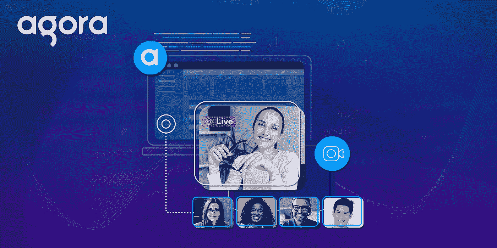
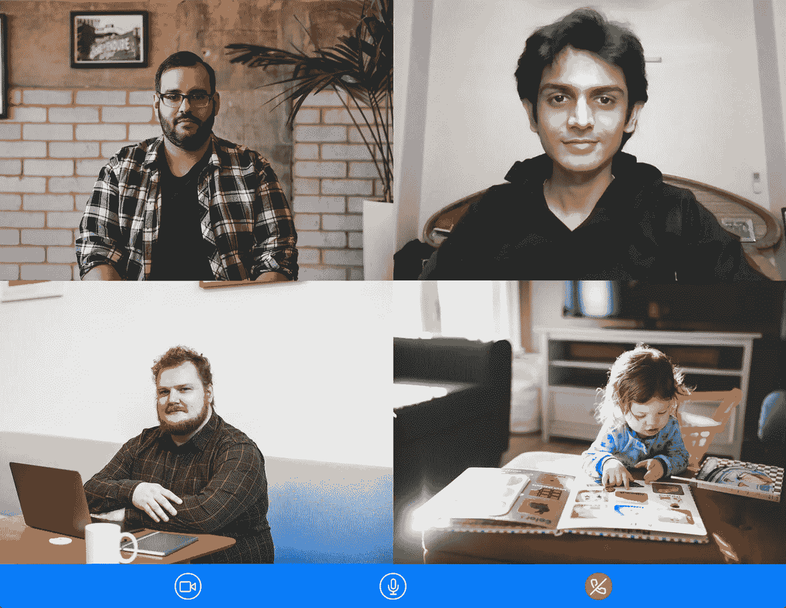
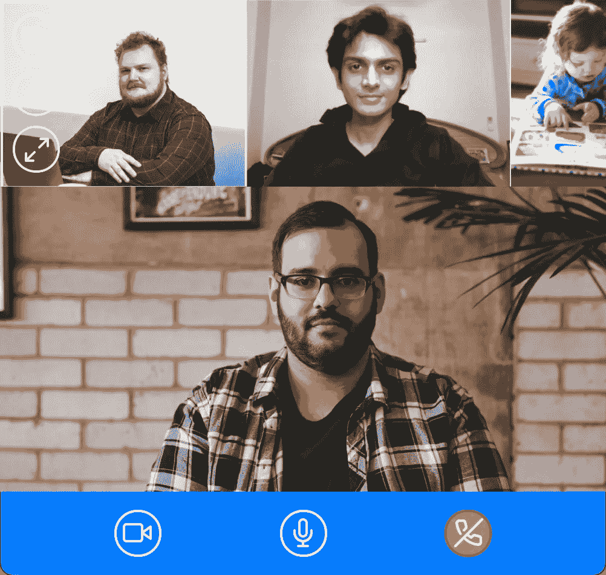

# 使用 Agora Web UIKit，用 5 行代码将视频聊天或直播添加到您的网站

> 原文：<https://levelup.gitconnected.com/adding-video-chat-or-live-streaming-to-your-website-in-5-lines-of-code-using-the-agora-web-uikit-ab1d2b0e5c61>



当你用 Agora 建立一个直播视频流或视频会议网站时，一些技术步骤可能会让你慢下来。现在有了 Agora Web UIKit，您只需 5 行代码就可以轻松地将视频通话添加到您的网站上！它具有完整的启动功能，易于定制，并且可以扩展。

可以看一下[发布博客](https://ekaansh.medium.com/agora-web-uikit-add-video-calling-or-live-streaming-to-your-website-in-minutes-2b635bb2601a)。如果你想深入了解技术，请继续阅读！



# 特征

*   支持视频会议和直播
*   即插即用，开箱后无水印或商标
*   桌面和移动设备的响应式布局
*   使用 React 属性的可定制 UI 和功能
*   自动管理令牌(使用双击服务器部署)
*   双流模式和主动说话人检测
*   使用可重组的模块化功能组件构建
*   类型脚本支持，没有第三方依赖性
*   支持用作 web 组件
*   每月 10，000 分钟免费通话

Agora Web UIKit 是基于 React 构建的。如果你的网站使用普通 JavaScript 或不同的框架，如 Svelte、Vue 或 Angular，你可以使用 [UIKit 作为 web 组件](https://github.com/AgoraIO-Community/Web-React-UIKit/tree/main/web-component)！您可以跳到最后一节了解更多信息。

# 先决条件

*   一个 Agora 开发者账户(免费–[在这里注册](https://sso.agora.io/en/signup?utm_source=medium&utm_medium=blog&utm_campaign=web-uikit-release-blog)！)
*   Node.js LTS 版本
*   使用 React 构建的网站
*   现代网络浏览器

# 设置

您可以在 GitHub 上获得[示例的代码。要使用 Typescript 创建 React 项目，您可以打开一个终端并执行:](https://github.com/AgoraIO-Community/Web-React-UIKit/tree/main/example)

```
npx create-react-app demo --template typescript
cd demo
```

也可以用自己的项目。安装来自 NPM[的 Agora Web UIKit】:](https://www.npmjs.com/package/agora-react-uikit)

```
npm i agora-react-uikit
```

> *注:撰写本帖时，当前* `agora-react-uikit` *发布为* `*v0.0.5*` *，当前* `agora-rtc-sdk-ng` *发布为* `*v4.8.1*` *。*

这就是设计。您现在可以运行`npm start`来启动 React 服务器，并在`localhost:3000`访问 hello world 应用程序。

# 添加视频流

这个 UIKit 易于设置，包含一个名为`AgoraUIKit`的高级组件。该组件处理我们实时视频体验的逻辑和 UI。我们可以向组件传递属性来定制行为和功能。让我们清除`App.tsx`文件，开始编写构建视频聊天应用程序的代码:

我们正在从`agora-react-uikit`包中导入`AgoraUIKit`组件。在 App 组件内部，我们有一个状态变量`videoCall`。我们将在 UIKit 组件设置为 true 时呈现它，当它为 false 时卸载它。我们在`rtcProps`对象中定义 Agora 应用 ID 和频道名称以及我们的角色。同一信道上的用户可以相互通信。您可以使用任何字母数字字符串作为频道名称。

> *注意:*如果你的应用处于安全模式，你可以从 Agora 控制台生成一个令牌，并将其传入进行测试。我们一会儿会详细讨论如何使用令牌。

`callbacks`对象包含 RTC 事件作为键，回调函数作为它们的值——我们使用`EndCall`事件来更新状态并卸载`AgoraUIKit`组件:

在 return 语句中，我们用`rtcProps`和`callbacks`对象来呈现`AgoraUIKit`组件。(卸载 AgoraUIKit 组件会自动执行所需的清理。)

UIKit 组件还接受第三个属性，称为`styleProps`，可以通过编写 React 样式来定制应用程序的外观。您可以用自己的样式覆盖 UIKit 的每个部分(如按钮、视频和容器)的默认样式。

# 直播呢？

我们有一个视频会议网站准备发货。但现在让我们看看如何将它转换成一个直播应用程序，用户可以作为主持人或观众加入。主持人可以与频道中的每个人共享他们的音频和视频，而观众只能从其他主持人那里接收视频和音频:

让我们添加两个新的状态变量:`isHost`和`isPinned`。`isHost`变量将跟踪用户是主持人还是观众，而`isPinned`变量用于在两个预先构建的布局之间切换:

我们可以用我们的状态来定义我们的`rtcProps`。我们将角色道具添加到主持人和观众之间的`rtcProps`开关中(默认角色是主持人)。UIKit 道具是动态的。如果您更新了作为道具传递的状态，UIKit 将对其做出反应(就像标准的 react 设计模式一样)。我们正在使用`styleProps`改变底部工具条的背景颜色，这样我们就可以看到它是如何工作的了:

我们将更新我们的 UI 来添加切换状态的按钮。我们还将把`styleProps`添加到 UIKit 中。当我们的视频通话状态为假时，我们不返回 null，而是添加一个`<h3>`标签，以便在通话结束后通过更新我们的状态来开始通话。

如果你想跟进，这里有更新的样式:

# **使用 RtcProps 定制功能**

RtcProps 对象允许您自定义 UIKit 的工作方式。您可以选择功能和布局。使用 RtcProps 可以定制的东西越来越多。对象类型定义可以在[这里](https://agoraio-community.github.io/Web-React-UIKit/interfaces/RtcPropsInterface.html)找到。

# 令牌管理

如果您在生产中使用 Agora Web UIKit，我们强烈建议使用令牌来保护您的应用程序。有两种方法可以使用它们:如果您已经设置了一个令牌服务器，那么您可以使用[令牌](https://agoraio-community.github.io/Web-React-UIKit/interfaces/RtcPropsInterface.html#token)属性向 UIKit 手动提供一个令牌。

如果没有令牌服务器，可以使用 [tokenUrl](https://agoraio-community.github.io/Web-React-UIKit/interfaces/RtcPropsInterface.html#tokenUrl) 属性。这可用于自动获取信道的新接入令牌，并在令牌即将到期时对其进行更新。请求新令牌的功能要求令牌遵循 GitHub 上预建的 Golang 令牌服务器中的 URL 方案:[AgoraIO-Community/agora-token-service](https://github.com/AgoraIO-Community/agora-token-service)。你可以使用[这个链接](https://www.heroku.com/deploy/?template=https://github.com/AgoraIO-Community/agora-token-service)将它部署到 Heroku。

## 使用不带 React 的 Web UIKit

Agora Web UIKit 也可以作为一个 Web 组件，用于使用普通 JavaScript 或 Angular、Vue 或 Avelte 等框架构建的网站。要在您的网站上添加视频通话，只需将 web 组件作为脚本导入即可。然后，您可以通过传入 Agora 应用程序 ID 和频道名称来使用 DOM 中的 web 组件:

您可以访问 JS 中的 web 组件元素并更新对象属性。这允许您以编程方式更新 props，例如，这在构建按钮以更新实时流中的用户角色时非常有用。您可以为 end call 按钮添加事件侦听器，以处理用户单击该按钮时发生的事情。我们期待您的反馈，您可以为我们打开一个功能请求，以便在 web 组件版本中添加更多 RTC 事件。

目前，web 组件有一些限制。到目前为止，我们讨论的所有内容都是受支持的，但是下一部分是特定于 React 的。根据您的反馈，我们将在 react 版本中继续添加特性并支持这个版本的 UIKit。

# 高级:重新组合 UIKit

如果您需要更好的控制，或者想要为您的应用程序构建一个定制的布局，而`AgoraUIKit`组件还不支持，您可以提取并使用组成 UIKit 的各个组件，然后将它们重新组合在一起，构建您自己的定制解决方案，而不用担心管理 SDK。

UIKit 并不局限于使用`AgoraUIKit`组件。它是由其他几个模块化组件组成的高级组件，很容易上手。您可以导入并使用各个部分来编写应用程序。

## RTC 配置

`RtcConfigure`组件包含视频呼叫的所有逻辑。它处理所有的 SDK 事件并维护应用程序的状态。您可以将其他 UIKit 组件包装在`RtcConfigure`组件中，以访问用户对象。

它还设置了可用于访问 Web SDK 客户端对象的`RtcContext`和包含远程轨道和本地轨道的`mediaStore`(以及改变状态的调度函数)。

## 轨道配置

`TrackConfigure`组件处理为应用程序创建音频和视频轨道。

## 控制

UIKit 导出一个包装了`LocalAudioMute`、`LocalVideoMute`和`EndCall`按钮组件的`LocalControls`组件。该库有一个`RemoteAudioMute`、一个`RemoteVideoMute`和一个`SwapUser`(用最大用户交换用户)按钮。这些组件接受用户对象作为道具。



> *注:*遥控器只能在本地静音远程用户的音频和视频。这种变化不会反映给通话中的其他任何人。

## 视频视图

为了渲染一个用户的视频，我们有两个组件:`MaxVideoView`和`MinVideoView`。两者都需要一个用户对象作为道具。用户数据分为两个不同的数组:`MaxUser`和`MinUser`。`MaxUser`数组总是只包含一个用户；其他用户包含在`MinUser`数组中。在固定布局的情况下，我们可以使用一个数组来呈现大视图，使用另一个数组来呈现视频列表。你不必与国家直接互动。例如，如果您想交换一个用户，您可以使用`SwapUser`按钮，这将在内部改变状态。

如果您不想使用视图构建自己的布局，我们还提供了`gridLayout`和`pinnedLayout`组件。

## 道具上下文

`PropsContext`使用 React [上下文 API](https://reactjs.org/docs/context.html) ，它允许您访问提供者和消费者组件。总的来说，这些允许您访问我们传递给组件树中其他组件的属性。库用它来传递组件树中的`rtcProps`、`styleProps`和`callbacks`。

## 用户上下文

通过`MaxUidContext`，您可以在`MaxView`(浮动布局中的主视图)中访问包含用户对象的数组。`MinUidContext`让您可以访问`MinView`中用户的对象数组(浮动布局中的顶部浮动视图)。`LocalUserContext`让您可以访问本地用户的状态。

# 重新作曲的示例

让我们通过构建自己的高级组件来看看所有这些组件的运行情况。为了清楚和便于解释，下面的例子省略了琐碎的细节(比如定义道具和样式)。如果需要更多信息，可以查看`AgoraUIKit`组件。

我们将应用程序包装在`<PropsProvider>`中，让其他组件访问 props。如果用户是主持人，我们将`<VideoCallUI>`包装在`<TracksConfigure>`组件中，该组件创建并传递麦克风和摄像机轨迹。

`<VideoCallUI>`由`<RtcConfigure>`包装，它包含我们视频通话或直播流的所有逻辑，还设置本地或远程用户状态。我们使用访问用户上下文的`<RenderVideos>`组件旁边的`<LocalControls>`来呈现控件底部栏，并使用映射到每个用户的`<MaxVideoView>`组件来呈现视频。

# 结论

我们期待你的贡献。如果您有功能请求，请打开一个拉取请求。如果发现 bug，请在 GitHub 问题上报告。我们也为 [Android](https://github.com/AgoraIO-Community/Android-UIKit) 、 [iOS](https://github.com/AgoraIO-Community/iOS-UIKit) 、 [React Native](https://github.com/AgoraIO-Community/ReactNative-UIKit) 和 [Flutter](https://github.com/AgoraIO-Community/Flutter-UIKit) 提供了类似的 UIKits，所以也请务必查看这些 UIKits。

如果您在使用 Web UIKit 时有任何问题，我邀请您加入 [Agora 开发者 Slack 社区](https://agora.io/en/join-slack)，您可以在`#web-help-me channel`中提问。请随意在 [GitHub Repo](https://github.com/AgoraIO-Community/Web-React-UIKit/issues) 上提出问题或报告错误。或者你可以在推特上联系我。