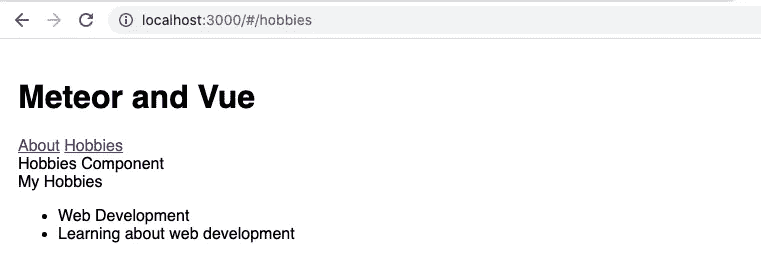

# 向 Meteor 添加 Vue 和 Vue 路由器

> 原文：<https://levelup.gitconnected.com/adding-vue-and-vue-router-to-meteor-7c411131494f>


meteor 框架几乎可以肯定是最古老的 JS 框架之一，它仍然吸引了大量的流行，不难看出为什么。将后端数据库的更改即时反映到前端的能力是一大优势。

如果说 Meteor 是最老的一个，Vue 仍然是这个街区的新成员之一，但它现在已经在 GitHub 上取代了 React。当你把 Vue 和 Meteor 放在一起，你会得到真正特别的东西。如果你喜欢在 Vue 开发，你会爱上它和 Meteor 的关系。

在本文中，我将向您展示如何将 VueJS 添加到 Meteor 中，以及如何安装和配置 vue-router。

# 完整的代码

如果您只想查看该项目的代码或将其用作入门模板，您可以在 GitHub 上找到完整的代码

[https://github.com/simonjcarr/meteor_vue_vue-router](https://github.com/simonjcarr/meteor_vue_vue-router)

# 安装流星

在我们开始之前，你需要在你的系统上安装 meteor，我总结如下，但是你可以在 [meteor 网站上找到更多。](https://www.meteor.com/install)

如果您在 Mac 或 Linux 上，请打开一个终端窗口并使用此命令

```
curl https://install.meteor.com/ | sh
```

在 Windows 上

```
choco install meteor
```

# 创建新的流星应用程序

在我们到达 Vue 之前，我们需要启动并运行一个 Meteor 应用程序。在命令行输入

```
meteor create myapp
```

然后运行应用程序，检查一切都准备好了

```
cd myapp
meteor
```

你应该在你的终端上看到这个

```
=> Started proxy.
=> Started MongoDB.
=> Started your app.=> App running at: [http://localhost:3000/](http://localhost:3000/)
```

去参观一下`http://localhost:3000`


基本流星应用程序

# 安装 Vue

这是`meteor create`命令给我们的应用程序结构


由 meteor 创建的初始应用程序结构

在应用程序的根目录下添加一个新文件夹`imports`和`imports/ui`

```
mkdir imports
mkdir imports/ui
```

现在我们将使用 NPM 安装 vue。在应用程序的根目录下，在终端中发出以下命令

```
meteor npm install vue --save
```

这对于本教程来说并不重要，但足以说明当在《流星》中使用 NPM 时，你应该使用`meteor npm`而不仅仅是`npm`

为了让 Meteor 和 Vue 很好地一起工作，我们需要安装更多的软件包，同时删除一个。在项目根目录下的终端中发出以下命令。

```
meteor add static-html
meteor add akryum:vue-component
meteor remove blaze-html-templates
```

一个基本的流星应用程序使用自己的模板引擎 blaze。我们正在使用 vue，所以我们需要添加对静态 html 和 akryum:vue 组件包的支持。因为我们不会使用 blaze，所以我们删除了它，否则我们会遇到一些冲突。

# 设置 Vue

我们现在需要告诉 meteor 如何启动 Vue。

编辑`/client/main.js`使它看起来像这样

您可以看到我们正在导入`/imports/ui/App.vue`，但是那个文件还不存在。让我们现在创建它，并添加以下内容。

当流星启动时，它加载`/client/main.html`我们需要编辑这个文件，并确保我们提供一个 id 为`app`的`div`来挂载 vue。如下编辑文件`/client/main.html`。

完成后，您现在应该能够刷新您的浏览器了，您将看到 App.vue 正在呈现。


App.vue 现在正在渲染

# 安装 Vue 转子

让我们安装 vue 路由器，然后我们将配置它。在应用程序根目录下的终端中，发出以下命令

```
meteor npm install vue-router --save
```

# 配置 Vue 路由器

创建一个新文件`/client/routes.js`，并添加以下代码。

由于本教程不是关于 Vue 的路线细节，如果你想了解更多关于路线的信息，你应该去参观 router.vuejs.org。

您将看到我们正在导入两个尚未创建的组件`About`和`Hobbies`。让我们现在创建它们。

创建包含以下代码的文件`/client/components/About.vue`。

并对包含这段代码的`/client/components/Hobbies.vue`做类似的事情。

我们就要让路由器工作了。我们现在需要将 routes 文件导入到`/client/main.js`文件中，并将其包含在我们的 Vue 实例中。编辑`/client/main.js`使其看起来像这样

最后一步是告诉路由器在哪里呈现链接到每条路由的组件。我们在`/imports/ui/App.vue`文件中使用`<router-view></router-view>`来实现这一点，我们还希望我们网站的访问者可以点击一些链接，以利用我们创建的两条路线。我们可以使用`<router-link></router-link>`来实现

编辑`/imports/ui/App.vue`并更新文件，如下所示

你现在应该有一个集成了 VueJS 和 Vue 路由器的工作的流星应用程序。诚然，这是一个非常丑陋的网站，但是我将把它留给您来解决。


# 向 Vue 添加流星实时数据

到目前为止，我们已经让 Vue 在 Meteor 中工作，虽然这很好，但我们可以做得更好。Meteor 直接向用户界面提供实时数据库更新。我们现在将在 Vue 中启用该功能。

我们需要安装另一个包。因此，在应用程序根目录下的终端中，发出以下命令

```
meteor npm install --save vue-meteor-tracker
```

让我们通过导入来利用这个包。将`/client/main.js`更新成这样。

现在我们将建立与内置 MongoDB 数据库的通信。创建一个新文件夹`/imports/api`。在终端中，在应用程序的根目录下发出以下命令。

```
mkdir imports/api
```

创建一个新文件`/imports/api/hobbies.js`,内容如下。

由于 meteor 是一个全栈应用程序框架，您会注意到，到目前为止，我们只在框架的客户端工作。我们现在需要告诉框架的服务器端关于我们的 MongoDB 集合(爱好)。

您将在应用程序结构中看到，我们已经有了一个包含一个`main.js`文件的`server`文件夹。

编辑`/server/main.js`,更新成这样。

因为我们需要在我们的 Vue ui 中获得`hobbies`集合，所以我们也需要告诉 Vue 它。

编辑`/client/components/Hobbies.vue`并按照下面的代码进行更新。

同样，这不是一个详细的关于流星进出的教程，所以我不想对正在发生的事情做太多的细节，而是作为一个总结。我们正在进口`/imports/api/hobbies`。通过添加到`/client/main.js`文件中的`Vue.use(VueMeteorTracker)`，我们可以使用`meteor`方法。在 meteor 方法中，我们让组件可以使用`hobbies`函数。反过来，它从我们的 MongoDB 爱好集合中选择所有记录。

# 在 Vue 中尝试实时数据库更新

如果您现在刷新您的应用程序并转到`Hobbies`页面，一切应该仍然正常。当然你还看不到任何爱好，因为我们还没有添加任何爱好。我们现在就去做。因为我们会确保观看屏幕，因为您的爱好会自动出现，无需刷新页面。

在应用程序的根目录下打开一个终端，发出以下命令。

```
meteor mongo
```

现在发出下面的命令，确保关注你的应用程序的爱好页面。

```
db.hobbies.insert({hobby: 'Web Development'})
```

我们再加一个

```
db.hobbies.insert({hobby: 'Learning about web development'})
```



不要告诉我的妻子，但这是我所见过的最性感的事情之一！

# 摘要

在本教程中，您将

*   创建了一个新的流星应用程序
*   安装了运行 VueJS 所需的所有软件包
*   移除不再需要的流星包。
*   已安装并配置 vue 路由器。
*   为您的路线添加了一个出口，并提供了一些链接来处理每条路线。
*   安装了 vue-meteor-tracker 并将其集成到 vue 中
*   向数据库中添加记录，并看到 UI 实时更新。

我希望你喜欢阅读这篇教程，并且觉得它很有用。如果加入下面的对话对你有帮助，请告诉我。如果你有任何不确定的地方，请提问，我会尽力帮助你。