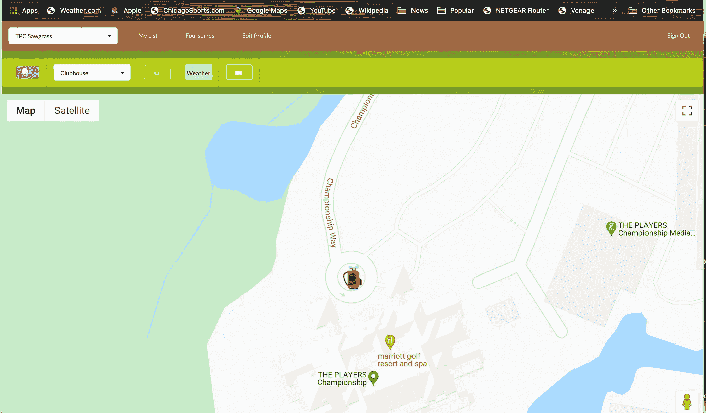
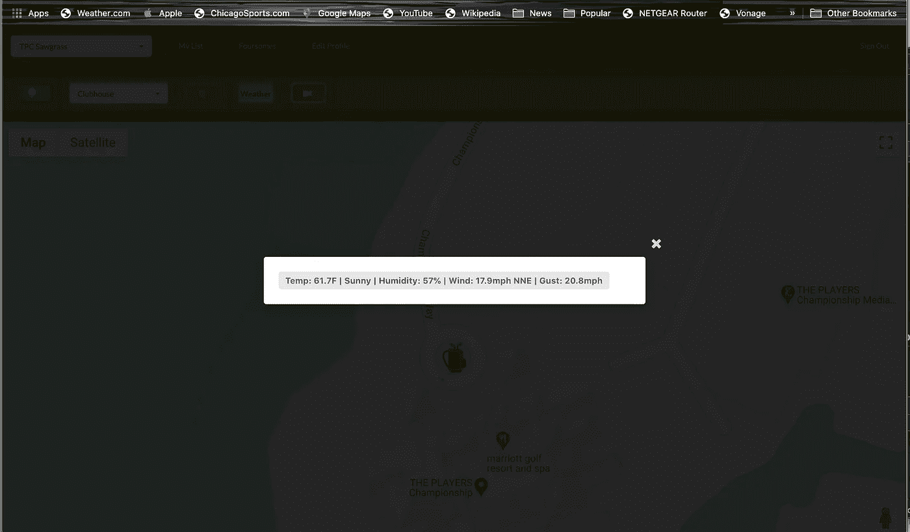
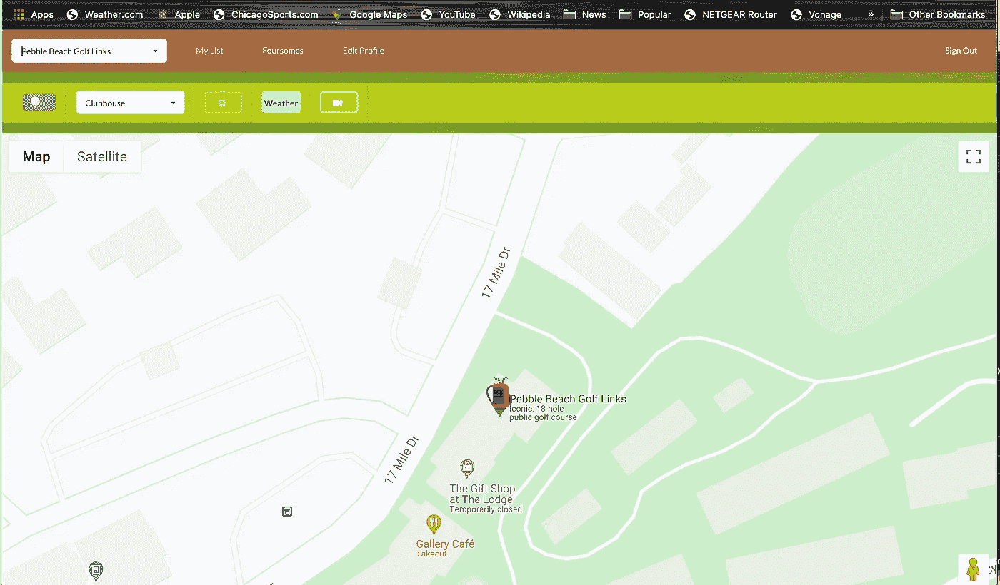
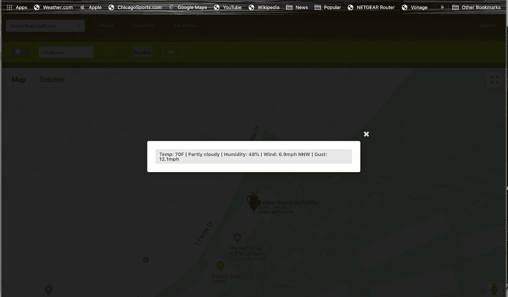
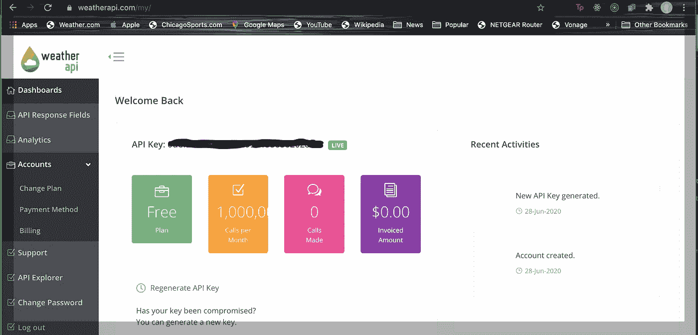
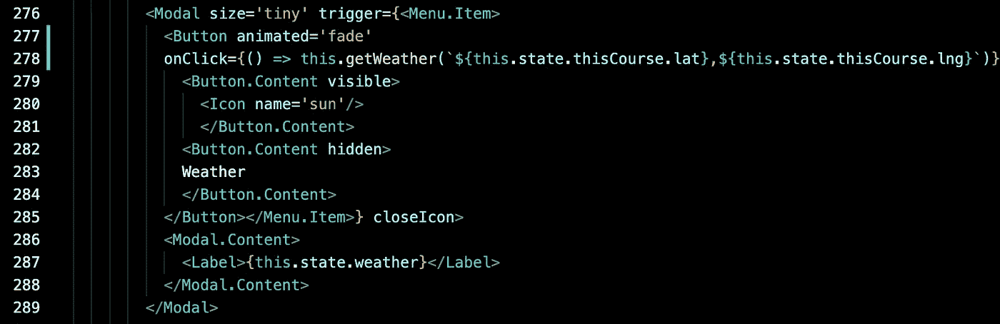
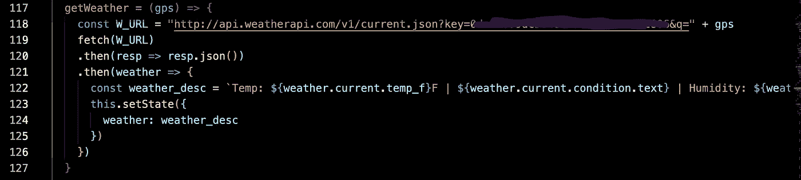

# 向您的应用程序添加天气数据

> 原文：<https://levelup.gitconnected.com/adding-weather-data-to-your-app-66389e85f421>

如果你需要在你的应用程序中添加天气信息，有很多 API 可以提供你需要的数据。这是我用过的一个，我发现它非常容易实现。好吧，如果“天气 api”这个名字对你来说不够简单，我想知道还有什么能引起你的注意。

我已经写过几次关于我的高尔夫应用程序的文章，所以如果你读过一些博客，你可能知道它是通过谷歌地图实现的，使用 GPS 数据显示高尔夫球场和球洞信息。作为一名高尔夫球手，天气是对比赛有实质性影响的一个因素。像雨和风这样的条件会改变人们为郊游做准备的方式。因此，当我开发这个应用程序时，直到人们可以获得球场的当前天气状况，它才感觉完整。

如果我在玩 TPC Sawgrass，我可能想看看是否下雨，因为球场位于佛罗里达州。

然而，如果我在玩圆石滩高尔夫球场，我很可能会担心加利福尼亚海岸的风。

因为我已经有了球场的 GPS 位置数据(经度和纬度),天气 api 就派上了用场，因为数据查询是基于 GPS 的。让我们开始吧。

首先，我们需要注册一个天气 api 账户。一旦注册，你会在你的账户下找到 API 密匙。这是我们请求天气数据所需要的。

在我的应用程序中，我在一个模态窗口中设置了天气信息显示，它是通过点击菜单栏上的天气按钮来触发的。这是我用的 JSX 代码。

如上所示，我的模态元素由一个菜单项触发，该菜单项由一个调用 getWeather 函数的按钮组成。该功能是通过 GPS 横向和纵向的过程中，已经存储在我的页面组件的状态。当显示模式时，窗口的内容只是一个从天气状态获取值的标签。我将在下面的代码中展示如何设置它。

为了获得当前的天气数据，我们需要从 api.weatherapi.com/v1/current.json.的天气 api api 中获取，我们需要从我们的帐户注册和我们的查询参数中提供 API 键(' q=lat，long ')。还有许多其他的 API 方法可以用来获取不同种类的天气数据。例如，如果您对预报信息而不是当前状况感兴趣，您可以使用 api.weather.com/v1/forecast.json.所有天气信息以 JSON 格式返回，并带有各种数据点供您显示。对于当前条件，“当前”对象包含的数据包括温度(华氏温度和摄氏温度)、文本和图标形式的天气条件、风向、风速(英里和公里)、阵风、真实温度、紫外线指数等。你可以在这里 *找到关于 API 方法和所有数据点 [*的文档。*](https://www.weatherapi.com/docs/)*

如果你想展示你的应用程序的气象能力，你肯定可以用热指数、云量百分比等项目来过载它，甚至像月出和月相这样的东西，如果你认为常规的五天预报太单调的话。