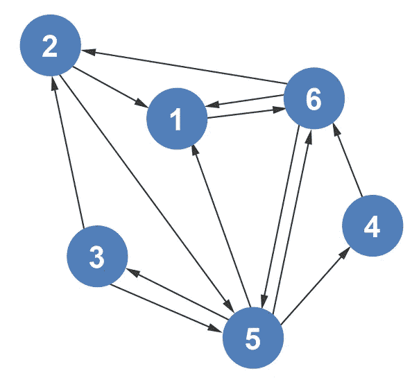
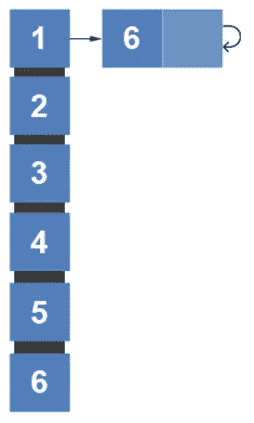
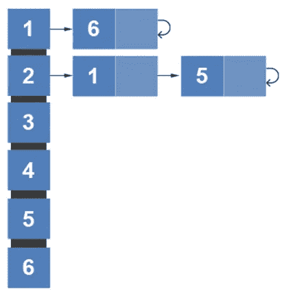
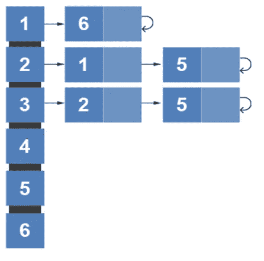
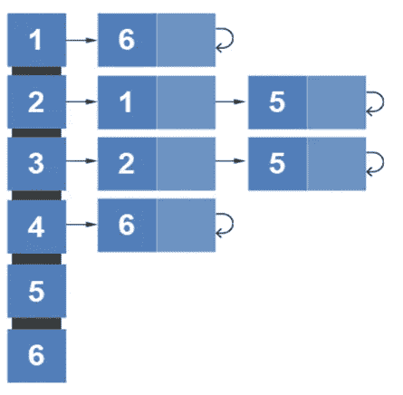
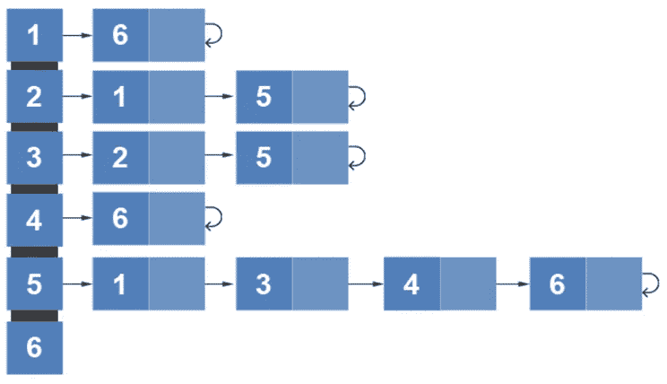
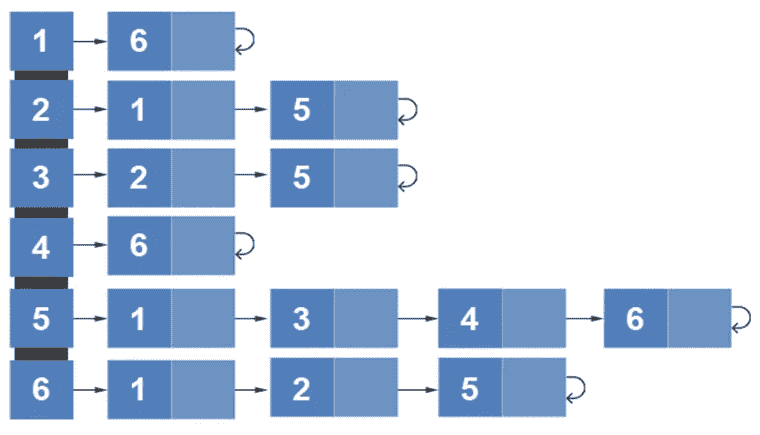

# 邻接表直观解释

> 原文：<https://levelup.gitconnected.com/adjacency-list-visually-explained-4d381e1c71c0>

邻接表是表示相邻顶点的另一种方式。为什么要创建邻接表？同样，为了节省时间。当试图找出图中的相邻节点时，邻接表更有效。邻接表也比邻接矩阵占用更少的空间。在邻接矩阵中，每个节点必须包含一个值，不管它是否包含到另一个节点的边。邻接表只包含连接的节点。让我们看一个例子，有人如何从有向图创建邻接表。

我们首先在数组中创建 6 个元素来表示 6 个节点。每个数组元素将存储一个链表。

浏览该图，顶点 1 与顶点 6 相连。因此，我们更新了顶点 1 的邻接表。结尾的循环表示顶点 1 没有指向其他节点。所以，它指向零。

顶点 2 指向另外两个顶点:顶点 1 和顶点 5。我们更新列表，让顶点 2 指向 1，然后指向 5。

顶点 3 指向 2 和 5。

顶点 4 指向顶点 6。

顶点 5 指向顶点 1、3、4 和 6。

最后，顶点 6 指向顶点 1、2 和 5。

通过观察，我们可以很快发现从邻接矩阵切换到邻接表节省了大量的空间。时间复杂度大致保持不变。

*如果你喜欢你所读的，我的书，***算法的说明性介绍，涵盖了这个图形表示和更多。**

**

*迪诺·卡伊奇目前是 [LSBio(寿命生物科学公司)](https://www.lsbio.com/)、[绝对抗体](https://absoluteantibody.com/)、 [Kerafast](https://www.kerafast.com/) 、[珠穆朗玛生物](https://everestbiotech.com/)、[北欧 MUbio](https://www.nordicmubio.com/) 和 [Exalpha](https://www.exalpha.com/) 的 IT 负责人。他还担任我的自动系统的首席执行官。他有十多年的软件工程经验。他拥有计算机科学学士学位，辅修生物学。他的背景包括创建企业级电子商务应用程序、执行基于研究的软件开发，以及通过写作促进知识的传播。*

*你可以在 [LinkedIn](https://www.linkedin.com/in/dinocajic/) 上联系他，在 [Instagram](https://instagram.com/think.dino) 上关注他，或者[订阅他的媒体出版物](https://dinocajic.medium.com/subscribe)。*

*[*阅读迪诺·卡吉克(以及媒体上成千上万其他作家)的每一个故事。你的会员费直接支持迪诺·卡吉克和你阅读的其他作家。你也可以在媒体上看到所有的故事。*](https://dinocajic.medium.com/membership)*