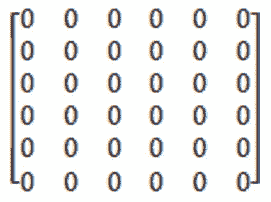

# 邻接矩阵直观解释

> 原文：<https://levelup.gitconnected.com/adjacency-matrix-visually-explained-16777cd81d61>

邻接矩阵是一个正方形矩阵，用来表示一个图。彼此相邻的元素表示相邻的顶点。为什么要创建邻接矩阵？为了节省时间。当试图找出图中的相邻节点时，邻接矩阵要有效得多。让我们看一个例子，有人如何从一个有向图中创建一个邻接矩阵。

虽然图形看起来很复杂，但创建邻接矩阵是一个简单的过程。由于有 6 个顶点，邻接矩阵将有 6 行 6 列。每个条目最初用零填充。

从顶点 1 开始，有一条到顶点 6 的出站边。因此，邻接矩阵中的第一个条目位于第 1 行第 6 列。我们将 0 改为 1，表示从顶点 1 到顶点 6 有一条边。

接下来，我们看顶点 2。顶点 2 有两条出站边:一条出站边到 1，另一条出站边到 5。我们将通过为条目(2，1)和条目(2，5)添加 1 来更新邻接矩阵。

顶点 3 有两条出站边:一条出站边通向顶点 2，另一条出站边通向顶点 5。我们更新矩阵条目(3，2)和(3，5)。

顶点 4 有一条到顶点 6 的出站边，因此我们更新条目(4，6)。

我们移动到顶点 5，它有 4 条向外的边。条目(5，1)、(5，3)、(5，4)和(5，6)被更新。请务必参考上面的图表，亲自验证这些数据。

最后，我们检查顶点 6。顶点 6 有 3 条向外的边。

图表在这里重复，这样你就不必每次都滚动到文章的顶部。

邻接矩阵中的条目(6，1)、(6，2)和(6，5)被更新。这就完成了邻接矩阵的创建。

邻接矩阵是一种工具，如果你想弄清楚图形是否对称，你可以使用它。如果我们查看每个条目，A *xy* ，并将其与 A *yx* 进行比较，我们可以得出结论，这个图是不对称的。对于每个条目，对称图都有一个 *xy* = A *yx* 。例如，条目(2，1)的值为 1，而条目(1，2)的值为 0。

如果你看对角线，你可以很快看出这个图没有自循环。如果有任何自循环(一个边指向自身的顶点)，该顶点的对角线条目将显示 1。

要找到某个顶点的相邻顶点，只需扫描该特定行并查看是否有非零条目。对于顶点 5，相邻的顶点是 1、3、4 和 6。

如果你喜欢你所读的，我的书，**【算法的说明性介绍】，涵盖了这个图形表示和更多。**

**

*Dino Cajic 目前是 [LSBio(寿命生物科学公司)](https://www.lsbio.com/)、[绝对抗体](https://absoluteantibody.com/)、 [Kerafast](https://www.kerafast.com/) 、 [Everest BioTech](https://everestbiotech.com/) 、 [Nordic MUbio](https://www.nordicmubio.com/) 和 [Exalpha](https://www.exalpha.com/) 的 IT 负责人。他还是我的自动系统公司的首席执行官。他有十多年的软件工程经验。他拥有计算机科学学士学位，辅修生物学。他的背景包括创建企业级电子商务应用程序、执行基于研究的软件开发，以及通过写作促进知识的传播。*

*你可以在 [LinkedIn](https://www.linkedin.com/in/dinocajic/) 上联系他，在 [Instagram](https://instagram.com/think.dino) 上关注他，或者[订阅他的媒体出版物](https://dinocajic.medium.com/subscribe)。*

*阅读 Dino Cajic(以及 Medium 上成千上万的其他作家)的每一个故事。你的会员费直接支持迪诺·卡吉克和你阅读的其他作家。你也可以在媒体上看到所有的故事。*