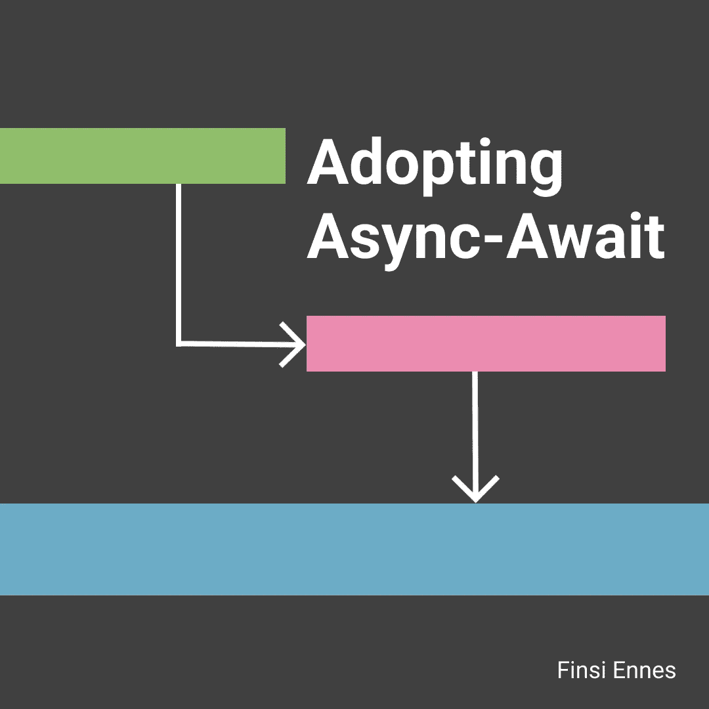
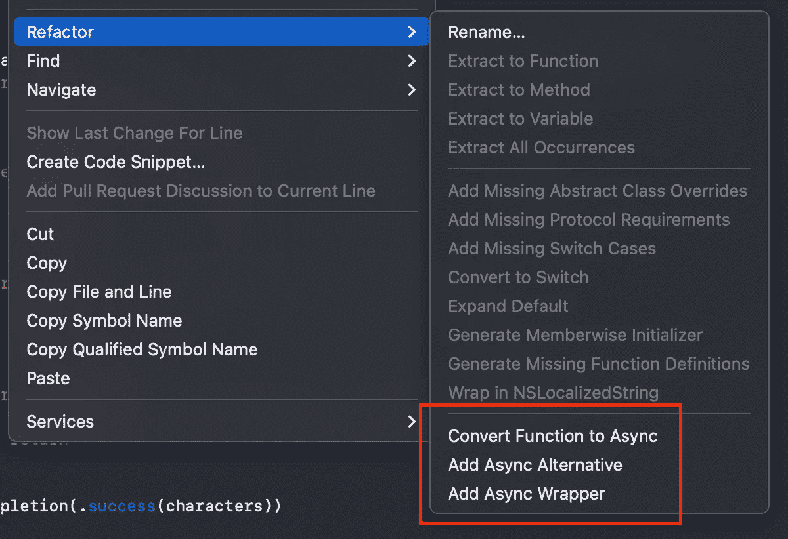
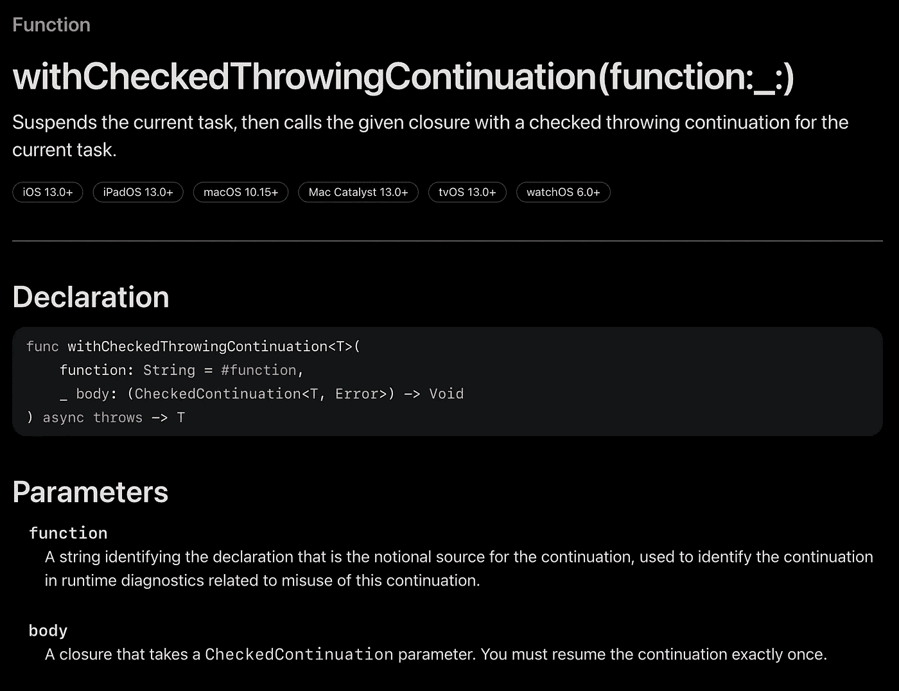

# 在你的项目中采用异步等待

> 原文：<https://levelup.gitconnected.com/adopt-async-await-in-your-project-d1117bf305be>

## 逐步地

Swift 并发中最相关和最新的变化之一是 Async-Await 及其与 iOS13 的向后兼容性。

除此之外，Xcode 提供了几个工具来从基于闭包的代码重构到这种新方法，允许我们逐步更新我们的项目。

我们有很多设备可以开始迁移。因此，在本文中，我们将学习如何使用 Xcode 选项采用异步等待。

# 开始前…

你应该知道这个语言扩展的基础。但是，如果您是异步等待领域的新手，请不要担心。

以下资源很好地介绍了所有这些概念，因此您可以理解我们在这里做什么:

 [## 在 Swift-wwdc 21-Videos-Apple Developer 中遇到异步/等待

### Swift 现在支持异步功能——这种模式通常被称为 async/await。了解新语法如何能够…

developer.apple.com](https://developer.apple.com/videos/play/wwdc2021/10132/)  [## 主 apple 上的 swift-evolution/0296-async-await . MD/swift-evolution

### 现代 Swift 开发涉及大量使用闭包和完成的异步(或“async”)编程…

github.com](https://github.com/apple/swift-evolution/blob/main/proposals/0296-async-await.md)  [## Apple 开发者文档

### 编辑描述

developer.apple.com](https://developer.apple.com/documentation/swift/updating_an_app_to_use_swift_concurrency) 

# 为什么我应该在我的项目中采用 Async-Await？

任何应用程序开发都很容易涉及大量异步(或“async”)编程。这意味着使用闭包和完成处理程序。

在这种情况下，网络层是包含更多并发性的应用程序的一部分。所以想象一下，我们正在开发一个应用程序，使用它的 [API](https://rickandmortyapi.com/) 来查阅关于 Rick 和 Morty 系列的数据。

例如，负责调用字符端点和处理数据的 Swift 方法如下所示:

通过这个简单的异步任务序列，我们可以发现一些**的缺点**:

*   闭包**更难阅读和调试**，如果它们是嵌套的就更难了。事实上，丢失运行代码的轨迹是很常见的。
*   **错误处理**又是个问题。我们必须检查每次回调的结果，这增加了代码的复杂性。
*   **易犯错误**。注意，对于每个可能的方法出口，我们必须调用完成闭包来提供结果。
*   如果我们不这样做，app 就会陷入无休止的状态。编译器不会将其标记为错误，因此**更难发现**。
*   此外，我们**必须使用自身的弱引用**来避免保留循环。

新的 Async-Await 模式解决了所有这些问题。这基本上就是调整你当前代码库的动机。

# 几个重构选项

在这一点上，想象我们想要重构这样的应用程序的网络层，开始使用异步函数。我们将使用真实的功能示例，一步一步地了解如何做到这一点。

我们来看看前面`findCharacter`的实现:

属性`commonComponents`和`createRequest(queryItems:) method`为我们提供了获取角色信息所需的请求。

但是我们感兴趣的是与`dataTask`方法的完成闭包相关的**异步任务**。再次注意，我们之前看到的关于为什么闭包不是最优的观点。

了解了这些，我们就可以开始重构了。为此:

*   做*在方法名上右击*。
*   选择 *Refactor* ，你会看到 Xcode 为我们提供的选项。

# 异步包装器

让我们从简单的开始，这是*添加异步包装器。*如果你想在你的项目中采用 async-await，但是你**没有时间进行大的重构**，这是一个**极好的选择**。

选择此选项，您将看到 Xcode 如何保持您的代码不变，它只是包含了一个充当异步包装器的新函数:

注意，**创建的包装器是一个异步函数**本身，它返回一个`String`并可以抛出。这与为我们的非异步功能提供的`Result`相对应。

所有的魔力都来自于`withCheckedThrowingContinuation`函数。让我们回顾一下文档，以了解这是如何工作的:

*   (结构)[检查延续](https://developer.apple.com/documentation/swift/checkedcontinuation)。
*   (功能)[witheckedthrowcontinuation](https://developer.apple.com/documentation/swift/withcheckedthrowingcontinuation(function:_:))。

总之，这个函数允许我们**将基于闭包的方法转换成异步函数**。该方法将**暂停当前任务，直到给定的闭包返回**并触发 async-await 方法的继续，以这种方式提供结果。

为了恢复暂停的任务并提供结果，您必须使用`resume(with:)`，其中参数类型是`Result<T,E>`。这与我们基于闭包的函数返回的类型相同。

*   所以我们可以做:`continuation.resume(with: result)`
*   其中`result`是`Result<String, Error>`

相关的东西，你只需要调用一次。调用此方法后，控制权立即返回给调用方。此外，您可以使用`resume(throwing:)`来抛出额外的错误。

知道了这是如何工作的，我们可以调用新的异步函数:

这里的另一个细节是`Task`。我们用它来创建一个异步任务，以便能够从同步函数中调用这样的函数。重构时你会经常用到它，你可以把它看作两种范式之间的桥梁。

有关详细信息，请查看文档:

*   [任务初始化器](https://developer.apple.com/documentation/swift/task/init(priority:operation:)-5ltye)

# **异步替代**

下一个重构选项是*添加异步选择*。选择它，Xcode 将完成大部分工作，但很可能您必须清理和修改结果代码。之后，重构的方法如下:

请记住，前面的方法包装了整个原始方法，以提供异步等待支持。然而，当前选项将**修改方法本身，在需要时暂停任务**。

在我们的例子中，这是涉及所有与网络调用相对应的闭包逻辑的部分。

同样，Xcode 将使用`withCheckedThrowingContinuation`函数。因此，只要得到回调，就必须确保调用`continuation`闭包。要么抛出一个错误，要么返回一个您可以看到的结果。

另一方面，Xcode 维护基于闭包的实现:

`available`属性是这些选项之间的共享特性。当你想逐步采用异步等待时，这非常有用。

没有必要在变更后调整所有的项目。此外，您可以很容易地回到旧的实现，以检查一切都按预期工作。

## 改进异步替代方案

提议的解决方案确实支持异步等待，但是注意方法结构和以前非常相似。我们调用的`continuation`闭包与最初实现中调用的`completion`闭包一样多。

幸运的是，我们可以使用新的 Async-Await API 来简化这一切。

`URLSession`就是一个例子，所以不使用`withCheckedThrowingContinuation`函数，而是使用:

正如你所看到的，异步函数就像同步代码一样被写成了直线。除了极大地简化代码之外，这使得它的演讲更加容易。在这种情况下**我们保存了 21 行代码**。

## 兼容性要求

一个相关的注释。异步向后兼容性仅适用于 Swift 语言功能。换句话说，你可以使用 async-await 编写代码，但是所有使用它的基础 API 仍然需要 iOS15。

# 将函数转换为异步

最后一个选项代表了最激进的方法。它直接将我们旧代码转换成异步代码，而无需维护非异步替代代码。

选择*将功能转换为异步*并像之前一样修改代码:

如果您想尽快迁移到 async-await，这是一个**的好选择，因为它不提供中间步骤。**

这适用于中小型项目，但如果我们谈论更大的代码库，事情就不同了。这种方法修改了调用旧函数的每一个点，这意味着大量的修改。请记住这一点。

# 是时候重构你的项目了

正如我们已经看到的，async-await 解决了这些由基于闭包的代码引起的问题。除了简化代码和提高可读性。

选择哪一个重构选项取决于几个因素，比如项目规模或可用时间。但是有一点是清楚的，那就是你应该开始使用 async-await。

如果你喜欢我的内容，想看更多，记得**拍拍**和**分享**🙂