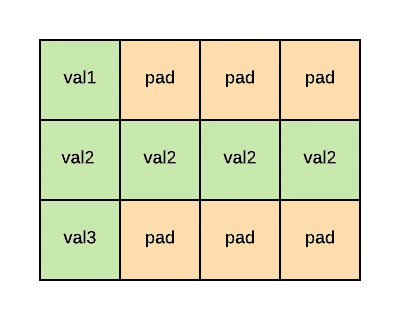
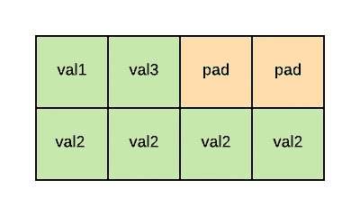
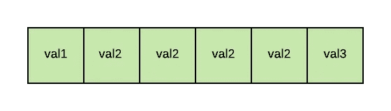

# C 结构中的高级概念

> 原文：<https://levelup.gitconnected.com/advanced-concepts-in-c-structures-254fe156b3fb>


照片由[阿迪·戈尔茨坦](https://unsplash.com/@adigold1?utm_source=unsplash&utm_medium=referral&utm_content=creditCopyText)在 [Unsplash](https://unsplash.com/s/photos/coding?utm_source=unsplash&utm_medium=referral&utm_content=creditCopyText) 上拍摄

今天我想和大家分享一些 C 语言中的高级概念。我遇到了这些概念，它们是很好的特性，但是很少被使用，或者至少我没有经常看到它们被使用。今天我们将讨论…

# 结构

在我看来，很少有人使用结构或者知道它们是什么和有什么用处。

> 结构创建的数据类型可用于将可能不同类型的项分组为单一类型。

结构更注重可读性。我们可以将属于同一类的变量分组。让我们假设您需要处理某人的地址。而不是这个:

```
void main() {  
        char street[50] = "Somestreet";  
        int housenumber = 123;  
        int postcode[5] = {4,3, 2, 1, 0};  
        char city[20] = "SomeCity";
}
```

我们可以把它组织成一个结构。首先，我们必须声明结构。我们声明了一个包含街道名、门牌号、5 位邮政编码和城市的结构。

```
struct address {
        char street[50];
        int housenumber;
        int postcode[5];
        char city[20];
};
```

现在，我们可以在主函数中定义一个变量，并像下面这样初始化它:

```
void main() {
         struct address myAddress = {
                "SomeStreet",
                123,
                {1, 2, 3, 4, 5},
                "SomeCity"
        };
        printf("House Number: %u\n", myAddress.housenumber)
}
```

这给了我们`House Number: 123`。

结构可以像其他变量一样处理。您可以将它传递给一个函数，构建一个结构数组，或者在结构中嵌套结构。

结构对于将数据组织在一起非常有用。如果您需要处理数据，例如`memcpy`，如果您已经将它们分组到一个结构中，就会容易得多。但是要小心:由于填充，结构在内存中可能更大。但是这是如何工作的呢？

## “结构”的记忆结构

当我们使用结构时，我们需要知道它们在内存中是如何排列的。数据结构成员按顺序存储在内存中，因此该结构的大小正好是它所包含成员的倍数。我给你举个例子。以下结构

```
struct data {
    uint8_t val1;
    uint8_t val2;
    uint8_t val3;
};
```

正好是三个字节。这里的对齐是一个字节，因为每个成员都是一个`uint8_t`，这是一个字节，所以结构本身是其成员的倍数，三个字节。

> 结构对齐取决于结构中的类型。

当我们使用混合型结构时，对齐会稍微复杂一点。以下结构

```
struct data2 {
    uint8_t val1;
    uint32_t val2;
    uint8_t val3;
};
```

技术上是六个字节，对吗？我们有两个单字节值，一个四字节值等于六。**很遗憾，这是不正确的**。我们忘了衬垫。如果我们创建混合类型的结构，填充符通常也等于我们在结构中使用的最大类型。但是请注意——这是特定于实现的！我们来看看结构`struct data2`在内存中是什么样子的。



**数据 2** 的存储结构

正如我之前说过的，内存中结构的对齐将等于我们的结构中使用的最大类型——所以它将是`uint32_t` : 4 字节。这意味着该结构将以 4 字节的块放入内存。如果下一个值不再适合 4 字节块，则当前块将用零填充(填充),并将使用新块。实际上，结构`struct data2`在内存中是 12 字节*大*。

如果我们像这样重新排列结构

```
struct data3 {
    uint8_t val1;
    uint8_t val3;
    uint32_t val2;
};
```



**数据 3 的存储结构**

它仍然包含相同数量的值，但是在内存中，它看起来完全不同。

如您所见， *val1* 和 *val3* 适合放在一个块中。显然 *val2* 不再适合，所以该块被填充， *val2* 进入下一个块。结构中变量的顺序对结构的大小有很大的影响。如果你考虑将数据直接存储到一个结构中，或者反之亦然，了解这一点是非常重要的。

## 修改对齐方式

有几种方法可以修改结构的对齐方式。它们都是特定于编译器的，但应该适用于大多数编译器。如果你想将对齐设置为一个字节，这样在结构的内存中就没有填充，你可以使用`__packed`关键字。像这样定义你的结构

```
struct __attribute__((__packed__)) data {
    uint8_t val1;
    uint32_t val2;
    uint8_t val3;
};
```



数据打包的存储结构

并且您的编译器不会向该结构添加填充。记忆中，是这样的。

该结构的大小正好是六个字节。请注意，删除填充会导致代码变慢。这应该只用于大小**很重要或者你想直接从输入流中调用数据的情况，例如，串行到一个结构中。**

如果你在 c 语言中使用`pragma`也能得到同样的效果。`pragma pack`指令改变了最大对齐。聪明的做法是只为你想要的结构设置`pragma pack`，而不是为整个项目设置。如果您想要更改对齐方式，它的工作方式如下:

```
#pragma pack(push)
#pragma pack(1)struct data {
        uint8_t val1;
        uint32_t val2;
        uint8_t val3;
};#pragma pack(pop)
```

`#pragma pack(push)`将实际校准设置推送到内部堆栈，以便我们稍后可以再次恢复该设置。`#pragma pack(1)`将最大对齐设置为一个字节，后跟结构定义。之后，我们再次用`#pragma pack(pop)`、*从内部堆栈中弹出*来恢复之前的对齐设置。

如果您处理的数据能够以某种方式聚集在一起，那么结构会非常有用。即使它没有为您节省任何内存，您的代码将获得更好的可读性。

**感谢阅读！**