# 每个有效的程序员都应该知道的递归中的高级概念

> 原文：<https://levelup.gitconnected.com/advanced-concepts-in-recursion-every-effective-programmer-should-know-de233a092dbf>

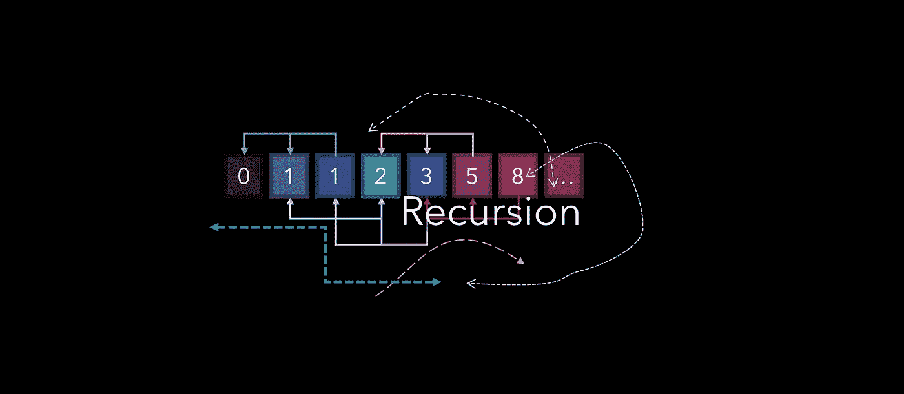

## 最强大最有用的编码方法之一

递归是最强大的编程方法之一。在编码人员的工具箱中，它是最有用的工具之一，能够用非常少的代码解决极其复杂的问题。然而，递归通常是一个难以理解的概念，因为它需要一个关于命令如何处理的非标准视图。

本文将从简单的例子开始，逐步发展到更具挑战性的例子，并附有大量图表:

*   递归的思维方式
*   递推关系
*   记忆化
*   分而治之策略

递归是一种解决问题的方法，在这种方法中，函数在函数的定义中调用自己。每个递归实现都需要两个元素:

*   一个或多个基本情况，即不再使用更多递归进一步搜索答案的终止情况。
*   一组规则(递归关系),通过启动另一轮递归，将其他情况减少到一个基本情况。

例如，让我们考虑打印一个字符串的反面的任务。输入“hello”的输出应该是“olleh”。处理这项任务的迭代方法是使用 for 循环，从最后一个索引到第一个索引打印出每个字符。

递归方法首先创建一个函数`reverseString`，它接受一个字符串作为参数。如果输入的长度不为 0——这将是基本的或终止的情况——我们打印最后一个字母，并在当前字符串上启动另一个`reverseString`实例，不包括最后一个(因为它刚刚被打印)。

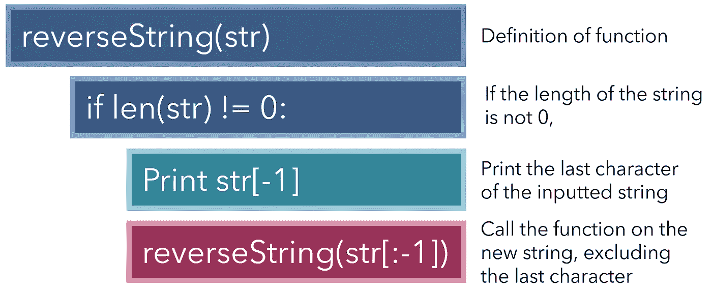

请注意，因为函数是在自身内部调用的，所以它自己创建了一个 for 循环。此外，在调用另一个函数实例之前，必须有一个`if`语句——否则，会抛出一个`RecursionError`或`RuntimeError`,因为脚本看不到无限循环的尽头。这类似于一个`while True`无限循环。

让我们看看这个递归函数如何作用于“hello”:

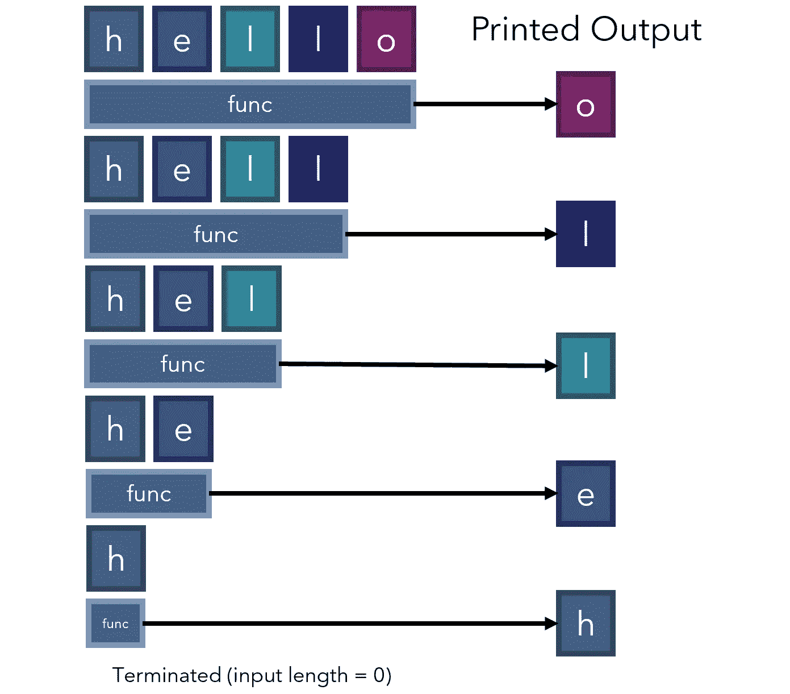

更复杂问题的递归可能是一项困难的任务，因为识别它的两个组成部分——递归关系，问题结果和其子问题结果之间的关系；基本情况是，不需要递归调用就可以直接计算。有时，基本情况被称为“底部情况”，因为它们是问题被缩小到最小规模的情况。

例如，考虑帕斯卡的三角形，其中每个数字都是上面两个数字的和，三角形的边上都有一个数字。如何使用递归来查找点( *i，j* )上任意值的值？递归关系和基础/终止情况是什么？

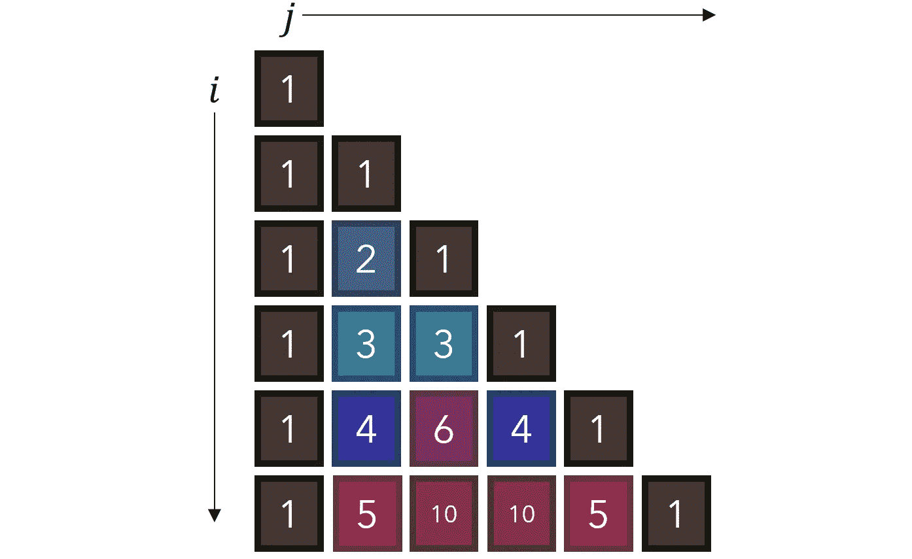

递归关系可以通过下面的等式来表示:

这在观察三角形的图形时是显而易见的。这个公式更好的一点是，如果我们继续使用它来分解任何位置( *i，j* )作为其他两个位置的总和，不可避免地会导致基本情况— 1。帕斯卡三角形从 1 开始，从 1 的总和中出现了一个完整的复杂模式。

我们如何实现这一点？

首先，让我们找到一组规则来确定何时满足基本情况—单元格的值等于 1。注意，1 出现在两种情况下:要么它们在第一列中( *j =* 0)，要么它们在对角线中( *i = j* )。

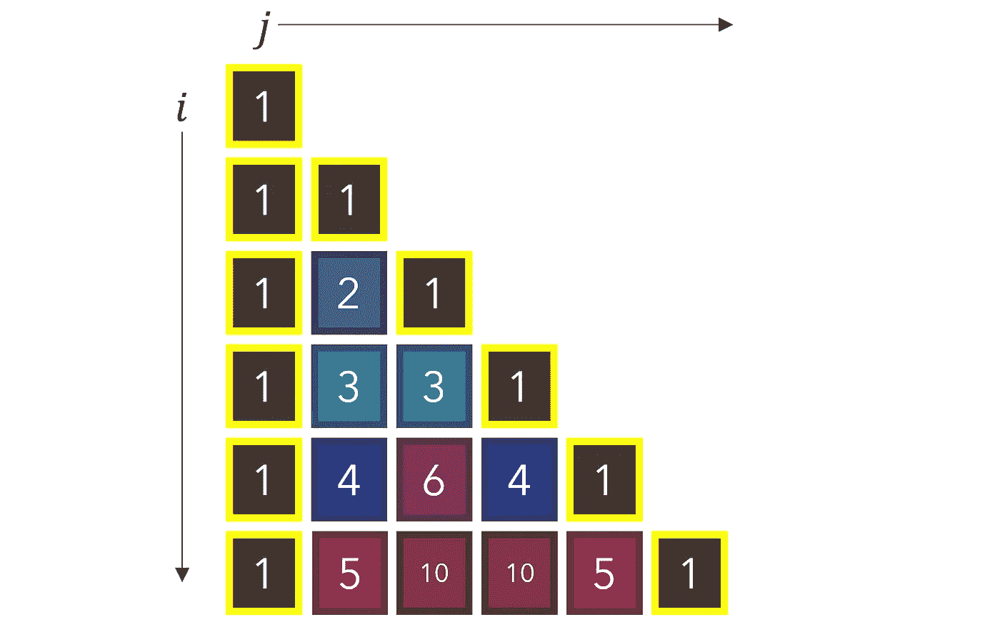

现在实施很简单。如果满足基本情况条件，我们返回基本值(1)。否则，我们继续减少问题，直到我们达到一个基本情况，我们已经确定任何输入将不可避免地被分解成。

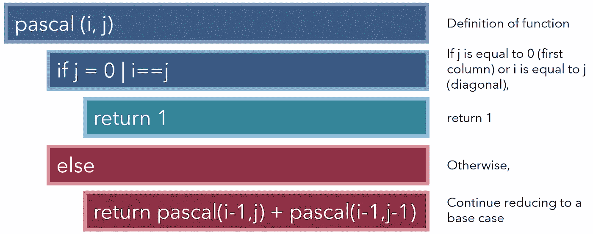

到目前为止，您应该已经明白了递归的美妙之处。这里，我们基本上用五行代码创建了一个自我构建树(如果您想缩短它，甚至可以是三行)。当我们调用`pascal`函数两次时，我们启动*两个*搜索分支，每个分支启动两个以上的分支，假设它们没有到达基本情况。

递归是如何如此有效地工作的，这可能有点不可思议和令人困惑。让我们看看递归算法是如何对一个例子进行操作的。

(4，2)分解成(3，1)和(3，2)，是它上面的两个数，根据我们的递推关系。请注意，该算法实际上并不知道这些单元格的值是 3，它只是记录了它们的位置。我们不知道也不关心任何价值，除非它满足我们的基本条件。从我们的基本情况(1)中，我们可以计算其他非基本位置，但必须首先找到所有基本情况。

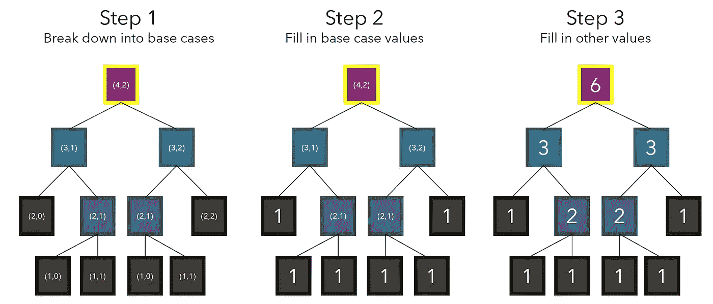

根据我们的递归关系，案例被迭代分解，直到满足基本案例( *j =* 0 或 *i = j* )。因为我们知道这些基本情况(1)的值，所以我们可以填充依赖于基本情况的其他值。

当然，这是递归算法如何工作的极其详细的视图——也许过于详细。实际上，这三个步骤都不需要编程；它们由脚本自动执行。就实现而言，您需要做的只是调用函数本身，并确保它必须在某些点终止于基本情况。

当我们调用`return pascal(i-1, j) + pascal(i-1, j-1)`时，我们不把返回当作一个过程，而是当作一个数字。由于`pascal(i-1, j)`将启动自己的分支过程，但最终将返回另一个数字(如 3)，因此将它视为后者而不是前者会有所帮助，后者会导致不必要的复杂性和麻烦。

人们可能倾向于指出这种递归算法的一些低效之处。毕竟‘6’被分解成‘3’，它们有相同的分解(就价值而言)，但它被天真地计算了两次。这在递归中很常见，其中一个 case 的基本 case 已经计算过了，但还要再计算一次。为了解决这个问题，我们使用记忆化。

以斐波那契数列为例，其中前两个数字是 0 和 1，下一个数字是前面两个数字的和。从我们之前的知识中，我们理解基础情况为 0 和 1，我们的递推关系为*v*(*I*)=*v*(*I*-2)+*v*(*I*-1)。因此，我们可以构造一个简单的递归函数来查找 Fibonacci 序列在任何索引 *i* 处的值，从 0 开始。

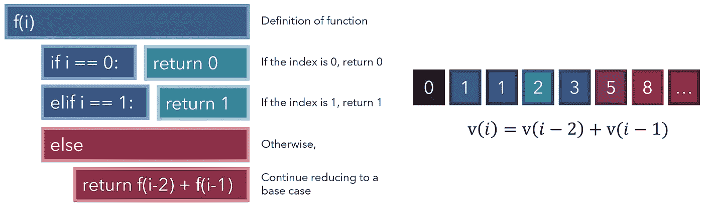

请注意，虽然这是递归的一个巧妙应用，但它的效率非常低。8 被分解成 3 和 5，反过来 5 又被分解成 3 和 2。我们从头开始计算一切，并建立一个完整的搜索树，有很多重复。

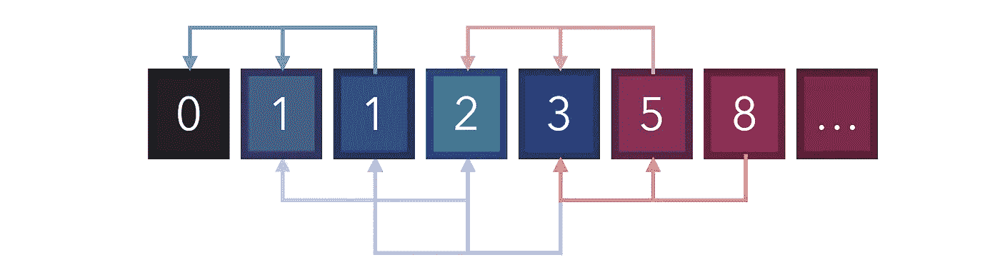

有了记忆化，我们可以通过创建缓存来解决这个问题。这可以通过使用字典来实现，并存储我们以前见过的值。例如，当索引 6(值 8)被分解为索引 4 和索引 5(值 3 和 5)时，我们可以将索引 4 的值存储在缓存中。当索引 5 被计算为索引 3 加上索引 4 时，我们可以从缓存中提取索引 4，而不是通过构建另一个扩展树来重新计算它。

为了给我们的函数添加记忆功能，我们添加了两个功能:首先，如果当前索引已经存储在我们的缓存中，我们只需返回存储的值；其次，在我们继续减少该值之前，我们将该值添加到缓存中，以便可以加速进一步的操作。请注意，缓存必须是一个全局变量，或者是一个无论调用命令的范围如何都可以检索和更改的变量。

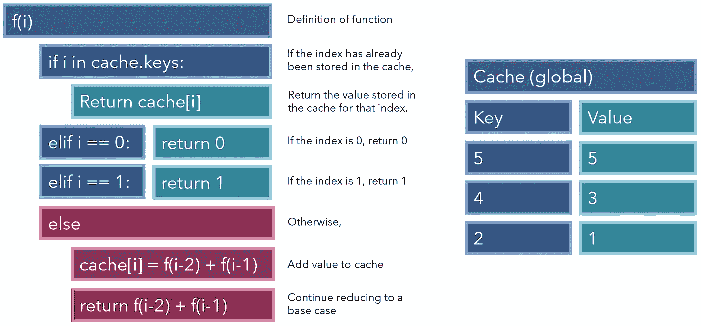

通过简单的记忆添加，我们的递归函数比以往任何时候都更快更强大。

递归是各种最快的排序算法的核心。排序算法的目标是接受一个数字列表，并从最小到最大返回它们。由于如此多的应用程序依赖于快速排序，所以找到一种能够最快地对列表进行排序的算法非常有意义。一些最快的算法使用分治递归方法。

分治策略是将一个初始问题递归地分解成几个子问题。在每个子问题都是单位大小(类似于基本情况)之后，找到每个子问题的子解，并且子解再次递归地集合在一起以形成完整的解。

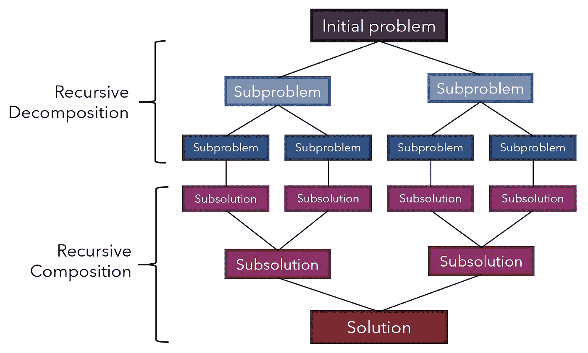

以 QuickSort 为例，它是排序中最快的算法之一，如果实现得好，它的执行速度可以比竞争对手和前辈快 2 到 3 倍。

快速排序从选择一个“支点”开始。在简单的实现中，对于我们的目的来说，中枢是任意的，但是更专业的实现在选择中枢时会非常小心。

小于枢轴的所有元素都移动到枢轴的左侧，大于枢轴的所有元素都移动到其右侧。这可以通过遍历每个元素来完成，如果它们的值小于数据透视表的值，则将它们移动到一个列表中，如果它们的值大于数据透视表的值，则将它们移动到另一个列表中。注意，这个操作只是部分地解决了这个任务。

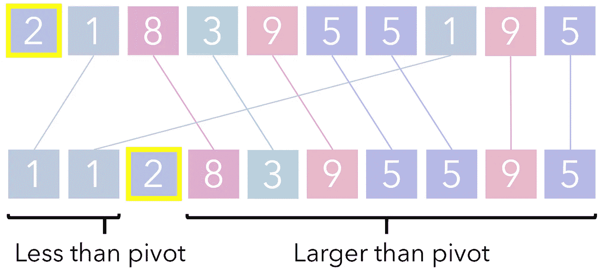

通过其轴心分割列表的过程被称为分区，因为轴心将列表分成两个分区，或者说两个面。每个分区对自己调用另一个分区迭代，依此类推，直到一个分区达到一个基本情况(1 个单元，仅仅是一个数字)。

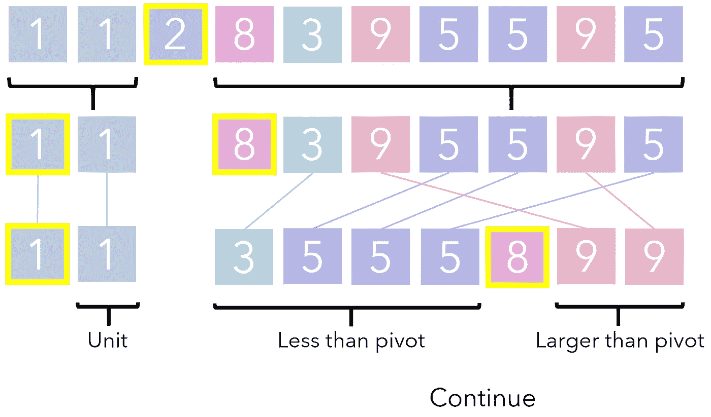

经过足够的递归后，原始列表将被足够地划分到不能再调用递归的程度。在这一点上，子解的组成就是简单地将它们水平堆叠在一起。合成的结果是一个排序列表。

请注意，QuickSort 遵循了前面讨论的递归的许多构件，只是层次更高。递归关系是组件的划分，基本情况是大小为 1 的划分。从一个原始列表开始，递归地调用相同的过程(选择一个支点，划分),直到结果只包含基本案例。

# 要点

*   递归是一种在函数中调用自身的编程方法，允许使用最少的代码进行循环和自动树构建。
*   当构造任何递归函数时，必须清楚地理解两个要素:递归关系和基本情况。
*   内存化是一种通过将信息存储在缓存中，然后在需要时检索它们来防止重复操作的方法。
*   分治是递归的许多更深层次的应用之一，在递归中，一个问题被递归地分解成几个子问题(基本情况)，从中可以很容易地提取子解决方案并将其聚合成一个完整的解决方案。

想在实践中看到更多递归的例子吗？查看这篇关于回溯的文章，回溯是递归的一种变体，通常是搜索问题的一个好策略。使用回溯来解决数独之类的问题，代码如下:

 [## 回溯:如何处理搜索编程面试问题

### 用三个例子直观地解释:N 皇后、飞行路线和数独

medium.com](https://medium.com/faun/backtracking-how-to-approach-search-programming-interview-questions-647a742197) 

所有图片均由作者创作。