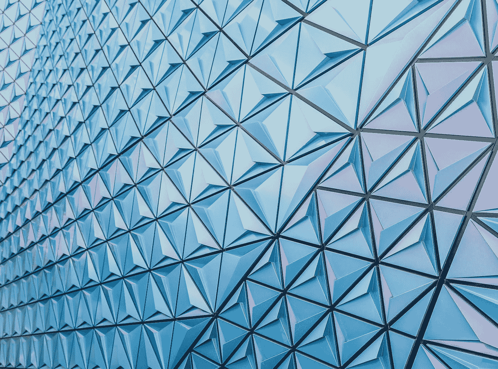

# 使用 Pixi.js 进行高级绘图

> 原文：<https://levelup.gitconnected.com/advanced-drawing-with-pixi-js-cd3fddc1d69e>



由[乔尔·菲利普](https://unsplash.com/@joelfilip?utm_source=medium&utm_medium=referral)在 [Unsplash](https://unsplash.com?utm_source=medium&utm_medium=referral) 上拍摄的照片

星星、连发、齿轮、楔形、多边形、弧线和破折号都是使用 Pixi.js 绘制的，pixi . js 是 HTML5 创建引擎，具有最快、最灵活的 2D WebGL 渲染器。

很多年前，当我给一幅图形添加一个爆发时，我偶然发现了里克·尤因的古怪的猴子绘画脚本。嵌入该功能的评论立即引起了我的共鸣:

> Burst 是一种绘制星暴的方法。如果你曾经在广告部工作过，你知道他们是什么；-)
> 
> 客户倾向于想要它们，开发人员倾向于讨厌它们…

我想我应该利用现代网络把这些东西带回来。

下面是七个移植到 Pixi.js 的绘图形状。

# 绘制虚线

绘制一条从点 x1，y1 到点 x2，y2 的虚线。

用法:

*   `target` —将在其上绘制虚线的图形实例
*   `x1` —沿 x 轴的起始位置
*   `y1` —沿 y 轴的起始位置
*   `x2` —沿 x 轴的最终位置
*   `y2` —沿 y 轴的最终位置
*   `dashLength` —每条虚线的长度，以像素为单位
*   `spaceLength` —破折号之间的间距，以像素为单位

```
function drawDash(target,
                  x1,
                  y1,
                  x2,
                  y2,
                  dashLength = 5,
                  spaceLength = 5) {
  let x = x2 - x1;
  let y = y2 - y1;
  let hyp = Math.sqrt((x) * (x) + (y) * (y));
  let units = hyp / (dashLength + spaceLength);
  let dashSpaceRatio = dashLength / (dashLength + spaceLength);
  let dashX = (x / units) * dashSpaceRatio;
  let spaceX = (x / units) - dashX;
  let dashY = (y / units) * dashSpaceRatio;
  let spaceY = (y / units) - dashY; target.moveTo(x1, y1); while (hyp > 0) {
    x1 += dashX;
    y1 += dashY;
    hyp -= dashLength;
    if (hyp < 0) {
      x1 = x2;
      y1 = y2;
    }
    target.lineTo(x1, y1);
    x1 += spaceX;
    y1 += spaceY;
    target.moveTo(x1, y1);
    hyp -= spaceLength;
  }
  target.moveTo(x2, y2);
}
```

# 画弧线

从起始位置 x，y 绘制一个圆弧。

用法:

*   `target` —将在其上绘制虚线的图形实例
*   `x` —起点的 X 坐标
*   `y` —起点的 Y 坐标
*   `radius` —圆弧的半径
*   `arc` —圆弧扫描(负值顺时针绘制)
*   `startAngle` —以度为单位的起始偏移角度
*   `yRadius`-圆弧的 Y 半径，如果不同于半径将绘制一个椭圆

```
function drawArc(target, 
                 x, 
                 y, 
                 radius, 
                 arc, 
                 startAngle = 0, 
                 yRadius = 0) {

  if (yRadius === 0)
    yRadius = radius; let segs = Math.ceil(Math.abs(arc) / 45);
  let segAngle = arc / segs;
  let theta = -(segAngle / 180) * Math.PI;
  let angle = -(startAngle / 180) * Math.PI;
  let ax = x - Math.cos(angle) * radius;
  let ay = y - Math.sin(angle) * yRadius;
  let angleMid, bx, by, cx, cy;

  if (segs > 0) {
    target.moveTo(x, y);
    for (let i = 0; i < segs; ++i) {
      angle += theta;
      angleMid = angle - (theta / 2);
      bx = ax + Math.cos(angle) * radius;
      by = ay + Math.sin(angle) * yRadius;
      cx = ax + Math.cos(angleMid) * (radius / Math.cos(theta / 2));
      cy = ay + Math.sin(angleMid) * (yRadius / Math.cos(theta / 2));
      target.quadraticCurveTo(cx, cy, bx, by);
    }
  }
}
```

# 绘制楔形

绘制饼形楔形，如在饼图中。

用法:

*   `target` —将在其上绘制虚线的图形实例
*   `x` —中心点的 X 坐标
*   `y` —中心点的 Y 坐标
*   `radius` —楔子的半径
*   `arc` —圆弧扫描(负值顺时针绘制)
*   `startAngle` —以度为单位的起始角度
*   `yRadius` —楔形的 Y 半径

```
function drawWedge(target,
                   x,
                   y,
                   radius,
                   arc,
                   startAngle = 0,
                   yRadius = 0) {
  let segs = Math.ceil(Math.abs(arc) / 45);
  let segAngle = arc / segs;
  let theta = -(segAngle / 180) * Math.PI;
  let angle = -(startAngle / 180) * Math.PI;
  let ax = x + Math.cos(startAngle / 180 * Math.PI) * radius;
  let ay = y + Math.sin(-startAngle / 180 * Math.PI) * yRadius;
  let angleMid, bx, by, cx, cy; if (yRadius === 0)
    yRadius = radius; target.moveTo(x, y);
  target.lineTo(ax, ay); for (let i = 0; i < segs; ++i) {
    angle += theta;
    angleMid = angle - (theta / 2);
    bx = x + Math.cos(angle) * radius;
    by = y + Math.sin(angle) * yRadius;
    cx = x + Math.cos(angleMid) * (radius / Math.cos(theta / 2));
    cy = y + Math.sin(angleMid) * (yRadius / Math.cos(theta / 2));
    target.quadraticCurveTo(cx, cy, bx, by);
  } target.lineTo(x, y);
}
```

# 绘制多边形

绘制指定边数的多边形形状。

用法:

*   `target` —将在其上绘制虚线的图形实例
*   `x` —中心点的 X 坐标
*   `y` —中心点的 Y 坐标
*   `sides` —边数(必须大于 2)
*   `radius` —从中心点到多边形上各点的半径
*   `angle` —以度为单位的起始角度偏移

```
function drawPolygon(target,
                     x,
                     y,
                     sides,
                     radius,
                     angle = 0) {
  let step = (Math.PI * 2) / sides;
  let start = (angle / 180) * Math.PI;
  let n, dx, dy; target.moveTo(
    x + (Math.cos(start) * radius),
    y - (Math.sin(start) * radius)
  ); for (n = 1; n <= sides; ++n) {
    dx = x + Math.cos(start + (step * n)) * radius;
    dy = y - Math.sin(start + (step * n)) * radius;
    target.lineTo(dx, dy);
  }
}
```

# 画星星

用指定的点数绘制星形图案

用法:

*   `target` —将在其上绘制虚线的图形实例
*   `x` —中心点的 X 坐标
*   `y` —中心点的 Y 坐标
*   `points` —星星上的点数
*   `innerRadius` —星形内角的半径
*   `outerRadius` —星形外角的半径
*   `angle` —以度为单位的起始角度偏移

```
function drawStar(target,
                  x,
                  y,
                  points,
                  innerRadius,
                  outerRadius,
                  angle = 0) { let step = (Math.PI * 2) / points;
  let halfStep = step / 2;
  let start = (angle / 180) * Math.PI;
  let n, dx, dy; target.moveTo(
    x + (Math.cos(start) * outerRadius),
    y - (Math.sin(start) * outerRadius)
  );

  for (n = 1; n <= points; ++n) {
    dx = x + Math.cos(start + (step * n) - halfStep) * innerRadius;
    dy = y - Math.sin(start + (step * n) - halfStep) * innerRadius;
    target.lineTo(dx, dy);
    dx = x + Math.cos(start + (step * n)) * outerRadius;
    dy = y - Math.sin(start + (step * n)) * outerRadius;
    target.lineTo(dx, dy);
  }
}
```

# 牵引齿轮

绘制具有指定边数的齿轮形状。

用法:

*   `target` —将在其上绘制虚线的图形实例
*   `x` —中心点的 X 坐标
*   `y` —中心点的 Y 坐标
*   `sides` —齿轮的齿数(必须大于 2)
*   `innerRadius` —齿的缩进半径
*   `outerRadius` —齿的半径
*   `angle` —以度为单位的起始角度偏移
*   `holeSides` —多边形孔的边数(必须大于 2)
*   `holeRadius` —孔的半径

```
function drawGear(target,
                  x,
                  y,
                  sides,
                  innerRadius = 80,
                  outerRadius = 4,
                  angle = 0,
                  holeSides = 2,
                  holeRadius = 0) {
  let step = (Math.PI * 2) / sides;
  let qtrStep = step / 4;
  let start = (angle / 180) * Math.PI;
  let n, dx, dy; target.moveTo(
    x + (Math.cos(start) * outerRadius),
    y - (Math.sin(start) * outerRadius)
  );

  for (n = 1; n <= sides; ++n) {
    dx = x + Math.cos(start + (step * n) - (qtrStep * 3)) * innerRadius;
    dy = y - Math.sin(start + (step * n) - (qtrStep * 3)) * innerRadius;
    target.lineTo(dx, dy);
    dx = x + Math.cos(start + (step * n) - (qtrStep * 2)) * innerRadius;
    dy = y - Math.sin(start + (step * n) - (qtrStep * 2)) * innerRadius;
    target.lineTo(dx, dy);
    dx = x + Math.cos(start + (step * n) - qtrStep) * outerRadius;
    dy = y - Math.sin(start + (step * n) - qtrStep) * outerRadius;
    target.lineTo(dx, dy);
    dx = x + Math.cos(start + (step * n)) * outerRadius;
    dy = y - Math.sin(start + (step * n)) * outerRadius;
    target.lineTo(dx, dy);
  } step = (Math.PI * 2) / holeSides; target.moveTo(
    x + (Math.cos(start) * holeRadius),
    y - (Math.sin(start) * holeRadius)
  ); for (n = 1; n <= holeSides; ++n) {
    dx = x + Math.cos(start + (step * n)) * holeRadius;
    dy = y - Math.sin(start + (step * n)) * holeRadius;
    target.lineTo(dx, dy);
  }
}
```

# 绘画爆发

用指定的边数画一个星形爆发。

用法:

*   `target` —将在其上绘制虚线的图形实例
*   `x` —中心点的 X 坐标
*   `y` —中心点的 Y 坐标
*   `sides` —齿轮的齿数(必须大于 2)
*   `innerRadius` —曲线缩进的半径
*   `outerRadius` —最外点的半径
*   `angle` —以度为单位的起始角度偏移

```
function drawBurst(target,
                   x,
                   y,
                   sides,
                   innerRadius,
                   outerRadius,
                   angle = 0) {
  let step = (Math.PI * 2) / sides;
  let halfStep = step / 2;
  let qtrStep = step / 4;
  let start = (angle / 180) * Math.PI;
  let n, dx, dy, cx, cy; target.moveTo(
    x + (Math.cos(start) * outerRadius),
    y - (Math.sin(start) * outerRadius)
  ); for (n = 1; n <= sides; ++n) {
    cx = x + Math.cos(start + (step * n) - (qtrStep * 3)) * (innerRadius / Math.cos(qtrStep));
    cy = y - Math.sin(start + (step * n) - (qtrStep * 3)) * (innerRadius / Math.cos(qtrStep));
    dx = x + Math.cos(start + (step * n) - halfStep) * innerRadius;
    dy = y - Math.sin(start + (step * n) - halfStep) * innerRadius;
    target.quadraticCurveTo(cx, cy, dx, dy);
    cx = x + Math.cos(start + (step * n) - qtrStep) * (innerRadius / Math.cos(qtrStep));
    cy = y - Math.sin(start + (step * n) - qtrStep) * (innerRadius / Math.cos(qtrStep));
    dx = x + Math.cos(start + (step * n)) * outerRadius;
    dy = y - Math.sin(start + (step * n)) * outerRadius;
    target.quadraticCurveTo(cx, cy, dx, dy);
  }
}
```