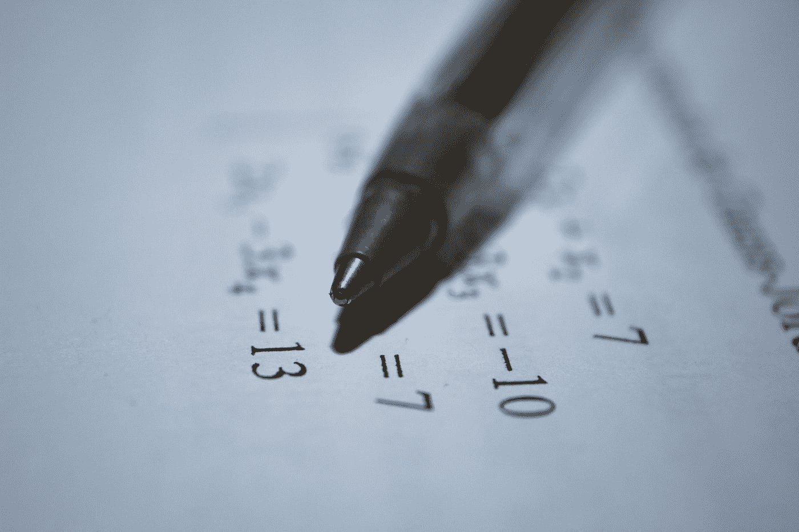
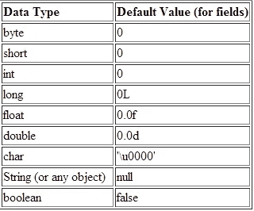
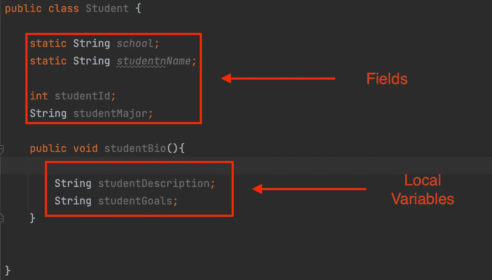
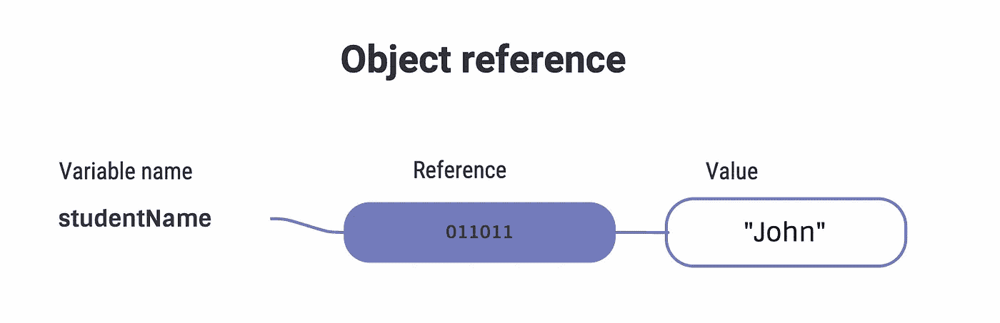

# 高级 Java 教程。原始类型和变量。

> 原文：<https://levelup.gitconnected.com/advanced-java-tutorial-an-in-depth-guide-on-java-data-types-and-variables-c9a1f6497e09>

## 为精通 Java 的人提供的数据类型和变量的彻底分类。

安托万·道特里在 Unsplash[拍摄的照片](https://unsplash.com?utm_source=medium&utm_medium=referral)

在本指南中，我们将深入分析数据类型和变量，并向您展示它们是如何工作的。本指南的很大一部分将包含编程和数学术语，如果你不熟悉编程或刚刚开始，我不会向你推荐本指南。如果你是一名学生或者正在为面试而学习，这将是你需要熟悉的有用信息。

## 字段与局部变量

***字段***

*   字段是在类级别声明的，而不是在方法或块级别。
*   它们可以是实例变量，这意味着该类的每个实例都有该变量的唯一实例。或者它们可以是一个类/静态变量，这意味着内存中只有一个该变量的实例，该类的任何实例都可以访问和更改它。静态变量可以用类名调用，而不用创建实例。例如`className.variablename`
    如果你想了解更多关于静态 vs 实例的信息，请查看这个 [Oracle 教程](https://docs.oracle.com/javase/tutorial/java/javaOO/classvars.html)
*   字段将自动初始化为默认值。以下是所有原始数据类型的默认值。字符串是唯一的异常值，因为它是一个对象(原始数据类型被归类为原始数据类型，因为它们只包含原始值)。

[https://docs . Oracle . com/javase/tutorial/Java/nutsandbolts/data types . html](https://docs.oracle.com/javase/tutorial/java/nutsandbolts/datatypes.html)

***局部变量***

*   局部变量在代码块或方法中声明
*   它们必须被赋值/初始化
*   它们永远不会是静态的
*   如果未定义，将导致控制台中出现未定义的错误

## 基本类型和对象引用之间的区别

***原始数据类型***

*   存储原始值。
*   无法存储空值

***对象引用***

*   存储指向其值的指针
*   可以存储空值

## 原始整数类型

整数类型是不能用十进制格式表示的值，可以保存一定范围的值，具体取决于使用哪一种类型。它们都由值 0 初始化。按大小升序排列的整型列表如下。

*   ***字节*。**一个字节是 8 位的序列。一个字节可以保存从-128 到 127 的数值。当要存储的数字不需要太多内存时，最好使用它。
*   ***短*。**短路是 16 位字节大小的两倍。它可以存储从-32，768 到 32，767 的值。
*   ***int* 。**int 大概是大多数编程的人都熟悉的。int 是一个 32 位的序列，可以保存从-21 亿到 21 亿的值。在大多数情况下，int 不是理想的数据类型，因为它占用大量的内存。大多数人在给一个 int 赋值时，几乎不会接近它的上限或下限。
*   ***长*。**长整型是最大的整型。在 64 位时，它可以保存-9.2 万亿到 9.2 万亿之间的值。Longs 最常用于以毫秒为单位测量时间。当你有一个整数不能处理的数字时，长整型通常是你的首选。当写一个长值时，你需要在末尾加上字母“L”来表示它是一个长值。L 可以是大写字母，也可以是小写字母。例子`long bigNum = 9,233,186,123L`。

## 浮点和双精度原语

浮点型和双精度型没有太大区别。它们的行为非常相似，并且有许多共同的特征。因此，在本节中，我们将列出他们共享的内容，然后列出他们各自的属性。

***既浮又双***

*   可以存储 long，int，short 等整型。
*   以十进制格式表示数据。
*   比所有的积分都有更宽的取值范围。
*   如果输出到控制台的值有太多位数，它们都将小数点后的数字四舍五入。
*   如果输出到控制台的值太大，它将以科学记数法表示。

现在来看看不同之处

***浮动***

*   是 32 位的序列。
*   值的末尾必须始终包含小写或大写字母“F”。否则，系统会将其识别为双精度型。
    比如`float aFloat = 21.22f`。如果不添加结尾“f ”,将会出现错误。

***双***

*   是 64 位的序列

## char 原语

大多数熟悉 char 数据类型的人都知道，它可以保存一个字符，正如我们在这里看到的`char letter = 'B'`，但这只是 char 原语工作方式的表面。

*   char 实际上是一个 16 位整数类型，可以保存从 0 到 65，535 的值。
*   像所有整数类型一样，不能给 char 赋值十进制值
*   字符也可以表示为 Unicode 文字。例如`'A'`和 Unicode `'\u0041'`是相同的，在运行时都会向控制台输出字母“A”。不同语言中有许多用 Unicode 表示的字符。有兴趣可以去探索一下 Unicode 上的 [wiki](https://en.wikipedia.org/wiki/List_of_Unicode_characters) 。
*   在引擎盖下，一个字符被表示为一个整数。例如，如果你给一个字符分配一个像这样的数字，并把它打印到控制台`char letterA = 65`，你会得到字母‘A’。这意味着这三个值`'A' = '\u0041' = 65`在分配给一个字符时都是相同的。
*   char 由 Unicode 中表示为`'\u0000'`的值 0 初始化。

在使用 char 的时候，数字的使用是非常模糊的，不是你每天都会看到的。但是知道这是一种可能性是非常有用的。

希望你们觉得这很有用。如果你有任何问题或意见，请留下，我会尽快回复。

祝您愉快！

## 资源

> [Unicode 及其值的列表](https://en.wikipedia.org/wiki/List_of_Unicode_characters)
> 
> [甲骨文教程。类/静态与实例变量](https://docs.oracle.com/javase/tutorial/java/javaOO/classvars.html)

# 分级编码

感谢您成为我们社区的一员！更多内容见[升级编码出版物](https://levelup.gitconnected.com/)。

关注: [Twitter](https://twitter.com/gitconnected) ， [LinkedIn](https://www.linkedin.com/company/gitconnected) ，[时事通讯](https://newsletter.levelup.dev/)

**升一级就是改造科技招聘**👉 [**加入我们的人才集体**](https://jobs.levelup.dev/talent/welcome?referral=true)