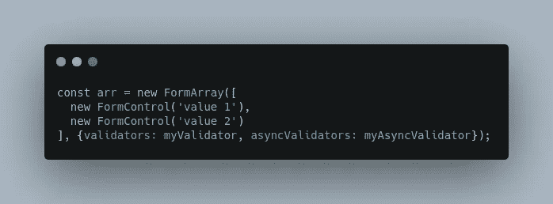
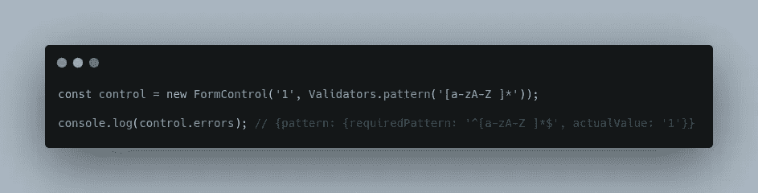

# 角反应形式的高级水平

> 原文：<https://levelup.gitconnected.com/advanced-level-for-angular-reactive-form-6482e19add5c>

## 有角的

## 帮助开发人员预排角反应形式的简单说明

照片由[克雷什尼克·塞卡](https://unsplash.com/@kreshnikceka?utm_source=unsplash&utm_medium=referral&utm_content=creditCopyText)在 [Unsplash](https://unsplash.com/s/photos/coffee?utm_source=unsplash&utm_medium=referral&utm_content=creditCopyText) 拍摄

你有没有想过为什么棱角在形式上如此强大？在本文中，我将带您了解这个主题，以了解与 React 或 Vuejs 相比，Angular 在表单中为什么更好以及如何更好。

内容:

1.  什么是反应形式
2.  三个基本块
3.  表单生成器
4.  验证器
5.  魔力

# 什么是反应形式

Angular 提供了两种处理表单的方法，分别是**模板驱动表单**和**反应式表单**。

模板驱动表单通过使用指令来处理表单，而反应式表单允许 Angular 开发人员在 Angular 模板组件上处理表单。

与模板驱动相比，反应式表单将带来更多好处，例如:

*   代码将是可测试的。
*   将所有表单逻辑放在同一个地方。
*   易于处理多级表单(我将在**魔法**部分强调这一点)。
*   这种方法对反应式编程是友好的。

# 三个基本块

角反应式有 3 个基本构件:

1.  表单控件
2.  表单组
3.  形式阵列

当我们在 Angular 中构建反应式表单时，它们都来自这三个基本块。

*为了使用反应式，从* `*@angular/forms*` *包中导入* `[*ReactiveFormsModule*](https://angular.io/api/forms/ReactiveFormsModule)` *并将其添加到您的 NgModule 的* `*imports*` *数组中。*

## 1.表单控件

**初始化表单控件**

下面是我们如何用 4 种不同的语法在 Angular 中创建表单控件。

首先，我们可以仅用值初始化表单控件。

初始化表单控件

其次，我们可以在禁用键的情况下创建表单控件。

用窗体状态对象初始化控件

第三，我们可以通过使用验证器添加验证规则作为第二个参数

最后，我们有时需要调用后端来做验证。在这种情况下，我们将使用**异步验证器**进行异步验证。

异步验证

**使用更新开启**

为了提高性能，我们可以对一些特殊的输入使用 updateOn，这些输入不需要在每次用户按键时更新。

我们可以用一个特定的事件来更新比如**模糊**或者**提交**。默认值是**改变**。

将 updateOn 用于更新策略

**重置控制**

我们可以使用`reset`函数来改变表单控件的值。

将 formControl 重置为另一个值

FormControl 提供了很多有用的 API。这里可以看[。](https://angular.io/api/forms/FormControl)

## 2.表单组

一个 **FormGroup** 将每个子 **FormControl** 的值聚集到一个对象中，每个控件名作为键。

它通过减少其子节点的状态值来计算其状态。

**创建一个表单组**

创建一个包含两个控件的窗体组

**用组级验证器创建表单组**

我们可以将组级别的验证器作为第二个参数。当我们有多个子控件时，这将帮助我们更容易地处理验证。

用组级验证程序创建表单组

我们可以将异步验证器和验证器一起作为选项对象的一部分使用。

将异步验证器与 formgroup 中的验证器一起使用

**在**上使用更新

该选项类似于表单控件上的**更新。但是，当我们在组级别设置它时，所有子控件都将继承选项值。**

在 FormGroup 上使用 updateOn

如果子节点明确指定了不同的 **updateOn** 值，则不会在组级别使用 **updateOn** 值。

FormGroup 提供了很多有用的 API。你可以在这里阅读。

## 3.形式阵列

FormArray 将每个子 FormControl 的值聚合到一个数组中。

创建一个表单控件数组

**用数组级验证器创建一个表单数组**

用数组级验证器创建一个表单数组

**为表单数组中的所有控件设置 updateOn 属性**

为窗体数组中的所有控件设置 updateOn 属性

FormArray 提供了很多有用的 API。你可以在这里阅读。

# 表单生成器

FormBuilder 提供了语法糖，可以缩短创建 FormControl、FormGroup 和 FormArray 实例的时间。

使用 FormBuilder 创建调查表格

FormBuilder 为我们提供了 3 种方法:

*   **控件**创建表单控件
*   **组** 创建表单组
*   **数组** 创建正式数组

# 验证器

通过使用 validators 类，向表单添加验证非常简单。

## **最小值**

要求控件的值大于或等于提供的数字的验证程序。

至少验证 3 个

## **最大**

要求控件的值小于或等于提供的数字的验证程序。

最多验证 15 个

## **必选**

要求控件具有非空值的验证程序。

验证该字段非空

## **要求正确**

要求控件值为真的验证程序。这个验证器通常用于必需的复选框。

验证字段值是否为真

## **电子邮件**

要求控件值通过电子邮件验证测试的验证程序。

验证该字段是否匹配有效的电子邮件模式

## **最小长度**

要求控件值的长度大于或等于所提供的最小长度的验证程序。

验证该字段至少包含 3 个字符

*注意:如果使用 html 5****minlength****属性，默认情况下也会提供这个验证器。*

## **maxLength**

要求控件值的长度小于或等于所提供的最大长度的验证程序。

验证该字段最多包含 5 个字符

*注意:如果使用 html 5****maxlength****属性，默认情况下也会提供这个验证器。*

## **图案**

要求控件的值匹配正则表达式模式的验证程序。

验证该字段仅包含字母或空格

**nullValidator**

不执行任何操作的验证程序

返回什么也不做的验证器

这表示[空对象模式](https://en.wikipedia.org/wiki/Null_object_pattern)，它防止代码中的空指针/空保护，因为总是有一些验证器，即使它什么也不做。

## **撰写**

将多个验证器组合成一个函数，该函数返回所提供控件的各个错误映射的并集。

使用 compose 添加多个验证规则

但是，我们现在不怎么用这种方法了。这是一条更短的路。

缩短替换验证器中合成函数的方式

# 魔力

如果我们有一个多层次的表单呢？

虽然在 React 或 Vuejs 中创建一个 3 级或 4 级或更多级的表单是非常痛苦的，但在 Angular 中我们可以很容易地做到。

让我们举一个例子，我们需要创建一个具有如下结构的表单:

1.  问题[]
    -问题标题
    -问题点
    -问题类型
    -必问问题
    -问题选项[]
    +选项 1
    +选项 2
    +选项 3
    +选项 4

因此，我们有一个简单的三级表单:

*   第一级:问题清单
*   第二层:问题信息
*   第三层:一个问题中选项列表

在 Angular 中，我们这样创建它:

用 FormBuilder 创建三级角形

我们要如何添加一个新问题？

创建新问题

我们如何移除索引 I 处的问题？

删除索引 I 处的问题

现在，我们想为第 10 个问题添加一个新选项。我们只需要通过问题 10 的索引，这样做:

在问题索引处添加新选项

删除问题 I 中的选项 j。

删除问题 I 中的选项 j

简单吗？

这就是我想在这个故事中分享的魔力。角反应形式的 **get()** 是如此强大，让我们可以处理复杂的多层次形式。

我希望这篇文章对你有用！你可以跟着我上[中型](https://medium.com/@transonhoang?source=post_page---------------------------)。我也在[推特](https://twitter.com/transonhoang)上。欢迎在下面的评论中留下任何问题。我很乐意帮忙！

# 参考

1.  [https://angular.io/guide/reactive-forms](https://angular.io/guide/reactive-forms)

# 分级编码

感谢您成为我们社区的一员！ [**订阅我们的 YouTube 频道**](https://www.youtube.com/channel/UC3v9kBR_ab4UHXXdknz8Fbg?sub_confirmation=1) 或者加入 [**Skilled.dev 编码面试课程**](https://skilled.dev/) 。

 [## 编写面试问题

### 掌握编码面试的过程

技术开发](https://skilled.dev)