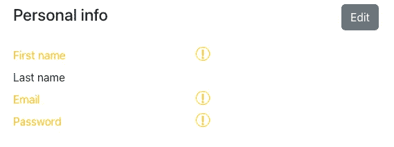

# 带 React 的高级多步表单

> 原文：<https://levelup.gitconnected.com/advanced-multistep-forms-with-react-b1899226c2f4>

在[之前的文章](https://javascript.plainenglish.io/build-a-multistep-form-with-react-hook-form-24f9398dc049)中，我们已经用 React 和 React 钩子创建了一个简单的注册多步表单。该表单适用于简单的注册工作流，用户不需要在步骤之间来回导航。在本帖中，我们将考虑步骤顺序不固定的表单，用户不需要一次提供所有信息。为了使它更简单，我们将建立在上一个教程中的表单示例，尽管这个工作流可能不是注册表单的最佳选择。相反，让我们想象一下，我们有一个结帐表单，用户在其中一步一步地填写信息，并可以将表单保存为草稿状态，以便以后返回。最终结果可以在 [Codesandbox](https://codesandbox.io/s/vigorous-kalam-78hdcy) 上测试。

# 在步骤导航中保存表单数据

在上一篇文章的结尾，我们确定了对表单的一些改进，使其更加灵活。首先，当从一个步骤移动到另一个步骤时，输入的数据没有被保存(用户没有得到任何反馈)。其次，通过点击一个步骤进行导航绕过了表单验证，允许用户提交不完整的表单。

在本帖中，我们将对表单进行一些改进，以解决上述问题:

*   删除每个步骤的字段验证，并在步进器中显示它们的状态。
*   在步长改变时保存输入的表格数据，这样数据不会在导航时丢失(但是，当点击`Previous`按钮时，输入的数据不会保存)。
*   突出显示确认页面中缺少的字段，以便用户可以返回并在需要时填充它们。

我们从移除所有步骤中的验证开始，相反，它将在最后一步中完成。接下来，当用户点击一个步骤时，我们需要提交表单数据。有几种方法可以解决这个问题。我们要做的是像对待`Next`按钮一样对待步骤之间的导航——它会将当前数据保存到共享上下文中。为了实现这一点，我们需要从`Stepper`组件中触发按钮的`onClick`事件。这就是晦涩的 [useImperativeHandle](https://reactjs.org/docs/hooks-reference.html#useimperativehandle) 钩子变得有用的地方。简而言之，这个钩子允许在组件外部调用 ref 目标的方法(例如，从父组件)。

首先，我们将`Button`、`Stepper`和单个步骤组件包装在`forwardRef`中，以便能够将`ref`作为道具接收，例如:

其次，我们将在`Button`内部设置`useImperativeHandle`钩子，暴露按钮的`click`事件。

最后，我们将在应用程序级别创建一个共享的`ref`，以及一个分配给每个链接的`onClick`的`onStepChange`回调。我们可以直接在`Stepper`中定义`onStepChange`，但是我们也需要将它包装在`forwardRef`中，以便能够接受`buttonRef`。

当我们导航到另一个步骤时，表单看起来工作正常，数据被保存。但是，有一个问题——您可能已经注意到，有时当我们想要前进几步时，例如从`Contact`到`Confirm`，表单一次只能导航一步。这是因为我们有两种相互冲突的导航——一种来自步进器的`NavLink`,另一种来自表单的`onSubmit`回调。为了解决这个问题，我们将调整`Form`组件，使它有一个自定义的`onSubmit`回调，并处理到下一步的导航。这样，当从`Form`触发导航时，步进器导航已经在进行中，表单导航被丢弃。

现在我们需要从每一步向表单提供`nextStep`来完成导航。更新后的步骤如下所示:

您会注意到，除了删除字段验证，我们还删除了密码确认字段以简化表单。这个验证现在移到最后一步— `Confirm`。为了简化呈现和验证，我们将要呈现的整个表单数据存储为一个字段对象数组，分成几个部分。

应该注意的是，虽然这看起来比在 JSX 中单独定义所有的部分和项目更干净，但是当需求改变时，例如，如果添加了一些额外的渲染逻辑，这很容易变得难以管理。

items 数组中新增了一个`required`字段，如果缺少任何必填字段，我们将使用它来禁用表单提交，并突出显示哪些字段是必填的。

为了实现前者，我们遍历所有条目，看看是否有任何必填字段为空。

之后我们可以将这个值传递给表单的`Submit`按钮来控制它的`disabled`状态。

通过突出显示字段名称(我们将使用 Boostrap 的警告黄色)并在字段值的位置显示感叹号，可以使必填字段更加明显。

因此，我们会突出显示必填字段:

# 在步进器中显示步进状态

作为最后的视觉接触，我们还可以显示导航中每一步的状态。如果没有访问过该步骤，它将不会有任何样式，否则，对于缺少字段的步骤，我们将显示警告图标，对于没有缺少必填字段的步骤，我们将显示成功图标。

首先，我们将开始跟踪上下文中访问过的步骤。然后，我们可以使用这些数据来显示适当的状态指示器。为了减少代码的混乱，让我们创建一个助手组件来呈现步骤状态。

这里没有什么特别的，我们只是根据布尔属性的值来渲染状态图标。为了跟踪已访问的步骤，我们可以利用 React Router 的钩子，并将当前位置的路径名保存为已访问的步骤。

我们在这里使用`setState`的[函数形式](https://reactjs.org/docs/hooks-reference.html#functional-updates)，以避免将其声明为`useEffect`依赖项之一(由于无限渲染循环，这可能会破坏应用程序)。我们不关心被访问的步骤是否是唯一的，我们可以在添加新步骤之前检查是否已经添加了该步骤，但是这看起来像是一个小的优化。

最后，我们可以将步进状态指示器添加到步进器中。为了更容易渲染，让我们将导航链接的数据收集到一个对象数组中，并在一个循环中渲染它们。

由于`Education`和`About`步骤没有任何必填字段，如果它们已经被访问过，那么它们将具有成功状态。如果需要的话，为这些步骤添加验证或者扩展验证(例如，验证电子邮件或密码)应该很容易。

# 结论

现在，单步状态突出显示正在工作，我们有了一个功能性的多步表单，它可以有广泛的用例。作为未来的改进，我们可以添加一个“另存为草稿”功能，将输入的不完整数据保存到本地存储(或数据库)中，并允许用户稍后返回。

*最初发表于*[*https://claritydev.net*](https://claritydev.net/blog/advanced-multistep-forms-with-react/)*。*