# 高级分析和跟踪 MySQL 查询

> 原文：<https://levelup.gitconnected.com/advanced-profiling-and-tracing-mysql-queries-c0c95dc7db24>

探索处理未优化的 MySQL 查询的各种方法。

很多时候，您希望分析正在执行的查询。这可能是由多种原因造成的。

*   当前的执行是潜在的，我们需要优化。
*   找出未使用的索引，或者确定索引是否可能在查询路径上。
*   来确定查询执行计划。
*   分析服务器上查询所用的时间。

# 慢速查询日志

如果您遇到行为不当或查询速度慢的问题，首先，应该将服务器设置为记录它们。如果不知道哪些查询真正占据了服务器，我们就永远无法优化它们。

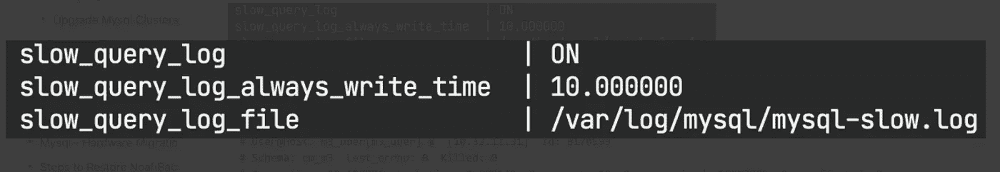

**显示全局变量，如“slow _ query %”**

设置一个特定的时间单位阈值，使日志噪音更小，占用的磁盘更少，*比如，记录超过 10 秒的请求* *(小心您的生产负载)*。一个示例日志查询如下所示。

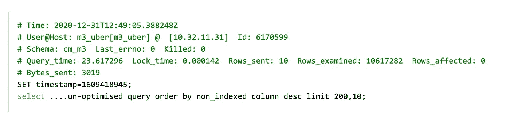

记录了一个慢速查询示例

**跟踪日志能告诉我们很多东西，**

*   哪个进程正在调用慢速查询。
    *有时，恶意客户端会以间接方式阻止资源*
*   花了多长时间？
    *这不是估计值，而是帖子查询执行的真实数字。首先需要隔离非常耗时的查询。*
*   它检查的行数和它返回的行数。
    *如果您正在检查许多行，但返回的很少，则可能需要一个索引。*
*   通过网络发送的字节数。堵塞网络的查询需要从 OLTP 卸载到 OLAP。
*   执行此查询的时间(在查询运行之前记录)。
    *时间线有助于以听觉为目的讨论问题。*

> ***小心*** *:*
> 
> *1)服务器上的慢速查询日志默认不轮换。如果未选中，日志分区可能会阻塞磁盘。请相应地设置阈值。*
> 
> *2)启用慢速查询日志会对性能产生一些影响，因此请确保进行监控。*

# 解释查询

现在我们已经隔离了一些查询，是时候解释它们的存在了。
EXPLAIN 关键字用于提供关于 MySQL 数据库如何执行查询的信息。

与通常的结果集不同，MySQL 随后会显示其语句执行计划，解释在执行语句时哪些进程以什么顺序发生，以及估计的成本。

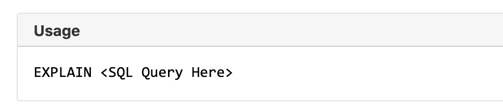

注意:小心使用 EXPLAIN 和 UPDATE 查询。

解释你所有的疑问是下一个最好的选择。您可以通过在 **Extra** 列中查找 **Using index** 来查看 MySQL 是否优化了您的查询以利用覆盖索引优化 的 [*。如果您的查询没有使用 index，您可能需要找出原因。*](https://www.burnison.ca/notes/fun-mysql-fact-of-the-day-got-it-covered)

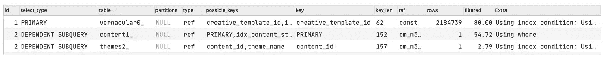

解释查询的输出(修订)

*   对于子查询中的每个查询，尝试查看可以使用的可能键(索引)(**possible _ keys**)。这是 MySQL 告诉你它可以使用这个集合中的任何一个的方式。**请注意 MySQL 一次只能使用一个索引**。*不多，都知道*。您可以创建 10 个索引，但是根据它的启发式规则，它将只使用一个。
*   您也可以强制 MySQL 使用索引，但并不总是推荐这样做。例如，你可能需要在 Hibernate 或其他 ORM 中编写本地查询来实现这一点。不方便。


ORM 和 Force 索引查询不太适用。

*   **键**列定义了实际选择的指数。完全基于 [*MySQL 启发式*](https://dev.mysql.com/doc/refman/5.7/en/optimizer-hints.html) 。我们希望 MySQL 选择一个能够最好地覆盖 where 子句中最大列数的索引。
*   需要注意的一点是，如果您刚刚创建了一个索引，MySQL 查询优化器提示可能不会反映出来，您可能会感到困惑，为什么您刚刚创建的一个更合适的 ***索引没有在 MySQL 解释输出中选择*** 。给它一些时间，启动一些查询，然后观察启发式更新。
*   理解**不相关子查询**和**相关/相关子查询之间的区别。**


不相关:MySQL 根据每个外部查询为内部查询派生一个标量值。 **O(外)**


从属:非标量。MySQL 对 outer_table 中的每一行执行一次内部查询。 **O(外*内)**

*   当您无法利用索引优化排序时，您应该尽量保持您的排序键尽可能小，尤其是小于[**max _ length _ for _ sort _ data**](https://dev.mysql.com/doc/refman/5.7/en/server-system-variables.html#sysvar_max_length_for_sort_data)。
*   如果你看到沉重的 [**文件排序**](https://dev.mysql.com/doc/refman/8.0/en/order-by-optimization.html#order-by-filesort) ，为了排序效率，牺牲一些准确性。*SET SESSION max _ sort _ length = 32*会告诉 MySQL 只比较每个字段的前 32 个*字节，而不是整个字段。*

例如，如果您有一个*ORDER BY campaign . date _ created，* *campaign.name* ，我们可能只想对活动名称的前 *32* 字节进行排序，而不是使用默认的 *1024* 字节。

*   点击阅读更多关于充分利用解释输出[的信息](https://dev.mysql.com/doc/refman/8.0/en/explain-output.html)

# 查询跟踪器

能够阅读解释查询的输出是一回事。然而，为了深入研究，您需要确切地了解 MySQL 将如何组织您的查询，以及这些潜在的索引能够或不能够涵盖哪些内容。

优化器跟踪很冗长，会产生大量输出。你会得到这样的东西

*   表相关性
*   潜在范围索引(重要)
*   如何估计行数和成本
*   它将如何准备连接。
*   它将如何执行连接。

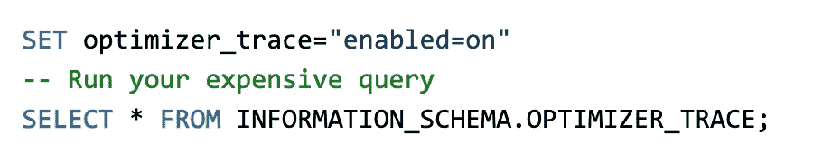

用法:启用查询跟踪。回应相当冗长。

大多数情况下，我们在寻找关键的**潜力 _ 范围 _ 指数**。在这里，您可以看到 MySQL 在这个表上找到的每个索引所覆盖的所有列。

对于潜在的多列索引中的每一列，MySQL 都会评估有用的部分。*(注意，这是指特定的查询，每个不同的查询的结果会有所不同)*

例如，考虑下面的查询

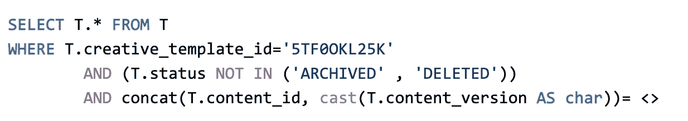

一个带有“3”where 部分的查询，最后一个并不平凡

where 部分中的子句是:

*   **创意 _ 模板 _id**
*   **状态**
*   **concat(内容标识，内容版本)**

如果我们检查 tracer 输出，在所有索引中，MySQL 告诉我们最后一个索引**idx _ vcg _ creative _ template _ status _ id version**将覆盖大多数键。


最后一个可用的覆盖了大多数键，即使根据 MySQL

这有什么帮助？

这是对索引实际上可用**且索引确实如预期覆盖**关键零件**的确认。可以想象，对于非平凡的查询，这可能有助于简化流程，因为只使用一个索引。**

如果这不是最优的，那么查询的性能也会很差。

注意:在上面的例子中，**串联(a，b)！= index(a，b)** 。像[虚拟列](https://confluence.fkinternal.com/display/SKADOOSH/2020-10-22+%7C+DB+Queries+%7C+CM+%7C+Virtual+Column+and+Index+%7C+Content+API+Optimization)这样的东西在这里可以有所帮助。

# 查询计时分析

现在您已经找出了查询中的弱路径，您可能已经处理了一组优化的候选查询。你怎么知道哪个候选人要把它投入生产？

**标准查询分析器**是可用的，它将帮助您对服务器上查询执行的结果进行计时。然而，令人沮丧的是，大多数*开发人员不正确地测量查询执行时间*。

它们包括开始传输的时间和要考虑的其他网络因素。例如，如果您正在使用 GUI 客户端并执行分析，则不能依赖 GUI 状态栏中报告的数字。参考这个。([来源](https://github.com/sequelpro/sequelpro/issues/264))

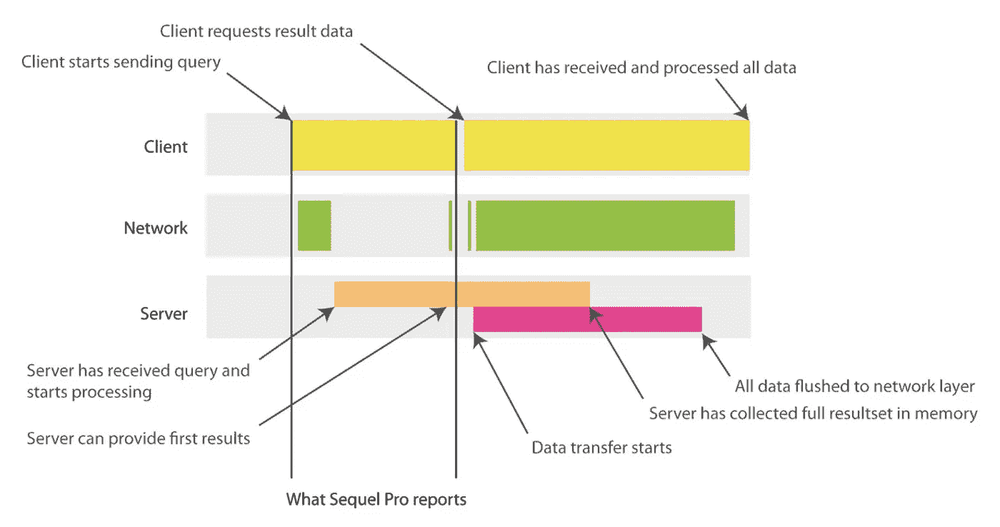

你真正衡量的是什么？

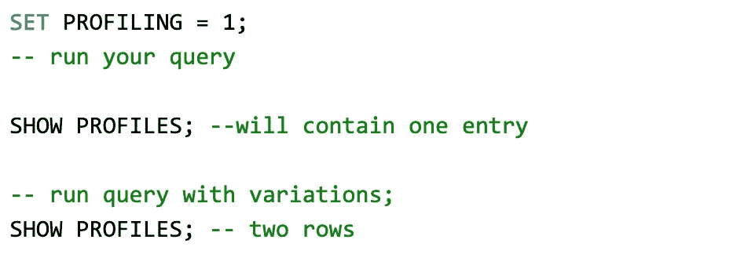

在服务器上启用查询计时分析的步骤(橙色窗口)

让我们对一个名为 *campaign* 的表进行如下查询，该表的主键超过了*300 万行*。然而，唯一的非主索引位于名为 **end_date 的列上。**

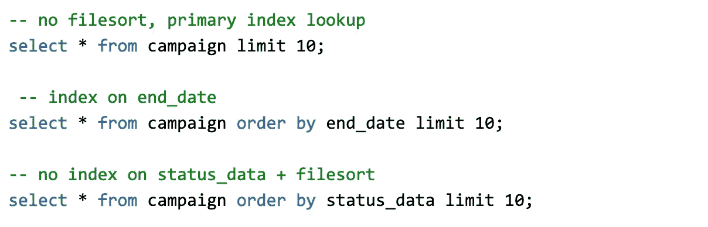

选择 10 行不同的查询模式

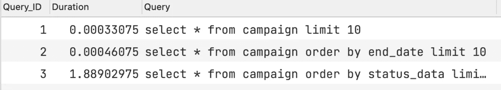

大约 300 万基数集上的查询计时结果

分析器的结果是直观的。您可以看到，在第二次查询中查找索引会稍微慢一点*并导致*轻微的*损失。*

*您还可以看到，没有索引加文件排序导致了巨大的 *5700%* 损失。通过这种方式，您可以很好地估计查询的执行情况。结果将直接转化为生产数据。*

# *JDBC 剖析*

*有时，在极少数情况下，一个查询在被隔离时可能执行得很好，但是在一系列的多个数据库调用中失败得很糟糕*(例如一个 API 向数据库发出 10 个调用)*。*

*在这种情况下，您也可以在 JDBC 驱动程序上启用**剖析**。*

*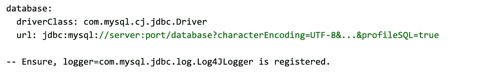*

*将 **profileSQL** 设置为 true 的 MySQL JDBC 驱动程序*

*然后，它将输出您可以用来*

*   *分析发送给驱动程序的每个查询。*
*   *花费的时间*
*   *向驱动程序发出查询的速率。*

*它甚至捕获从 JDBC 池(如 TomCat)发送的健康检查或验证查询。*

*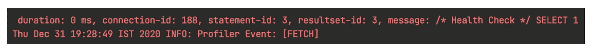*

*已配置的 **HEALTH_CHECK** 从连接池获取对驱动程序的调用。*

*该日志对于检测 ORM 框架中是否有任何正在执行的[周期是至关重要的，例如当实体 A 有一个到多个 B 时，加载 B，B 一对一地加载 A。*这发生在我们的生产设置中，导致一个查询停顿。*](https://stackoverflow.com/questions/16577907/hibernate-onetomany-relationship-causes-infinite-loop-or-empty-entries-in-json)*

***如果你不做分析(我们做了)，你永远不会知道为什么查询会挂起。**然而，如果你做了侧写，你就会知道为什么你一直看到有多个电话打给司机。每个查询可能在孤立情况下表现良好。这种剖析将帮助您捕获代码库中的一个 bug，您将看到 cycle 以及如何使用 [JsonReference](https://stackoverflow.com/questions/37392733/difference-between-jsonignore-and-jsonbackreference-jsonmanagedreference) 来处理这个问题。*

*探索各种方法深入到根本原因是一段相当长的旅程。
总结一下。*

```
*- Log the Query first. How else do we know what to debug 
- EXPLAIN the Query and check the possible indexes, extra clauses
- Trace out query execution to discover deeper structures in joins
- Use MySQL profiles to log (various) query execution at the server
- Use JDBC profiler and note for any cyclic / unnecessary queries.*
```

*如果你能做到这一步，谢谢你的时间。我希望这是有用的。我会在下一集里赶上你们。快乐侧写。*

***参考文献***

*   *阅读[高性能 MySQL](https://learning.oreilly.com/library/view/high-performance-mysql/9781449332471/) 它可能过时了，但内容很扎实*
*   *关于 MySQL 内部的最好的博客之一是由 Richard Burnison 写的*
*   *标准的 MySQL 文档在 dev.mysql.com 非常好*