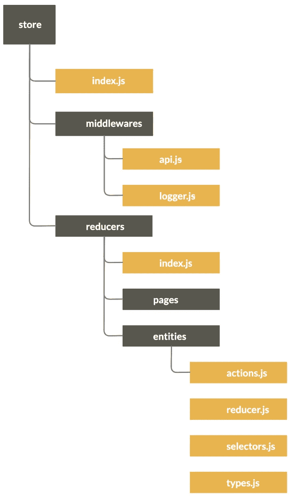
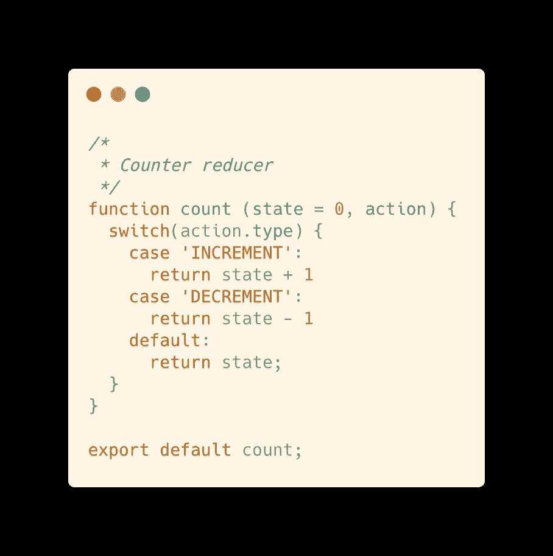
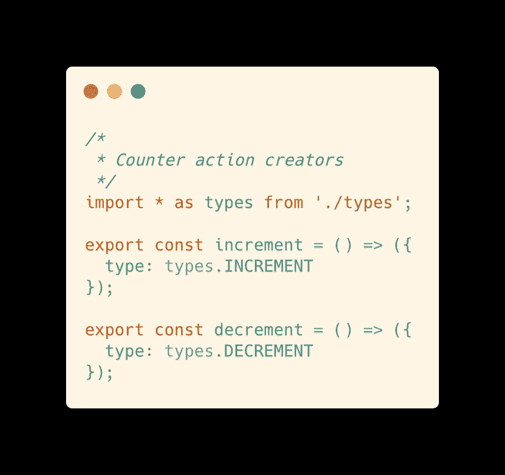
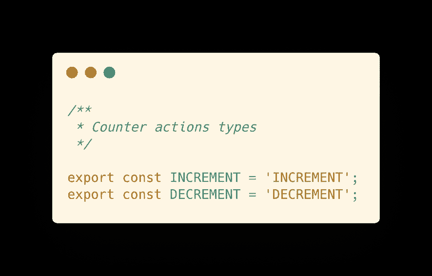
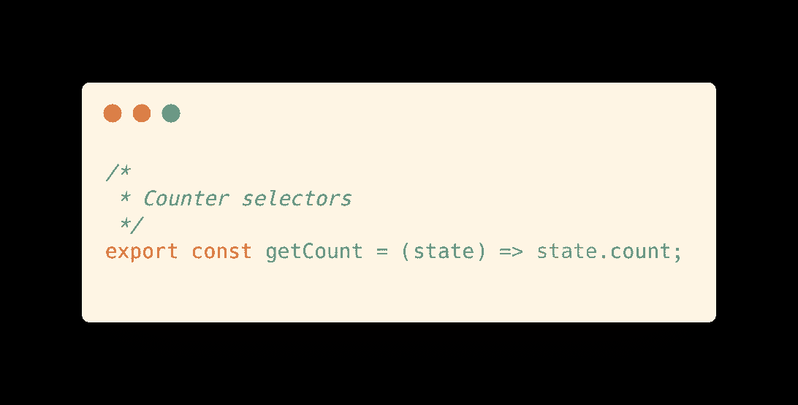
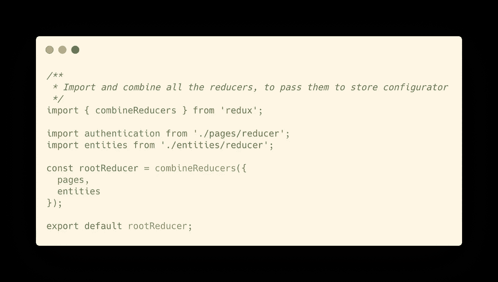
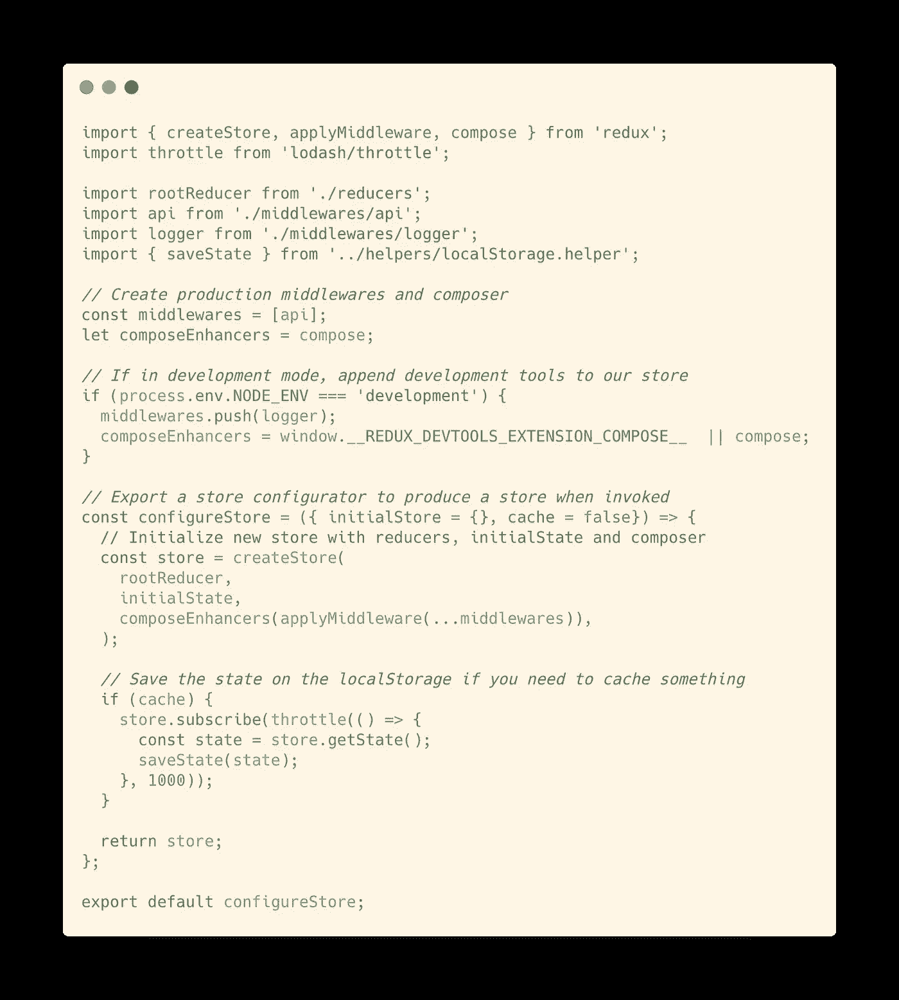

# React 应用程序的 Redux 存储设置

> 原文：<https://levelup.gitconnected.com/advanced-redux-store-setup-for-your-react-application-4b07e13f619e>

## 向 React 应用程序添加 Redux 存储的快速而简洁的配置。

在开发一个 *React 应用*时，我们经常需要在项目中引入一个状态管理器来帮助我们管理所有的状态，并在应用中轻松共享数据。

通常，一个好的候选人是 **Redux** 。**这是一个强大而灵活的选项，可以管理您的全局状态并集中您的大部分数据逻辑。**

> Redux 是 JavaScript 应用程序的可预测状态容器。

但是在你的 React app 上添加 Redux 的时候，你确定你做的对吗？在这里，我们将看到如何按照良好的文件结构和配置设置将其集成到我们的应用程序中。 ***我们开始吧！***

# 1.商店的骨架。

在开始查看代码之前，让我们一起定义我们希望如何组织文件并将其集成到 React 代码库中。

总体思路是创建一个**“store”**目录，其中包含我们所有的逻辑和商店配置，这样我们就可以简单地导入我们的商店设置，并将其传递给我们应用程序中的一个`Provider` 。

1.  创建 ***存储*** 文件夹到 ***MyApp/src*** 中。
2.  创建一个 ***index.js*** 文件来导出我们的商店创建者。另外，添加两个文件夹:**中间件**和**减速器** *。*
3.  在*中间件*文件夹中，为每个 [***Redux 中间件***](https://redux.js.org/advanced/middleware) (如 api、logger)创建一个文件。
4.  在*减速器*文件夹中，创建一个 *index.js* 文件，将所有减速器组合在一起。另外，为每个缩减器添加一个文件夹。
5.  对于每个 reducer 文件夹，创建四个文件:

*   ***【actions . js:***包含与该缩减器相关的动作的动作创建者。
*   ***reducer.js:*** 包含减速器功能。
*   ***选择器. js:*** 包含状态选择器。
*   ***types.js:*** 包含动作的类型定义。

# 2.添加第一个减速器。

由于每个应用程序都是不同的，您可能需要不同的状态，为了简单起见，我将编写众所周知的 [*反例*](https://github.com/reduxjs/redux/tree/master/examples/counter/src) *。*

> 免责声明:对于这个例子，建议的样板文件是过度结构化的，但是随着应用程序的增长，保持这种逻辑的条理性是很重要的。

# 3.结合你的减速器。

如果您的应用程序非常简单，并且您只使用一个 reducer 函数，您可能不需要将它们组合起来，但是如果您定义了多个 reducer 函数，最好使用 Redux 包提供的`**combineReducers**` 函数将它们组合在一起:

index.js 文件放到 reducers 文件夹中

正如你所注意到的，如果我们需要*减速器*文件夹，我们的减速器组合将被导入。

# 4.中间件还是非中间件？

本练习的重点不是中间件的实现，所以我假设你知道它们是如何工作的，以及它们在商店中的角色是什么，但是我保证我也会创建一个关于它们实现的指南🚀

# 5.最后是店铺配置。

现在我们已经准备好了 redux 和中间件，是时候创建我们的 redux store creator 了——这个函数允许我们用一些可选参数创建一个新的 store:

index.js 文件复制到存储文件夹中

概括一下这个文件中发生的事情:

*   我们创建了一个*必备*中间件的列表。
*   如果在开发模式下，我们应用一个额外的配置，比如日志中间件。
*   我们定义(并导出！)一个`**configureStore**` 函数，它创建一个新的存储，并基于作为参数接收的选项，设置一个初始状态，并可选地缓存该状态。

# 摘要

好吧，亲爱的读者，现在你可以从你的商店文件夹中导入一个能够轻松创建你的商店的功能，如果你需要用新的逻辑扩展你的状态，你就有了一个易于遵循和工作的按功能划分的模板！

关于这个话题的评论、分享和讨论总是很受欢迎的，我很乐意回答你的任何问题！

> **随时在 Linkedin 上联系我:**[***https://www.linkedin.com/in/marcoantonioghiani/***](https://www.linkedin.com/in/marcoantonioghiani/)

***这里可以找到我的一些文章:***

 [## 我是如何通过改变习惯快速学习的。

### 9 个有效的习惯可以让你学得更快，提高工作效率。

medium.com](https://medium.com/swlh/how-i-became-a-fast-learner-changing-my-habits-5e8f125ce42f)  [## 如何编写干净的 React 组件

### 使用最佳实践编写高效可读的 React 组件的 5 条规则

hackernoon.com](https://hackernoon.com/how-to-write-clean-react-components-following-best-practices-c952242126ee)  [## 高级 Koa.js 样板文件

### 使用 Create Koa 应用程序组织代码的高级建议。

medium.com](https://medium.com/swlh/advanced-koa-js-boilerplate-bda90c9abe24)