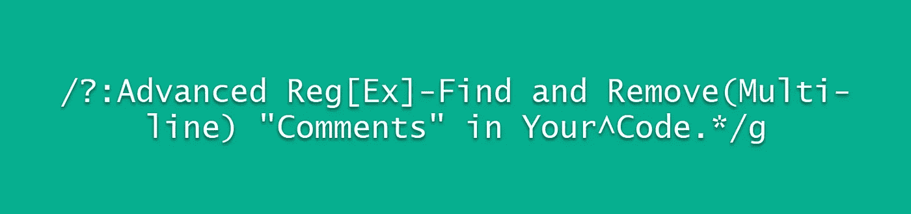

# 高级正则表达式—查找并删除代码中的多行注释

> 原文：<https://levelup.gitconnected.com/advanced-regex-find-and-remove-multi-line-comments-in-your-code-c162ba6e5811>



[Regex](https://www.regular-expressions.info/) ，是*正则表达式*的缩写，在 JavaScript 中进行字符串操作和验证时，它对我来说是一个有用的工具。在这篇文章中，我们将使用 Regex 删除两个预定字符之间的所有内容。

在我们开始之前，您需要了解一些关于 Regex 的事项。

> `[*.replace()*](https://www.w3schools.com/jsref/jsref_replace.asp)`是在字符串中搜索指定值的 JavaScript 函数，或者是*正则表达式*，返回指定值被替换的新字符串。
> 
> 在 replace 中使用一个`*/*`来打开一个搜索，它位于 replace 语句中的 Regex 之前。例如:`*string.replace(/.../g, ' ')*`。
> 
> `*/g*`表示全局替换，意味着它将替换`*/...*`模式的每个实例。你可能会看到的其他字母有`*i*`代表不敏感、`*m*`代表多线、`*s*`代表单线等等。对于这个帖子，我们将只关注`*/g*` *。*

稍后我会讲到其他重要的角色。现在，让我们开始吧。参见下面的字符串。它包含一个多行注释以及注释之外的数据。

```
var str = `
Hello, World.
/*Goodbye, World.*/Hello again, World.
`
```

使用正则表达式，我们如何匹配`/*`和`*/`以及它们里面的内容，而不影响这些字符之外的信息呢？首先，让我们把所有的东西整合到一条线上。这将简化我们的正则表达式模式，原因我将在后面介绍。为此，我们可以编写下面的正则表达式。

```
str.replace(/\n/g, " ")
```

利用`.replace()`函数，这一行将用一个空格替换任何新行(`\n`)实例，将多行合并成一行。上面的表达式将使我们的字符串看起来像这样:

```
" Hello, World. /* Goodbye, World. */ Hello again, World. "
```

太好了！我们把所有的数据都放在一行上，但是我们仍然有那些多行字符。下一个表达式会处理它们。

在我们继续之前，考虑到`/`和`*`都是[特殊字符](https://www.regular-expressions.info/refcharacters.html)。这意味着如果我们试图在表达式中匹配它们，我们不能把它们原样放入，否则我们的表达式将假设它们是操作的一部分，而不是模式中的文字字符。

假设我们有下面的字符串:

```
var aStr = "aabbccaadd"
```

如果我们想用 x 替换所有的 a，我们可以这样写:

```
var aStr2 = strOne.replace(/a/g, "x")
```

这将给我们`"xxbbccxxdd"`。如果我们用`/`来尝试，表达式将会中断。


我们需要使用[转义符](https://stackoverflow.com/questions/3115150/how-to-escape-regular-expression-special-characters-using-javascript)、`\`。这个转义字符将允许我们使用特殊字符作为文字字符。我们可以像这样使用转义符:

```
var slashStr = "//bbcc//dd"var slashStr2 = slashStr.replace(/\//g, "x")slashStr2 will now equal "xxbbccxxdd".
```

我们可以用转义符来标识`/*`。见下文。

```
var newStr = str.replace(/\n/g, " ").replace(/\/\*/g, "bruh")//NOTE: '\/' equals '/', and '\*' equals '*' 
//together they make '/*'console.log(newStr)> " Hello, World. bruh Goodbye, World. */ Hello again, World. "
```

我们已经匹配了`/*`，换成了`bruh`，但是还需要识别`*/`。通常，我们可以使用' alternative '字符(`|`)来匹配多个模式。

```
var newStr = str.replace(/\n/g, " ").replace(/\/\*|\*\//g, "bruh")console.log(newStr)> “ Hello, World. bruh Goodbye, World. bruh Hello again, World. “
```

这是可行的，但是由于我们不仅仅寻找这两种模式，`|`并不适合我们。相反，我们将使用`.`字符。

`.`表示匹配除换行符外的任意字符*。我们已经删除了换行符，所以不需要担心这些！*

```
var newStr = str.replace(/\n/g, " ").replace(/\/\*.\*\//g, "bruh")console.log(newStr)> " Hello, World. /* Goodbye, World. */ Hello again, World. "
```

为什么没用？这是因为虽然`.`是一个特殊字符，但它需要一个[量词](https://docs.microsoft.com/en-us/dotnet/standard/base-types/quantifiers-in-regular-expressions)。`.`可以帮助设置模式匹配的规则，但是量词指定了一个字符、组或字符类必须有多少个实例才能匹配。`.`没有量词会匹配任何字符，但只匹配第一个实例。下面是一个没有量词的工作示例*。*

```
var diffStr = "Hello World, /*G*/oodbye W/*o*/rld, Hello again, World."var newDiffString = diffStr.replace(/\/\*.\*\//g, "bruh")console.log(newDiffString)> "Hello World, bruhoodbye Wbruhrld, Hello again, World."
```

当`/*`和`*/`之间只有一个字符时，我们的`.replace()`函数起作用，因为我们的匹配模式只有一个实例。因为我们需要能够匹配`/*`和`*/`之间的任何一个(或者一个都不匹配)，所以我们最好使用`*`量词。

`*`查找 0 个或更多匹配项，这意味着任何匹配该模式的字符(由于`.`，它是除换行符之外的任何字符)都将匹配。由于我们将这两个字符放在`/*`和`*/`之间，我们的表达式现在将选择`/*`和`*/`以及**除了它们之间的换行符之外的任何字符的所有**实例。这是我们的正则表达式，当`.`和`*`串联使用时。

```
var newStr = str.replace(/\n/g, " ").replace(/\/\*.*\*\//g, "bruh")

console.log(newStr)> " Hello, World. bruh Hello again, World. "
```

如您所见，我们的模式匹配起作用了，我们的`.replace()`函数用`bruh`替换了匹配。为了提高可读性，让我们用一个空格代替多行注释，而不是`bruh`，然后用单个空格代替我们在替换模式时产生的多余空格。

像这样:

```
var newStr = str.replace(/\n/g, " ").replace(/\/\*.*\*\//g, " ")
   .replace(/\s+/g, " ")

console.log(newStr)> " Hello, World. Hello again, World. "
```

我们快到了！还有一件事我们可以做，使这更可读。JavaScript 有一个函数叫做，`.trim()`。

`[.trim()](https://www.geeksforgeeks.org/javascript-string-prototype-trim-function/)`用于删除字符串两端的空格。让我们把它加到替换函数的末尾，来完成我们的字符串。

```
var newStr = str.replace(/\n/g, " ").replace(/\/\*.*\*\//g, " ")
   .replace(/\s+/g, " ").trim()

console.log(newStr)> "Hello, World. Hello again, World."
```

我们的整体解决方案如下所示:

```
var str = `
Hello, World.
/*Goodbye, World.*/Hello again, World.
`var newStr = str.replace(/\n/g, " ").replace(/\/\*.*\*\//g, " ")
   .replace(/\s+/g, " ").trim()

console.log(newStr)> "Hello, World. Hello again, World."
```

# 摘要

这是开发步骤的分解。

1.给定一个多行字符串，用一个空格替换所有换行符(用`\n`表示)，使多行字符串成为单行。这将简化我们的正则表达式。

2.一旦字符串成为一行，执行另一个`.replace()`函数，这一次使用转义字符让我们的正则表达式将特殊字符视为文字字符。

3.在我们的表达式中包含字符`/*`和`*/`，并在它们之间放置`.`字符，以包含除换行符之外的任何字符(我们已经删除了这些字符，因此无需担心)。

4.通过添加`*`来量化`.`。这种组合可以匹配任意数量的任意字符。

5.转义的特殊字符和它们之间任意数量实例的任意字符的组合将允许我们有效地匹配`/*`、`*/`和它们之间的任意字符。我们用空格替换这个字符集合。

6.我们执行另一个`.replace()`功能，这一次删除任何多余的空白，用`\s`表示，并用一个空格替换它。

7.最后，我们使用 JavaScript 的`.trim()`函数来删除字符串两端的尾随空白，返回一个可读的、适当间隔的字符串，其中删除了`/*`、`*/`和它们之间的任何内容。

如果你喜欢这篇文章或者需要澄清任何提到的事情，请在评论中告诉我。不要忘记留下掌声和分享！

# 参考

 [## Regular-Expressions.info - Regex 教程、示例和参考- Regexp 模式

### 在 Regular-Expressions.info 上，你可以找到关于一种强大的搜索模式语言的广泛深入的信息…

www.regular-expressions.info](https://www.regular-expressions.info/) [](https://www.w3schools.com/jsref/jsref_replace.asp) [## JavaScript 字符串替换()方法

### 组织良好，易于理解的网站建设教程，有很多如何使用 HTML，CSS，JavaScript 的例子…

www.w3schools.com](https://www.w3schools.com/jsref/jsref_replace.asp) [](https://stackoverflow.com/questions/3115150/how-to-escape-regular-expression-special-characters-using-javascript) [## 如何使用 javascript 对正则表达式特殊字符进行转义？

### 我需要使用 java 脚本来转义正则表达式中的特殊字符。我怎样才能实现这一点？任何帮助都应该是…

stackoverflow.com](https://stackoverflow.com/questions/3115150/how-to-escape-regular-expression-special-characters-using-javascript) [](https://www.rexegg.com/regex-quickstart.html) [## 正则表达式备忘单

### 正则表达式语法参考。包括显示语法、示例和匹配的表格。

www.rexegg.com](https://www.rexegg.com/regex-quickstart.html)  [## 正则表达式中的量词

### 数量 n 和 m 是整数常数。通常，量词是贪婪的；它们导致正则表达式…

docs.microsoft.com](https://docs.microsoft.com/en-us/dotnet/standard/base-types/quantifiers-in-regular-expressions) [](https://www.geeksforgeeks.org/javascript-string-prototype-trim-function/) [## JavaScript | String trim()-GeeksforGeeks

### 函数的作用是:删除给定字符串两端的空格。的语法

www.geeksforgeeks.org](https://www.geeksforgeeks.org/javascript-string-prototype-trim-function/)