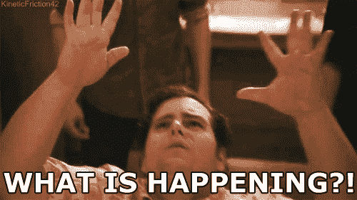

# 高级正则表达式:查找并替换每两个字符实例

> 原文：<https://levelup.gitconnected.com/advanced-regex-find-and-replace-every-second-instance-of-a-character-c7d97a31516a>


我拍的照片。大黄蜂得到蜂蜜，布鲁克林植物园。

我正在做一个个人项目，其中一部分涉及一些实验性的分号插入。虽然这个功能可以应用于任何字符，但我将使用反勾号作为参考点。参见下面的字符串。

```
var str = `HERE IS AMULTILINECOMMENT` 
```

目标是在第二个反勾号后插入一个分号。为什么？因为如果我们在每个反勾号后面加上分号，我们的字符串将会这样结束:

```
`;HERE IS AMULTILINECOMMENT`;
```

这将改变字符串的内容，最终通过在字符串值后添加分号来改变含义。这里是我的字符串‘不一样’；这是我的线。


照片由 Medium 的仪表盘提供。

通过只查找第二个反勾号，我们可以确保分号只放在字符串的末尾，而不是放在每个反勾号之后——包括第一个反勾号。那么，我们如何找到并替换反勾号的每一个**秒**实例呢？

使用正则表达式，我们可以通过写`/`/g`来识别反勾号。这一小段将匹配字符串中的每个反勾号。在您的控制台中尝试下面的代码。

```
var str = "`HERE IS A COMMENT (with back ticks)`"
var newStr = str.replace(/`/g, '`;')
console.log(newStr)> "`;HERE IS A COMMENT (with back ticks)`;"
```

我们使用 JavaScript 的`replace()`函数替换并传递我们的正则表达式作为第一个参数，传递`'`;'`作为第二个参数。这些参数告诉我们的`replace()`函数，它应该找到```的每个实例，然后用反勾号和分号替换它。

既然我们知道了如何查找和替换每一个反勾号，我们就可以改进我们的正则表达式，使之能够每隔一个就查找一次。为此，我[询问了堆栈溢出社区](https://stackoverflow.com/questions/57444177/use-regex-to-find-and-replace-every-second-backtick-in-a-string)。一个小时内，我的问题被 [*第四只鸟*](https://stackoverflow.com/users/5424988/the-fourth-bird) 回答了。


*不是真正的第四只鸟。

他们推荐使用[捕获组](https://javascript.info/regexp-groups)，它将模式的一部分括在括号中。这使我们能够分开比赛的一部分。当使用替换时，捕获组也是有帮助的，但是我们一会儿会讲到。

在您的控制台中尝试下面的正则表达式。

```
let str = "abcabcabcabc"
let matchedArr = str.match(/(abc)+/g)
console.log(matchedArr)> ["abcabcabcabc"]
```

该正则表达式将`+`修饰符应用于“abc ”,因此它将匹配任何后跟一个或多个“abc”实例的“abc”实例。如果没有捕获组，它将只对“c”应用修饰符，匹配“abc”后跟一个或多个“c”实例。有道理吗？



太棒了。让我们继续前进。

我们将使用捕获组来包含我们的否定字符表达式。在我们的否定字符表达式中，我们在括号外有一个反勾。然后我们在克拉后面的括号里有一个反勾号，以及其后的`*`。

```
(`[^`]*)
```

这将查找一个模式，该模式包括一个左反勾号，后跟除反勾号之外的任何字符的 0 个或多个实例。我们就要到了，但是我们还需要一个字符来完成我们的模式:一个结束的反勾号！为什么？我们希望将第一个反勾号之后的任何内容与第二个反勾号分开。

```
(`[^`]*)`
```

这将我们带到替换函数的最后一部分，[替换](https://docs.microsoft.com/en-us/dotnet/standard/base-types/substitutions-in-regular-expressions)。


这种替换用美元符号和数字来标识。因为我们只有一个捕获组，所以我们将使用数字 1。我们替换的目的是匹配与我们的捕获组最近匹配的文本相同的文本。我们将使用它来捕获第一个反勾号之后的内容，然后将其恢复到原始形式。这对我们的事业有什么帮助？嗯，我们可以在替换中添加其他东西，比如，哦，我不知道，也许是一个**反勾和一个分号**？


通过在我们的`$1`后面添加``;`，我们有效地将第一个反勾号之后的所有内容替换为它本身，然后用一个反勾号和一个分号替换第二个反勾号(在捕获组之外)。尝试下面的代码，看看它是如何工作的。

```
let str = "`HERE IS A COMMENT (with back ticks)`"
let final = str.replace(/(`[^`]*)`/g,'$1`;')
console.log(final)> "`HERE IS A COMMENT (with back ticks)`;"
```

# **总结**

我们使用一个**捕获组**隔离第一个反勾号之后的所有内容。捕捉组以一个反勾号开始，后面是**被否定的字符类**。这个求反的字符类查找除了反勾号以外的任何字符。我们在此之后使用一个**星号**来捕获第一个反勾号之后的任意字符的 0 个或多个实例(而不是另一个反勾号)。在捕获组的外部，我们有一个闭合的反勾号，因此它与捕获组匹配的内容是分开的。一个**替换**将允许我们的 replace 函数用它自己替换第一个反勾号和后面的内容。由于我们的模式中的反勾号位于捕获组之外，所以这个反勾号不会被替换为它本身，而是在替换的末尾用附加的反勾号和分号替换。

如果你喜欢这篇文章或者需要澄清任何提到的事情，请在评论中告诉我。请随意分享和留下掌声！

在此 *将您的免费媒体会员升级为付费会员，每月只需 5 美元，您就可以收到来自各种出版物上数千名作家的无限量无广告故事。这是一个附属链接，你的会员资格的一部分帮助我为我创造的内容获得奖励。谢谢大家！*

# 参考

[](https://stackoverflow.com/questions/57444177/use-regex-to-find-and-replace-every-second-backtick-in-a-string) [## 使用 regex 查找并替换字符串中的每一个反勾号

### 感谢贡献一个堆栈溢出的答案！请务必回答问题。提供详细信息并分享…

stackoverflow.com](https://stackoverflow.com/questions/57444177/use-regex-to-find-and-replace-every-second-backtick-in-a-string) [](https://javascript.info/regexp-groups) [## 捕获组

### 模式的一部分可以用括号括起来(...).这被称为“捕获组”。这有两个影响:它…

javascript.info](https://javascript.info/regexp-groups)  [## 字符类或字符集

### 使用“字符类”，也称为“字符集”，您可以告诉正则表达式引擎只匹配几个字符中的一个…

www.regular-expressions.info](https://www.regular-expressions.info/charclass.html#negated)  [## 正则表达式中的替换

### 替换是只能在替换模式中识别的语言元素。他们使用正则表达式…

docs.microsoft.com](https://docs.microsoft.com/en-us/dotnet/standard/base-types/substitutions-in-regular-expressions)