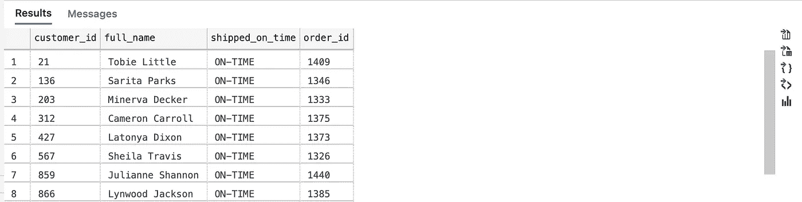
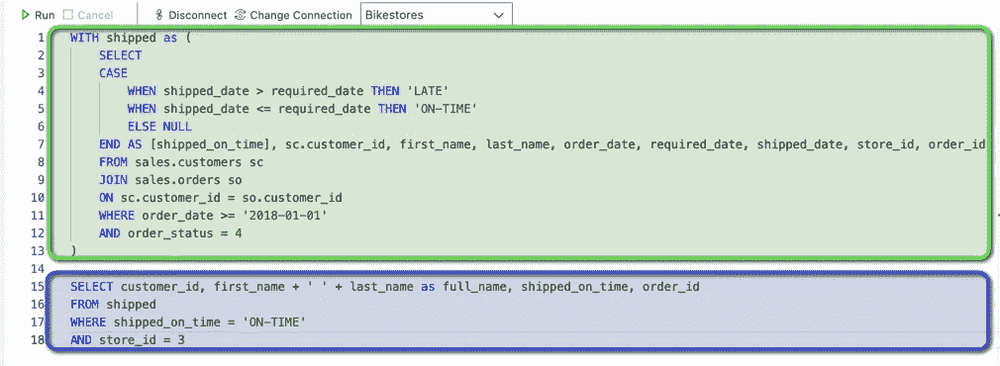

# 高级 SQL — CTEs

> 原文：<https://levelup.gitconnected.com/advanced-sql-ctes-f36d00cbf051>

## 使用 WITH 子句的常用表表达式。


当写出 SQL 查询时，事情很容易失控或过于复杂，以至于可读性大大降低。幸运的是，在 2005 年，cte(公共表表达式)被引入到 SQL Server 中，使我们能够为一组结果指定名称，这些结果可以在其他 CRUD 语句中使用。在这篇博文中，我想简单介绍一下 CTE 语法以及如何使用它。我希望将来能写另一篇博文，更详细地介绍复杂用例。

# 什么是 CTE？

如上所述，CTE(有时称为“WITH 语句”)是一个临时命名的结果集，它不保存在任何位置，只在查询运行时存在于内存中(与存在于临时数据库文件中的临时表不同)。CTE 的结果只存在于特定语句的执行范围内；换句话说，结果只能用于紧跟在定义 CTE 的 WITH 子句之后的 CRUD 语句。cte 是简化和管理复杂查询的一种很好的方式，通过将代码分成几个部分，使代码更容易阅读。

# CTE 语法

我编写了一个简单的 SQL 查询作为示例来展示如何使用 CTE:

基于我从[sqlservertutorial.net](https://www.sqlservertutorial.net/load-sample-database/)获得的样本数据，上面的查询将返回以下结果:



关于 CTE 语法，首先要注意的是，它是在直接位于 CRUD 语句之前的 WITH 子句中定义的，CRUD 语句的结果将在该语句中使用。基本语法如下:

```
WITH CTE-name AS (CTE-definition) 
```

您还可以通过使用逗号分隔定义来定义多个 cte:

```
WITH name AS (definition),
second-name AS (second-definition)
```

为了定义 CTE，只需编写一条 SELECT 语句作为括号文本。该语句应该捕获您希望在另一个查询中使用的任何数据。一旦定义了 CTE，就可以在最终查询中引用它了:

```
WITH ***name*** AS (definition)SELECT * FROM ***name***
```

让我们再看一下上面的示例查询:



以绿色突出显示的部分是定义 CTE 的 WITH 子句，以蓝色突出显示的部分是查询 CTE 的 SELECT 语句。这是一个很好的设置，因为 CTE 可以为我们处理大部分困难的工作，我们可以根据我们需要的数据编辑最终的查询。

# 常见使用案例

CTE 是一个非常有用和灵活的工具，可以添加到您的 SQL 清单中。以下是一些最常见的使用案例:

1.  cte 通常用于提高查询的可读性和可管理性。通过定义多个 cte，您可以将一个长而复杂的查询分解成可以在最终查询中引用的逻辑块。如果在多个子查询中引用相同的数据，它们也是遵循 DRY 原则的好方法。
2.  cte 可用于创建递归查询，这很有帮助，因为普通的 SELECT 语句不能引用自身。参见微软关于使用 cte 进行递归查询的[文档](https://docs.microsoft.com/en-us/previous-versions/sql/sql-server-2008-r2/ms186243(v=sql.105)?redirectedfrom=MSDN),了解更多信息。

# TL；速度三角形定位法(dead reckoning)

1.  CTE 仅存在于后续语句的执行范围内。
2.  与临时表不同，cte 不会保存在任何地方。
3.  CTE 是通过在 WITH 子句后的括号中编写 SELECT 语句来定义的。
4.  可以像查询中 FROM 子句后面的任何其他表一样引用 CTE。
5.  CTE 是干燥代码、增加可读性和可管理性以及编写递归查询的好方法。