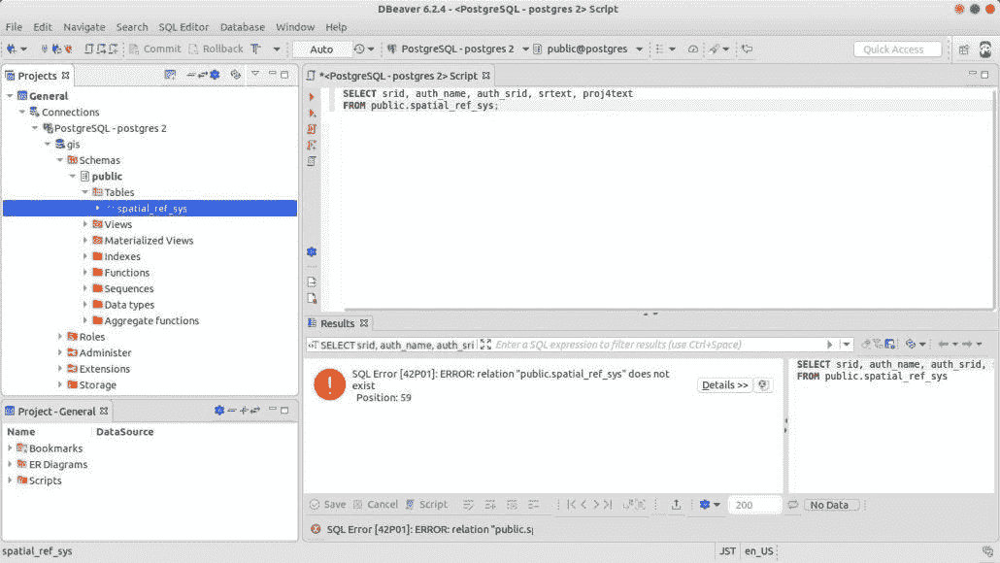

# 面向数据专业人员的高级 SQL

> 原文：<https://levelup.gitconnected.com/advanced-sql-for-data-professionals-e0ef0740e8e1>

> 如何超越选择、位置、分组查询？如何解决 FAANG 面试中问到的 SQL 问题？

*我们都经历过…* 作为数据专业人士，你需要学习高级 SQL。最大的问题是——没有好的资源来找到所有好的问题。

这个博客收集了我希望在 SQL 入门指南中看到的内容。

在经历了所有这些之后，你将能够解决大约 95%的可能被问到的 SQL 问题。

# 这是一个逐步的过程:

**第一步**:在你的系统上安装 MySQL 客户端。我推荐用 ubuntu(或者 linux)来做同样的事情。设置一个客户端使得随时练习变得非常容易，并且给你设置数据库的信心。

**第二步**:安装 DBeaver。对于任何使用 SQL 的人来说，这都是一个很棒的软件。

***你应该知道的一些概念:***

*   **CTEs** :帮助在查询中创建临时表，并在以后使用它们(通用表表达式)
*   **子查询**
*   **SQL 中的变量**
*   使用 **CASE WHEN** ，IF 语句，子串和日期函数。
*   **窗口功能**
*   使用连接来解决非平凡的问题。

# **第三步** : *黑客排名(3-4 小时)* —

解决成功率较高的简单到中等的问题。如果你在这一点上不能解决 ***所有*** 的问题，不要自责——你还在热身。*解决 30-40%的问题。*

使用“讨论”选项卡来学习和查看备选解决方案方法—您仍是一名学习者。

# 步骤 4:按顺序完成这个列表:

> **学习解决几乎所有 SQL 问题的常用方法:**

1.  [更新累计金额](https://github.com/NIteshx2/AdvancedSQL_Interview/blob/master/Interview/02_Spotify_Listening_History/README.md)
2.  [月活跃用户](https://github.com/NIteshx2/AdvancedSQL_Interview/blob/master/Interview/03_Monthly_Active_User/README.md)
3.  [枢纽数值数据](https://github.com/NIteshx2/AdvancedSQL_Interview/blob/master/Interview/05_Pivoting_Numeric_Data/README.md)
4.  [透视文本数据](https://github.com/NIteshx2/AdvancedSQL_Interview/blob/master/Interview/06_Pivoting_Text_Data/README.md)
5.  [取消数据透视表](https://github.com/NIteshx2/AdvancedSQL_Interview/blob/master/Interview/07_Unpivoting_Tables/README.md)
6.  [按箱子分组](https://github.com/NIteshx2/AdvancedSQL_Interview/blob/master/Interview/08_Group_by_Bins/README.md)
7.  [推荐好友](https://github.com/NIteshx2/AdvancedSQL_Interview/blob/master/Interview/10_Spotify_Recommend_Friend/README.md)
8.  [连续活跃用户](https://github.com/NIteshx2/AdvancedSQL_Interview/blob/master/Interview/09_Consecutive_Active_Users/README.md)
9.  [Spotify 相似好友](https://github.com/NIteshx2/AdvancedSQL_Interview/blob/master/Interview/11_Spotify_Similar_Friends/README.md)
10.  [文本确认](https://github.com/NIteshx2/AdvancedSQL_Interview/blob/master/Interview/13_Text_Confirmation/README.md)
11.  [无效搜索](https://github.com/NIteshx2/AdvancedSQL_Interview/blob/master/Interview/12_Invalid_Search/README.md)
12.  [FB 共同好友](https://github.com/NIteshx2/AdvancedSQL_Interview/blob/master/Interview/14_Facebook_Common_Friend/README.md)
13.  [FB 推荐好友](https://github.com/NIteshx2/AdvancedSQL_Interview/blob/master/Interview/15_Facebook_Recommend_Friend/README.md)
14.  [Instagram 普通关注者](https://github.com/NIteshx2/AdvancedSQL_Interview/blob/master/Interview/16_Instagram_Common_Follower/README.md)
15.  [FB 广告商状态](https://github.com/NIteshx2/AdvancedSQL_Interview/blob/master/Interview/01_Facebook_Advertiser_Status/README.md)。

> **知道 SQL 问题派上用场的特殊窍门:**

1.  [有用的子查询](https://github.com/NIteshx2/AdvancedSQL_Interview/tree/master/Hacks/06_Hacking_Aggregation)
2.  [多列分区](https://github.com/NIteshx2/AdvancedSQL_Interview/blob/master/Hacks/07_Multi_Column_Partition)
3.  [动态查询(Python)](https://github.com/NIteshx2/AdvancedSQL_Interview/blob/master/Hacks/04_Dynamic_Query)

> **建议练习题 *:***

1.  [行程和用户](https://leetcode.com/problems/trips-and-users/)
2.  [部门前三名薪资](https://leetcode.com/problems/department-top-three-salaries)
3.  [员工累计工资](https://leetcode.com/problems/find-cumulative-salary-of-an-employee/)
4.  [人流量](https://github.com/NIteshx2/AdvancedSQL_Interview/blob/master/LeetCode/601_Human_Traffic_of_Stadium/README.md)
5.  [平均工资](https://leetcode.com/problems/average-salary-departments-vs-company/)
6.  [学生报告](https://leetcode.com/problems/students-report-by-geography/)

> **我也建议你在** [**查询优化**](https://docs.google.com/document/d/1k5bzlranLiIaiNxz9AOFrzsZEQhDpVdRszRQAOj0HGg/edit?usp=sharing) **上阅读这个文档。**

***第五步:*** 继续 HackerEarth 上剩余的 SQL 问题。确保再次重温已完成的。

> **就是这样！！您已经涵盖了您需要的 90%的高级 SQL 内容。现在带着自信去面试吧。**

在[***LinkedIN***](http://linkedin.com/in/niteshx2)上关注我，保持联系。我定期分享数据专业相关的职位，你可能会发现有用的。如果你觉得有用，也可以看看我的其他帖子。

