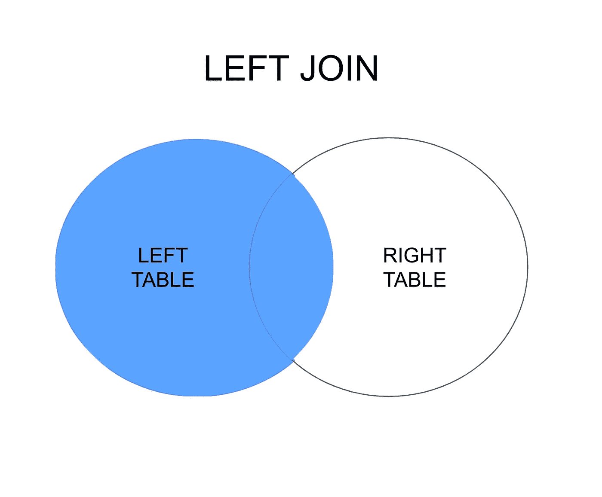
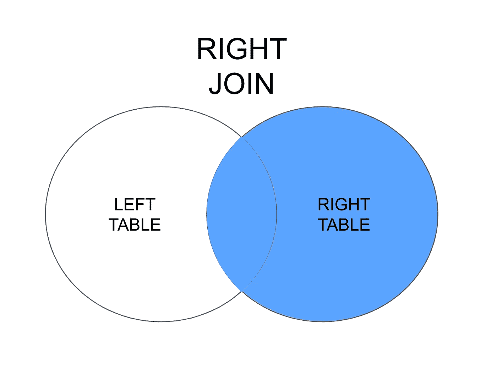

# 用于数据分析的高级 SQL 查询

> 原文：<https://levelup.gitconnected.com/advanced-sql-queries-for-data-analysis-61949a336780>

更高级的 SQL 查询来收集和过滤数据


[Peter Kleinau](https://unsplash.com/@nepumuk?utm_source=medium&utm_medium=referral) 在 [Unsplash](https://unsplash.com?utm_source=medium&utm_medium=referral) 上拍摄的照片

SQL 是一种强大的数据查询和数据过滤语言。在本文中，我们将深入探讨 SQL 中更复杂的查询。对于基本的查询，你可以阅读我的文章[](/common-sql-functions-for-data-scientist-dbf1359f885e)**。**

**我使用我们为关于基本查询的文章创建的样本数据，并做了一些小的修改。**

**代码如下:**

```
create table sport_types (
    id int,
    name varchar(100),
    location varchar(100),
    primary key (id)
);create table students (
    id int,
    sport_id int,  
    first_name varchar(40),
    last_name varchar(50),
    gender   varchar(2),
    age int,
    grade int,
    primary key (id)
);
```

**我创建了两个表，`sports_type`和`students`表。`Students`表中的`sport_id`是一个引用`sports_type`表的整数。我们将在后面详细阐述这一点。**

```
insert into sport_types values (1, 'Track and Field','Field');
insert into sport_types values (2, 'Soccer','Field');
insert into sport_types values (3, 'Gymnastics','Gymnasium');
insert into sport_types values (4, 'Fencing','Gymnasium');
insert into sport_types values (5, 'Swimming','Pool');
insert into sport_types values (6, 'Pole Vaulting','Field');
insert into sport_types values (7, 'Rugby','Field');
insert into sport_types values (8, 'Diving','Pool');
insert into sport_types values (9, 'Hockey','Gymnasium');
insert into sport_types values (10, 'Frisbee','Field');
insert into sport_types values (11, 'Water Polo','Pool');
insert into sport_types values (12, 'Tennis','Court');
insert into sport_types values (13, 'Basketball','Court');
insert into sport_types values (14, 'Boxing','Gymnasium');
insert into sport_types values (15, 'Volleyball','Court');insert into students values (1, 9, 'James', 'Logan', 'M', 17, 84);
insert into students values (2, 5, 'Jack', 'Gilmore', 'M', 16, 92);
insert into students values (3, 5, 'Megan', 'Vansel', 'F', 16, 75);
insert into students values (4, 3, 'Shawn', 'Cattermole', 'M', 18, 60);
insert into students values (5, 15, 'Nicole', 'Lee', 'F', 18, 93);
insert into students values (6, 13, 'Maria', 'Hill', 'F', 17, 82);
insert into students values (7, 3, 'Wes', 'Owen', 'M', 18, 73);
insert into students values (8, 11, 'Evan', 'Parker', 'M', 17, 80);
insert into students values (9, 12, 'Archie', 'Dale', 'M', 18, 52);
insert into students values (10, 2, 'Jack', 'Blaine', 'M', 17, 77);
insert into students values (11, 4, 'Hannah', 'Kidd', 'F', 19, 91);
insert into students values (12, 8, 'Ivan', 'Rice', 'M', 16, 82);
insert into students values (13, 6, 'Vanessa', 'Tsu', 'F', 18, 71);
insert into students values (14, 1, 'Christopher', 'Beck', 'M', 18, 83);
insert into students values (15, 10, 'Clay', 'Powers', 'M', 17, 90);
insert into students values (16, 11, 'Owen', 'Parker', 'M', 19, 80);
insert into students values (17, 4, 'Jill', 'Powell', 'F', 18, 62);
insert into students values (18, 14, 'Tina', 'Mane', 'F', 19, 77);
insert into students values (19, 5, 'Michael', 'James', 'M', 19, 95);
insert into students values (20, 8, 'Jane', 'Bale', 'F', 17, 91);
insert into students values (21, 1, 'Tommy', 'Jones', 'M', 19, 86);
insert into students values (22, 7, 'Matthew', 'Frommers', 'M', 16, 57);
insert into students values (23, 10, 'Jeffery', 'Walsh', 'M', 18, 86);
insert into students values (24, 9, 'John', 'Lee', 'M', 19, 64);
```

*   ****别名****

**别名是可以在表的列或表本身中引用的名称。这也说明了更好的可读性。您可以使用`as`引用别名，或者添加一个空格并创建一个变量。让我们看一些例子。**

```
SELECT age, ROUND(avg(grade), 2)
FROM students
GROUP BY age
```

**该查询将计算按学生年龄分组的平均成绩。通过运行这个命令，您可以看到列名是`age`和`round`。对于平均值来说,`round`不是一个很好的列名，当查询变得更加复杂时，这可能会令人困惑。为了避免这个问题，我们可以为`avg`列设置一个别名，以便它更恰当地表示值。**

```
SELECT age, ROUND(avg(grade), 2) as average
FROM students
GROUP BY age
```

**通过这样做，您将列名设置为 average，用`average`替换`round`，这更合适地表示列。**

**别名也可以帮助表命名。这将有助于在引用列时表示表。**

```
SELECT s1.age, s1.grade
FROM students s1
```

**在这里，您可以看到我们使用`students`和`s1`之间的空格将 s1 设置为别名。students 表已经被设置为变量 s1，我们现在可以使用`s1.<column name> -> s1.age, s1.grade etc.`引用该列，表中的别名可能不是很有用，但是当我们得到更复杂的查询时，您会看到别名将有助于区分表。**

*   ****像符****

**LIKE 操作符通常用在 WHERE 子句中，它将在查询中用通配符匹配给定列中给定的模式。**

**通配符包括:`%`和`_`**

**`%`代表该列中的任意字符。**

**以下是一些例子:**

*   **使用`%`结束**

```
SELECT first_name, last_name, age, grade
FROM students
WHERE first_name like 'M%'
```

**该查询将从 students 表中选择名字**以字母‘M’开头的所有行。****

```
| first_name   | last_name   | age     | grade   |
|------------- | ----------- | ------- | ------- |
| **M**egan        |  Vansel     | 16      | 75      |
| **M**aria        |  Hill       | 17      | 82      |
| **M**ichael      |  James      | 19      | 95      |
| **M**atthew      |  Frommers   | 16      | 57      | 
```

*   **开始时使用`%`**

```
SELECT first_name, last_name, age, grade
FROM students
WHERE first_name like '%an'
```

**该查询将从 students 表中选择名字**以字符串‘an’结尾的所有行。****

```
| first_name   | last_name   | age     | grade   |
|------------- | ----------- | ------- | ------- |
| Meg**an**        |  Vansel     | 16      | 75      |
| Ev**an**         |  Parker     | 17      | 80      |
| Iv**an**         |  Rice       | 16      | 82      |
```

*   **使用中间的`%`**

```
SELECT first_name, last_name, age, grade
FROM students
WHERE last_name LIKE 'J%s'
```

**该查询将从学生表中选择姓氏**以‘J’开始**和**以‘s’结束**的所有行。**

```
| first_name   | last_name   | age     | grade   |
|------------- | ----------- | ------- | ------- |
| Michael      |  **J**ame**s**      | 19      | 95      |
| Tommy        |  **J**one**s**      | 19      | 86      |
```

**`_`代表单个字符。它通常在查询中与`%`字符一起使用。**

```
SELECT first_name, last_name, age, grade
FROM students
WHERE first_name LIKE '_e%'
```

**该查询将选择 students 表中第二个字符是“e”的所有行**

```
| first_name   | last_name   | age     | grade   |
|------------- | ----------- | ------- | ------- |
| M**e**gan        |  Vansel     | 16      | 75      |
| W**e**s          |  Owen       | 18      | 73      |
| J**e**ffery      |  Walsh      | 18      | 86      |
```

**其他一些问题:**

```
SELECT first_name, last_name, age, grade
FROM students
WHERE first_name LIKE '__l%'
```

**查询表示学生表中名字的第三个字母为“l”的所有行。**

****

**照片由 [Cytonn 摄影](https://unsplash.com/@cytonn_photography?utm_source=medium&utm_medium=referral)在 [Unsplash](https://unsplash.com?utm_source=medium&utm_medium=referral) 上拍摄**

*   ****加入查询****

**让我们创建另一个名为 Products 的表。这是一张学生将购买产品的桌子。**

```
create table products (
    id int,
    name varchar(100),
    student_id int,
    primary key (id)
);insert into products values (1, 'LEGO', 2);
insert into products values (2, 'LEGO', 5);
insert into products values (3, 'Toy Train', 5);
insert into products values (4, 'Toy Train', 8);
insert into products values (5, 'Shirt', 10);
```

**当我们必须从第二个表中查询一列时，就要使用连接查询。通常，第一个表中的一个键等同于第二个表中的一个键。它可以是 ID 或字符串的形式。**

*   **内部连接**

****

**内部联接是联接一个或多个表，只要两个表匹配就选择行。它就像一个互联系统。**

```
SELECT s.first_name, s.last_name, st.name as sport
FROM students s
INNER JOIN sport_types st
on s.sport_id = st.id
where s.age = 17
```

**在这个 select 语句中，我们将 students 表与 sports _ id(sport _ types 中的 id 和 students 中的 sport_id)上的 sport 表连接起来，并按学生年龄(17 岁)进行筛选。请注意，我使用了**别名**函数，其中我将 students 表引用为 s，将 sport_types 表引用为 st。**

```
FROM students s
INNER JOIN sport_types st
on s.sport_id = st.id
```

**我将学生表与学生的 sport_id 列上的 sport_types 表和 sport_types 的 id 连接起来。如果它们具有相同的值，SQL 将返回这些行。**

**结果:**

```
| first_name   | last_name   | sport        | 
|------------- | ----------- | ------------ |
| Jack         |  Blaine     | Soccer       |
| Jane         |  Bale       | Diving       |
| James        |  Logan      | Hockey       |
| Clay         |  Powers     | Frisbee      |
| Evan         |  Parker     | Water Polo   |
| Maria        |  Hill       | Basketball   |
```

*   **左连接**

****

**左连接选择左表中的所有记录以及与右表匹配的记录。**

```
SELECT s.first_name, s.last_name, p.name
From students s
LEFT JOIN products p
on p.student_id = s.id
```

**无论`p.name`是否存在，该查询都将返回左表(学生)的所有记录。请注意，在字段`p.name`中，如果没有记录，则为空。**

*   **右连接**

****

**右连接选择右表中的所有记录以及与左表匹配的记录。**

*   **完全外部连接**

****

**完全外部联接选择左表和右表的所有记录。**

****

**照片由[凯尔·格伦](https://unsplash.com/@kylejglenn?utm_source=medium&utm_medium=referral)在 [Unsplash](https://unsplash.com?utm_source=medium&utm_medium=referral) 拍摄**

****案例陈述****

**CASE 语句通过一个条件。如果满足条件，它将返回指定的结果，并继续下一个查询。它具有 IF-ELSE 语句的特征。**

**让我们看一个例子。**

**查询:根据每个学生的成绩，返回一个字母成绩。**

*   **a ':等级> 90**
*   **“b”:分数在 81 到 90 分之间**
*   **c ':等级在 71 到 80 之间**
*   **d ':等级在 61 到 70 之间**
*   **f ':60 级及以下**

```
SELECT  first_name, last_name, grade,
  (CASE 
   WHEN grade > 90 THEN 'A'
   WHEN grade > 80 AND grade <= 90 THEN 'B'
   WHEN grade > 70 AND grade <= 80 THEN 'C'
   WHEN grade > 60 AND grade <= 70 THEN 'D'
   ELSE 'F'
  END) letter_grade
FROM students
```

**该查询将分配一个新的 letter_grade 列，并根据 grades 列中的值将值设置为“A”、“B”、“C”、“D”或“F”。**

**运行查询并亲自查看！**

**看看这个查询:**

```
SELECT  (CASE 
   WHEN grade > 90 THEN 'A'
   WHEN grade > 80 AND grade <= 90 THEN 'B'
   WHEN grade > 70 AND grade <= 80 THEN 'C'
   WHEN grade > 60 AND grade <= 70 THEN 'D'
   ELSE 'F'
  END) score,
  count(1)
FROM students
GROUP BY 1
ORDER BY 1
```

**您认为这个查询有什么作用？**

**如果您能算出这个查询返回按字母顺序排序的每个类别的字母等级总数，那么您就对了。**

**以下是解释:**

*   **我们选择等级，并根据案例陈述将它们分为字母等级**
*   **`count(1)`在本例中是 counting case 语句，因为它是查询中的第一条 select 语句。因为 count 是一个聚合函数，所以我们需要一个 group by 方法。在这种情况下，`GROUP BY 1`会将字母等级组合在一起并进行计数。**
*   **ORDER BY 将根据字母等级对它们进行排序。**

****子查询****

**子查询是查询中的一个查询。它用于返回在主查询中使用的数据。**

**练习:执行一个查询，返回每组得分最高的学生。在这个查询中，您必须返回学生的名和姓、分数和年龄组。如果同一年龄组有多个最高分，则返回所有记录。**

**解决方案:**

```
SELECT st.first_name, st.last_name, max_age.grade, max_age.age
FROM
(SELECT s.age age, MAX(s.grade) grade
From students s
GROUP BY s.age
ORDER BY s.age DESC) max_age
INNER JOIN students st
ON max_age.grade = st.grade
ORDER BY 4 DESC
```

**这个查询看起来很复杂，包含一个查询中的一个查询。让我们来分解一下:**

**我们将首先研究子查询。**

```
SELECT s.age age, MAX(s.grade) grade
From students s
GROUP BY s.age
ORDER BY s.age DESC
```

**这是我们理解的正常查询。这里我们选择学生表的年龄和最高年级，设置为别名 s，根据年龄对他们进行分组，并按降序排序。**

```
(SELECT s.age age, MAX(s.grade) grade
From students s
GROUP BY s.age
ORDER BY s.age DESC) max_age
```

**这个查询将建立一个临时表，并建立一个名为 max_age 的别名。**

```
max_age | age   | grade    |
|------ | -------- |
| 19    | 95       |
| 18    | 93       |
| 17    | 91       |
| 16    | 92       |
```

**查看整个查询:**

```
SELECT st.first_name, st.last_name, max_age.grade, max_age.age
FROM
(SELECT s.age age, MAX(s.grade) grade
From students s
GROUP BY s.age
ORDER BY s.age DESC) max_age
INNER JOIN students st
ON max_age.grade = st.grade
ORDER BY 4 DESC
```

**创建了临时表后，我们可以开始查询基于该表的结果。它看起来会像这样**

```
SELECT st.first_name, st.last_name, max_age.grade, max_age.age
FROM max_age
INNER JOIN students st
ON max_age.grade = st.grade
ORDER BY 4 DESC
```

**max_age 是创建的临时表。现在，我们可以根据我们所知道的进行正常的查询。查询中的第一行是从表 students 表的别名)中选择 first_name，last_name，并从子查询创建的表 max_age 中选择年级和年龄。我们使用内部连接来连接表，键是 grade 列。然后，我们根据选择查询中的第 4 列(恰好是 max_age.age 列)对记录进行降序排序。您可以按编号对列进行排序或分组，而不是写出整列。因此**

```
ORDER BY 1
```

**将根据选择查询中的第一列(即`st.first_name`)对记录进行排序，依此类推。**

**下面是对更高级的 SQL 命令的介绍。希望这有所帮助！**