# 带有示例的高级类型脚本类型

> 原文：<https://levelup.gitconnected.com/advanced-typescript-types-with-examples-1d144e4eda9e>

## 提高您对 TypeScript 的理解，并学习这些高级技术来帮助您掌握这种语言并通过 React 使用 TypeScript


不同种类的水果:)照片由[卢克·迈克尔](https://unsplash.com/photos/1cWZgnBhZRs?utm_source=unsplash&utm_medium=referral&utm_content=creditCopyText)在 [Unsplash](https://unsplash.com/?utm_source=unsplash&utm_medium=referral&utm_content=creditCopyText) 上拍摄

当我去年冬天开始使用 TypeScript 时，我已经从默认使用`any`来处理所有比`string`或`number`更复杂的类型，到现在对高级内置类型和自定义类型的使用感到很舒服。通过切换到 TypeScript 向 JavaScript 代码添加类型，以编写密封的应用程序。本文将提供使用高级类型的例子，以及如何在 React 应用程序中使用它们。

我们将讨论`Record`*`Partial`*`Required`*`Pick`和一个自定义的`Omit`类型。***

***[](https://skilled.dev) [## 编写面试问题

### 一个完整的平台，在这里我会教你找到下一份工作所需的一切，以及…

技术开发](https://skilled.dev) 

# 记录

Typescript 2.1 引入的一个非常有用的内置类型[是`Record`:它允许你创建一个类型化的`map`，对于创建复合接口非常有用。要将变量类型化为`Record`，您必须将一个字符串作为一个键，并为其相应的值传递一些类型。最简单的情况是当您有一个`string`作为值时:](https://github.com/Microsoft/TypeScript/wiki/What's-new-in-TypeScript#typescript-21)

```
const SERVICES: Record<string, string> = { 
    doorToDoor: "delivery at door",
    airDelivery: "flying in",
    specialDelivery: "special delivery",
    inStore: "in-store pickup",
};
```

这可能看起来微不足道，但它为您的日常代码输入提供了便利。`Record`运行良好的一个流行的例子是一个业务实体的接口，它作为键-值对保存在字典中。这个模型可以表示联系人、事件、用户数据、交通请求、电影票等等的集合。在下面的示例中，我们为用户可以添加到购物车中的产品创建了一个模型:

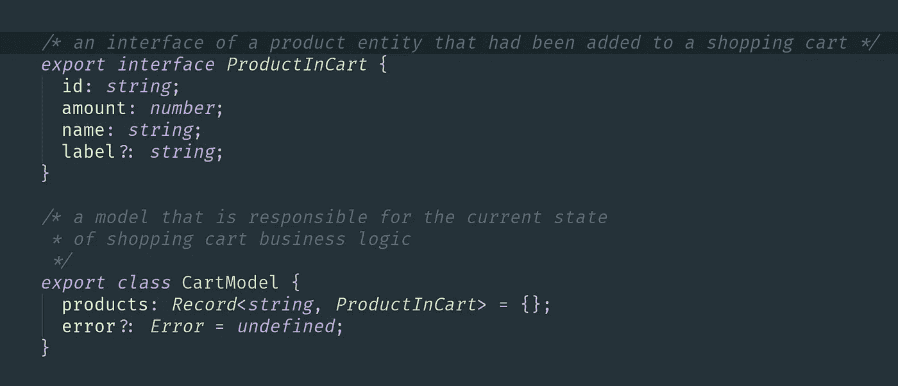

类型记录用于用户购物车中的产品字典。

您将看到编辑器自动完成功能如何帮助我们定义一个类型化的对象，并将变量标记为一个错误，因为没有定义所有必需的属性:

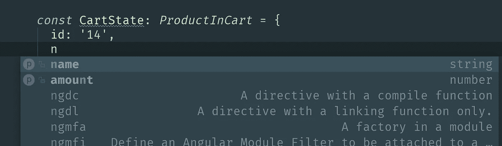

Webstorm 自动完成工具建议为 CartState 变量添加名称和数量

此外，Typescript 不允许我们为某个已定义的形状创建一个空对象，然后用属性填充它，但是这里的`Record`可以帮助我们。

也可以使用`string` `enum`作为`Record`类型的键。例如，我们将使用`ErrorsEnum`来保存和访问可能的错误值(消息):

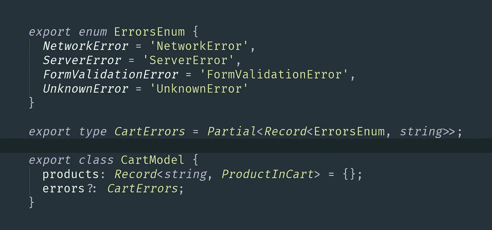

在业务模型中使用错误记录字典

> 让我们看看如何在使用 [Material-UI](https://material-ui-next.com) 库时使用它来增强类型。正如指南所说，您可以使用 [CSS-in-JS 符号](https://material-ui-next.com/customization/css-in-js/)添加自定义样式，并通过`withStyles` HOC 注入它们。您可以将样式定义为一个函数，该函数将一个`theme`作为参数，并返回带有对应样式的未来`className`，并且您想要为此函数定义一个类型:

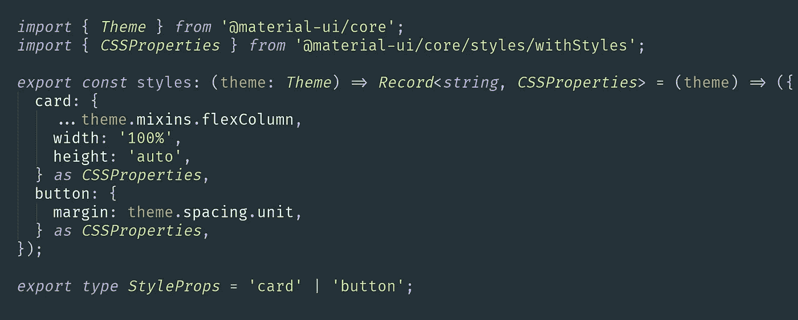

在每个组件文件中添加样式函数的类型

您会注意到为每个样式对象添加这些`as CSSProperties`会变得非常烦人。或者，您可以利用`Record`类型的优势，为`styles`函数定义一个类型:

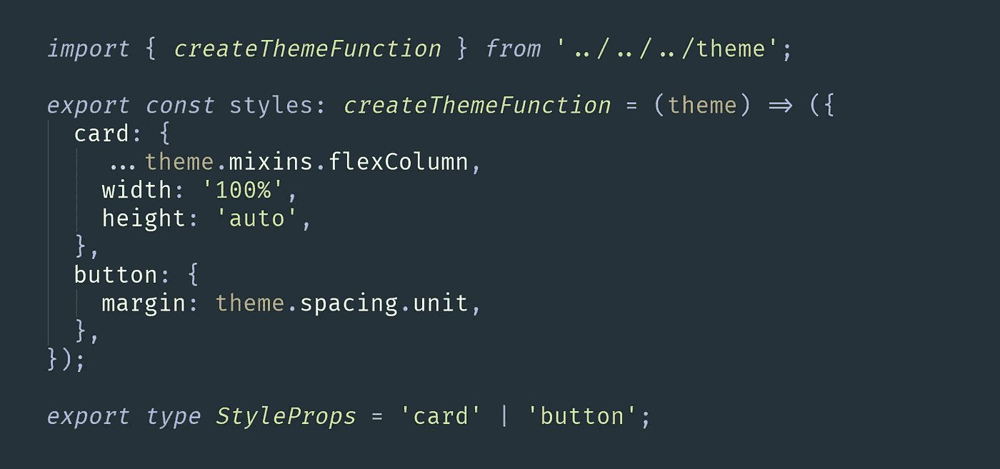

到处使用一次定义的 createThemeFunction 类型

现在，您可以在每个组件中安全地使用它，并在您的样式中摆脱硬编码类型的 CSS 属性。

# 部分和必需

`Partial`类型使对象中的所有属性都是可选的。在许多情况下，它会对您有所帮助，例如，当您正在处理某个组件将呈现的数据，但您知道在挂载时可能无法获取该数据时:

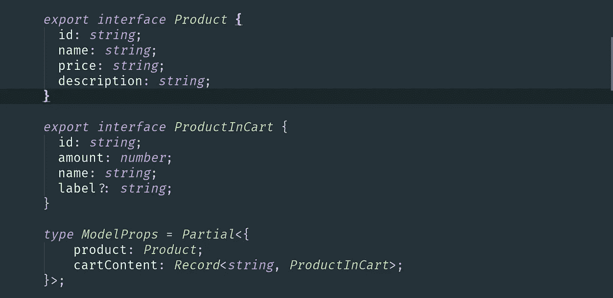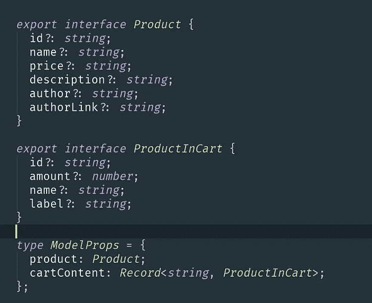

左侧:使用分部类型达到与右侧相同的结果，在右侧，每个属性都标记为可选

或者你可以使用`Partial` 来定义一些道具作为你的组件的默认道具:

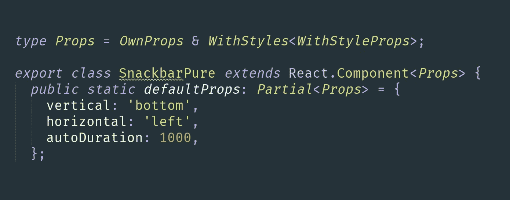

在默认属性的类型中使用偏旁

相反，Typescript v2.8 中引入的`Required`内置类型使得被描述对象的所有属性都是必需的:

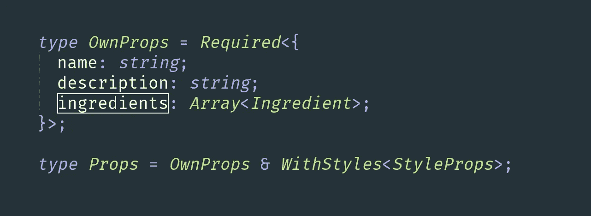

此组件的 OwnProps 中的所有字段都是必需的

Required 的一个用例是**选择器**:有时你想为一个嵌套对象的属性创建一个选择器，并且你知道在选择器调用的时候这个属性将被定义。你可以通过打字指出来:

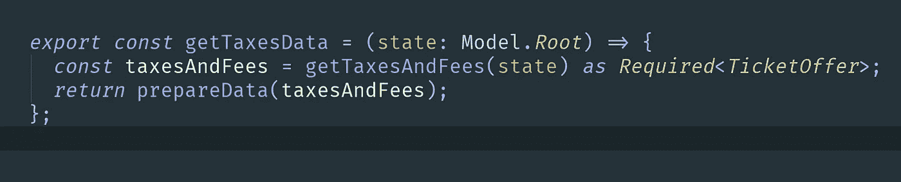

一个小黑客确保编译器 ticketOffer 是选择器处理所必需的

这看起来像一个骗局，如果你开始从可选属性继承必需属性，它会导致类型错误，所以要小心！

> 也许这听起来很愚蠢，但是当你拥有自动生成的代码，并且你手中的所有接口都是部分的，并且你的 UI 的所有元素都只需要 T10 必需的 T11 时，这种情况并不少见。在这里，您将开始检查*上每个未定义的嵌套对象😨*。

# 挑选和省略

你有没有因为意识到下一个类不需要这一堆属性而试图缩小一个类型？或者你可能在重构的过程中到达了这个点，试图以一种新的方式分布系统的各个部分。有几种类型可以解决这个问题。

帮助你使用一个已经定义好的接口，但是只从对象中取出你需要的那些键。

`Omit`在`lib.d.ts`中没有预定义，但是很容易用`Pick`和`Exclude`来定义。它排除了您不想从接口中获取的属性。

在这两幅图像中，`ProductPhotoProps`将包含除名称和描述之外的所有`Product`属性:

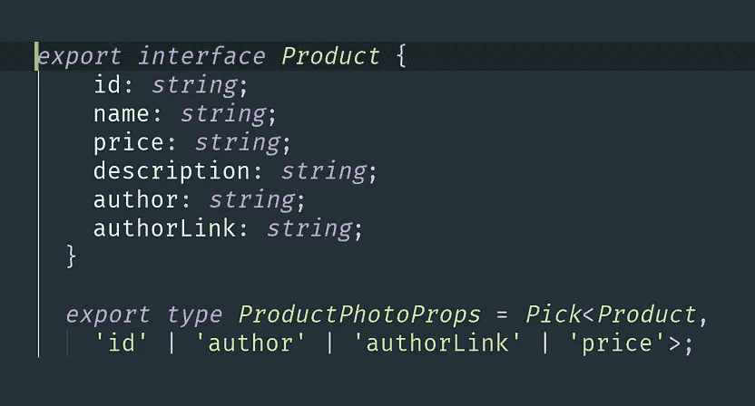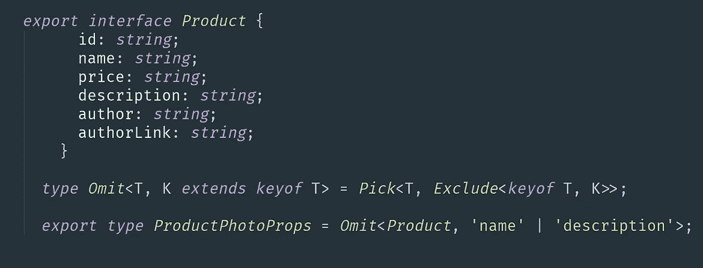

挑选和省略是重用接口的灵活方式

> 在我目前的项目中，这种情况的一个实际例子是重构一个具有复杂字段依赖关系的大型表单。有`FormProps`类型，其中包含错误字段。在重新考虑这个架构之后，错误对于第一个子组件来说变得不必要，但是对于第二个子组件来说仍然是需要的。我使用 Pick 获取一部分字段，除了一个新接口的错误，它工作得很好。

当然，有不同的方法来组合类型和定义它们的关系。如果你一开始就把一个大的东西分解成小块，也许你就从另一个侧面解决了一个物体排除属性的问题。您应该扩展类型。

# 扩展类型/接口

当您扩展接口时，在源接口/类型中描述的所有属性将在结果接口中可用。让我们看看如何将小界面组合成一个与我们的任务相对应的界面:

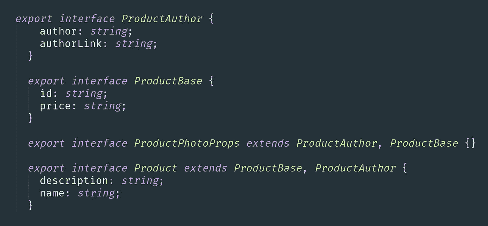

扩展紧凑接口，以便在不同的组件类型中重用它们

这种方法并不方便，因为你必须事先想象物体的形状。另一方面，它又快又简单，这使得它非常适合于原型开发或构建简单的 UI，比如将数据呈现到只读块中。

# 摘要

我们已经用真实的代码示例探索了一些流行的预定义类型脚本类型。我们使用的项目只是一个演示，但所有这些类型至少在我所知道的一个真实世界的应用程序中是有效的😉。我希望这篇文章对你有用，并鼓励你不要害怕打字。我用 React-Redux SPA 创建了一个 [repo](https://github.com/ainalain/sandbox) ，在这里你可以找到大多数这样的例子或者它们的替代品。

但是，我想再说一点关于静态类型的事情。通常，当您探索一项新技术或在功能开发过程中面临挑战时，您开始解决一个技术问题，并且可能会忘记您的目标。静态打字不是你工作的一个目标，它只是一个工具。如果它成为了一个项目的核心，那就表明你已经忘乎所以了🚀。记住你的应用程序的商业/技术部分的平衡和快乐编码！

[](https://gitconnected.com/learn/typescript) [## 学习 TypeScript -最佳 TypeScript 教程(2020) | gitconnected

### 21 大 TypeScript 教程-免费学习 TypeScript。课程由开发人员提交并投票，从而实现…

gitconnected.com](https://gitconnected.com/learn/typescript)***