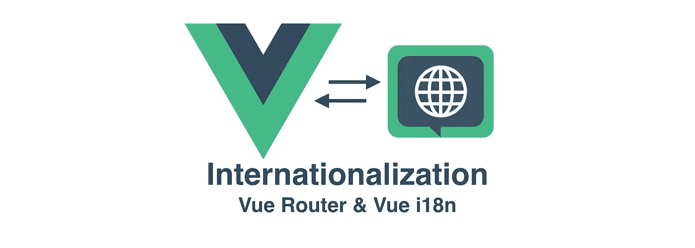
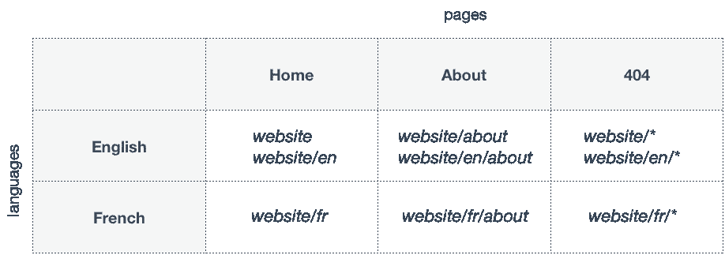
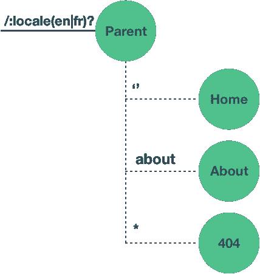
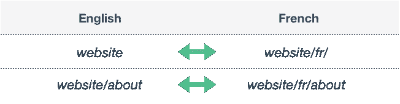
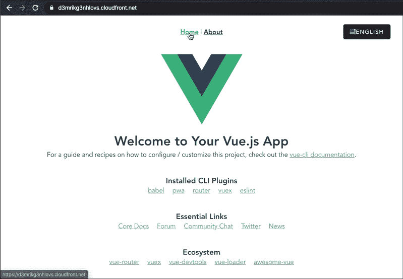
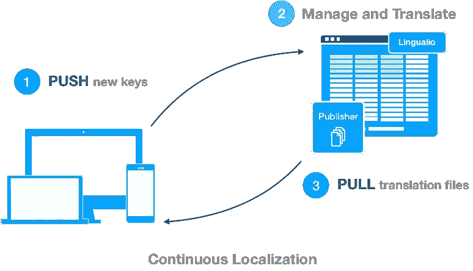

# 使用 Vue 路由器的高级 Vue.js 国际化(i18n)和本地化(l10n)

> 原文：<https://levelup.gitconnected.com/advanced-vue-js-internationalization-i18n-and-localization-l10n-using-vue-router-a94ecd83fecd>



Vue、Vue 路由器、Axios、Vue i18n、Vuex 和 Linguallo

在任何前端框架中设置国际化(i18n)都可以通过使用不同的技术来完成。大多数企业级应用程序为页面的每个语言版本使用不同的 URL，而不是使用 cookies、本地存储或浏览器设置来调整页面上的内容语言。这种方法也被搜索引擎所建议，比如 Google。

例如，如果你要打开 apple.com[这样的网站，它会以默认语言加载(在这种情况下是美国英语)。但是，如果您想将语言更改为法语，您的首选语言将显示在网站的 URL 中:](https://apple.com)

*   英语—apple.com
*   法语—apple.com/fr
*   德语—apple.com/de
*   等等。

像这样的网站需要复杂的后端服务器设置，但在其困惑之下是简单的路由器配置。基本思想是，路由器将检查 URL 的第一个参数是否是语言参数，如果是，它将为您提供该语言的内容(`apple.com/fr/iphone`)。但是，如果第一个参数与任何受支持的语言都不匹配，它将以默认语言(`apple.com/iphone`)给出内容。我们将尝试通过使用 Vue 路由器来演示如何在 Vue 中实现这一点。



## 在本文中，我们将涵盖:

*   Vue i18n 的安装和配置
*   加载开发转换键( **dev.json** )
*   使用路由器将语言设置为 URL 参数
*   用 Axios 加载翻译文件(将 JSON 文件与 Vue 解耦)
*   改变语言
*   使用 [Linguallo](https://linguallo.com) TMS 管理翻译文件(l10n)

# 演示

如果你有兴趣看到最终的结果，请看看我们的 starter 应用程序的 [**演示**](https://d3mrikg3nhlovs.cloudfront.net/) ，它正在`AWS S3`和`Cloudfront`上运行。源代码可以在 [**GitHub**](https://github.com/ivanmiletic/vue-i18n-router-starter) 上找到。

# Vue i18n 的安装和配置

为了帮助我们国际化，我们将使用 [Vue i18n](https://kazupon.github.io/vue-i18n/) 插件。

您可以使用以下命令安装插件:

1.  NPM

```
npm install vue-i18n --save
```

2.故事

```
yarn add vue-i18n
```

3.Vue CLI

```
vue add i18n
```

通过设置 ***i18n.js*** 文件中的配置来配置插件:

然后，你需要在 ***main.js*** 中注册插件:

我们已经在我们的 Vue 应用中设置了 i18n！

# 加载开发转换密钥(dev.json)

您可能已经注意到我们已经将 fallback locale 设置为`dev`。拥有一个开发翻译文件( **dev.json** )有助于开发新特性、修复错误等。该文件主要在开发应用程序时使用，但也可以用作应用程序的默认后备语言。

在 *src* 文件夹中创建 *locale* 文件夹并添加 **dev.json** 文件，然后在实例化 VueI18n 时加载该文件。你的 ***i18n.js*** 文件现在应该是这样的:

# 使用路由器将语言设置为 URL 参数

正如我们在开始时提到的，我们的路由配置应该有一个语言参数。如果第一个参数与任何支持的语言都不匹配，它将以默认语言提供内容。此外，如果 URL 不匹配任何路由，它将加载英语(默认)语言的 404 页面。

首先让我们用基本路径定义支持的语言。新建文件夹*常量*并添加文件 ***locales.js:***

> 现在，我们将只使用代码属性。当我们继续阅读本文时，我们将使用它们的其余部分。

接下来，我们将配置路由器。更新**src/router/index . js:**

现在，我们的***src/router/router . js***文件应该是这样的:

如果我们在路径中使用简单的动态参数，例如我们的父路由的`/:locale`，路由器将不能容易地区分`/fr`和`/about`URL。通俗的说就是两个网址都会匹配。因此，我们决定使用基于我们支持的语言环境配置构建的高级模式:

```
/:locale(en|fr)?
```

在这里，`:locale`代表我们的动态参数。继续，`(en|fr)`表示如果 param 是`en`或`fr`，则该参数将匹配，并且将设置 locale param。如果第一个参数是其他参数，例如`/about`，path 仍然匹配，但是 locale param 将不会被设置(因为我们最后的问号`?`代表可选参数)。

以上都可以这样表示:



高级 Vue 路由器

# 用 Axios 加载翻译文件(将 JSON 文件与 Vue 解耦)

由于我们已经成功地从 URL 中提取了 locale param，现在我们可以配置应用程序、加载翻译文件和设置消息。我们将在父路线的`beforeEnter`保护区内完成此操作。这是接收 3 个参数的函数:

*   `to` —你想去的路线，
*   `from`——你来自的那个
*   `next` —完成后调用的回调函数。

理想情况下，在企业应用程序中，翻译文件应该从 Web 应用程序中外部化。这意味着文件应该位于应用程序上下文之外，从而允许业务或 it 部门更改翻译文件，而不必重新构建和部署前端应用程序。出于演示目的，我们将把文件放在 *public/translations* 文件夹中，并创建新的 **en.json** 和 **fr.json** 文件。

我们的***src/router/index . js***文件现在会是这样的:

让我们看看我们的新后卫有什么变化:

*   我们正在用`to.params.locale`读取区域参数
*   基于 param，我们从我们的***src/constants/locales . js***文件中定义的受支持的区域设置列表中获取我们的配置，如果在`website/`或`website/about`的示例中没有设置区域设置，我们将默认区域设置为`en`。
*   在我们的 Vuex 存储中设置语言环境配置，以进一步用于确定当前的应用程序语言环境
*   基于语言环境，我们将使用 Axios 获得 JSON 文件
*   如果文件存在，我们将使用`i18n.setLocaleMessage()`设置翻译消息
*   在`finally`语句中，我们将为 i18n 插件设置区域设置并触发`next()`回调。

# 改变语言

我们希望通过路由更改实现的是，当用户使用特定语言的路由，但决定更改语言时，它会将他/她重定向到首选新语言的同一页面。你可以在下图中看到它:



这可以通过将 URL 指向其他语言路径来实现。我们可以通过将`href`设置为 anchor element，以编程方式或直接从 html 中实现这一点。之前，我们已经在商店中设置了当前的区域设置，但是现在我们可以使用它来计算我们的实际子路线。我们可以通过在我们的完整路径上执行`substring`并删除我们的语言基础路径来做到这一点。例如，如果我们的当前路线是`/fr/about`，我们的`beforeEnter`警卫将配置设置为:

接下来，我们将从我们的完整路径`/fr/about`中移除基础部分`/fr`，并得到路线`/about`。

我们新语言的最终 URL 将是新的语言库+上一个例子中的新 URL。如果你想添加更多的语言，例如德语(`/de`，它将是`/de + /about = /de/about`。在我们的例子中，它将看起来像这个`‘’ + /about = /about`。

这里可以看出逻辑:

# 试试看！



# 使用 Linguallo TMS 管理翻译文件(l10n)

所示的例子是一个只有几个翻译键的简单项目。但是，正如我们在开始时提到的，大规模应用程序要复杂得多。不仅因为他们有成千上万的钥匙，而且所有的钥匙都被语言的数量成倍增加。因此，最终的翻译数量很可能是几十万。

此外，复杂性增加得更多，因为开发人员在开发新功能时会不断添加新的键。所以，现在你可以在这里看到一个重复的模式——每次添加新的密钥时都发送给翻译者，然后将它们同步回应用程序。这变成了一个邪恶的恶性循环，而且非常耗时。

这个问题的解决方案是包括翻译管理系统(TMS ),它将代表真实的单一来源。

在我的职业生涯中，我熟悉了多种不同的 TMS。最贵的是 Adobe Experience Manager (AEM)中的翻译器。但是，由于价格只有几十万美元，Adobe AEM 只为有限的几家公司保留。

在搜索和尝试几乎所有在线 TMS 时，我遇到了一个很棒的——[**【Linguallo.com】**](https://linguallo.com)**，**这是 SaaS 的，可以免费使用。免费计划包括无限数量的电子表格，其中每个电子表格可用于每个应用程序，每张表格有 500 个免费托管密钥，5 种语言和 3 个用户协作。依我拙见，对于大多数公司来说，这是一个很好的选择。该工具与其他工具的区别在于:

*   它使用起来很直观，因为它看起来像 Excel，并且具有与 Trello 相似的基于角色的访问。
*   多亏了名为 Publisher(免费)的工具，它拥有完整的发布管理功能。这个工具类似于 Jenkins，可以创建构建并将它们部署到`AWS S3`或`GitHub`。
*   您可以使用`[CLI](https://github.com/linguallo/linguallo-cli)`从系统中直接以“拉”请求或`pull`翻译文件的形式`push`翻译密钥，这是同步来自多个开发人员的新翻译密钥的好方法。

最重要的是，它允许[连续定位](https://github.com/linguallo/linguallo-cli)的概念。



取自 Linguallo.com

添加新密钥很简单，假设您已经安装了 Linguallo CLI，只需在项目的工作区中键入以下内容:

```
translate push --input="./src/locales/dev.json"
```

我强烈推荐你尝试一下，并在评论区告诉我你的印象！

# 结论

在本文中，我们讨论了如何设置 Vue 应用程序的高级路由和国际化。我们还提到了如何管理、翻译和发布语言文件。

尽管它是“三巨头”(Angular、React 和 Vue)的最新产品，但我肯定会在企业应用中尝试 Vue，因为我已经在和我的团队讨论它了。多年来，我一直在 Angular 和 React 框架中进行开发，同时构建了世界上最大的旅游电子商务 Web 应用程序之一。在我看来，Vue 比 React 容易学得多。Vue 以 web 开发人员已经习惯的方式分离关注点，将 HTML、CSS 和 JavaScript 解耦。我认为 Vue 获得了 React 和 Angular 的最佳部分。

如果你有任何进一步的问题，请不要犹豫与我联系。

*示例代码可以在*[***GitHub***](https://github.com/ivanmiletic/vue-i18n-router-starter)*上找到，或者如果您有兴趣查看应用程序，请访问* [***演示***](https://d3mrikg3nhlovs.cloudfront.net/) *上的****AWS S3****和****Cloudfront****。*