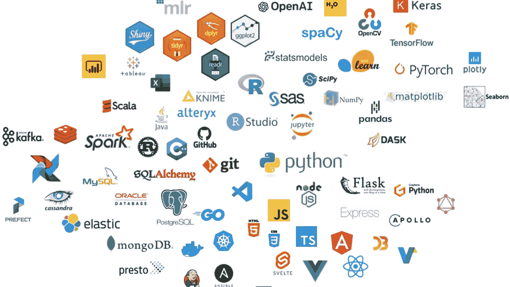
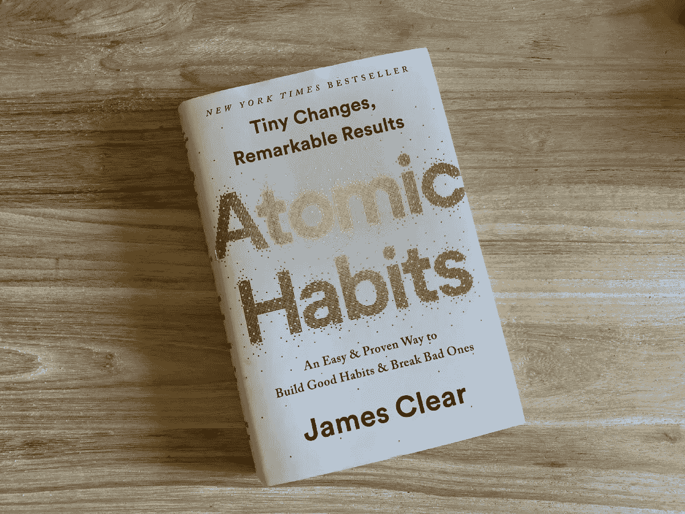

# 我希望在刚开始软件开发时就知道的建议

> 原文：<https://levelup.gitconnected.com/advice-i-wish-i-knew-when-i-first-started-software-development-633572953b42>

## 帮助开发人员提高学习和避免倦怠的指南

最近，我开始了我的第一份全职工作——软件开发。过去的这个周末，我坐在床上回想两年前我第一次接触一段代码的情景。我意识到从那时起我学到了很多东西，我开始考虑如果我可以回到 22 岁的我，第一次发现软件开发，我会告诉自己的所有事情。这是我今天写作的灵感。我决定为像我一样的人，刚开始进入软件开发领域的人，或者已经进入职业生涯并希望继续进步的人创建一个指南。我把我的建议分成 5 个部分，每个部分讨论我在最初几年的发展中所学到的一课或一条建议。

对于那些对我来到这里的道路感兴趣的人，我开始自学游戏开发，但当我参加软件工程训练营 Flatiron School 时，我的学习速度加快了。虽然是的，我相信就我的学习方式而言，训练营是值得投资的，但它并不适合所有人。此外，我在这篇文章中分享的建议适用于任何试图学习的人，不管你走的是什么道路，也不管你在职业生涯中走了多远。说了这么多，让我们停止谈论我的旅程，所以我希望能帮助你。

1.  ***学而优则仕***

在我开发的头两年中，我学到的最重要的一课是，编程既是一种脑力活动，也是一种体力活动。换句话说，最好的学习方法是构建应用程序并在此过程中解决问题。

经验给你知识，所以如果有人问你“我将如何使用**插入你正在学习的东西** 来解决**一些问题** ？”你不仅可以告诉他们从哪里开始，还可以谈论你遇到的挑战，解释什么对你有用，什么没用。

学习发展不像是为考试或测试而学习，它更像是练习一项运动。例如，在许多运动中，你可以研究改善状态的方法，研究战术手册，尽可能多地学习这项运动的复杂性，但这只能让你成为一名运动员。在某些时候，为了成为你能做到的最好的球员，你必须实际练习和比赛。发展很相似，最好的学习来自经验。构建项目的过程就是你如何从一个初学者的表面理解，到更深层次的理解，再到成为专家。所以，当你学习和记笔记时，确保你也让你的代表进来。

[Jexo](https://unsplash.com/@jexo?utm_source=medium&utm_medium=referral) 在 [Unsplash](https://unsplash.com?utm_source=medium&utm_medium=referral) 上的照片

**2*。不要担心做出完美的项目，只要开始***

假设您已经花了一些时间学习一门新编程语言的基础知识，并准备解决一些问题和开始一个项目。太好了，但是现在你在做什么项目呢？如果你问我，我会告诉你“几乎任何事情”。事实上无论你首先想到什么？或者更好的是，你会有什么最有趣的建设。只要你认为你能把刚刚学到的东西应用到项目想法中，那么这个项目就是一个很好的项目。关键是**刚入门**。

我无法告诉你有多少次，我陷入了这样一个陷阱，即试图找到最好的事情去做，而不去开始做任何事情，这让我陷入了某种“分析麻痹”。不仅仅是我。与我交谈过的大多数开发人员都有过这样的经历，他们发现自己陷入了困境，没有取得任何进展，因为他们认为他们的项目想法不够好。

但是为什么会这样呢？老实说，这是两件事之一。我们要么和别人比较，要么是为了满足自己的期望、目标和抱负。我们会想“我需要做一个令人印象深刻的项目，足以让我得到梦想中的工作”或“我想要一个和某某人的项目一样好的项目”，甚至“我想创造一些以前没有人做过的东西”。

现在你可能在想，以目标为导向或者追随你的抱负有什么错？绝对没有，事实上，如果你已经计划好了你的项目想法，或者如果你正在学习编码以便执行一个商业想法，那么你应该 100%地去做。只有当你开始为了寻找合适的项目而推迟学习时，它才会成为一个问题。不值得。执行一个“简单的项目”并对它充满热情要比努力创建一个你不想创建的“复杂的项目”好得多。这有几个原因。

首先,“简单的项目”最终可能会给人留下更深刻的印象。我必须很快学会的一件事是，如果你能详细地、充满激情和热情地谈论你的项目(是的，即使它像一个简单的井字游戏),通常会给人留下更深刻的印象，而不是努力创造一些你不喜欢的复杂的东西。即使这个项目表面上听起来不一定令人印象深刻，表达你对一个项目的热情也有很大的帮助，这不是你可以假装的。

第二，是避免烧坏。精疲力竭在开发过程中非常普遍，大多数情况下，当有人在做他们不喜欢的事情时，就会出现这种情况。当谈到工作中的编程时，从事你不喜欢的工作有时是不可避免的。然而，这应该给你更多的理由让你的个人项目成为你热爱的事情。

长话短说，我见过的大多数最令人印象深刻的项目都来自于表面上的简单想法，这些想法演变成了一个漂亮的应用程序。这是因为创造它的人充满热情，享受他们所创造的东西。所以，不要为寻找“正确的”项目而过度紧张，从你喜欢的事情开始吧。

***3。不要试图什么都学，你不能***

这一部分的标题听起来可能很悲观，但实际上，它应该鼓励你。作为一个个体，你不应该试图学习与你无关的任何东西，这是因为要学的东西实在太多了。在今天的技术世界中，有成千上万种不同的技术和框架，我们作为开发人员可以学习和进入，但没有一个人可以学习所有的技术和框架。

一个很好的例子是，当我刚开始学习编程时，我认为同时学习 python 课程、C++课程、使用 C#的游戏开发课程和 Java 课程是一个好主意。正如你们中的许多人现在可能在想的那样，我很快发现，编程语言在概念上并没有太大的不同，而且基础知识有很多重叠，特别是对于入门课程。在我看来，我当时并不清楚，但现在回想起来，这似乎相当愚蠢。

关键是，除了试图一次学习太多东西而分散精力的风险之外，通过一次深入钻研一两项技术，你实际上会学到更多东西。事实上，有许多人在他们的整个职业生涯中只使用少数几种不同的技术，并且每天都在学习新的知识。

***4。*** 理工叠加不要紧(种)

读完最后一节后，您可能会问自己如何知道选择哪种或哪些技术。嗯，类似于挑选一个项目，找一个你感兴趣的技术栈。或者，如果你有一家或几家你想去工作的公司，看看招聘信息，看看他们使用什么技术，学习这些技术。无论您选择什么，成为一名优秀的开发人员都要学习并使用您所学的知识来构建一些东西。

几乎每种类型的开发，你都可以找到 5 种不同的框架&技术栈，它们可以完成非常相似的结果。例如，假设你想学习前端 web 开发。您可以选择只使用普通的 JavaScript，也可以从各种 JavaScript 框架/库中进行选择。其中包括[反应](https://reactjs.org/)、[棱角](https://angular.io/)、 [Vue](https://vuejs.org/) 和[苗条](https://svelte.dev/)，不一而足。虽然它们各有不同，但它们具有相似的功能和相同的目的。

或者想学机器学习。你可以选择 JavaScript、Python、C 或 Swift 来学习 Tensorflow。或者你可以选择专注于 Python 并利用 [Numpy](https://numpy.org/) 和[the no](https://pypi.org/project/Theano/)，或者甚至学习 [Spark ML](https://spark.apache.org/docs/1.2.2/ml-guide.html) 模型，以及 Scala 或 Java。

或者假设你想成为一名游戏开发者，你有大量的游戏引擎可以选择学习。比如[合一](https://unity.com/)、[虚幻](https://www.unrealengine.com/en-US/unreal?utm_source=bing&utm_medium=Performance&utm_campaign=an*Internal_pr*UnrealEngine_ct*Search_pl*Brand_co*US_cr*exact&utm_id=398466222&sub_campaign=UE_Broad_EN&utm_content=existing&utm_term=unreal%20engine)、[游戏制作者工作室](https://www.yoyogames.com/en)、 [Godot](https://godotengine.org/) 等。都是很好的选择，虽然它们在功能上有所不同，但是使用其中的任何一种，你都可以成为一个非常优秀的、可雇佣的游戏开发者。关键是你有很多选择，实际上如果你是为了职业目的而学习，选择对你有意义的技术。

现在，你在这一部分旁边看到“有点”的原因类似于关于选择项目的警告。如果你正在为一个公司构建一个大规模的应用程序，技术栈确实很重要，效率、成本、可伸缩性等等。一切都重要。对于 99%的人来说，开发是为了他们的投资组合、体验或乐趣，那么这些细节通常并不重要。

***5。代码每日***

当我第一次决定要转行做开发的时候，有人会说“你需要每天都编码”，这看起来很吓人。尤其是因为那时我有一份完全与编码无关的工作。我记得我在想“我什么时候会有时间？”。我不知道我只是想错了。

我曾经认为这是一件苦差事，是我必须完成的另一件事，是我必须花上几个小时才能从中获得什么的事情。事实上，人们说你应该每天都编码的原因是，如果编码成为你一天中的一部分，而不是当你有时间的时候做一项任务，那么它更容易维护。

关键是**启动小**和**保持一致**。它不仅更容易维护，你会学到更多，会更有趣，而且你也不太可能感到疲惫。只需要每天投入 15 分钟到 1 小时的时间，非常有目的地专注于编码。

只要确保你至少达到了自己承诺的最短时间，几周到一个月后，你会发现，就像刷牙一样，这只是你一天中的另一部分。现在你可能在想，每天 15 分钟是不可能有大的进步的。我会说，你会惊讶的。你还会发现，很多时候你会超出自己的承诺，因为开始往往是最难的部分。但是你也应该记得在其他日子里同样自豪，在那里你只是达到了你承诺的最低限度。事实上，正是在那些日子里，你真的感觉不在状态，对编码不感兴趣，但你仍然出去打你的 15 分钟，这让你长期坚持下去。

我可以继续不停地说为什么每天做一点点更好，更可持续，但这可能是另一个时间的话题。现在，我只推荐詹姆斯·克利尔的书《原子习惯》，因为它非常详细地讨论了这个话题，并分享了书中的一段话，这是对它的最好总结。

> 如果你愿意坚持数年，起初看起来很小很不重要的变化会合成显著的结果。
> 
> 詹姆斯·克里

