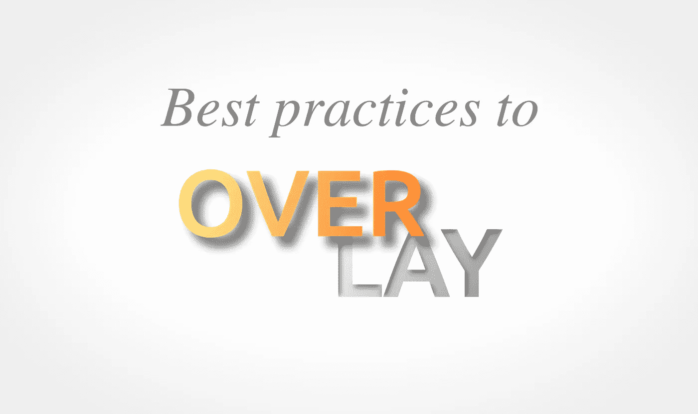
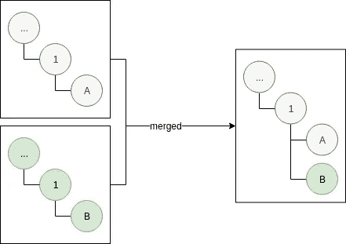
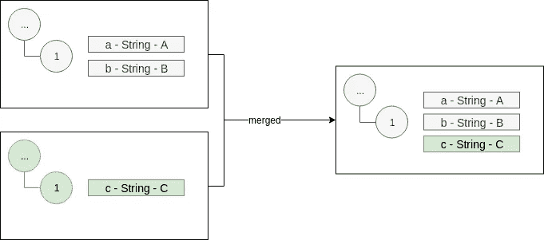
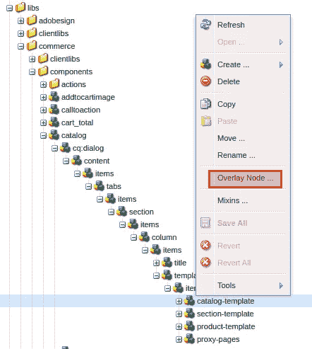
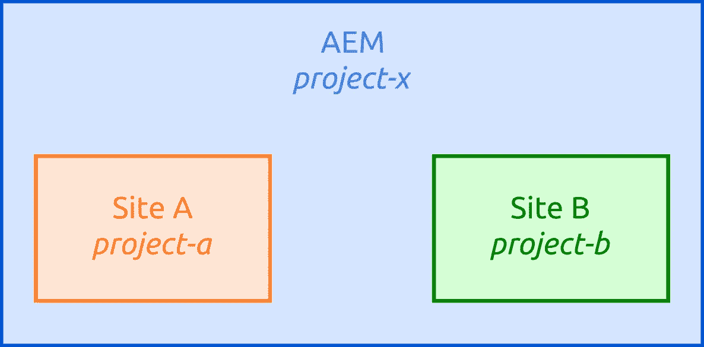

# AEM:覆盖层的 5 个最佳实践

> 原文：<https://levelup.gitconnected.com/aem-5-best-practices-for-overlays-4babcbbb8a80>

## 如何像老板一样叠加

AEM 提供了两种定制 OOTB 资源的方法:

1.  **覆盖**，允许*重新定义*现有资源(即:替换当前行为)。
2.  **覆盖**，允许您*扩展*现有资源(即:添加新行为)。

本文假设您已经使用了覆盖，并将讨论这样做的一些最佳实践。如果你不清楚覆盖是如何工作的，或者它们与覆盖有什么不同，我推荐 Adobe 的[这篇文章或者 aemvardhan 的](https://helpx.adobe.com/experience-manager/6-5/sites/developing/using/sling-resource-merger.html)覆盖和覆盖的比较，其中包括一个快速教程。

# 外科覆盖物

照片由[贾法尔·艾哈迈德](https://unsplash.com/@darksidoo?utm_source=unsplash&utm_medium=referral&utm_content=creditCopyText)在 [Unsplash](https://unsplash.com/s/photos/surgery?utm_source=unsplash&utm_medium=referral&utm_content=creditCopyText) 上拍摄

“最好的代码是没有代码”——这是你经常会在文章中读到的，比如*如何成为一名高级程序员*或*如何像 10x 开发人员一样编程的 7 个技巧*或*如何获得一艘游艇并使用 Java 勾引超级模特*...你明白了。你做的所有东西都可能坏掉，你写的每一行都需要维护，任何开发都是如此，AEM 也不例外。

减少覆盖影响的关键是理解 AEM 中的 Sling 资源合并，它发生在节点级和属性级。AEM 将获取`/libs`的内容，并仅覆盖*您在* `/apps`中指定的节点和属性。

下面是一个节点级资源合并的例子(灰色的`/libs`，绿色的`/apps`):

在节点级别合并资源

如您所见，要向`1`添加一个`B`节点，没有必要复制节点`1/A`，因为 AEM 会从`/libs`中获取它。但是节点`1`的属性呢？如果你不指定它们，它们也会从`/libs`中获取:

财产层面的资源合并

这意味着，要使你的覆盖“外科手术”,你应该只覆盖那些你实际上需要改变的节点和属性，而把其余的留为空白。

通过将整个子树从`/libs`复制到`/apps`来改变一些属性，使覆盖变得太“大”了。)有时是由 AEM 开发新手和有老版本 CQ 或 AEM 经验的人来完成的，这导致了更难维护的开发。如果将来的升级在复制到`/apps`的子树中的`/libs`下做了改变，那么这些改变将会被埋没在“覆盖层”下，你将不会从中受益。

要轻松创建手术覆盖，请使用 CRX DE 中的*覆盖节点*功能，右键单击树中的节点即可进入:

CRX 德的覆盖节点特征

这将创建一个覆盖图，其中包含:

*   有问题的节点及其所有属性
*   一系列空节点用来创建`/apps`下的路径

# 避免重叠文件

关于资源合并的主题:它存在于节点和节点属性，但*不存在于文件内容*。这意味着，为了更改 JS 脚本中的一行，您必须覆盖整个文件(有时有数百或数千行)。如果此文件在将来的升级中发生了更改，您将看不到这些更改，直到您修补覆盖图(即:将 Adobe 对文件的更改与您自己的更改合并)。修补可能是一个繁琐的过程，忽略它可能会破坏某些功能，因此如果可能，请避免覆盖文件，而首选覆盖节点和属性。

`/libs`下的许多 HTL、JSP 或 JS 文件从 JCR 中获取节点和属性，并对它们执行逻辑以达到期望的结果。通过更改这些文件的输入数据(JCR 内容),您会发现您可以操纵结果。

这里是我以前发表的文章中的一个例子，目的是禁止文件上传到一个图像组件，而是强迫用户从 DAM 中选择一个图像。这可以通过两种方式实现:

1.  通过在`/libs/cq/gui/components/authoring/dialog/fileupload/render.jsp`修改 JSP
2.  通过向组件`cq:dialog`中的节点添加一个`allowUpload — Boolean — false`属性。

第一个选项的优点是这会影响所有使用`fileupload`组件的组件，但是每次升级后都需要打补丁。

第二种选择的优点是更快、更简单、更易维护。

对于不同的需求，总是有不同的解决方案，但是每当您觉得需要更改一个文件以达到您想要的结果时，就很有必要检查一下是否可以用一种更干净、更易维护的方式达到相同的结果。 [Granite](https://helpx.adobe.com/experience-manager/6-5/sites/developing/using/reference-materials/granite-ui/api/jcr_root/libs/granite/ui/index.html) 和 [Coral](https://helpx.adobe.com/experience-manager/6-3/sites/developing/using/reference-materials/coral-ui/coralui3/documentation.html#coralUI3Migration) 文档可能是一个很好的起点，但是阅读该文件并理解其工作原理可以揭示官方文档中没有的解决方案(并让您感觉像夏洛克·福尔摩斯)。

# 进行不变的首次提交

照片由 [NASA](https://unsplash.com/@nasa?utm_source=unsplash&utm_medium=referral&utm_content=creditCopyText) 在 [Unsplash](https://unsplash.com/s/photos/surgery?utm_source=unsplash&utm_medium=referral&utm_content=creditCopyText) 上拍摄

假设(不管什么原因)你没有选择，只能在`/libs/cq/gui/components/authoring/dialog/fileupload/clientlibs/fileupload/js/fileuploadfield.js`覆盖文件。从 6.5.1 开始，这个文件有 680 行长。为了让你的同事清楚你的改变，你应该:

1.  覆盖物
2.  导入到项目中
3.  犯罪
4.  做出改变
5.  再次提交

如果您在同一次提交中覆盖*和*变更文件，然后将您的特性分支发送给代码审查，您的同事将不得不在 680 多行代码中找到那个变更，这是一个大麻烦。

他们必须在`/libs`中找到文件，将它复制到一个 diff 工具中，然后回到您的代码审查工具中获得反馈，等等。

就算你不喜欢你的同事，也是为了你自己的名声。尽管我很喜欢使用 Adobe 产品，但他们的开发人员并不是上帝！您可能会覆盖一个包含错误、不良做法或遗留待办事项的文件。通过在您的更改之前为覆盖创建一个单独的提交，您就脱离了任何 OOTB 猴子业务😉

# 让你的代码与众不同

希望你的代码看起来更快乐

按照同样的思路，尽你所能将你的代码与 OOTB 代码区分开来。仔细考虑你的定制做了什么和它的技术实现，并尝试找到一种方法来清楚地区分你的定制和 Adobe 的代码。

例如，如果你的特性可以被视为纯粹的*附加的*(即:它增加了功能而不改变现有的行为)，那么为什么不创建一个新的 clientlib，而是将它添加到一个现有的类别中呢？这将导致您的代码与 OOTB Adobe 代码同时加载。

如果您的特性实现覆盖了 Adobe 代码，那么创建一个带有*自定义*类别的 clientlib，并使用覆盖将该类别添加到您需要的任何地方。当您的定制是基于 CSS 时，这种技术很有用，例如:只需将 CSS clientlib 类别*添加到包含它所覆盖的样式的类别*之后(clientlib 按照其类别列出的顺序加载)。

如果您决定您需要覆盖一个文件，同样的原则适用。抵制冲动(无论多么诱人😉)来重构现有代码，并避免在现有代码块中编写代码。

如果可能的话，不要修改十行 Adobe 代码，而是在文件的底部写一个十行的函数，并在上面调用一次。这将大大降低升级/更新 AEM 实例时打补丁过程中出现冲突的风险。尽管如此，如果发生冲突，它们至少会更清晰、更容易解决，而不需要对特性有深入的先验知识。

# 将自定义与项目分开

希瑟·福特在 [Unsplash](https://unsplash.com/?utm_source=unsplash&utm_medium=referral&utm_content=creditCopyText) 上的照片

我在这里使用术语“项目”来指代一个站点以及所有特定于站点的代码和逻辑，例如,`projectA`将是一个包含实现站点 a 所需的所有组件和逻辑的 Maven 项目存储库。如果您的 AEM 实例托管多个站点(或者将来可能托管多个站点),那么第二个`projectB`将是一个类似于站点 B 的项目。

那么 AEM 平台的定制属于哪里呢？因为`projectA`应该只影响站点 A，而`projectB`应该只影响站点 B，但是定制会影响站点 A 和站点 B 的作者，所以它们属于一个单独的项目:`projectX`。

假设站点 A 的用户希望在 DAM 资产名称中允许某些特殊字符，但是 SiteB 与第三方接口，因此必须严格地在文件名中只使用小写字母数字字符。两个团队都可以通过在`/libs/dam/gui/coral/components/commons/fileupload/clientlibs/fileupload/js/fileupload.js`覆盖脚本来实现他们的定制，但是不是让*拥有两个*特性，最后部署的项目会覆盖另一个项目的变更:不好。

如果定制存在于一个单独的项目中，两个团队都可以访问(最好是由另一方进行代码审查)，那么这两个特性可以合并到一个定制中，这样大家都满意，双赢！

感谢阅读！请记住，这些只是我为创建 AEM 平台最易维护的定制而提出的指导方针。过去，为了得到我想要的结果，我不得不打破我自己的许多规则，但是在我承诺之前，我总是停下来想是否有更好的方法，即使答案有时是…“没有”🤷‍♂️

这就是我对这个问题的看法😊您遵循的其他最佳实践中有没有我可能遗漏的？欢迎在评论中分享，或者[在 LinkedIn](https://www.linkedin.com/in/theo-pendle-1630a52a/) 上联系我，我们可以讨论理论！