# AEM:向 TouchUI 添加自定义图标

> 原文：<https://levelup.gitconnected.com/aem-add-custom-icons-to-touchui-a270f6f26ed>

## 如何超越花岗岩和 CoralUI 图标选择，添加您自己的风格

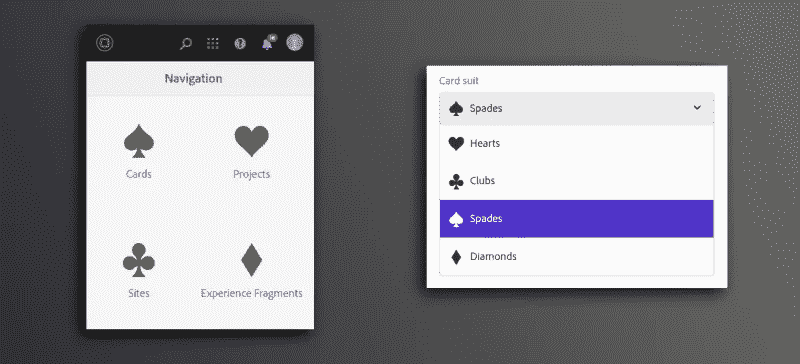

很多人可能知道，当使用 Granite 组件或对 TouchUI 进行调整时，CoralUI 为[提供了许多图标](https://helpx.adobe.com/experience-manager/6-3/sites/developing/using/reference-materials/coral-ui/coralui3/Coral.Icon.html#availableIcons)供选择。但是如果您在选择中找不到合适的图标呢？

在本教程中，我将向你展示如何在 TouchUI 中添加你自己的图标，这些图标可以在任何地方使用，包括组件编辑对话框、工具栏甚至是主屏幕。

# 设置

我们先来看一个简单的组件。这是 HTL:

这里是`cq:dialog` XML:

如您所见，它是一个非常简单的组件，只允许用户选择一套扑克牌:

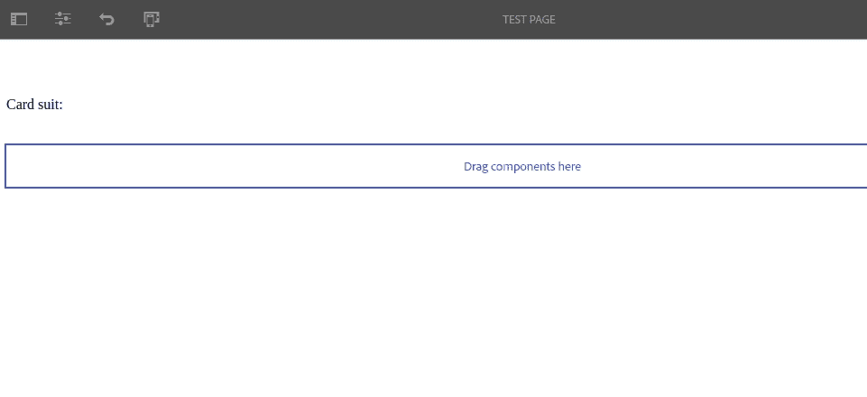

简单组件

如果你的母语是英语，你会确切地知道这些套装对应的是什么。然而，在其他语言中，术语完全不同(例如，在法语中，“黑桃”被称为“*”*”或“长钉”)，所以让我们在下拉选择的每个选项中添加一个图标，以帮助我们的双语朋友选择正确的西装。

当然，Adobe 没有为卡牌套装提供 OOTB·科拉鲁伊图标，所以为了做到这一点，我们必须自己创建！

# 创建图标字体

我们接下来需要的是图标字体，这是一种将非标准 Unicode 字符映射到特殊字形(图标)的字体。CoralUI 使用这个系统(例如，Home 图标对应于 [F261 Unicode 字符](https://unicode-table.com/en/F261/)或`\f261`)，为了我们自己的目的，我们将劫持这个系统😈

有许多方法可以创建图标字体。许多在线工具会让你上传 SVG 文件，并将它们编译成图标字体。一个这样的工具是 **icomoon.io** ，这是我将在本教程中使用的工具。

> 如果你想从一个专有的图标集合中创建一个图标字体，又不愿意把它们上传到一个在线平台，有一个替代方法。 [FontCustom](https://github.com/FontCustom/fontcustom) 是一个用于 Mac 和 Linux 的命令行工具，它可以从矢量文件中生成图标字体，但是它需要一些安装工作(尤其是在 Linux 上)。
> 
> 无论你使用 icomoon.io，另一个在线工具，FontCustom 还是你自己编写的脚本，我建议你继续阅读，以确保无论你做什么，你最终都获得了正确的资源🙂

## 使用 icomoon

前往[https://icomoon.io/app/#/select](https://icomoon.io/app/#/select)，搜索`card heart`并从免费收藏中选择四个卡牌套装图标:

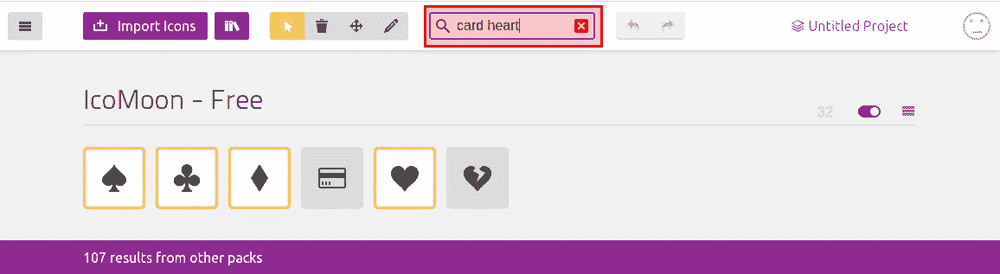

icomoon 图标选择

现在，在屏幕底部，点击*生成字体*，然后在下一个屏幕上，点击顶部工具栏中的*首选项*。这将打开一个对话框。

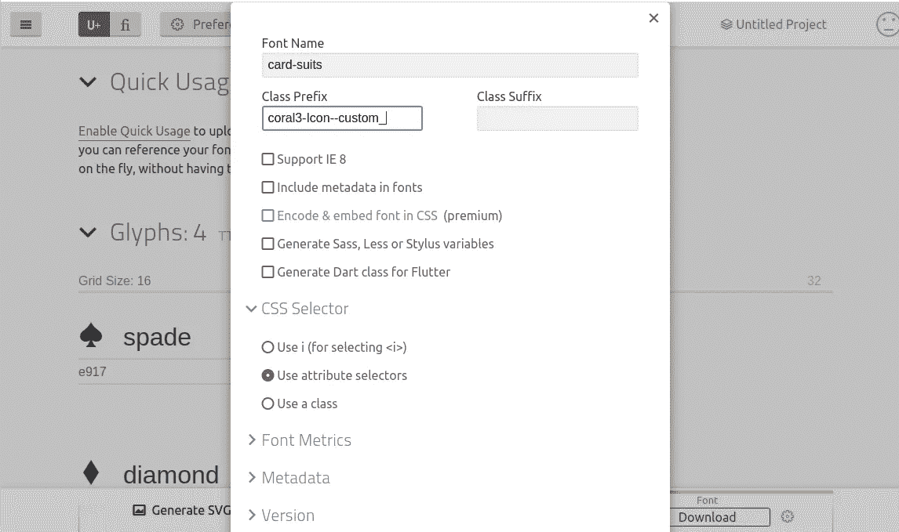

首选项对话框

在对话框中，填写以下字段:

*   *字体名称*:这将是你的字体名称。
*   *类前缀*:这个很重要！Icomoon 将为每个带有这个前缀的图标生成一个 CSS 类。

那么为什么是`coral3-Icon--custom_`？第一部分，`coral3-Icon--`是 CoralUI 使用的前缀，这意味着它将受益于 Coral3 中已经包含的所有 CSS。第二部分，`custom_`是我们用来避免冲突的前缀。有数百个 CoralUI 图标，所以当我们创建一个图标字体时，很可能有些图标会有相同的名称。通过添加这个前缀(或任何其他前缀),我们可以确保我们的图标有别于 OOTB 的图标。

例如，我们选择了一个名为`heart`的图标，这将与 OOTB `heart`图标相冲突:

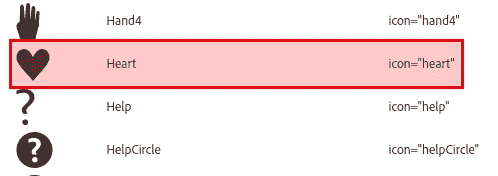

OOTB·科拉路易心形图标

然而，为了一致性，我将把`heart`重命名为`heart**s**`:

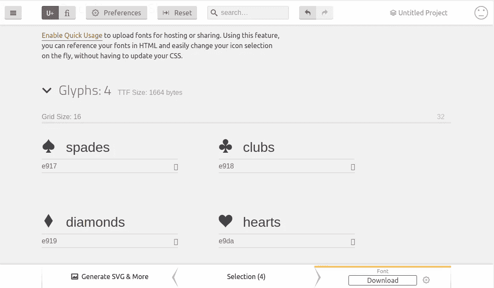

图标字体概述

> ***重要！*** 您的自定义前缀和图标名称都不能包含连字符，因为这将与 CoralUI 的字符串分割算法冲突，并破坏图标。相反，使用下划线。请注意，icomoon 对多单词图标名称使用连字符，因此如果使用它们，请务必重新命名。

您现在可以点击屏幕右下角的*下载*，这将下载一个. zip 文件。提取内容，您应该得到以下内容:

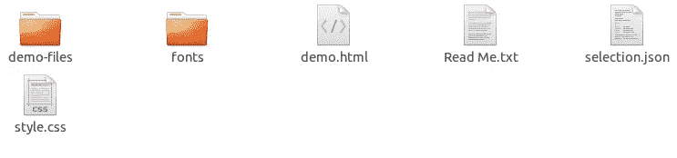

提取结果

重要文件包括:

*   `fonts`文件夹中的文件，它们是实际的图标 web 字体。
*   `styles.css`文件，其中包含图标类。

现在我们有了图标字体，我们准备好与 AEM 和 TouchUI 集成了！和往常一样，我们将使用 clientlib 来完成😁

# 创建客户端库

在组件节点(在我的例子中是`demo`)下创建一个 clientlib，结构如下:

```
/apps/demo/components/content/demo (cq:Component)
└── **clientlibs (nt:folder)**
    └── **editor(cq:ClientLibraryFolder)**
        ├── **css (nt:folder)**
        │   └── **icons.css (nt:file)**
        ├── **css.txt (nt:file)**
        └── **fonts (nt:folder)**
```

将提取的字体文件夹的内容复制到`fonts` nt:文件夹中。

现在打开提取的`style.css`文件。您应该看到以下内容:

这已经很不错了！它只是需要一些调整。将内容复制到`icons.css`并进行以下编辑:

1.  `@font-face`规则现在不正确。字体文件不在`fonts/`而是在`../fonts`。
2.  移除除了中间规则的`font-family`属性之外的所有属性，因为所有其他属性都已经由 CoralUI 提供了。

结果如下:

> **注意:** CoralUI 在某些情况下会试图覆盖`font-family`，所以请确保遵守`!important`规则。

现在，我们必须确保我们的 clientlib 在正确的时间装载。重要的是要理解它应该在 TouchUI 编辑器覆盖的上下文中加载，而不是在您站点的 clientlibs 的上下文中加载。

因此，我们给它一个自定义类别。将以下属性添加到`editor`节点:

```
categories  -  String[]  -  cmp.demo.editor
```

然后将以下属性添加到`cq:dialog`节点:

```
extraClientlibs  -  String[]  - cmp.demo.editor
```

这将导致 AEM 加载带有编辑对话框的 clientlib。

最后要做的事情是告诉 AEM 将哪个图标与每个选项相关联。重新访问`cq:dialog`的 select 小部件的项目列表，并为每个项目添加一个类型为`String`的`icon`属性，其值为图标的名称(包括自定义前缀，例如:`custom_hearts`):

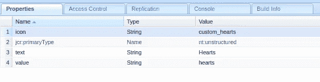

向心形选项添加图标

保存修改并在编辑模式下打开页面。将您的组件放在页面上，打开编辑对话框，您将看到下拉选择现在包含图标！

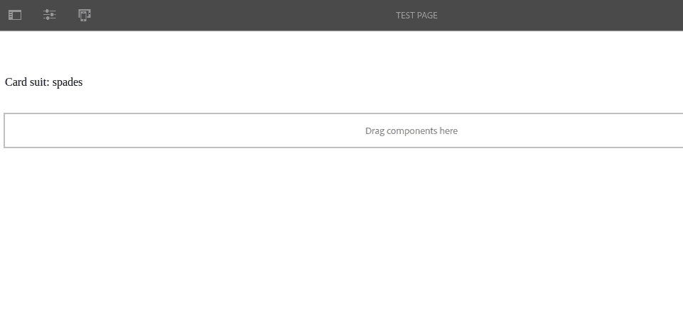

带图标的下拉选择

相当整洁！但这还不是全部，只需点击几次，我们就可以在 TouchUI 中的任何地方使用这些图标。让我们在下一节看看如何实现。

> **注意**:如果你来本教程是为了寻找一种创建可视图标选择器的方法，这个例子会很好。然而， [ACS Commons 有一个复杂的(虽然有点难看)图标选择器小部件](https://adobe-consulting-services.github.io/acs-aem-commons/features/ui-widgets/icon-picker/index.html),具有更高级的特性(搜索、分页等)。).

# 走向全球

那么，如果我们不只是想为一个特定的组件使用我们的新图标，而是在 TouchUI 的任何地方使用呢？例如，如果我们想在主屏幕上创建一个新的导航项目，该怎么办？

## 更新客户端库

实际上这很简单！让我们先把新创建的 clientlib 从组件中移出，放在`/apps/yoursite/clientlibs`下，并把它从`editor`重命名为`clientlib-icons`。

然后，您会看到类似这样的内容:

```
apps/demo/clientlibs
├── **clientlib-icons**
.   ├── **css**
.   │   └── **icons.css**
.   ├── **css.txt**
    └── **fonts**
        ├── **card-suits.svg**
        ├── **card-suits.ttf**
        └── **card-suits.woff**
```

现在我们需要改变 clientlib 的类别。它不再与一个特定的组件相关，相反，我们希望用 CoralUI 3 全局加载它。所以将 clientlib 的`category`属性改为`coralui3`。

现在从组件的`cq:dialog`节点中移除`extraClientlibs`属性。

检查你的组件编辑对话框，你应该看不到任何行为上的变化，只是 clientlib 现在在整个 TouchUI 中都是全局可用的，而不仅仅是那个组件的编辑对话框。

## 创建导航项目

要创建导航项，在 CRX DE 中找到`/libs/cq/core/content/nav node`，点击右键，选择*叠加节点*叠加到`/apps/cq/core/content/nav`上。然后创建一个名为`cards`的`nt:unstructured`类型的子元素，并赋予它以下属性:

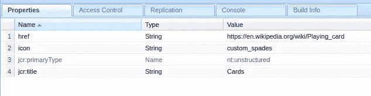

创建新的导航项目节点

看到我们如何使用`custom_spades`作为图标名称了吗？

现在在你的浏览器中导航到`/aem/start.html`，你应该会看到你非常熟悉的主页，但是有一个值得注意的附加功能！

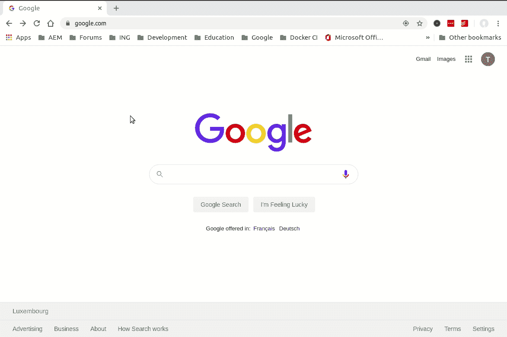

你现在可以在任何你想要的地方自由使用你的自定义图标😃

# **奖金**

用四个图标做一个下拉选择没什么大不了的，但是如果你想要 100 个图标呢？500?没问题！只需按照我之前的教程从 JSON 文件创建数据源，并为元素使用以下 JSON 结构(添加一个`icon`字段):

```
[
    {
        "text": "Hearts",
        "value": "hearts",
        "icon": "custom_hearts"
    }
    {
        "text": "Diamonds",
        "value": "diamonds",
        "icon": "custom_diamonds"
    },
    {
        "text": "Clubs",
        "value": "clubs",
        "icon": "custom_clubs"
    },
    {
        "text": "Spades",
        "value": "spades",
        "icon": "custom_spades"
    },
    ...]
```

我希望这个教程是清晰和有帮助的！如果你有任何进一步的问题，不要犹豫留下评论或在 LinkedIn 上找到我。

和往常一样，本教程制作的包可以在 GitHub 上下载[。](https://github.com/theopendle/aem-custom-icons/releases/tag/1.0.0)