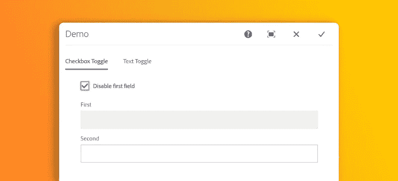
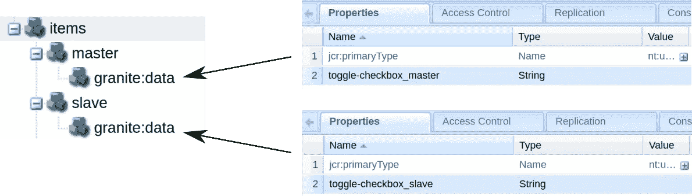
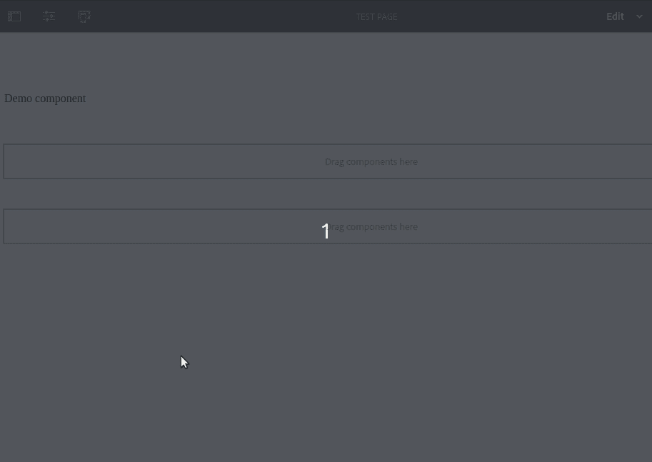
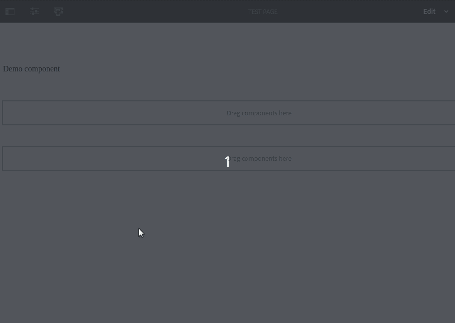

# AEM:根据复选框小部件(或其他任何东西)有条件地显示或隐藏字段

> 原文：<https://levelup.gitconnected.com/aem-conditionally-show-or-hide-a-field-based-on-a-checkbox-widget-or-anything-else-6b23b2515810>

## 如何创建一个通用系统来显示/隐藏、启用/禁用或实现编辑对话框中的任何条件逻辑



> 感谢我的朋友兼同事弗雷德里克·卡隆，是他启发了我写这篇教程👍

在之前的教程中，我向您展示了如何利用 OOTB 显示/隐藏功能，根据下拉选择在 AEM TouchUI 中有条件地显示小部件。

不幸的是，这是使用本机特性在 AEM 中有条件地显示小部件的唯一方法，因此在本教程中，我将向您展示我们如何使用复选框或任何其他小部件来重新创建类似的功能！

# 它是如何工作的

以下是我决定的一些条款:

*   **主**:这个小部件的值将决定从部件的行为(例如:如果主部件是一个复选框并且被选中，从部件将被禁用)
*   **Slave** :这些小部件将对主小部件值的变化做出反应。
*   **切换**:这是主机、从机和 JS 函数的组合，当主机值改变时，JS 函数更新从机。

使用`granite:data`节点配置主从关系。看一下这个例子，我们稍后将构建它:



有了这种关系，我们将编写一个脚本来检测主节点的变化，并相应地更新从节点。

# 创建客户端库

使用以下节点结构创建 clientlib:

```
/apps/demo/components/content/demo (cq:Component)
└── **clientlibs (nt:folder)**
    └── **editor(cq:ClientLibraryFolder)**
        ├── **js (nt:folder)**
        │   └── **toggle.js (nt:file)**
        └── **js.txt (nt:file)**
```

在`js.txt`中，加载`toggle.js`文件:

```
*#base=*js

toggle.js
```

在`toggle.js`文件中，粘贴以下代码:

为了让这个脚本易于阅读，我已经给出了大量的注释，但是让我们来看看发生了什么:

*   `toggle`包含一个`name`和一个`updateFuntion()`。
*   在`name`中，创建了两个选择器，一个用于主小部件(`data-toggle-checkbox**_master**`)，一个用于从小部件(`data-toggle-checkbox**_slave**`)。
*   当对话框加载或主控件值改变时，`updateFunction()`更新从控件。

让我们继续下去，我们将看到这个脚本的运行。将以下属性添加到我们的新 clientlib 中:

```
categories  -  String[]  -  demo.editor
```

好了，我们的 clientltib 已经准备好了，现在让我们通过提供选择主设备和从设备所需的属性来构建一个与`toggle.js`兼容的编辑对话框。

# 配置对话框

我将在本教程中使用一个叫做`demo`的超级简单的组件，这里是 HTL:

这里是`cq:dialog` XML:

重要部分如下:

*   `cq:dialog`节点的`String`类型的`extraClientlibs`属性被设置为`demo.editor`。当编辑对话框打开时，这将加载我们新创建的 clientlib。
*   主节点有一个`granite:data`子节点，它有一个空的`toggle-checkbox**_master**`属性，表示它是主小部件
*   从节点(`first`和`second`)具有`granite:data`子节点，子节点的`toggle-checkbox**_slave**`属性分别设置为`true`和`false`。这告诉我们的脚本他们是奴隶。

> **注意:** `granite:data`节点让你给小部件添加`data-`属性。因此，如果您有一个小部件，它的`granite:data`子部件的`foo`属性设置为`bar`，那么小部件标签将包含以下 HTML 属性: `data-foo="bar*"*`。
> 因此，`toggle-checkbox_slave`的“真”和“假”为字符串而非布尔值是正常的(即使看起来很奇怪)。

是时候测试我们的系统了！在*编辑*模式下打开一个页面，将您的组件添加到其中，然后打开它的编辑对话框，您应该会看到以下内容:



瞧啊。我们的两个文本字段现在从属于 checkbox 小部件😃当勾选该复选框时，一个被禁用，另一个被启用，反之亦然。

让我们再看一下`toggle.js`中的`updateFunction()`，这里是相关部分:

如您所见，如果 slave 属性值与复选框状态匹配，我们将把`disabled`属性设置为`true`。由于一个从机被设置为`true`，另一个被设置为`false`，我们得到这种交替模式。

# 更进一步

这很好，但是如果您希望能够基于任何其他小部件的值来切换任何小部件的状态/行为呢？

我以一种易于扩展的方式编写了这个`toggle.js`脚本。例如，不是只有一个`toggle`对象，我们可以有一个`toggles`数组，并将特性应用到每个对象上。用在找到的[脚本覆盖你的 `toggle.js`。](https://gist.github.com/theopendle/fda2bad4d92dbf7c2ad08629642c9f37)

正如您在新脚本中看到的，我现在有了一个额外的切换对象:

这将根据一个`textfield`主窗口小部件的值显示或隐藏一个从窗口。

让我们通过添加另一个选项卡来更新我们的`cq:dialog`。在`/apps/demo/components/content/demo/cq:dialog/content/items/tabs/items`下添加以下 XML:

现在返回页面编辑器，打开组件上的编辑对话框。您应该看到名为*文本切换*的第二个选项卡，其中包含一个文本字段。在文本字段中输入“ *show secret* ”并点击 Tab 键(或在字段外点击)。



这样做将显示我们的秘密下拉选择。

正如你所看到的，这个系统是完全通用的，可以用来在你的编辑对话框中实现任何类型的条件逻辑，只需简单地将 toggle 对象添加到 toggle 数组中，并编写一个`updateFunction()`😃

我希望这篇教程对你有所帮助，如果你有任何问题或评论，请不要犹豫，写在这里或者在 LinkedIn 上联系我👍

包含本教程结果的包可以在 [GitHub](https://github.com/theopendle/aem-toggle-widgets/releases/tag/1.0.0) 上获得。