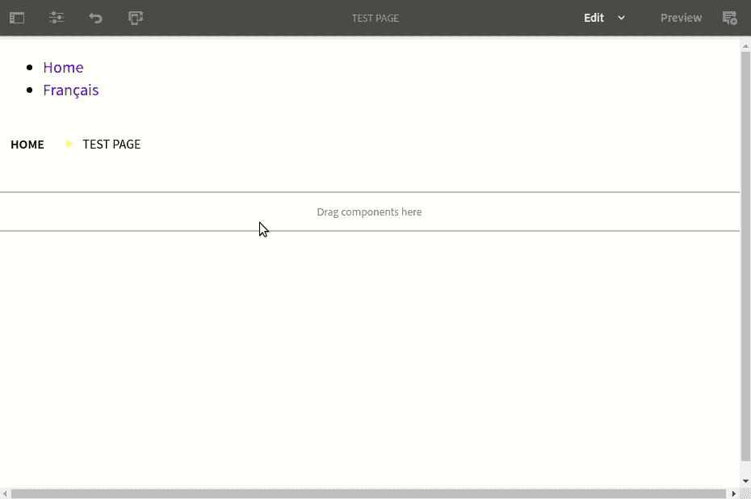
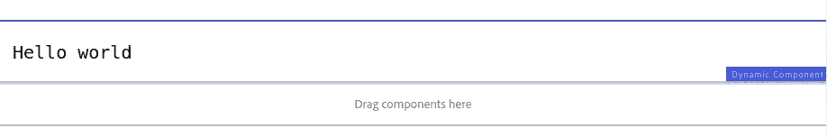
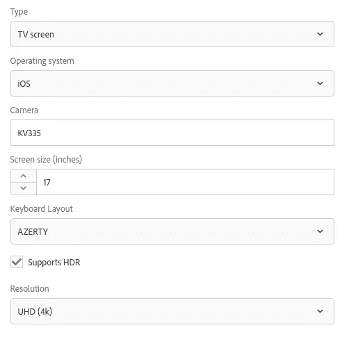
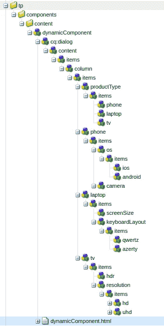
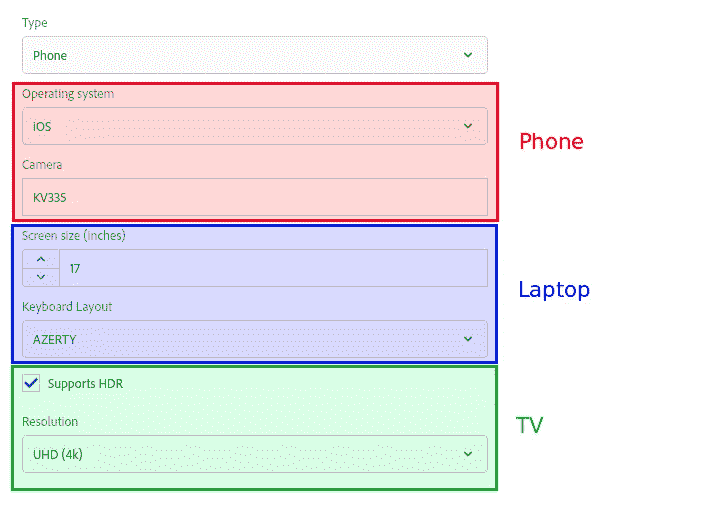
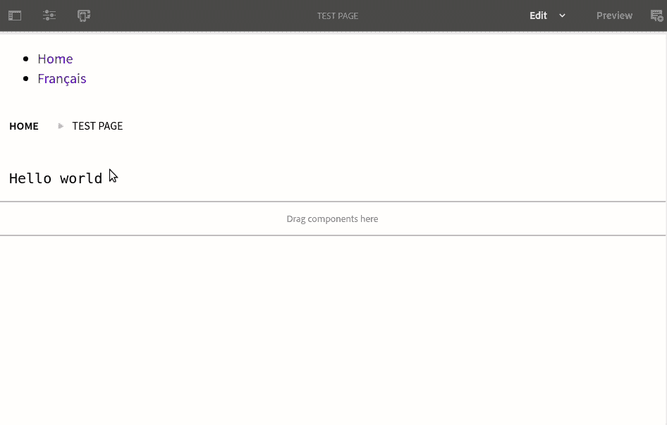
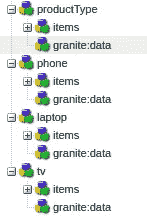
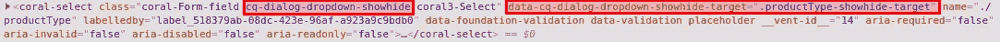

# AEM:在 Coral 3 的 TouchUI 对话框中有条件地显示或隐藏字段(例如:AEM 6.3+)

> 原文：<https://levelup.gitconnected.com/aem-conditionally-show-or-hide-fields-in-touchui-dialogs-with-coral-3-ie-aem-6-3-bfd48c261012>

如何创建一个可以根据用户输入动态显示或隐藏字段的 TouchUI 对话框是一个经常出现在 [AEM 体验联盟论坛](https://forums.adobe.com/community/experience-cloud/marketing-cloud/experience-manager/content)上的话题。

在本教程中，我将向您展示如何为基本 AEM 组件构建以下 TouchUI 对话框:



# 珊瑚 2 对珊瑚 3

网上似乎有许多教程描述了如何使用 Coral 2 实现这一特性，其中包括一个官方的 Adobe 指南:

1.  **Adobe 指南**:[https://helpx . Adobe . com/experience-manager/using/dynamic _ touch ui . html](https://helpx.adobe.com/experience-manager/using/dynamic_touchui.html)
2.  **来自 SGAEM 的教程:**[http://www . sgaemsolutions . com/2019/01/showhide-tabs-and-fields-based-on-drop . html](http://www.sgaemsolutions.com/2019/01/showhide-tabs-and-fields-based-on-drop.html)
3.  **视频图图利亚**l:[https://www.youtube.com/watch?v=JZFFxxiFpGY](https://www.youtube.com/watch?v=JZFFxxiFpGY)

但是，Coral 2 已经过时，在 AEM 的未来版本中可能会被弃用和/或删除。因此，尽可能考虑迁移到 Coral 3，因为它具有新的更好的特性，当您决定迁移到新版本时，它将使您的项目经得起未来的考验。你可以在这里了解更多关于 Coral 3 的信息:[基于 CoralUI 3 的迁移指南——Granite UI 1.0 文档](https://forums.adobe.com/external-link.jspa?url=https%3A%2F%2Fhelpx.adobe.com%2Fexperience-manager%2F6-4%2Fsites%2Fdeveloping%2Fusing%2Freference-materials%2Fgranite-ui%2Fapi%2Fjcr_root%2Flibs%2Fgranite%2Fui%2Fcomponents%2Flegacy%2Fcoral2%2Fmigration.html)。

然而，如果你决定开始使用 Coral 3 组件，避免创建混合了 Coral 2 和 Coral 3 的 ui/对话框，我已经看到了许多奇怪的副作用。您可以通过 Coral 2 和 Coral 3 在 JCR 中的位置来区分它们:

**珊瑚 2**:/libs/granite/ui/components/foundation
**珊瑚 3**:/libs/granite/ui/components/**珊瑚** /foundation

Coral 3 PSA 已经过时，让我们来看看我们的使用案例。

# 使用案例

你在一家多媒体零售公司工作，销售不同类型的硬件:电视、电话和笔记本电脑。他们希望您为他们的 AEM 网站创建一个组件，列出每个产品的技术规格。但是，根据产品的*类型*，技术规格会有所不同。

为了简化营销团队的工作，您决定创建一个可以适应每种产品类型的单一组件。组件的编辑对话框将允许用户选择产品类型并显示适当的技术规范字段。

事不宜迟，让我们建立一个对话！

# 1.创建对话

首先，我们需要一个组件来附加我们的编辑对话框，所以在 apps 下创建一个。我只是简单地将我的组件称为 dynamicComponent。给它一个 HTML 文件，现在，我们只是让它呈现一个简单的“Hello world”:

```
<pre>Hello world</pre>
```

将您的组件添加到组件组中，并创建一个模板策略，以允许它在您选择的页面模板上以创作模式使用。

现在创建一个页面并将组件放在上面，您应该会看到以下内容:



现在我们有了组件，让我们构建没有显示/隐藏功能的编辑对话框。结果如下:



节点结构如下所示:



下面是 XML:

# 2.添加显示/隐藏功能

下一步是根据用户选择的产品类型显示和隐藏某些字段:



为了做到这一点，我们需要告诉 AEM:

1.  哪个输入将决定显示或隐藏什么。在我们的例子中，它是**产品类型**下拉菜单。
2.  哪些字段将对应于下拉列表中的每个输入。

打开 CRX DE 中的 productType 节点，并添加以下属性:

```
granite:class - String - cq-dialog-dropdown-showhide
```

这基本上“激活”了显示/隐藏功能(下面进一步解释)。现在添加一个名为 **granite:data** 的节点，类型为 **nt:unstructured** 到 **productType** 。

将类型为**字符串**的 a**CQ-dialog-drop down-show hide-target**属性添加到 **granite:data** 节点中。该属性的值可以是您想要的任何值，我选择了**。产品类型-显示隐藏-目标**。基本上，这里你提供了一个 [CSS 选择器](https://www.w3schools.com/cssref/css_selectors.asp)来定位要显示或隐藏的字段。简单地说，这意味着*“显示或隐藏任何带有****product type-Show hide-target****class****”*。**

现在我们已经告诉 AEM *如何*显示或隐藏我们的字段，让我们告诉它*哪些*字段应该受到影响。您会从步骤 1 中注意到，每种产品类型有两个字段要显示。我没有每次显示/隐藏两个字段，而是将这些字段分成 3 个容器(每个容器对应一种产品类型),我们将显示/隐藏这些容器。

将以下属性添加到**电话**、**笔记本电脑**和**电视**容器节点中:

```
granite:class - String - productType-showhide-target
```

如果您刷新编辑器对话框，您应该会看到除了 **productType** 下拉列表之外的所有字段都消失了。这是因为我们已经给了 AEM*how*和 *what* ，而不是 *when* 。我们想告诉 AEM *“选择选项 Y 时显示容器 X”*。

在这 3 个容器下分别添加一个类型为 **nt:unstructured** 的 **granite:data** 节点。将以下属性添加到这些节点中:

```
showhidetargetvalue - String - {x}
```

其中{x}是要与每个容器关联的 productType 下拉列表的子项的值。例如:对于 **phone** 容器， **granite:data** 节点将包含以下属性:

```
showhidetargetvalue - String - **phone**
```

现在返回到您的对话框，您应该会看到根据下拉选择出现和消失的字段:



以下是 granite 的节点结构:数据节点:



这是 XML:

最后，用以下代码替换**dynamicComponent.html**的内容:

这将导致组件根据产品类型呈现技术规格。

> **注意**:如果布尔 **hdr** 值的处理看起来很奇怪，请查看[官方花岗岩文档](https://helpx.adobe.com/experience-manager/6-3/sites/developing/using/reference-materials/granite-ui/api/jcr_root/libs/granite/ui/components/coral/foundation/form/checkbox/index.html) n 中的复选框，并查看[Nate yoles](https://gist.github.com/nateyolles)的[要点](https://gist.github.com/nateyolles/e5eed811dc9c35961c23)。

# 说明

显示/隐藏功能由*/libs/CQ/GUI/components/authoring/dialog/dropdownshohide/client libs/dropdownshohide/js/dropdownshohide . js*脚本实现。

该脚本简单地使用 CSS 选择器从具有目标类的元素中添加或移除 **hide** 类(在我们的例子中是**product type-show hide-target**)。

属性让我们向一个元素添加类。 **granite:data** 节点让我们向元素添加 **data-** 属性。如果您检查 **productType** dropdown 元素，您会看到这样的效果:



**CQ-dialog-drop down-show hide**类是由 **granite:class** 属性和**data-CQ-dialog-drop down-show hide-target = "添加的。product type-show hide-target "**属性是由 **granite:data** 节点的**data-CQ-dialog-drop down-show hide-target**属性添加的。

需要记住的一件重要事情是，字段的显示/隐藏纯粹是 UI 的事情，*对 JCR* 没有任何影响，这意味着如果您隐藏了 **tv** 容器的 **hdr** 和**分辨率**字段，然后再隐藏它们，您的组件将仍然具有 **hdr** 和**分辨率**属性。在实现组件时，不要忘记处理这种可能性。

你可以在这里找到这个教程[的源代码。](https://github.com/theopendle/aem-dynamic-dialog-fields)

如果你想下载并安装本教程第一步或第二步的软件包，你可以在这里找到它们。