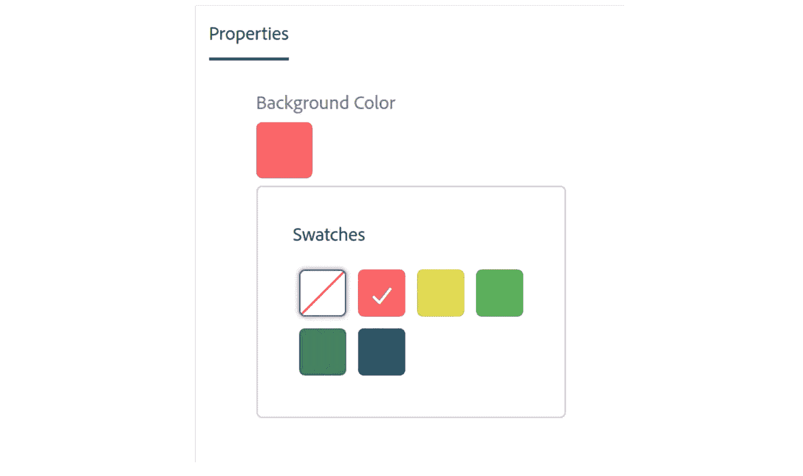

# AEM:使用预定义的调色板创建颜色选择器

> 原文：<https://levelup.gitconnected.com/aem-creating-a-color-picker-with-a-predefined-palette-c4a03c1eddc5>

## 如何让作者从预定义的可视调色板中选择颜色？



# 使用案例

作为行业领先的解决方案，AEM 通常用于大中型公司，这些公司通常拥有成熟的品牌和视觉形象。出于这个原因，通常有必要给网站作者提供从一系列颜色中进行选择的能力，使他们能够在品牌中具有创造性和创新性，但也要保持在网站的外观和感觉的范围内。让我们看看如何在 TouchUI 对话框中提供有限的调色板。

# 现有的解决方案

[Adobe Core Components](https://github.com/adobe/aem-core-wcm-components) 通过使用一个 [Granite ColorField](https://helpx.adobe.com/experience-manager/6-4/sites/developing/using/reference-materials/granite-ui/api/jcr_root/libs/granite/ui/components/coral/foundation/form/colorfield/index.html) 小部件(基于一个`Coral.ColorInput`组件，你可以在这里看到[的演示](https://helpx.adobe.com/experience-manager/6-3/sites/developing/using/reference-materials/coral-ui/coralui3/Coral.ColorInput.html))为他们的[容器组件](https://www.aemcomponents.dev/content/core-components-examples/library/container/container.html)的背景色做这件事，该小部件根据页面模板中的组件策略显示颜色。

以下是允许我们添加预定义颜色(此处称为“样本”)的容器组件策略:


使用组件策略修改样本

以下是编辑对话框中的结果:


如您所见，我们在组件策略级别定义的样本现在可供选择。使用策略中的其他选项，我们还可以启用或禁用自定义颜色创建器。

这是一个好的开始，但是如果您有一个调色板可以在许多不同的上下文中的许多不同的组件中使用呢？调色板包含 30 种颜色的图像。我们现在必须到处添加策略(并维护它们)。

此外，如果我们不希望模板作者能够改变样本呢？如果我们想确保我们网站的视觉准则得到尊重，我们必须将它们限制在特定的调色板上。

# 多走一步

所以我们决定锁定我们的调色板，并使它作为自定义组件的背景色。我们将通过为我们的调色板使用一个单一的数据源来实现这一点，使用来自我以前的教程的数据源系统。

> 重要提示:这个解决方案依赖于上一个教程中的数据源系统，所以请先阅读那个教程！

像往常一样，滚动到底部找到包含教程结果的包。

## 该组件

首先，让我们创建一个定制组件。出于本教程的目的，我正在创建一个超级简单的组件，它只在一个彩色框中显示一些文本:

为了挑选背景的颜色，我们将需要下面的`cq:dialog`节点:


您可以在这里找到完整的 XML [，但重要的部分是`backgroundcolor`节点(在上面的红框中):](https://gist.github.com/theopendle/ecde3cee86df537da13beb8acf7511da)

最显著的特性是:

*   `showDefaultColors = false`避免显示默认色板
*   `showProperties = false`避免显示允许作者创建自定义颜色的颜色滑块
*   `showSwatches = true`显示色板面板
*   `variant = ”swatch”`避免显示允许作者输入自定义十六进制或 RBG 代码的文本框

## 数据源

要创建数据源，请确保您已经实现了在[之前的教程](https://medium.com/p/edafada90cc4)中详述的系统，然后在您的站点节点下创建一个数据源文件夹(例如:`/apps/tipi/datasources/colors`)。在该文件夹中，创建一个`colors.html`文件并粘贴以下代码:

现在让我们创建我们的调色板！前往 [Colormind](http://colormind.io/) 生成一个调色板，这是我的:


由此，我们可以创建以下 JSON，然后将其保存在您的`colors`文件夹下的一个名为`data.json`的文件中:

如果您阅读了上一篇关于数据源的教程，您可能会奇怪为什么这里的 JSON 元素中缺少了`text`属性。这是因为 ColorField widget 目前无法显示标签。您仍然可以添加`text`属性，只是为了让文件更易于阅读。

## 修复

此时，你可能认为你的解决方案已经准备好了，你几乎是正确的。如果您前往一个页面，放置您的组件，打开编辑对话框并尝试选择一种颜色，您应该会看到以下 UI 错误:


为什么我们的样本面板会消失在对话框的左侧？如果你查看 DOM，你会在呈现这个面板的`coral-overlay`元素上看到这两个不可靠的属性:


这就是问题所在，我们真正想要的是我们的面板在左边对齐。那么我们该如何改变这种情况呢？不幸的是，没有简单的方法，因为 granite 不提供修改这些属性的 OOTB 方法😒

> **注意:**如果你没有看到这个 UI bug，那真是个好消息！这意味着 Adobe 已经修复了这个问题。

这意味着我们必须写一些 JS 来解决这个问题。回到您的组件(我的在`/apps/tipi/components/content/datasourcedemo`)并在它下面创建以下节点结构(粗体):

```
apps
 \ — tipi
     \ — components
         \ — datasourcedemo
            ** \ — clientlibs (nt:folder)
                 \ — editor (cq:ClientLibraryFolder)
                     \ — js.txt (nt:file)
                     \ — js (nt:folder)
                         \ — datasourcedemo.js (nt:file)**
```

向编辑器节点添加一个`categories`属性，并给它一个您选择的值(我使用了 `tipi.components.datasourcedemo.editor`)。

现在打开`datasourcedemo.js`，复制以下代码:

这段代码将简单地找到覆盖图并修复上面提到的两个属性。然而，要使该代码工作，需要做两件事:

1.  它必须与组件一起加载。
2.  它必须能够使用 CSS 选择器找到编辑器对话框。

为了加载 clientlib，我们需要转到`cq:dialog`节点并添加一个`extraclientlibs`属性。该值的类型应该是`String[]`，并且应该是一个单独的项目:有问题的 clientlib 的名称(在我的例子中是`tipi.components.datasourcedemo.editor`)。

为了让脚本使用`DIALOG_CONTENT_SELECTOR` CSS 选择器(在我的例子中是`.cmp-datasourcedemo__editor`，但是您可以将其更改为您选择的类名)找到覆盖，我们必须通过转到`cq:dialog/content`节点并添加以下属性将该类名添加到编辑对话框中:

```
granite:class  -  String  -  cmp-datasourcedemo__editor
```

> 组件的最终状态(`cq:dialog`、clientlibs、数据源等等)可以在 Github 上找到。滚动到页面末尾，找到回购的链接。

## 结果呢

就是这样！现在，当您打开组件的编辑对话框时，脚本将加载，调整覆盖，您可以选择您的颜色:


现在，您的作者有了一个清晰、直观的方法来为他们的设计添加颜色，同时遵守任何公司准则，并且您可以在任何需要的地方重用调色板数据源！

我希望这篇教程对你有所帮助，如果你有任何问题，请在下面留下评论或者在 LinkedIn 上联系我。

你可以从 [Github](https://github.com/theopendle/aem-color-picker-palette) 找到一个安装包来安装在本教程中创建的组件，但是不要忘了，如果没有来自[本教程](https://medium.com/p/edafada90cc4)的数据源系统，这个是不行的！