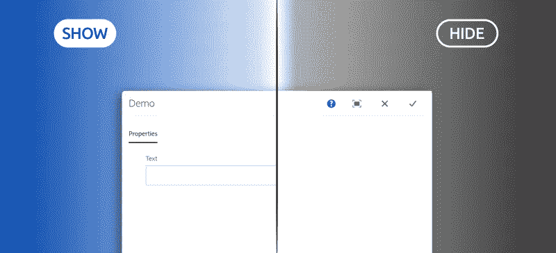
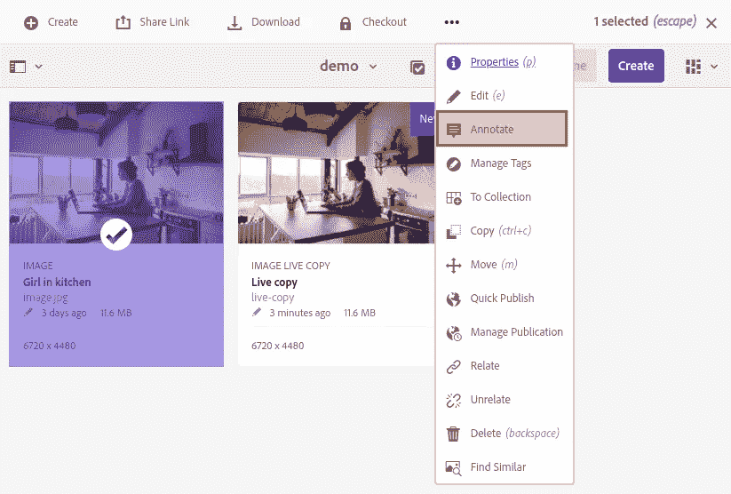
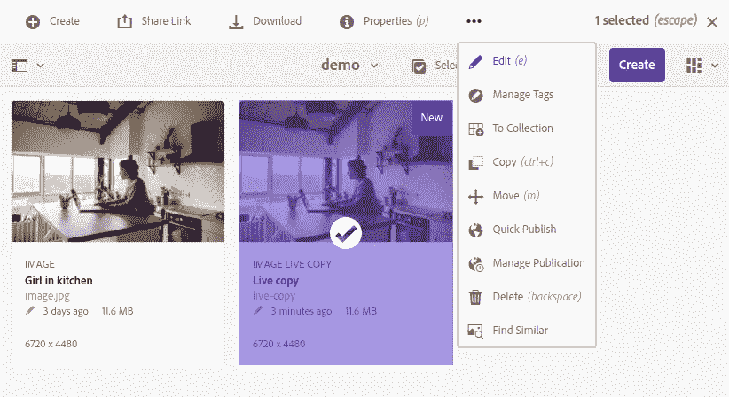
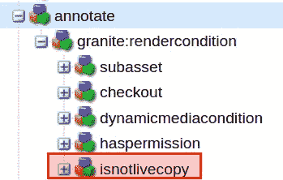
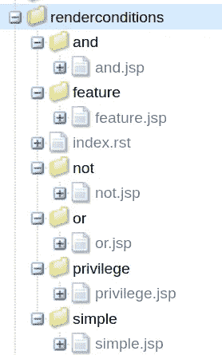
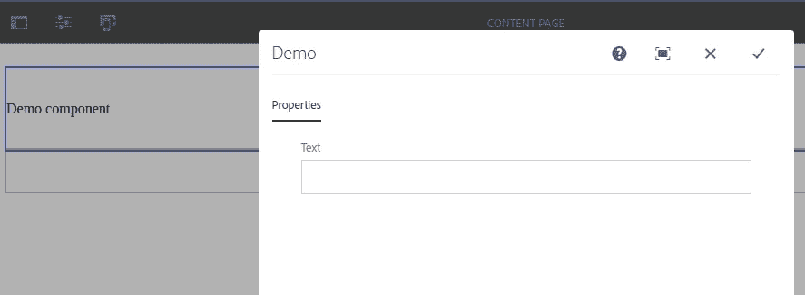
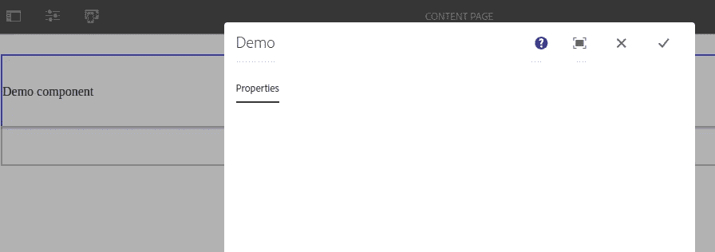

# AEM:创建自定义花岗岩渲染条件

> 原文：<https://levelup.gitconnected.com/aem-creating-custom-granite-render-conditions-28a21958f420>

## 如何使用 HTL 和 Java Sling 模型而不是 JSP 为 AEM TouchUI 创建一个定制的复杂呈现条件



# 什么是花岗岩渲染条件？

“呈现条件”是一个不言自明的术语。更具体地说，根据[花岗岩文档](https://helpx.adobe.com/experience-manager/6-4/sites/developing/using/reference-materials/granite-ui/api/jcr_root/libs/granite/ui/docs/server/rendercondition.html)，是“*技工指示组件是否应该渲染*”。

那么它是如何工作的呢？如果您曾经使用过资源(尽管还有成百上千的其他资源)，您可能会发现这样一个例子:您不能对原始资源执行与活动副本相同的操作。

一个这样的例子是*注释*，您不能在实时副本上这样做。以下是对原始资产的工具栏操作:



在 live 副本中，它已经消失了(许多其他副本也是如此)！



这个效果是通过一个渲染条件实现的，你可以在这里找到:`/libs/dam/gui/content/assetdetails/jcr:content/actions/annotate`



注释动作和呈现条件

在这个例子中，`granite:rendercondition`节点将所有其他节点进行 and 运算。

现在我们已经看到了一个例子，让我们看看如何创建我们自己的自定义渲染条件

# 使用 OOTB 渲染条件

首先要知道的是，AEM 提供了一个 OOTB 渲染条件，您可以使用它来创建相对简单的条件。

Nate Yolles 在 GitHub 上发布了一个[参考，向你展示了如何在](https://gist.github.com/nateyolles/eec2f56acc7153fe9fb7dd6637e8f7ad) [Java EL(表达式语言)](https://docs.oracle.com/javaee/7/tutorial/jsf-el.htm)中使用 OOTB `granite/ui/components/coral/foundation/renderconditions/simple`渲染条件。不幸的是[相关的博客](http://www.nateyolles.com/blog)已经不在线了，但是参考资料仍然很方便。

参考资料中有一个这样的例子:

在这种情况下，如果作者使用 Chrome，您将只在组件的编辑对话框*中显示一个字段。*

不幸的是，您可以用简单的呈现条件做的事情是有限的，并且 AEM 的 EL 文档很差，很难维护。因此，让我们来看一个用例，看看我们如何创建一个自定义的渲染条件来解决它。

# 使用案例

> **注意**:这个用例的灵感来自 AEM 体验联盟论坛上的[这个问题。感谢用户](https://experienceleaguecommunities.adobe.com/t5/adobe-experience-manager/using-component-model-data-to-show-hide-fieldset-in-component/qaq-p/358232) [neos45149736](https://experienceleaguecommunities.adobe.com/t5/user/viewprofilepage/user-id/11675486) 的有趣挑战👍

下面是我们想要做的:创建一个组件编辑对话框，只有当组件位于具有某个导航标题的页面上时，该对话框才会呈现某个字段*。*

> **注意**:对于本教程，我使用可编辑的模板。

我不会讨论如何创建一个模板，[我假设你已经有了一个](https://docs.adobe.com/content/help/en/experience-manager-learn/sites/page-authoring/template-editor-feature-video-use.html)。

# 创建组件

我们首先需要一个非常简单的组件。以下是 HTML:

这里是`cq:dialog` XML:

需要注意的最重要的部分是`text`节点下的`granite:rendercondition`节点。

现在它指向`demo/renderConditions/navTitle`处的渲染条件。这还不存在，但是我们将在下一节中创建它。

它还有一个`allowedNavTitle`属性，这是触发条件的导航标题。如果组件被放置在带有*任何其他导航标题*的页面上，那么`text`文本字段将被隐藏。

# 创造条件

现在有趣的部分来了。如果你去 CRX 德看看`/libs/granite/ui/components/coral/foundation/renderconditions`，你会看到一些 OOTB 渲染条件。如果你点击它们中的每一个，你会注意到它们使用 JSP 工作。其实据我所知，所有的渲染条件都是这样实现的。



格鲁斯。

就我个人而言，我认为 JSP 很讨厌，它们属于 17 世纪，所以我们将跳到现在，使用一个吊索模型，如下所示:

这个算法非常简单，但是你可能会想:*“这看起来有点冗长，为什么我不在当前页面中注入* `@ScriptVariable private Page currentPage` *或者其他什么？”*。

我们需要记住的是，我们将用这个模型适应的请求是*而不是*对演示组件资源的请求，它是对呈现条件资源的请求*(对我来说是`/mnt/override/apps/demo/components/content/demo/cq:dialog/content/items/tabs/items/properties/items/columns/items/column/items/text/granite:rendercondition`)。因此，没有`currentPage`，因为资源实际上不在页面上(它在`cq:dialog`中)。*

既然我们的模型已经准备好了，就叫它 via HTL 吧。在您的`/apps/site`文件夹下创建以下节点结构:

```
/apps/demo
└── **renderConditions (nt:folder)**
    └── **navTitle (nt:folder)**
        └── **navTitle.html (nt:file)**
```

在`navTitle.html`文件中，粘贴下面一行(指向你的模型):

现在我们已经准备好所有的材料来测试我们的创造！

创建一个页面，转到 Properties 并将导航标题设置为与`allowedNavTitle`相同的字符串，然后将组件放在上面并打开编辑对话框。您应该会看到文本字段出现，没什么特别的:



文本字段呈现

现在把`granite:rendercondition` `allowedNavTitle`属性改成别的(我就在最后加个`x`)。

请刷新页面，然后重试。现在德州已经消失了！



Textfield 不呈现

除非页面导航标题与`allowedNavTitle`属性匹配，否则文本字段不会出现😀

希望这篇教程对你有帮助。如果你有任何意见或问题，你可以在这里分享或联系我。

组件和渲染条件可以用这个包安装在 [Github](https://github.com/theopendle/aem-render-conditions/releases/tag/1.0.0) 上(你必须自己添加 Java Sling 模型)。