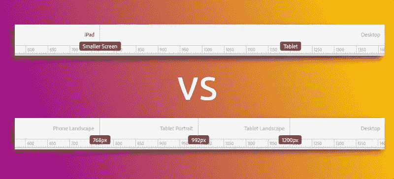
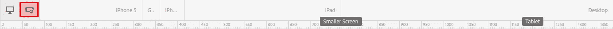
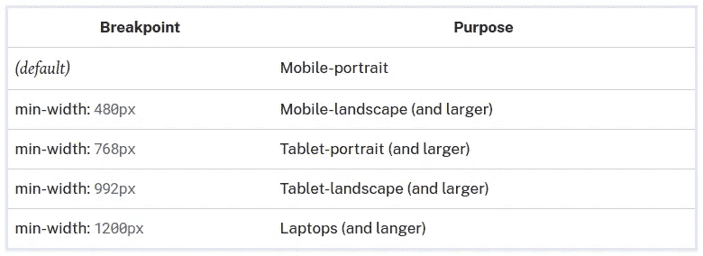
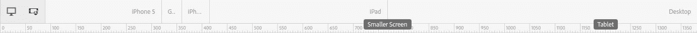
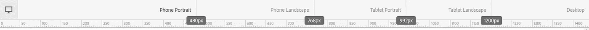
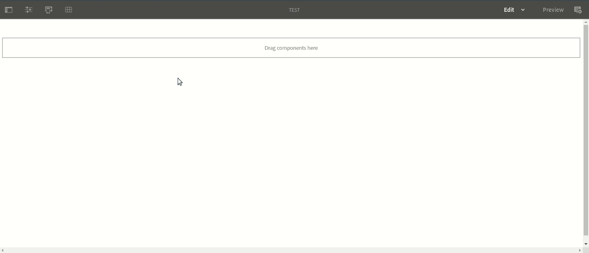

# AEM:在布局模式下定制模拟器

> 原文：<https://levelup.gitconnected.com/aem-customize-emulators-in-layout-mode-288f951d96c5>

## 如何添加，删除或替换模拟器，以帮助您的作者设计不同布局的内容

作为一名开发人员，我必须承认:我实际上并不关心真正的设备尺寸，我只关心`@media()`查询……**# sorry not sorry**。所以当 AEM 的作者来告诉我他们也没有时，我感到惊喜。

如果你曾经使用过 AEM 页面编辑器和*布局*模式，你会熟悉 AEM 提供给 OOTB 的默认断点和模拟器:

非常嫌疑犯

这些默认设置的问题是，它们要求作者在多个方向上使用多个仿真器，以便到达每个断点。例如上图中，如何测试平板电脑断点？ *iPad* 太小，*桌面*太大。

你必须点击*设备旋转*按钮(红色)让 iPad 进入横向模式，然后在完成后再次点击按钮返回纵向模式。

这是世界末日吗？

号码

但是，如果您每天都要做数百次来创建和测试布局，这是不是很烦人？

是的。

老实说，确切地知道你的内容在特定设备上会是什么样子是有价值的，即使它*被笨拙地设置在两个断点之间。但在当今世界，市场上有如此多的设备，尺寸也如此多样化，以至于针对一个特定设备尺寸的测试仍然只能提供目标受众体验的 1–2%的快照。*

相反，我们将抽象维度来表示“设备原型”，这是一种描述“典型设备”的很酷的方式。例如“典型的纵向手机”或“典型的横向平板电脑”。在本教程中，我们将把 AEM 模拟器与这些原型断点对齐。该死的设备！

# 前提

出于本教程的目的，我们将使用以下断点，这些断点基于[这篇分解了最流行的屏幕尺寸](https://ricostacruz.com/til/css-media-query-breakpoints)的文章:

最后，我们会改变这一点:

变成这样:

# 创建断点

首先要做的是在 480 像素、768 像素等位置创建断点。我不会对此进行过多的描述，因为您的项目可能已经实现了那些断点，但简而言之:断点(以及 AEM 响应网格)的生成是使用一个`grid.less`文件(它是 AEM Maven 原型的一部分)完成的。

如果您不知道我在说什么，那么最好先阅读一下[index.js](https://medium.com/@tiffanyolejnik#base=</em>jsjs<span id=)[life](https://developer.mozilla.org/en-US/docs/Glossary/IIFE)添加到 index.js 文件中:

就是这样！重新加载页面编辑器，享受断点和模拟器之间新的 1:1 映射🙂

我希望这篇教程能帮助你为你的作者实现一个很酷的特性😁

我的演示项目中对应于本教程的一个分支可以在 GitHub [这里](https://github.com/theopendle/aem-custom-emulators)找到。现成的安装包在这里是。

如果您有任何问题或意见，可以留在这里或通过 [LinkedIn](https://www.linkedin.com/in/theo-pendle-1630a52a/) 联系我！