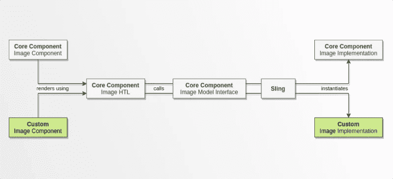
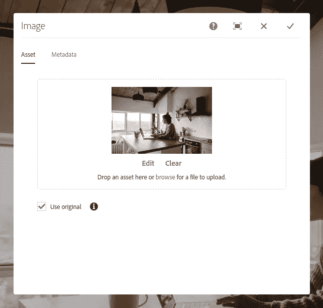

# AEM:使用资源类型关联和委托扩展核心组件模型

> 原文：<https://levelup.gitconnected.com/aem-extend-core-component-models-using-resource-type-association-and-delegation-b8855ed281e2>

## 如何使用图像资源的原始再现，而不必从头开始创建组件



AEM 核心组件是非常有用的资源，随着它们被包含在 [AEM Maven 原型](https://github.com/adobe/aem-project-archetype)和 [WKND 教程](https://docs.adobe.com/content/help/en/experience-manager-learn/getting-started-wknd-tutorial-develop/overview.html)中，它们在 AEM 站点开发中变得无处不在。如果你还没有使用它们，我强烈建议你使用。

每当我决定创建一个新的组件时，我都将核心组件作为一个参考点，看看它们是否为我的需求提供了一个解决方案。答案是:

1.  有时没有，所以我从头开始创建组件。
2.  有时候是的，所以我只是简单地将核心组件代理到我的项目中。
3.  经常…有点。核心组件没有所有的答案(这是一件好事，否则我不会有工作！)，但是它们是一个很好的基础。

# 用例

作者想在网站上放置一些非常高分辨率的图像，性能见鬼去吧！他们要求有一个选项，允许他们使用图像资产的*原始*再现，而不是获取适应页面上图像大小的网络友好再现。

在这种情况下，[核心组件(CC)映像](https://docs.adobe.com/content/help/en/experience-manager-core-components/using/components/image.html)几乎是*完美的，它只需要一点调整。那么如何才能以最小的努力满足这个要求呢？这是本教程的主题。*

# 解决办法

下面是横幅图片(我刚刚给你省了三个鼠标滚轮，不客气):


我们将利用 Sling 模型关联的能力来实现一个 Sling 模型，该模型仅覆盖来自 CC 图像模型的最少行为。不幸的是，这个强大的技术在关于主题的 [Sling 文档中被简单提及，所以本教程将作为一个实际的例子。](https://sling.apache.org/documentation/bundles/models.html#associating-a-model-class-with-a-resource-type-since-130)

正如您在图中看到的，我们所需要的是一个代理图像组件(如果您使用 AEM Maven 原型来引导您的项目，您应该已经有了)和一个超短模型(30 行，不包括导入),我们将在下面创建它。我们将让 CC 和 Sling 来做繁重的工作！

通过这样做，我们可以:

*   避免重新实现逻辑
*   受益于核心组件的未来版本
*   避免写新的 HTL 剧本

# 编写我们的模型

CC Image 组件依赖一个名为 [ImageImpl](https://github.com/adobe/aem-core-wcm-components/blob/master/bundles/core/src/main/java/com/adobe/cq/wcm/core/components/internal/models/v2/ImageImpl.java) 的类来实现它的模型。

“好吧，让我们扩展模型”你可能会想。不完全是。相反，我们将使用[委托模式](http://best-practice-software-engineering.ifs.tuwien.ac.at/patterns/delegation.html)来覆盖 CC 模型的行为，并依靠 CC [图像接口](https://github.com/adobe/aem-core-wcm-components/blob/master/bundles/core/src/main/java/com/adobe/cq/wcm/core/components/models/Image.java)来提供我们需要的方法，请看:

我已经做了过多的注释，所以你可以一行一行地了解这个模型是如何工作的，但是可能有一些你不熟悉的东西:

*   `[@Delegate](https://projectlombok.org/features/Delegate.html)` [是一个 Lombok 注释](https://projectlombok.org/features/Delegate.html)，它生成基本委托模式所需的样板代码。
*   吊索关联是通过`@Model` 注释的`resourceType`属性完成的。更多信息请见下文。

如果你现在在你的站点的页面上创建了 place Image 组件，你将看不到任何东西，因为现在没有提供一个`useOriginal`属性值。但是在幕后，Sling 正在实例化我们的`CustomImage`模型。

发生这种情况是因为我们没有更改组件的 HTL 脚本，该脚本包含以下行:

```
data-sly-use.image=”**com.adobe.cq.wcm.core.components.models.Image**”
```

所以当它运行时，Sling 将收到一个创建`com.adobe.cq.wcm.core.components.models.Image`实例的请求，除了现在它有两个选择:

1.  `com.adobe.cq.wcm.core.components.internal.models.v2.ImageImpl`
2.  我们的`CustomImage`班。

面对这种困境，Sling 将检查发出请求的组件的`sling:resourceType`，在我们的例子中是`demo/components/content/image`。这与我们的`CustomImage` `resourceType`匹配，但是*与`ImageImpl`的*不匹配，所以我们的类将被实例化。

# 覆盖编辑对话框

现在让我们为我们的模型提供一个`useOriginal`布尔值。覆盖代理图像组件中的`cq:dialog`节点以添加复选框。下面是 XML:

保存并重新加载您的页面。编辑图像组件，您应该会看到复选框出现:



选择高分辨率图像，勾选复选框并保存。现在，您应该看到图像以其原始分辨率呈现。

以下是`useOriginal`为`false`时图像的`src`属性:

```
src="/content/demo/us/en/1/_jcr_content/root/responsivegrid/image.coreimg.jpeg/1590780252215/image.jpeg"
```

这里是当`useOriginal`是`true`时:

```
src="/content/dam/demo/image.jpg"
```

这次我不提供 GitHub 链接，因为实际上要分享的代码太少了(这是重点😉).我希望这有助于说明在幕后使用 CCs 是多么容易。如果你有任何问题或只是想联系，请随时在 LinkedIn 上找到我！