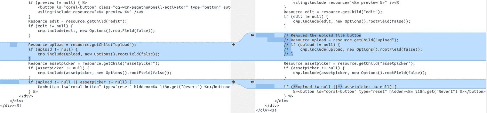

# Adobe Experience Manager:通过堵塞漏洞强制对图像使用 DAM

> 原文：<https://levelup.gitconnected.com/aem-forcing-the-use-of-the-dam-for-images-by-closing-loopholes-b102d944cad2>

## 如何防止用户不经过大坝上传图片到 AEM？


DAM(数字资产管理器)是 AEM 的资产管理系统，应该是所有资产进入 AEM 平台的单一入口，也是在内容中使用这些资产的一站式商店。

DAM 不仅仅是存储资产，它还提供有用的功能，如资产验证、许可证管理、标记和分析等。即使您不使用这些功能，也有很多原因让您希望确保所有资产都在同一个地方，在同一个管理系统下:

1.  资产很容易找到，特别是如果你有一个常识性的目录结构或者使用[集合特性](https://helpx.adobe.com/gr_en/experience-manager/6-5/assets/using/managing-collections-touch-ui.html)。
2.  如果您想要运行工作流(如内容验证)或对新资产进行任何类型的处理，这可以在创建 DAM 资产时完成。
3.  如果您需要将资产从另一个平台转移到另一个平台，集成会变得很容易。

然而，用户可以通过使用我认为是 OOTB 组件中的“漏洞”来绕过 DAM，直接从他们的机器上传文件(通常是图像)到 JCR 中的特定位置，而不必将该文件放在 DAM 中。


漏洞:照片由[梅姆](https://unsplash.com/@picoftasty?utm_source=unsplash&utm_medium=referral&utm_content=creditCopyText)在 [Unsplash](https://unsplash.com/s/photos/rope?utm_source=unsplash&utm_medium=referral&utm_content=creditCopyText) 上拍摄

如果上面的环的图像让你想起了刽子手的绳子，那不是巧合！让这些漏洞存在会导致包含“浮动资产”的被污染的 JCR，这对于任何类型的批处理作业都是一个巨大的痛苦，并且从长远来看会对 JCR 的大小产生毁灭性的影响。

# AEM 站点图像组件

我们先来看看最明目张胆的漏洞:图片组件的*浏览*选项。


浏览按钮

如果您使用“上传”按钮来提供图像，会发生以下情况:


存储在页面级别的图像

图像保存在页面级别，而不是 DAM，这使得将来很难找到它。现在想象一下，同一个高分辨率图像在 10 个地方使用，并且每次用户都从他们的系统上传:你现在储存了 10 个图像，而不是在 DAM 中保存一次并引用 10 次。

上面的 CRXDE 截图中的页面大小是 7.3MB(参考大坝)和 3.1MB(上传图像)(增加了 424 倍)！

这种提供图像的方法也存在潜在的安全风险。拥有机密信息访问权限和芯片的用户可以使用*浏览*功能上传一个隐藏为 JPEG 格式的文本文件，该文件发布后，外界可以访问。我在下面的 GIF 中演示了这个场景:


使用图像组件暴露机密信息

当然，您可以采取许多安全措施来防止这种滥用，但是删除*浏览*选项是一个好的开始。

相信了吗？让我们来看看如何“停用”这个特性。

## 选项 1:对于特定组件

“最干净”的方法是使用 Image 组件的`/libs/cq/gui/components/authoring/dialog/fileupload`组件的`allowUpload`属性。将该属性设置为`false`将会移除*浏览*按钮。

如果您正在使用 AEM 核心组件，那么您可以通过将`/apps/core/wcm/components/image/v2/image/cq:dialog/content/items/tabs/items/asset/items/columns/items/column/items/file`处的节点复制到您的映像组件中，并简单地向其添加以下属性来实现这一点:

```
allowUpload  -  Boolean  -  false
```

## 选项 2:全球

如果你想完全删除这个功能，你可以通过在`/libs/cq/gui/components/authoring/dialog/fileupload/render.jsp`覆盖 JSP，简单地删除读取`allowUpload`属性和呈现*浏览*按钮的代码。

下面是一个示例，但是请查看 GitHub repo 以了解 JSP 的完整重构:


从 JSP 中删除*浏览按钮*

# AEM 形成图像和图像选择组件

AEM 表单组件图像和图像选择也存在同样的问题:


然而，一般来说，AEM 表单的定制友好性比 AEM 网站差得多，所以我们需要采用一种变通方法来使这个按钮消失。

两个组件的`cq:dialog`节点树的大部分都标有`granite:InternalArea` mixin，表示[它们不可扩展，也不能被覆盖](https://docs.adobe.com/content/help/en/experience-manager-64/deploying/upgrading/sustainable-upgrades.html)。这也使得它们在 CRXDE 中显示为灰色:


标有花岗岩的节点:内部混合

由于我们不能直接修改这些节点，我们将创建一个 CSS clientlib 来阻止按钮的呈现。

创建类似于以下内容的节点结构:

```
**apps**
 \ — **customization** (nt:folder)
     \ — **clientlibs** (nt:folder)
         \ — **restrict-asset-upload** (cq:ClientLibraryFolder)
             \ — **css.txt** (nt:file)
             \ — **css** (nt:folder)
                 \ — **restrictAssetUpload.css** (nt:file)
```

将以下内容添加到`css.txt`:

```
#base=cssrestrictAssetUpload.css
```

我们可以修改`restrictAssetUpload.css`的内容来实现我们的特性。下面的 CSS 将隐藏*上传*按钮:

现在，我们必须确保这个 CSS 加载了与表单编辑器相关联的其余 clientlibs。

这两个组件的现有样式在`/libs/fd/af/authoring/clientlibs/granite/components/imageUploadStyles` clientlib 中，clientlib 属于`imageUpload`类别。为了同时加载我们的 CSS，我们将把它放在同一个类别中，这样它就可以被 AEM 选中并与其他的 stlyes 合并。将以下属性添加到`restrict-asset-upload`节点:

```
categories — String[] — imageUpload
```

现在重新加载您的 AEM 表单编辑器，并打开一个图像组件的配置侧面板，您应该会看到 Upload 按钮消失了。


不再上传按钮

你会看到同样的图像选择。

当然，这并不能阻止精通技术的用户在浏览器中检查 DOM，删除`display: none;` CSS 属性并点击上传按钮，但这是一个好的开始。如果您想更进一步，过程是一样的，只是您将创建一个 JS clientlib，从 DOM 中删除 Upload 按钮。

# AEM 网站页面缩略图

允许用户从他们的机器上传文件的另一个时间是当他们为页面设置缩略图时。这不太引人注目，因为缩略图供内部使用，网站访问者通常无法访问。此外，页面继承其模板的缩略图，因此用户很少需要手动设置缩略图。

但是，如果您想删除该功能，可以按如下方式操作。

## 选项 1:对于特定的页面组件

在页面组件下创建以下节点结构:

`**your-page-component**/tabs/thumbnail/items/column/items/thumbnail`

然后在该目录下，创建一个名为`upload`的`nt:unstructured`类型的节点，并赋予它以下属性:

```
sling:hideResource  -  Boolean  -  true
```

## 选项 2:全球

如果您更喜欢从所有页面中移除缩略图上传，而不管它们的页面类型或模板，您可以通过在`/apps/cq/gui/components/common/wcm/pagethumbnail/pagethumbnail.jsp`处覆盖文件并进行以下更改来移除按钮(代码请参见本文底部的 GitHub repo):



这就对了，您的 JCR 现在受到保护，不会受到“浮动”资产的影响！

要查看 JSP 修改的源代码，请前往本教程的 GitHub repo。

如果你能想到任何其他用户不使用 DAM 就能上传图片(或任何资产)的例子，请在下面评论，我会在这篇文章中添加一个补丁:)