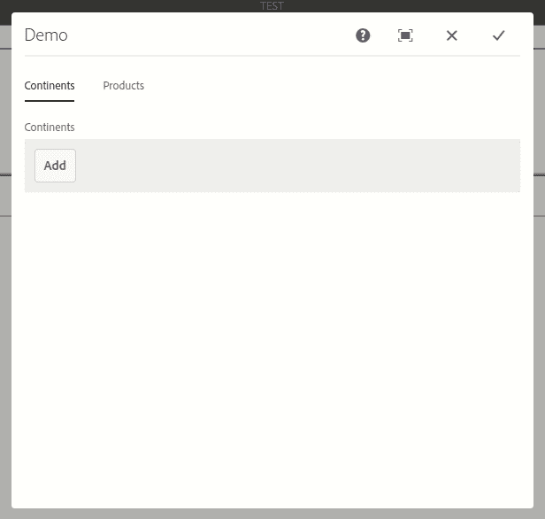
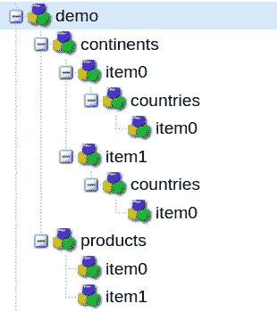
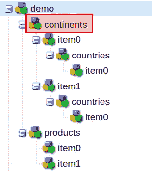
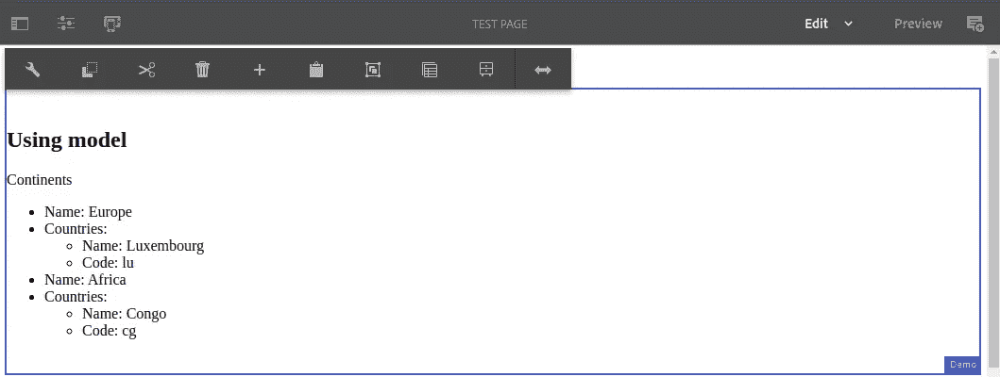
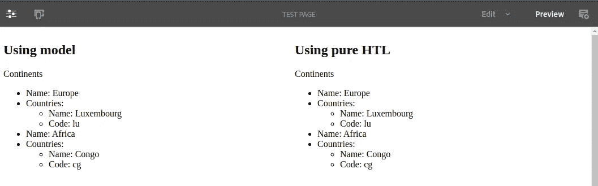
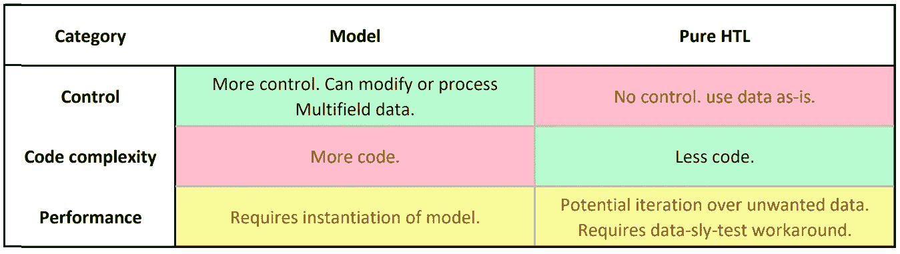

# AEM:如何在你的组件中使用嵌套多字段(使用吊索模型与纯 HTL)

> 原文：<https://levelup.gitconnected.com/aem-how-to-use-nested-multifields-in-your-components-using-a-sling-model-vs-pure-htl-92ff8d036ba1>

## 如何使用 HTL 或模型从 TouchUI 嵌套多字段中提取值，以及两种解决方案的比较


亚历克斯·埃克曼在 [Unsplash](https://unsplash.com/s/photos/spiral?utm_source=unsplash&utm_medium=referral&utm_content=creditCopyText) 上拍摄的照片

Adobe 有一个关于在组件中使用多字段的有用教程。本教程有助于掌握基础知识，但它有两个缺点。首先，它没有覆盖*嵌套*多字段，其次，它实际上有点错误，因为它使用了混合 HTL/吊索模型解决方案。

在本文中，我将向您展示在组件中使用嵌套多字段数据的两种方法:

1.  使用 java Sling 模型
2.  使用纯 HTL(完全没有模型)

# 创建编辑对话框

无论您希望使用哪种解决方案，您都需要一个具有嵌套多字段`cq:dialog`的基本组件。让我们现在就创建它。

我将在`/apps/demo/components/content/demo`下创建我的组件。现在让我们给它一个非常简单的`demo.html`文件:

```
<p>Demo</p>
```

现在使用下面的 XML 创建一个`cq:dialog`节点:

如果您现在将`demo`组件放在一个页面上并打开编辑对话框，您应该会看到以下内容:



编辑对话框包含两个选项卡:

*   *大陆*，其中包含一个嵌套的多字段
*   *产品*，其中包含一个简单的多字段

现在给多字段添加一些数据。这是我用过的:

```
Continents
    1\. Name: Europe
       Countries:
        A. Name: Luxembourg
           Code: lu
    2\. Name: Africa
       Countries:
        A. Name: Congo
           Code: cg
Products
    1\. Name: Phone
    2\. Name: Car
```

如果你在`/content/…`(我的页面在/ `content/demo/us/en/test-page/jcr:content/root/responsivegrid/container/demo`)下找到你刚刚创建的组件，你应该会看到下面的 JCR 节点结构:



这是多字段数据的正常结构。现在让我们看看如何利用它来使用我们的`demo.html`文件呈现数据。

# 使用 Java Sling 模型

对于后端高手来说，您的第一反应将是创建一个 Java Sling 模型来从多字段中提取数据，所以让我们来看看如何实现这一点。

> **注意:**我将使用 [Lombok](https://projectlombok.org/setup/maven) 来避免编写样板代码。

首先让我们创建一些 POJOs 来建模我们的数据。这里有一个`Continent`:

其中包含一个`List`组成的`Country`物体:

现在是模型。下面是界面:

下面是实现过程:

让我们来看看这一切是如何一起工作的。在我们的模型实现中，你可以看到我们直接注入了一个`Continent`对象的`List`。这将注入组件资源的`*continents*` *子资源*(即:我们之前看到的这个小家伙):



我们在`Continent`类中使用相同的注入原理，直接注入`Country`对象的`List`！

只要确保您的 Java Sling 模型中的属性名与您在`cq:dialog`中赋予属性的名称相匹配。

> 这个超级简单的解决方案基于[的一篇很棒的文章](https://blogs.perficient.com/2018/08/24/using-sling-models-with-nested-composite-mulitifields-in-aem-6-3/)作者[艾哈迈德·穆萨拉姆](https://blogs.perficient.com/author/amusallam/)。去看看博客，了解更多信息👍

最后，我们通过使用 Lombok 的`@Getter`将`Continents`中的`List`提供给 HTL。

现在我们的模型已经准备好了，让我们写一些 HTL 来渲染我们的组件！这是:

很直接，对吧？我们只是使用模型并创建一个嵌套的`<ul>`,其结构与嵌套的多字段相同。

现在让我们部署我们的 Java 代码(不要忘记创建一个`package-info.java`文件)，重新加载我们的页面并检查组件是如何呈现的:



成功！我们现在有了一个递归映射嵌套多字段数据到 Sling 模型属性的方法👍

现在，我将向你展示实现同样目标的另一种方法。

# 使用纯 HTL

复制您的`demo`组件，并将其命名为`demoHtl`。将组件重命名为*演示 HTL* 。

现在将`demo.html`重命名为`demoHtl.html`，并粘贴以下 HTL 代码:

首先要注意的是，我们不再调用模型。

这就是我之前提到的 Adobe 教程搞错的[。他们创建了一个模型，而事实上*你根本不需要一个模型来迭代多字段*，不管嵌套与否。你可以简单地使用`resource`属性(这是当前的资源，即:组件),就像我在第 4 行所做的那样。](https://helpx.adobe.com/experience-manager/using/aem65_coral_resourcetypes.html#UseaMultifieldinyourcomponent)

现在你可能想知道为什么我在组件对话框中包含了一个*产品*标签。它的存在只是为了说明下一点:使用纯 HTL，*你不能选择迭代一个特定的多字段*。这是因为不可能使用 HTL 将参数传递给方法，所以我们必须使用返回所有子节点的`[Resource.getChildren()](https://helpx.adobe.com/experience-manager/6-2/sites/developing/using/reference-materials/javadoc/org/apache/sling/api/resource/Resource.html#getChildren())`方法，而不是使用`[Resource.getChild(String relPath)](https://helpx.adobe.com/experience-manager/6-2/sites/developing/using/reference-materials/javadoc/org/apache/sling/api/resource/Resource.html#getChild(java.lang.String))`方法。如果您有多个多字段(就像我们一样)，那么我们的 HTL 将依次迭代每个字段。

这就是为什么在第`6`和`17`行，你会看到`data-sly-test`条件，以确保我们只在右多字段迭代时才呈现某些内容，即:`continents`和*而不是* `products`。

保存`demoHtl.html`文件，并将`demoHtl`组件放在页面上。像前面一样填写属性并提交对话框。您应该会看到与第一个组件完全相同的输出。这是并排的:



# 比较

那么，如果有两种使用嵌套多字段的方法，哪一种是最好的呢？这要看情况。以下是一些需要考虑的事项:



总的来说，如果您的组件相对简单，并且多字段数据不需要修改或处理，就使用纯 HTL 解决方案。

但是，如果您正在创建大量使用嵌套多字段的组件，或者如果数据需要在呈现之前进行处理，那么使用 Sling 模型可能是值得的。

我希望这篇教程能帮助你更好地理解多字段是如何工作的，以及如何利用它们🙂如果您还有任何问题，请随时在 LinkedIn 上发表评论或联系我。

[GitHub](https://github.com/theopendle/aem-nested-multifield/releases/tag/1.0.0)上有一个包，包含创建这两个组件的`/apps`内容，但不包括 Java 代码，你必须自己将它复制到你的包中。