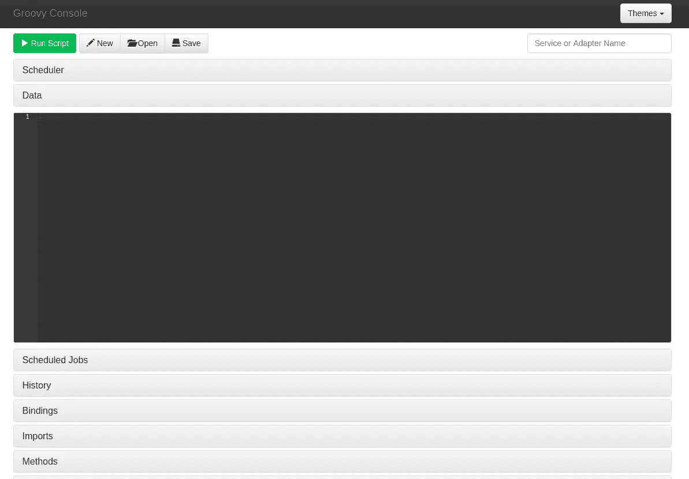
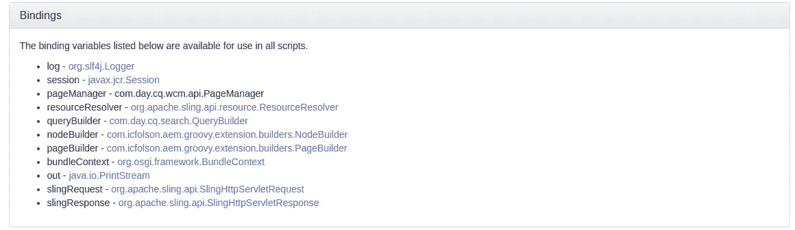
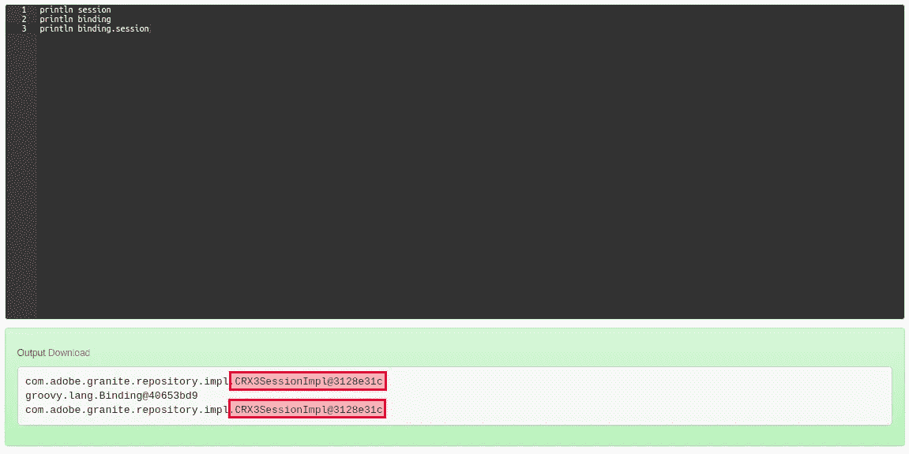
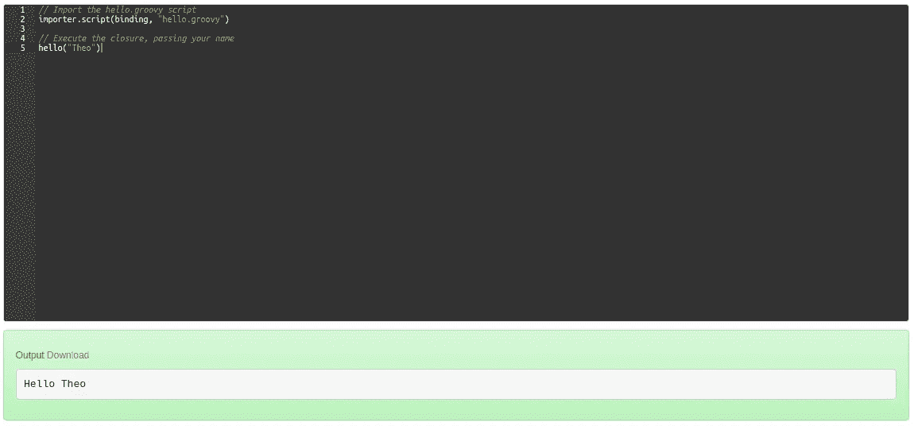

# AEM:在脚本中导入和重用 Groovy 代码片段，并定制控制台

> 原文：<https://levelup.gitconnected.com/aem-import-and-re-use-groovy-snippets-in-your-scripts-and-customize-the-console-cd5057ae4d6c>

## 使用 Groovy 控制台定制，将您的代码分成几个文件，创建实用程序方法，并将全局对象存储在 AEM Groovy 脚本中

AEM Groovy 控制台对于 AEM 管理员来说是一个非常棒的开源工具。它允许您编写 Groovy 脚本，这些脚本可以在一个活动的 AEM 实例上执行，以针对 JCR 运行。你需要给你网站的所有图片添加一个`alt`属性？没问题。需要查找特定内容的引用？轻松点。控制台允许您直接在 AEM 中编写脚本，保存并运行它，而无需重新编译或重新部署任何代码。

如果你还不知道 AEM Groovy 控制台，有许多文章可以帮助你理解它的好处，但是如果你想试用它，最好的地方是公开的 [Github repo](https://github.com/CID15/aem-groovy-console) ，其中有一些示例脚本。

这里没有提到，但是当你开始使用和重用你的脚本时变得非常有用的一件事是如何将代码从一个脚本导入到另一个脚本中。这将帮助您避免编写 500 行的脚本或在几个脚本中复制粘贴简单的实用函数。

如果你以前使用过 Groovy Shell(例如，如果你以前不愉快地浏览过这个 Adobe 教程)，你会对`load`语句很熟悉，但是它在控制台上不起作用。我们将通过对控制台进行一些定制来达到同样的效果。

# 将 Groovy 控制台添加到 AEM 实例中

首先要做的是下载并安装 AEM Groovy 控制台。如果您已经这样做了，您可以跳到下一部分，但是如果您想看看如何以 CI/CD 友好的方式完成，请不要离开😉

[官方 Github repo for the console](https://github.com/CID15/aem-groovy-console) 解释了如何手动下载和安装控制台，但我总是喜欢将第三方依赖项嵌入到我的项目中，以便它们可以进入我们常规的 DevOps 工作流。所以我们打算把它嵌入到我们的`ui.apps`包中。

转到您的`ui.apps` pom.xml 文件并添加以下依赖项(检查哪个版本最适合您的实例[这里是](https://github.com/CID15/aem-groovy-console#compatibility)):

然后在`filevault-package-maven-plugin`配置(`build > plugins > filevault-package-maven-plugin > configuration > embeds`)中将下面的`embed`添加到您的包中:

现在，当我们构建项目时，Maven 将从 Maven Central 提取 AEM Groovy 控制台可安装 zip 包，并将其嵌入到您的`ui.apps`包中。当您安装软件包时，控制台也将被安装。

运行`ui.apps`包的构建、上传和安装，并导航到[http://localhost:4502/groovy console](http://localhost:4502/groovyconsole)以确认控制台已成功安装。您应该会看到类似这样的内容:

AEM Groovy 控制台

# 扩展 Groovy 控制台

AEM Groovy 控制台`README`有[一小部分](https://github.com/CID15/aem-groovy-console#extensions)简要提到了如何扩展控制台的功能，尽管我不得不在源代码中搜寻以确认它是如何工作的。我将带您完成下面的过程，以此来节省您的精力，但是首先理解 Groovy 中的*绑定*的概念是很重要的。

如果您单击 Groovy 控制台 UI 上的 Bindings accordion，您将看到与之相关的变量列表:

这意味着这些变量被*绑定*到脚本范围，并且可供您在脚本中调用。例如:

我们将修改这个绑定来添加我们自己的变量。

首先，我们需要以下两个 Java 依赖项。您可以将这些添加到您的核心中`pom.xml`:

由于我们在上一节中使用了`embed`，这两个依赖项将作为捆绑包运行，所以您可以将它们标记为`provided`。

接下来，创建`Importer`类。这将负责读取和运行一个脚本。以下是逻辑，为了清楚起见，引入了额外的注释:

然后，通过使用下面的类将`Importer`类的实例绑定到作用域，这告诉 Groovy 控制台添加我们的`Importer`作为绑定变量:

这就是 Java 代码🙂您可以构建并安装您的项目。确保这个包满足了所有的依赖项，并且运行正常(如果您使用了不同版本的 Groovy 控制台，您可能需要使用我们刚刚添加的两个依赖项的版本号)。

# 导入和重用代码

现在让我们用两个脚本来测试我们的开发。

第一个脚本使用一个 [Groovy 闭包](http://www.groovy-lang.org/closures.html)创建了一个实用函数(本质上:Groovy 的 lambda 版本)。保存在`/var/groovyconsole/scripts/hello.groovy`:

第二个脚本将导入第一个脚本，然后调用那个闭包。在`/var/groovyconsole/scripts/demo.groovy`保存:

现在运行`demo.groovy`，你应该会得到如下结果:

如您所见，`hello()`现在可以在您的脚本范围内被调用，就像任何其他绑定变量一样！

# 结论

现在，您已经准备好创建可以跨所有脚本使用的实用函数了🙂您还了解了如何向脚本绑定添加自定义变量，以便创建其他有趣且高效的特性来改善 AEM 管理员的生活。

如果你有任何问题或顾虑，请在下面留下评论，或者更好:在我最活跃的 LinkedIn 上与我联系。