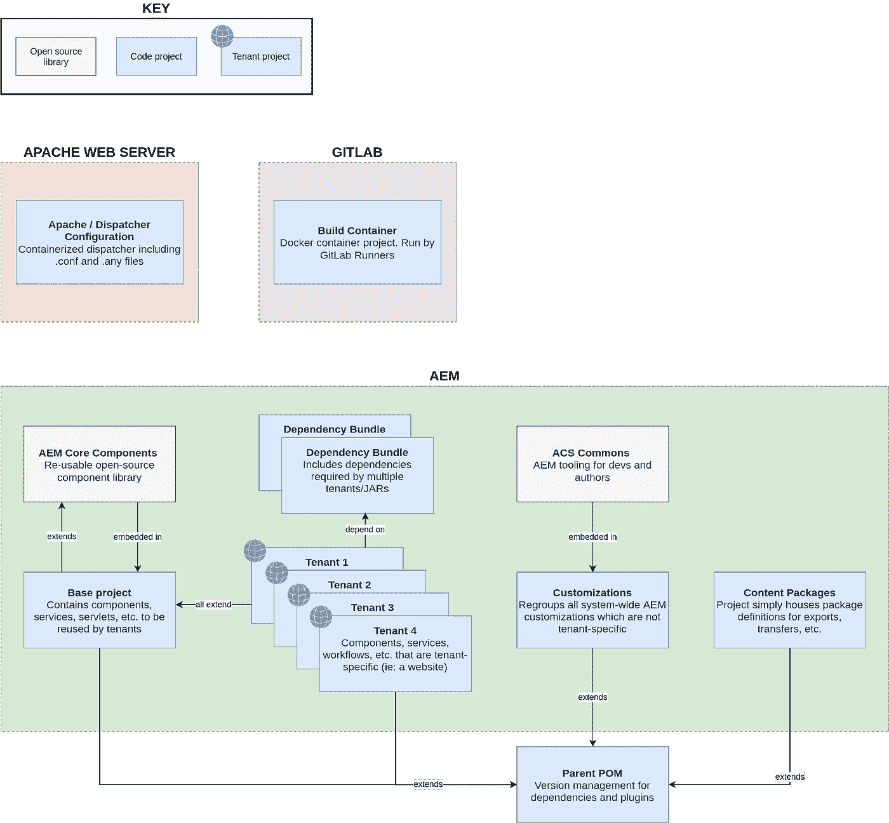

# AEM 多租户:在单个 AEM 环境中运行多个网站

> 原文：<https://levelup.gitconnected.com/aem-multitenancy-running-multiple-websites-on-a-single-aem-environment-7eaf602c36d5>

## 组织您的代码以运行多租户生态系统

照片由[詹·雅各布·纳尼斯塔](https://unsplash.com/@janjakubnanista?utm_source=unsplash&utm_medium=referral&utm_content=creditCopyText)在 [Unsplash](/s/photos/apartments?utm_source=unsplash&utm_medium=referral&utm_content=creditCopyText) 上拍摄

如果您为一家使用 AEM 的大中型公司工作，很可能需要在一个生产环境中运行多个站点。

就代码而言，这意味着多个*租户*。租户是一个项目，包括:

*   实现组件、工作流、服务、servlets 等的所有应用代码。对于一个网站(例如:`/apps/yoursite`)
*   网站的所有配置(例如:`/conf/yoursite`)
*   最初的网站结构(如:`/content/yoursite`，但不是它的孩子)

那么，组织代码项目的最佳方式是什么，以便多个租户可以共存呢？请继续阅读我对这个问题的看法🙂

# 使用案例

贵公司有两个品牌:

1.  品牌 A 为大众提供服务。
2.  品牌 B 更适合 B2B 客户。

每个品牌都有:

1.  互联网上的公共网站。
2.  一个只能通过手机应用程序访问的私人网站。

这使得我们总共有四个不同的网站，因此有四个不同的租户。

所有租户都生活在同一个 AEM 实例(作者和发布者)上，并且它们都共享一个调度程序，但是每个租户都有一个调度程序配置，因为租户之间有不同的需求。

此外，贵公司决定在某些地方定制 AEM Touch UI，以提高作者的 UX。

因此，我们的目标是设计一个生态系统，允许所有租户、为每个租户提供变更的团队以及内容作者在同一个 AEM 平台上和平共处。有一些需要考虑的事项:

*   没有固定的发布时间表。品牌 A 的公共站点应该可以在星期一部署，而不会影响可以在星期三部署的私有站点。
*   多个团队在租户项目上工作。
    例如:团队 A 负责品牌 A，团队 B 负责品牌 B。团队 C 由负责两个品牌的前端专家组成。

# 解决方案

这是我将如何为上面的用例布局生态系统(下面有进一步的细节):

> **注意**:在上图中，我使用了广义的概念上的术语“扩展”,通过覆盖/覆盖 JCR 中的节点，扩展/实现 Java 类/接口或依赖 Maven 中的父 POM，等等。

从密钥中可以看出，每个盒子都代表了其自身 Git repo 中的一个代码库。以下是每个项目的明细:

## **阿帕奇/调度员配置**

理想情况下，这个项目是一个 docker 文件和附带的 Apache `.conf`和 Dispatcher `.any`文件，用于配置。这个项目不仅需要开发人员参与，还需要网络和基础设施团队参与。它可以完全独立于 AEM 内部运行的其他项目进行部署。

## 构建容器

这个项目是可选的，取决于您的构建管道需要如何实现。如果你在一个简单的 Jenkins 环境中运行，那么就没有必要了。但是，如果您使用 GitLab Runners，您将需要创建一个 Docker 项目来准备构建容器、执行构建、缓存依赖项、保存工件等。

## 父 POM

这个项目很简单。它只是为将在同一个 AEM 环境中运行的其他 Maven 项目中使用的所有依赖项设置版本。所有项目在依赖项和版本方面保持一致非常重要，原因有很多:

1.  只是更干净更清晰。
2.  它避免了两个项目在编码标准方面“偏离”,例如，两个团队更喜欢使用两个不同的 JSON 解析库。
3.  它避免了 AEM 包之间冲突。这对于使用依赖包向 AEM 添加 OOTB 没有提供的库的情况很重要。例如，如果一个租户使用 Jsoup v1.13.1，而另一个租户使用 v1.10.1，那么在 OSGi 安装的最后一个租户将覆盖第一个租户。这将导致您的第一个租户捆绑包出错。

## 依赖包

这些包仅用于打包库并将其导出到 OSGi 层，以便租户可以使用。如前所述，这可能是 Jsoup 或任何其他第三方库。

## AEM 核心组件

这个[开源项目](https://github.com/adobe/aem-core-wcm-components)现在预配置为嵌入到所有使用 [AEM Maven 原型](https://github.com/adobe/aem-project-archetype)构建的新项目中。然而，在这种情况下，我们希望它只嵌入到*一个*项目中:Base(一旦通过 Base 安装，就没有理由通过租户项目重新安装)。

这些核心组件是基本的构建模块，您可以扩展和组合它们来创建我们自己的组件。

## 基础项目

基础项目的角色与核心组件非常相似。它提供了一个基础，租户站点将在这个基础上创建他们的定制组件。如果你的 4 个租户在范围上非常相似，那么很有可能你 80%的代码都在基础项目中。

让我们以一个按钮组件为例。您将使用[核心组件的按钮组件](https://www.aemcomponents.dev/content/core-components-examples/library/page-authoring/button.html)，并对其功能进行一些定制。也许增加一些属性，也许改变吊索模型等等。这应该使用[代理模式](https://docs.adobe.com/content/help/en/experience-manager-core-components/using/developing/guidelines.html#proxy-component-pattern)来完成。一旦创建了自定义按钮，在每个租户项目中可能就没有那么多需要自定义的了。也许他们想要改变 CSS(可以使用 clientlib)或者改变白名单链接列表(可以通过覆盖数据源)等等。但是基本行为可以共享和重用😃

因此，基础项目通常很大，但很少变化，而租户项目较小，但变化更频繁。当一个特性为一个租户项目开发时，它可以被提供给其他租户来决定它是否应该被“提升”为一个基础特性。

## 租户项目

这些是每个站点的真实实现，如本文介绍中所述。它们可以根据特定团队的时间表进行部署，而不会干扰其他租户。

## 自定义

自定义是我所说的任何自定义代码，意在修改 AEM 或 TouchUI 的行为。这种定制的例子有很多(如果你正在寻找灵感，我在 Medium 上有几十篇关于这个主题的文章)，但这里有一个最近我写的教程中的例子:

 [## AEM:用“线框模式”查看所有编辑器覆盖图

### 一个简单的超轻量级定制，允许作者在编辑器覆盖图中看到所有组件边界框。

medium.com](https://medium.com/@theopendle/aem-view-all-editor-overlays-with-a-wireframe-mode-97028f540fa) 

在租户项目中添加 Touch UI 的定制并不少见。事实上，AEM Maven 原型实际上为覆盖层添加了公共 JCR 区域:

这在单租户实例中可能有意义，但是如果您有多个租户，这是错误和混乱的常见来源。

> **注意:**[jrg Hoh](https://cqdump.wordpress.com/about/)有一个关于 AEM 中的多租户的 3 部分系列，涵盖了与其他团队、部门或业务单位共享技术生态系统时出现的一些组织问题，你可以在这里阅读[。](https://cqdump.wordpress.com/2015/06/23/the-problems-of-multi-tenancy-the-development-model/)

想象一个场景，每个租户可以做出影响 AEM 的所有用户的改变:如果团队 A 可以在界面上添加一个按钮而不考虑它对站点 B 的影响，或者如果团队 B 可以在不警告站点 A 的作者的情况下将某些 Mime 类型上传到 DAM 的黑名单中，情况将很快陷入混乱！

相反，通过将定制放在一个独立的项目中，并有自己的治理(由*所有*利益相关者共享，而不是每个团队单独共享)，您正在促进在影响*所有*用户的主题上的合作和交流，而不管租赁情况如何。

将定制转移到他们自己的项目中还有另一个原因:您可能需要一个不同的构建。也许你正在为你的组件使用 React 或 lit-element，但是当涉及到修改 Touch UI 时，你需要编写与 Adobe 的 Coral 和 Granite UI 库良好接口的代码。

你也不一定有相同的客户。例如在我的公司，我知道所有的作者都将通过 Windows 上的 Chrome 80+访问 AEM。我可以在很大程度上简化定制项目的构建和测试，因为我不需要像支持实际网站那样支持多个有时会过时的浏览器。

## ACS Commons

ACS Commons 是 AEM 开发人员和作者工具的开源库。我在很多地方看到，人们倾向于像安装服务包或累积补丁包一样安装 ACS Commons:手动安装，并且只在绝对必要时才安装😅

我会将这个包嵌入到定制项目中，因为它们在主题上是相似的，并且将它包含在 CI 管道中会比手动干预更容易安装和更新。

## 内容包

这些是可选的。它们是简单的 Maven 项目，包含空包过滤器定义，用于上传并构建在 AEM 服务器上。一个例子是完整的内容包，在构建时，包含所有 4 个租户的所有内容。然后，可以每天、每周或每月将该包从 PROD 导出到开发人员和 UAT，以确保内容跨环境保持一致，这在作者打电话说“嘿，page X 是*损坏的*”时非常有用，但作为开发人员，您无权访问 PROD 环境！

就是这样！请在评论中告诉我你对这个架构的看法，不要犹豫，把我加到 LinkedIn 上🙂您的多租户生态系统是如何工作的？