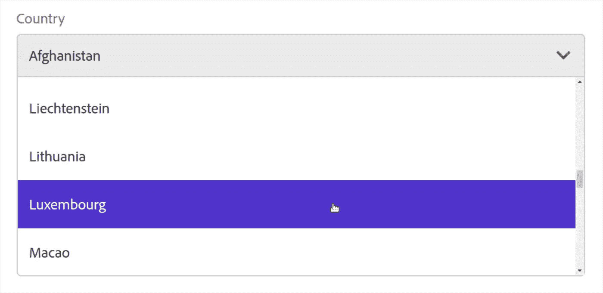
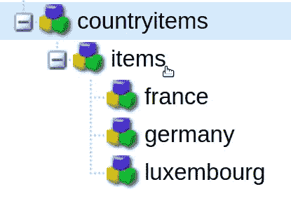
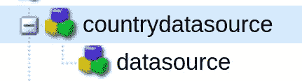
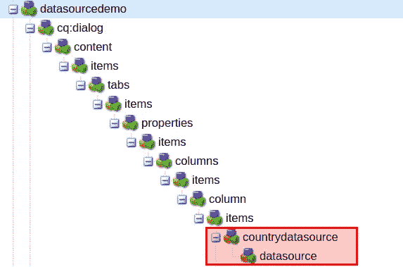
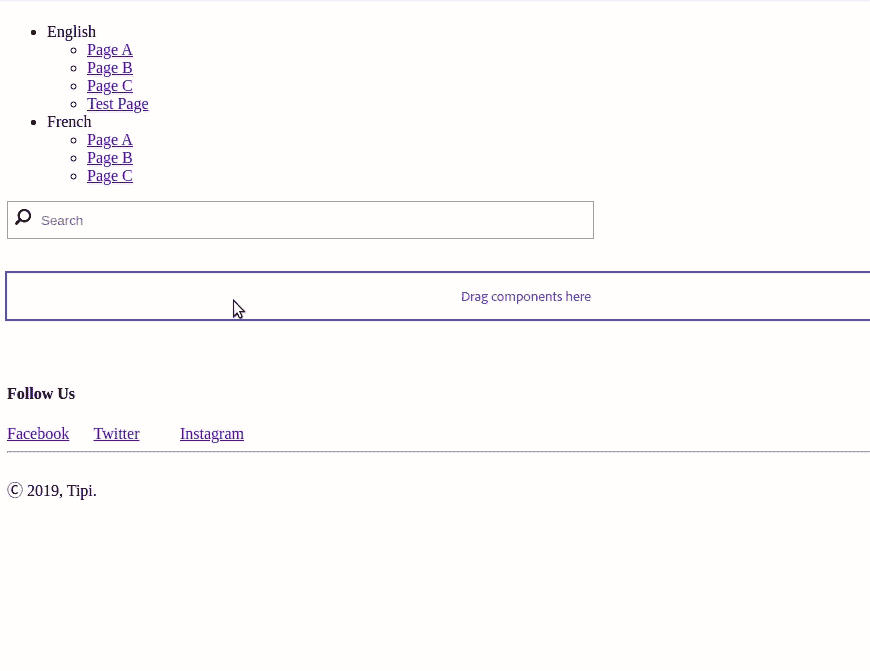

# AEM:用数据源填充下拉列表

> 原文：<https://levelup.gitconnected.com/aem-populate-a-drop-down-with-a-data-source-edafada90cc4>

## 如何创建一个通用的、可重用的数据源系统，为下拉菜单和其他小部件提供数据

CoralUI 下拉列表选择使用数据源填充

当创建组件或修改 AEM touch ui 的其他部分时，有时需要使用包含许多选项的选择小部件。那么我们如何做到这一点，最好的方法是什么，尤其是当我们有很多大列表的时候？

# 解决方法

## 暂且应急的

这可以用最简单的方法来完成，将每个条目列为 JCR 中的一个节点，其中每个条目节点包含一个`text`(在 select 小部件中看到的标签)和一个`value`(保存在 JCR 中的实际值)属性。

这对于小列表来说很有效，但是对于大列表来说却不是最有效的方法，尤其是当它们将来会改变的时候！

## adobe-推荐

这将我们带到 Granite 数据源，正如这里的[所记录的](https://helpx.adobe.com/experience-manager/6-4/sites/developing/using/reference-materials/granite-ui/api/jcr_root/libs/granite/ui/docs/server/datasource.html)，它允许我们以编程方式创建可由我们的小部件使用的项目列表。Adobe 有一个(有点过时的)教程，它仍然依赖于 JSP，但是涵盖了基础知识:你用一个`datasource`节点替换`items`节点，这调用了一个 Java 模型。这个模型将每个条目作为一个`ValueMap`添加到请求中。

如果您必须添加许多项目(在 JCR 中创建 100 或 1000 个节点的图像😟).然而，仍然有一些缺点:

*   您必须为每个数据源创建一个 Java 数据源模型。
*   现在，每当您想要更改数据源内容时，都必须部署一个 Java 包。

## 我的解决方案

想象一下，如果您可以简单地通过在您的`/apps/site`节点下添加一个 JSON 文件来创建一个新的数据源呢？

*   您将拥有每个人都能理解的标准化格式的数据，而不是后端 Java 类中的一系列`Map.put()`行。
*   您不再需要部署您的包来更改数据源中的值。
*   在后端，您将只有一个易于测试的处理程序。

在本教程中，我提出了一种通用的方法来创建数据源，只依赖一个可以被所有数据源使用的 Sling 模型。

既然已经完成了，让我们卷起袖子开始工作吧！😁

# 履行

首先，我想提几件事:

*   我正在使用 Lombok 的 getters、setters 和 logging
*   不要忘记给你创建的每个包添加一个`package-info.java`文件！

## 模型

让我们从创建吊索模型开始。它所能做的就是接受一个请求，并把它传递给一个服务来完成繁重的工作。我总是喜欢使用界面，所以这里是界面:

以及实现:

我选择将我们的模型称为“static ”,因为它从 JCR 中的静态节点获取数据。然而，本教程中的原则可以很容易地应用于动态数据源，例如，用从 REST 端点或数据库获取的数据填充下拉列表。

到目前为止够简单了吧？现在，让我们创建一个承担重任的服务。

## 服务

下面是界面:

以及实现:

我在这里用了大量的注释和 Javadoc 来尽可能清楚地说明这一点，但是让我们更详细地浏览一下。

这个类的作用是:

1.  将请求作为参数。
2.  确定请求的资源。
3.  通过这个位置，它找到了一个`data.json`文件。
4.  它以流的形式读取 JSON 文件。
5.  它将 JSON 转换成一个值映射列表
6.  将值映射转换为资源
7.  将它们添加到名为`com.adobe.granite.ui.components.ds.DataSource`的请求属性中。

这是这个解决方案真正出彩的地方:因为我们的服务基于请求路径确定从*读取哪个 JSON 文件，所以它可以用于任何数量的源！将这个包部署到您的 AEM 实例中，准备好之后，现在让我们在 JCR 中使用 JSON 创建实际的数据源。*

## 数据源

数据源将由三个元素组成:

1.  一个调用我们上面创建的模型的 HTL 脚本。
2.  一个包含实际文本/值对的`data.json`文件。
3.  包含这两个文件的方便命名的文件夹。

你可能已经从上面的截图中猜到了，我们将列出 ISO-3166 国家和他们的 alpha-2 国家代码。

在项目节点(例如:`/apps/mysite/datasources`)下创建一个`nt:folder`节点，并将其命名为 countries。然后在该文件夹中创建一个`countries.html`文件。

现在放松一下，打开一本冷的剧本，因为这可能是你写过的最简单的 HTL 剧本:

就是这样！现在让我们最后提供我们的数据😃根据[这个来源](https://www.iban.com/country-codes)有 249 个 ISO-3166。这些数据太多了，无法包含在教程中，但是你可以在这里找到 JSON 文件。一般来说，任何`data.json`文件都应该遵循以下格式:

在`countries`文件夹中创建一个`data.json`文件，并将 JSON 粘贴到其中。

## 下拉选择小部件

当然，如果我们想使用我们的数据源，我们需要一个小部件。我将使用一个超级简单的演示组件，它只显示一个``标签，包含我们从组件编辑器对话框的下拉列表中选择的值:

这里是`cq:dialog`结构，在红框中是需要注意的重要部分:

下面是 XML 格式的部分:

关键元素是`datasource`节点，它指向我们在上一节中创建的带有`sling:resourceType`属性的数据源文件夹(我的站点名称是`tipi`)。

现在让我们翻到一页，测试一下！

这就是我们拥有的，一个允许你创建尽可能多的新数据源的系统，你所要做的就是从现在开始复制粘贴一些 JSON😁

如果您想查看另一个可以利用这个数据源系统的小部件，请参见本教程[。](https://medium.com/p/c4a03c1eddc5)

我希望这篇教程对你有所帮助，如果你有任何进一步的问题，请不要犹豫，在 LinkedIn 上发表评论或联系我。你可以在这里找到安装演示组件和数据源[的包。](https://github.com/theopendle/aem-datasource-system/releases/tag/1.0.0)