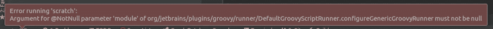
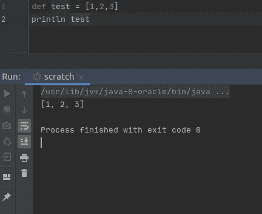
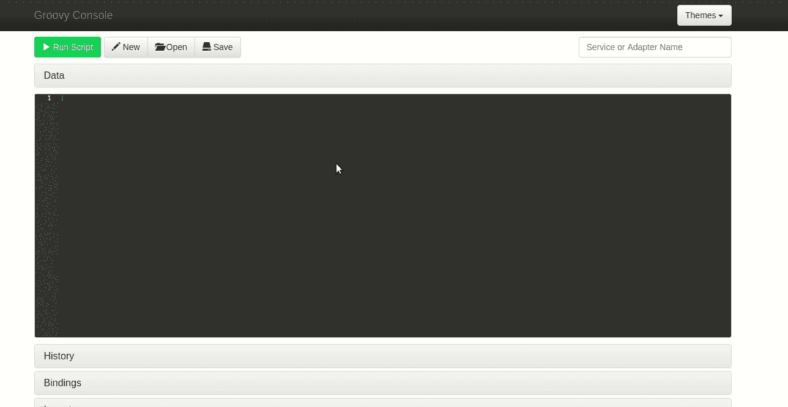
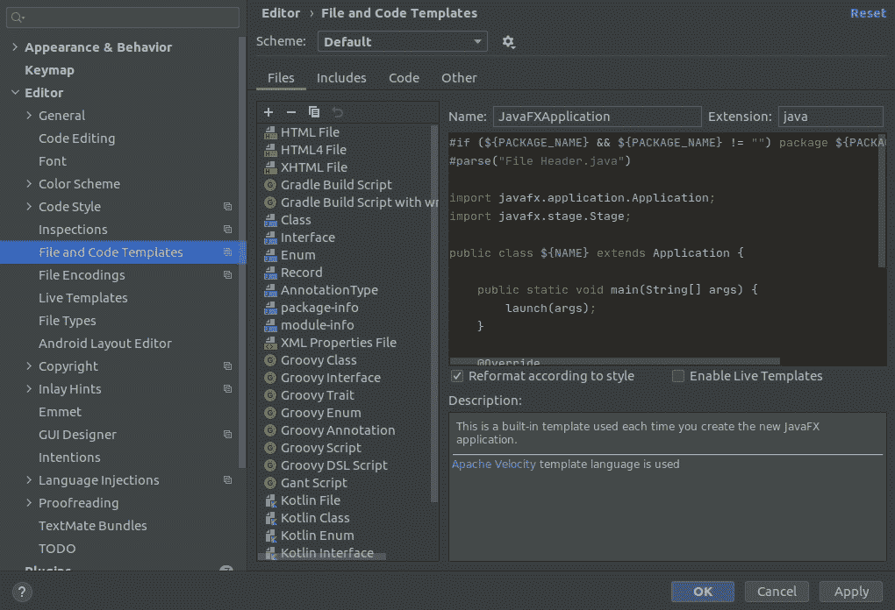
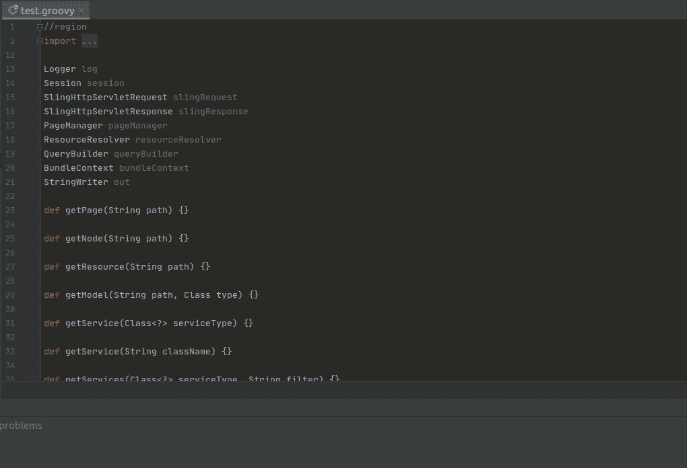
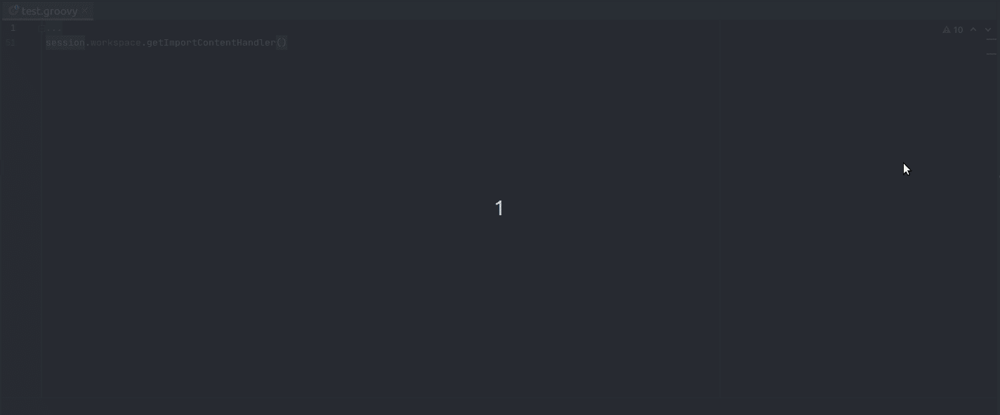

# AEM 快速提示:用 IntelliJ 编写 Groovy 脚本

> 原文：<https://levelup.gitconnected.com/aem-quick-tip-write-your-groovy-scripts-in-intellij-716f4aa3c6ba>

## 自己键入一个完整的变量名，并不得不谷歌 javadoc 是农民的家务活！

我最近迷上了 AEM Groovy 脚本，以前从未使用过 Groovy，立即面临着不得不在简单的文本编辑器中学习新语法的烦恼。

我在 2014 年写了第一行代码，从第一天起，我就享受到了 JetBrains 花哨的 IDE: IntelliJ IDEA 的幸福奢华。代码建议、自动完成和 in-IDE 文档让我变成了一个编程公主。

" workspace.copy()需要多少个参数？"

因此，这里有一个使用 IntelliJ 作为 Groovy 脚本编辑器的快捷技巧😉

# 运行 Groovy 脚本

IntelliJ 将让您从头开始创建带有基本语法高亮和代码建议的`.groovy`文件。如果你像我一样是个初学者，运行一些小代码片段也会非常有用。不幸的是，如果没有一些配置，这是行不通的:

该死的。

第一步是下载一个 Groovy SDK，你可以从这里下载:【http://groovy-lang.org/download.html。

只需下载归档文件，并将其解压缩到您选择的位置。一旦完成，您必须告诉 IntelliJ 在哪里可以找到它。

右键单击 IntelliJ 项目窗口的根节点，并单击*添加框架支持…* ，然后选择 *Groovy* ，并在*使用库*字段中单击*创建*按钮，并设置解压缩后的归档文件的路径(文件夹名称应该类似于`groovy-3.0.4`，这取决于您的版本)。点击*确定*关闭对话框并保存。

现在，如果你回到你的 Groovy 文件并运行它(CTRL + SHIFT + F10)，结果将打印在下面的输出窗口中:

# 使用全局变量

如果您熟悉 AEM Groovy 控制台，您会知道有许多全局对象和方法可用于 OOTB。您可以使用编辑器下方的手风琴来检查它们:

所有这些都是自动完成的，不是很好吗？

返回 Intellij，前往*设置>编辑器>文件和代码模板*，点击小`+`图标创建一个新模板。然后为您的模板输入一个名称，将扩展名设置为`groovy`，并将以下代码粘贴到模板主体中:

现在，当您创建一个新的 Groovy 脚本时，您可以选择模板，Groovy 控制台提供的所有相同的全局变量在 IntelliJ 中也是可用的(当然是未实例化的)。

`//region`和`//endregion`标签用于创建一个代码块，您可以关闭它来关注您自己的代码:

当然，IntelliJ 会聪明地警告你未使用的变量或缺少实例化。最好的办法可能是通过将鼠标悬停在警告计数器上来禁用这些警告:

# 结论

你有它！现在，您可以在自己喜欢的 IDE 中编写 Groovy 脚本，然后在准备好在实例上运行它们时，将它们复制粘贴到 AEM Groovy 控制台中。

当然，运行一个使用全局变量和方法的脚本不会很好，因为它们只是被声明而已。对于勇敢的读者来说，这里有一些改进的机会:

*   改进模板以实例化接口和方法的模拟实现
*   创建一个无需模板就能完成所有这些工作的插件

我考虑了两个选项，但决定坚持 KISS 原则，因为这已经是最紧迫的问题:没有自动完成，我就毫无用处😂

如果您有任何问题/想法，请随时在 [LinkedIn](https://www.linkedin.com/in/theo-pendle-1630a52a/) 上联系我！